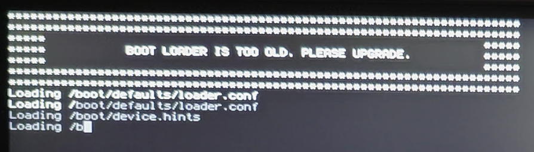

# 第 3.7 节 通过 freebsd-update 更新 FreeBSD


> **前排提示**
>
> 阿里云服务器用户升级到 13.x 请看第 2.1 节 “使用 virtio 技术半虚拟化的虚拟机” 部分。

> **注意：**
>
> 只有一级架构的 release 版本才提供该源。也就是说 current 和 stable 是没有的。 关于架构的支持等级说明请看： [https://www.freebsd.org/platforms](https://www.freebsd.org/platforms)
>
> 在 FreeBSD 15 的开发计划中，预计将使用 `pkgbase` 替代 `freebsd-update`。


>**注意**
>
>ZFS 相关升级请参见 ZFS 章节

## 更新系统

FreeBSD 提供了实用工具 `freebsd-update` 来安装系统更新，包括升级到大版本。`freebsd-update` 在 FreeBSD 7.0-RELEASE 中得到了正式支持。

### 参考文献

- [FreeBSD 7.0-RELEASE Announcement](https://www.freebsd.org/releases/7.0R/announce/)，`freebsd-update(8) provides officially supported binary upgrades to new releases in addition to security fixes and errata patches.`


## 环境准备

- 如果是 csh（14 以下 root 默认为 csh）：
```
# setenv EDITOR /usr/bin/ee # 切换 vi 为 ee，vi 不会用
# setenv VISUAL /usr/bin/ee # 切换 vi 为 ee，vi 不会用
```

- 如果是 bash、zsh 或 sh（14 及以上 root 默认为 sh）：

```sh
# export  EDITOR=/usr/bin/ee # 切换 vi 为 ee，vi 不会用
# export  VISUAL=/usr/bin/ee # 切换 vi 为 ee，vi 不会用
```

检查验证：

```sh
root@ykla:/home/ykla # echo $EDITOR
/usr/bin/ee
root@ykla:/home/ykla # echo $VISUAL
/usr/bin/ee
```

### 常规的安全更新：

```sh
# freebsd-update fetch
```

当出现类似于下列信息时：

```sh
usrlinclude/c++/vl/trllvector usrlinclude/c++/vl/trllversion usrlinclude/c++/v1/trl/wchar.h usr/include/c++/v1/tr1/wctype.h usrlinclude/c++/vllunwind-armh
usrlinclude/c++/v1/unwind-itaniumh usrlinclude/c++/vllunwindh
usr/include/crypto/ cryptodevh usrlinclude/crypto/cbcmac.h usr/include/crypto/deflate.h usrlinclude/crypto/gfmult.h usr/include/crypto/gmac.h
usr/include/crypto/rijndael.h usrlinclude/crypto/rmd160.h usr/include/crypto/xform.h
usr/include/crypto/xformauth.h usr/includecrypto/xformcomp.h usrlincludelcryptolxformenc.h
usr/include/crypto/xformpoly1305.h usrlincludelsys/ cscanatomic.h usrlincludelsys/ cscanbus.h usr/lib/clang/11.0.1
usr/lib/clang/11.0.1/include
:
```

你只需要输入`q`回车即可。然后：

```sh
# freebsd-update install
```

### 大小版本更新

>**注意**
>
>`freebsd-update` 下载慢不是因为其更新源在境外（你使用境外服务器更新一样慢；并且在 freebsdcn 境内源还生效的那些日子里，亦如此）。可能因其设计缺陷。[这是一个始终普遍存在的问题](https://freebsd-questions.freebsd.narkive.com/xjVoetUM/why-is-freebsd-update-so-horrible-slow)。

**以 FreeBSD 14.1-RELEASE 升级 14.2-RELEASE 为例**

则，现在要更新到 `14.2-RELEASE`：

```sh
# freebsd-update upgrade -r 14.2-RELEASE
```


当出现类似于下列信息时，按照下方提示操作：

```sh
root@ykla:/home/ykla # freebsd-update upgrade -r 14.2-RELEASE
src component not installed, skipped
Looking up update.FreeBSD.org mirrors... 3 mirrors found.
Fetching metadata signature for 14.1-RELEASE from update2.freebsd.org... done.
Fetching metadata index... done.
Fetching 1 metadata patches. done.
Applying metadata patches... done.
Fetching 1 metadata files... done.
Inspecting system... done.

The following components of FreeBSD seem to be installed:
kernel/generic kernel/generic-dbg world/base world/lib32

The following components of FreeBSD do not seem to be installed:
world/base-dbg world/lib32-dbg

Does this look reasonable (y/n)? # 在这里输入 y，然后回车即可，在检查基本组件的安装情况。

Fetching metadata signature for 14.2-RELEASE from update2.freebsd.org... done.
Fetching metadata index... done.
Fetching 1 metadata patches. done.
Applying metadata patches... done.
Fetching 1 metadata files... done.
Inspecting system... done. # 这里在检查系统，从上面的回车到这里需要等待约 10 分钟。
Fetching files from 14.1-RELEASE for merging... done.
Preparing to download files...   # 这里在准备要下载的文件，需要等待约 15 分钟。
# 下面需要等待约 30 分钟。注意，当跨大版本更新时，有时候需要等待 5 小时会更长时间，这都是正常的。
Fetching 4070 patches.....10....20....30....40....50....60....70....80....90....100....110....120....130....140....150....160....170....180....190....200....210....220....230....240....250....260....270....280....290....300....310....320....330....340....350....360....370....380....390....400....410....420....430....440....450....460....470....480....490....500....510....520....530....540....550....560....570....580....590

…………中间省略………………

3810....3820....3830....3840....3850....3860....3870....3880....3890....3900....3910....3920....3930....3940....3950....3960....3970....3980....3990....4000....4010....4020....4030....4040....4050....4060....4070 done.
Fetching 35 files... ....10....20....30.. done. # 打补丁，需要等待约 5 分钟
Attempting to automatically merge changes in files... done.

The following changes, which occurred between FreeBSD 14.1-RELEASE and
FreeBSD 14.2-RELEASE have been merged into /etc/ssh/sshd_config:
--- current version
+++ new version
@@ -103,11 +103,11 @@
 #PidFile /var/run/sshd.pid
 #MaxStartups 10:30:100
 #PermitTunnel no
 #ChrootDirectory none
 #UseBlacklist no
-#VersionAddendum FreeBSD-20240318
+#VersionAddendum FreeBSD-20240806
 
 # no default banner path
 #Banner none
 
 # override default of no subsystems
Does this look reasonable (y/n)? # 输入 y 回车，这里在确认系统文件的变动。
The following files will be removed as part of updating to
14.2-RELEASE-p0:
/usr/lib/ossl-modules/fips.so
/usr/lib32/ossl-modules/fips.so
/usr/share/examples/sound/README
/usr/share/examples/sound/basic.c
/usr/share/examples/sound/ossinit.h
/usr/share/examples/sound/ossmidi.h
/usr/share/man/man9/ifaddr_byindex.9.gz
/var/db/etcupdate/log
/var/db/locate.database
(END)  # 这里输入 q，确认变动
The following files will be added as part of updating to
14.2-RELEASE-p0:
/boot/kernel/bnxt_re.ko
/boot/kernel/gpioaei.ko
/boot/kernel/if_rtw89.ko
/boot/kernel/linuxkpi_video.ko
/boot/kernel/mac_do.ko
/boot/kernel/snd_dummy.ko
/etc/devd/autofs.conf
/usr/bin/mdo
/usr/bin/mididump
/usr/include/sys/splash.h
/usr/lib/debug/boot/kernel/bnxt_re.ko.debug
/usr/lib/debug/boot/kernel/gpioaei.ko.debug
/usr/lib/debug/boot/kernel/if_rtw89.ko.debug
/usr/lib/debug/boot/kernel/linuxkpi_video.ko.debug
/usr/lib/debug/boot/kernel/mac_do.ko.debug
/usr/lib/debug/boot/kernel/snd_dummy.ko.debug
/usr/libexec/bsdinstall/firmware
/usr/libexec/fwget/pci_network_intel
/usr/share/examples/oci
/usr/share/examples/oci/Containerfile.pkg
/usr/share/examples/oci/README
/usr/share/examples/sound/oss/README
/usr/share/examples/sound/oss/audio.c
/usr/share/examples/sound/sndstat_nv.c
: # 这里输入 q，确认变动，直至没有新内容出现

…………中间省略………………

The following files will be updated as part of updating to
14.2-RELEASE-p0:
/bin/[
/bin/cat
/bin/chflags
/bin/chio
/bin/chmod
/bin/cp
/bin/cpuset
/bin/csh
/bin/date
/bin/dd
/bin/df
/bin/domainname
/bin/echo
/bin/ed
/bin/expr
/bin/freebsd-version
/bin/getfacl
/bin/hostname
/bin/kenv
/bin/kill
/bin/link
/bin/ln
/bin/ls
/bin/mkdir
To install the downloaded upgrades, run 'freebsd-update [options] install'.
```

运行 `freebsd-update install` 以安装更新：

```sh
root@ykla:/home/ykla # freebsd-update install
src component not installed, skipped
Creating snapshot of existing boot environment... done.
Installing updates...
Kernel updates have been installed.  Please reboot and run
'freebsd-update [options] install' again to finish installing updates.
```

内核更新已经安装，系统要求重启：

```sh
root@ykla:/home/ykla # reboot
```

运行 `freebsd-update install` 安装用户空间的更新部分：

```sh
root@ykla:/home/ykla # freebsd-update install
src component not installed, skipped
Creating snapshot of existing boot environment... done.
Installing updates...
Restarting sshd after upgrade
Performing sanity check on sshd configuration.
Stopping sshd.
Waiting for PIDS: 868.
Performing sanity check on sshd configuration.
Starting sshd.
Scanning /usr/share/certs/untrusted for certificates...
Scanning /usr/share/certs/trusted for certificates...
Scanning /usr/local/share/certs for certificates...
 done.
```


重装 `pkg`：


```sh
root@ykla:/home/ykla # pkg bootstrap -f
The package management tool is not yet installed on your system.
Do you want to fetch and install it now? [y/N]: y # 此处输入 y 后回车
Bootstrapping pkg from https://mirrors.nju.edu.cn/freebsd-pkg/FreeBSD:14:amd64/latest, please wait... # 我换过 pkg 源，你可能和我不一样，没有问题
Installing pkg-1.21.3...
package pkg is already installed, forced install
Extracting pkg-1.21.3: 100%
```

检查第三方软件 ABI 变化（FreeBSD ABI 非常稳定，一般不会出错）：

```sh
root@ykla:/home/ykla # pkg upgrade
root@ykla:/home/ykla # pkg upgrade
Updating nju repository catalogue...
Fetching meta.conf:   0%
Fetching data.pkg: 100%    7 MiB   7.6MB/s    00:01    
Processing entries: 100%
nju repository update completed. 35765 packages processed.
All repositories are up to date.
Updating database digests format: 100%
Checking for upgrades (215 candidates): 100%
Processing candidates (215 candidates): 100%
The following 223 package(s) will be affected (of 0 checked):

New packages to be INSTALLED:
	ceres-solver: 2.2.0_10
	glib-networking: 2.80.0
	libsoup3: 3.2.2
	openjph: 0.18.0
	py311-pygobject: 3.50.0
	py311-truststore: 0.10.0
	pygobject-common: 3.50.0
	suitesparse-cxsparse: 4.4.0
	suitesparse-spqr: 4.3.3_1
	webrtc-audio-processing: 1.3

Installed packages to be UPGRADED:
	AppStream: 1.0.1 -> 1.0.3_1
	AppStreamQt5: 1.0.1 -> 1.0.3

…………中间省略………………

	zh-fcitx5-chinese-addons: 5.1.6 -> 5.1.7_1
	zh-libime: 1.1.8 -> 1.1.9_1

Installed packages to be REINSTALLED:
	gcc13-13.3.0 (provided shared library changed)
	kig-23.08.5_2 (required shared library changed)
	py311-httpx-0.27.2 (option added: ZSTD)

Number of packages to be installed: 10
Number of packages to be upgraded: 210
Number of packages to be reinstalled: 3

The process will require 45 MiB more space.
687 MiB to be downloaded.

Proceed with this action? [y/N]:  # 此处输入 y 再回车即可

…………以下省略………………
```


以上，更新完毕。

验证更新：

```sh
root@ykla:/home/ykla # freebsd-version -k
14.2-RELEASE
root@ykla:/home/ykla # freebsd-version -u
14.2-RELEASE
```

### 更新 EFI 引导

>**警告**
>
>使用 EFI 引导的系统，EFI 系统分区（ESP）上有引导加载程序的副本，用于固件引导内核。如果根文件系统是 ZFS，则引导加载程序必须得能读取 ZFS 引导文件系统。在系统升级后，且执行 `zpool upgrade` 前，必须更新 ESP 上的引导加载程序，否则系统可能无法引导。虽然不是强制性的，但在 UFS 作为根文件系统时亦应如此。

可以使用命令 `efibootmgr -v` 来确定当前引导加载程序的位置。`BootCurrent` 显示的值是用于引导系统的当下引导配置的编号。输出的相应条目以 `+` 开头，如

```sh
root@ykla:~ # efibootmgr -v
Boot to FW : false
BootCurrent: 0004
BootOrder  : 0004, 0000, 0001, 0002, 0003
+Boot0004* FreeBSD HD(1,GPT,f83a9e2f-bd87-11ef-95b7-000c29761cd2,0x28,0x82000)/File(\efi\freebsd\loader.efi) # 就是这条
                      nda0p1:/efi/freebsd/loader.efi (null)
 Boot0000* EFI VMware Virtual NVME Namespace (NSID 1) PciRoot(0x0)/Pci(0x15,0x0)/Pci(0x0,0x0)/NVMe(0x1,00-00-00-00-00-00-00-00)
 Boot0001* EFI VMware Virtual IDE CDROM Drive (IDE 1:0) PciRoot(0x0)/Pci(0x7,0x1)/Ata(Secondary,Master,0x0)
 Boot0002* EFI Network PciRoot(0x0)/Pci(0x11,0x0)/Pci(0x1,0x0)/MAC(000c29761cd2,0x0)
 Boot0003* EFI Internal Shell (Unsupported option) MemoryMapped(0xb,0xbeb4d018,0xbf07e017)/FvFile(c57ad6b7-0515-40a8-9d21-551652854e37)


Unreferenced Variables:
```

ESP 应该已经挂载到了 **/boot/efi**。如果没有，可手动挂载之，使用 `efibootmgr` 输出中列出的分区（本例为 `nda0p1`）：`mount_msdosfs /dev/nda0p1 /boot/efi`。有关另一则示例，请参阅 [loader.efi(8)](https://man.freebsd.org/cgi/man.cgi?query=loader.efi&sektion=8&format=html)。

在 `efibootmgr -v` 输出的 `File` 字段中的值，如 `\efi\freebsd\loader.efi`，是 EFI 上正在使用的引导加载程序的位置。若挂载点是 **/boot/efi**，则此文件为 `/boot/efi/efi/freebsd/loader.efi`。（在 FAT32 文件系统上大小写不敏感；FreeBSD 使用小写）`File` 的另一个常见值可能是 `\EFI\boot\bootXXX.efi`，其中 `XXX` 是 amd64（即 `x64`）、aarch64（即 `aa64`）或 riscv64（即 `riscv64`）；如未配置，则为默认引导加载程序。应把 **/boot/loader.efi** 复制到 **/boot/efi** 中的正确路径来更新已配置及默认的引导加载程序。

---

~~上面是废话，不用看~~


在版本更新后，在启动菜单出现之前，可能出现下面的画面

>**注意**
>
>该界面出现的时间非常短暂，约只有 20 毫秒。可用相机拍摄观察。



即

```sh
**************************************************************
**************************************************************
*****                                                    *****   
*****      BOOT LOADER IS TOO OLD, PLEASE UPGRADE.       *****
*****                                                    *****
**************************************************************
************************************************************** 
```

这说明 loader 需要更新了。还可以使用命令进行版本验证：

```sh
# strings /boot/efi/efi/freebsd/loader.efi|grep FreeBSD|grep EFI
DFreeBSD/amd64 EFI loader, Revision 1.1
# strings /boot/loader.efi|grep FreeBSD|grep EFI
DFreeBSD/amd64 EFI loader, Revision 3.0
```

此处命令参考了手册 [loader.efi](https://man.freebsd.org/cgi/man.cgi?query=loader.efi) 中的例子。`/boot/efi/efi/freebsd/loader.efi` 为正在使用的 loader（版本确实旧了）

更新：

```sh
# cp /boot/loader.efi /boot/efi/efi/freebsd/
```

>**警告**
>
>请先更新 loader，再更新 ZFS 版本！

>**重要**
>
>非 EFI、bootcode、ZFS 等相关更新请自行查看相关部分章节！


### 可选更新


## 查看 FreeBSD 版本

> **注意：**
>
> 有时候补丁不涉及内核，内核版本就不会变，用 `uname -r` 看不出来，但是用户空间版本会变。所以你可能会看到两个版本，以较高者为准。

### freebsd-version 命令

查看 FreeBSD 内核版本和补丁号：

```sh
ykla@ykla:~ % freebsd-version -k
13.1-RELEASE-p3
```

查看已安装的用户空间的版本和补丁程序级别：

```sh
ykla@ykla:~ % freebsd-version -u
13.1-RELEASE-p5
```

### uname 命令

```sh
ykla@ykla:~ % uname -a
FreeBSD ykla 13.1-RELEASE FreeBSD 13.1-RELEASE releng/13.1-n250148-fc952ac2212 GENERIC amd64
```

```sh
ykla@ykla:~ % uname -mrs
FreeBSD 13.1-RELEASE amd64
```

## 故障排除

### pkg 找不到 `.so`：

终端执行命令

```sh
# pkg bootstrap -f
```

### FreeBSD 升级出错，没有 ntp 用户

终端执行命令

```sh
# pw groupadd ntpd -g 123
# pw useradd ntpd -u 123 -g ntpd -h - -d /var/db/ntp -s /usr/sbin/nologin -c "NTP Daemon"
```
