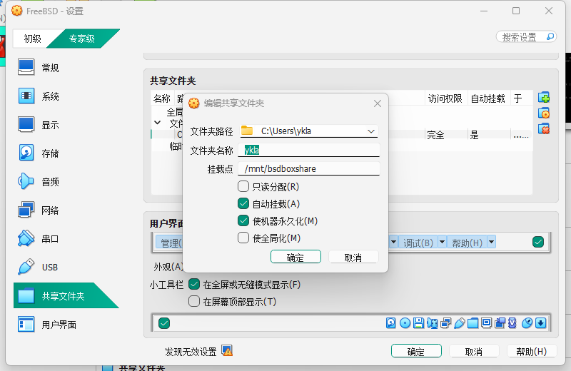

# 3.4 使用 VirtualBox 安装 FreeBSD

Oracle VirtualBox 是一款 Type-2 虚拟机监视器（Hypervisor），通过虚拟设备模拟（device emulation）与半虚拟化（paravirtualization）技术为虚拟机提供计算、存储和网络资源。VirtualBox 支持多种虚拟磁盘镜像格式，默认使用 VDI（Virtual Disk Image），同时兼容 VMDK（VMware）、VHD（Microsoft）等格式。该虚拟化软件可在 Windows、macOS、Linux、Oracle Solaris 等主流操作系统上运行，FreeBSD 可通过 Ports 安装 VirtualBox OSE 作为宿主机使用。

FreeBSD 在 VirtualBox 中作为虚拟机运行稳定。本节演示环境为 VirtualBox 7.2.8 和 Windows 11 25H2。

> **注意**
>
> VirtualBox 当前维护两个并行分支：7.1.x 与 7.2.x。7.2 系列于 2025 年 8 月首次发布，新增 Windows/Arm 平台支持，为当前主线版本；7.1.x 系列仍持续接收维护更新。FreeBSD Ports 中 `emulators/virtualbox-ose`（6.1.x）已被标记为 DEPRECATED，过期日期为 2026-12-31，建议使用 `emulators/virtualbox-ose-72`。

## 下载 VirtualBox

访问官方网站 [https://www.virtualbox.org](https://www.virtualbox.org)，点击页面右侧的 `Download` 按钮，选择对应平台的安装程序完成安装。

## 安装设置

VirtualBox 安装完成后，依次创建并配置虚拟机。


在 VirtualBox 主界面中选择“新建”。


在“名称”字段中输入“FreeBSD”，下方的相关选项将自动填充。


分配内存大小与 CPU 数量，并开启 EFI 支持选项。

> **技巧**
>
> 建议使用 UEFI 引导方式，Xorg 可自动识别显卡驱动，无需手动编写 **/usr/local/etc/X11/xorg.conf**。


调整虚拟硬盘容量。


进入虚拟机设置。


将显卡控制器设置为 `VBoxSVGA`。

> **警告**
>
> 请勿勾选“启用 3D 加速”。FreeBSD 下的 VirtualBox Guest Additions 不支持 3D 加速，启用后将导致显示异常。


如有需要，可将虚拟硬盘切换为 NVMe 控制器：


点击“启动”，开始安装 FreeBSD。


安装完成后，需手动关机并在虚拟机设置中移除安装光盘（如弹出强制释放提示，选择同意），否则下次启动仍会进入安装界面。


安装完成的 FreeBSD 虚拟机系统：


## 解决 EFI 下无法正常关机

编辑 **/etc/sysctl.conf** 文件，添加以下内容：

```ini
hw.efi.poweroff=0
```

随后重启系统，再执行关机即可恢复正常。该设置禁用 EFI 电源关闭功能，使系统通过 ACPI 完成关机。

### 参考文献

- mib. 12.0-U8.1 -> 13.0-U2 poweroff problem & solution[EB/OL]. (2022-12-23)[2026-03-26]. <https://www.truenas.com/community/threads/12-0-u8-1-13-0-u2-poweroff-problem-solution.104813/>. 提供了 EFI 环境下 FreeBSD 关机问题的解决方案。
- FreeBSD Forums. EFI: VirtualBox computer non-stop after successful shutdown of FreeBSD[EB/OL]. (2022-04-28)[2026-03-26]. <https://forums.freebsd.org/threads/efi-virtualbox-computer-non-stop-after-successful-shutdown-of-freebsd.84856/>. 详细分析了 VirtualBox 中 FreeBSD 关机异常的技术原因与修复方法。

## 网络设置

在虚拟网络方面，VirtualBox 提供 NAT、桥接（Bridged）、内部网络（Internal）、仅主机（Host-Only）等多种网络模式，每种模式对应不同的网络拓扑和连通性。

### 桥接模式

> **技巧**
>
> VirtualBox 的桥接模式可实现各方向网络互通。

桥接是宿主机与虚拟机互通的便捷方式，虚拟机可获得与宿主机处于同一网段的 IP 地址。例如，如果宿主机 IP 为 `192.168.5.123`，则虚拟机 IP 将为 `192.168.5.x`。


请确保上图中“名称(N)”选择的网卡是当前正在使用的网卡，否则虚拟机将无法访问网络。

设置后执行 `dhclient em0` 可立即获取 IP 地址。为保证长期有效，可在 **/etc/rc.conf** 中添加 `ifconfig_em0="DHCP"`。

如无法访问互联网，可将 DNS 设置为 `223.5.5.5`。具体操作步骤请参阅本章 DNS 配置相关小节。

### NAT 与仅主机模式

与 VMware 不同，VirtualBox 的默认 NAT 模式下，宿主机与虚拟机无法直接互通。虚拟机可以访问宿主机的特殊地址 `10.0.2.2` 及其上运行的服务，但宿主机无法访问虚拟机的端口，各虚拟机之间的网络也相互隔离。

当桥接模式无法生效时，可改用双网卡方案。如果要通过宿主机（如 Windows 11）控制虚拟机中的 FreeBSD 系统，需配置两块网卡：一块为 NAT 模式，用于连接互联网；另一块为仅主机模式，用于与宿主机互通。

首先设置 NAT 模式下的网卡，用于互联网连接：


网卡类型下拉列表中，“网络地址转换（NAT）”与“NAT 网络”选项功能相似。两者的主要区别在于：“NAT 网络”模式下的虚拟机之间可以互通，而“网络地址转换（NAT）”模式下的虚拟机网络相互隔离。

随后设置第二块网卡（仅主机模式），用于局域网：


执行 `ifconfig` 查看网络状态。如果第二块网卡 `em1` 未获取 IP 地址，可通过 DHCP 临时获取：`dhclient em1`。为保证长期有效，可在 **/etc/rc.conf** 中添加 `ifconfig_em1="DHCP"`。


```sh
# netstat -rn -f inet | egrep 'default|10\.0\.2\.0/24|192\.168\.56\.0/24'
default            10.0.2.2           UGS             em0 # 网络地址转换(NAT)网卡，默认网关，
10.0.2.0/24        link#1             U               em0
192.168.56.0/24    link#2             U               em1 # 仅主机(Host-only)网络网卡，用于与宿主机互通
```

在此配置下，虚拟机与宿主机所在局域网无法直接互通。应通过 `em1` 的 IP 地址进行 SSH 连接，通常为 `192.168.56.X`，而非 `10.0.2.X`。

### 参考文献

- Oracle. Network Address Translation (NAT)[EB/OL]. [2026-03-26]. <https://www.virtualbox.org/manual/topics/networkingdetails.html#network_nat>. 也可以按照手册中的端口转发来连通网络。
- Oracle Corporation. 6.3. Network Address Translation (NAT)[EB/OL]. [2026-04-04]. <https://www.virtualbox.org/manual/topics/networkingdetails.html#network_nat>. “网络地址转换（NAT）”与“NAT 网络”选项的区别。

## 虚拟机增强工具

VirtualBox 的虚拟机增强工具（Guest Additions）是一组运行在虚拟机内部的驱动程序和系统服务，提供以下支持：

- 共享剪贴板。
- 集成鼠标指针。
- 宿主时间同步。
- 窗口缩放。
- 无缝模式。

> **注意**
>
> 以下命令在 FreeBSD 虚拟机中执行。

### 安装增强工具

- 使用 pkg 安装：

```sh
# pkg install virtualbox-ose-additions-72
```

- 或者使用 Ports 安装：

```sh
# cd /usr/ports/emulators/virtualbox-ose-additions-72/
# make install clean
```

- 安装完成后，可通过以下命令查看增强工具的配置说明：

```sh
# pkg info -D virtualbox-ose-additions-72
```

### 服务管理

安装增强工具后，需启用相关服务并设置开机自启。

启用 VirtualBox 虚拟机增强驱动：

```sh
# service vboxguest enable
```

启用 VirtualBox 服务：

```sh
# service vboxservice enable
```

将普通用户 ykla 添加到 wheel 组以获得管理权限：

```sh
# pw groupmod wheel -m ykla
```

如果使用了 ntpd(8) 时间服务，应禁用宿主时间同步，在 **/etc/rc.conf** 中添加以下内容：

```ini
vboxservice_flags="--disable-timesync"
```

### 桌面预览

在 Wayland 环境下，由于缺少对应的 DRM/KMS 驱动支持，桌面功能暂不可用。以下演示在虚拟机中安装并启动 X11 下的 KDE：


窗口缩放、鼠标无缝切换等功能均正常。


视频播放较为流畅，但默认音量偏低，可适当调高系统音量。

### 共享文件夹

共享文件夹用于在宿主机与虚拟机之间传输文件，可通过 `mount_vboxvfs` 命令挂载访问。以下示例在 VirtualBox 图形界面中创建共享文件夹 **C:\Users\ykla\\**，并将其挂载至虚拟机内的 **/mnt/bsdboxshare**：



注意，“文件夹名称”是操作系统（FreeBSD 虚拟机）将看到的文件名，不得包含空格。

在 FreeBSD 虚拟机中查看待挂载的文件夹：

```sh
$ dmesg | grep -i VBOXVFS
VBOXVFS[1]: sfprov_mount: path: [ykla]
```

在 FreeBSD 虚拟机中挂载共享文件夹的命令如下：

```sh
# mkdir -p /mnt/bsdboxshare # 创建上面指定的挂载点
# mount_vboxvfs -w ykla /mnt/bsdboxshare # 挂载共享文件夹 ykla，-w 为可写挂载
```

列出共享文件夹内容：

```sh
# ls /mnt/bsdboxshare/

……省略其他输出……

/mnt/bsdboxshare/SendTo/
/mnt/bsdboxshare/SiYuan/
/mnt/bsdboxshare/Templates/
```

## 故障排除与未竟事宜

### 鼠标被捕获在虚拟机窗口内，无法移出

按下右侧 `Ctrl` 键即可释放鼠标（默认设置下键盘左右各有一个 `Ctrl` 键）。如果因自动缩放需要还原屏幕或无法找到菜单栏，请按 `Home` + 右侧 `Ctrl`。

> **技巧**
>
> 标准 108 键键盘上，`Home` 键位于 `Scroll Lock` 键的下方。

### UEFI 固件设置

开机时连续按 `Esc` 键即可进入 VirtualBox 虚拟机的 UEFI 固件设置界面。
