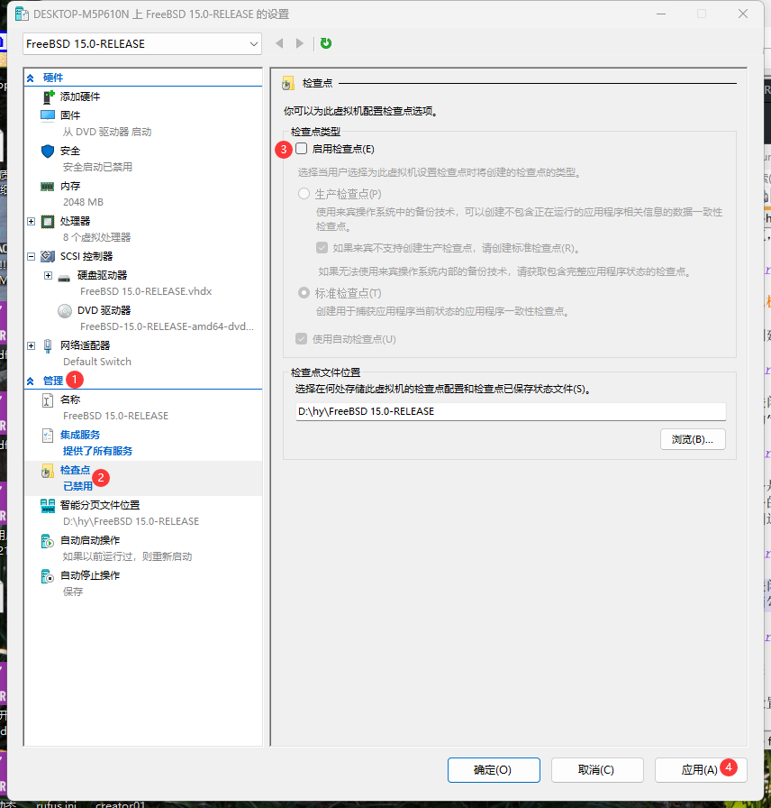
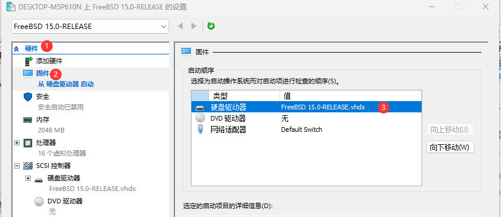

# 3.5 使用 Hyper-V 安装 FreeBSD

Hyper-V 是微软公司（Microsoft）为 Windows 和 Windows Server 开发的企业级虚拟机监视器，属于系统内置组件。本节介绍在 Hyper-V 中安装与配置 FreeBSD 的完整流程。

## Hyper-V 简介

虚拟机监视器是一种创建和运行虚拟机的软件，允许多个操作系统同时运行在同一台计算机上。按虚拟化技术的理论分类，Hyper-V 属于 Type-1 架构，虚拟化层直接管理硬件资源。

Hyper-V 分为 Gen 1（第一代）和 Gen 2（第二代）两种虚拟机架构，两种架构在硬件支持和启动方式上有所不同。Gen 1 与 Gen 2 的区别如下表所示：

| Hyper-V 代系 | 硬盘 | 启动方式 |
| ------------ | ---- | -------- |
| Gen 1 | IDE + SCSI | 仅支持 MBR |
| Gen 2 | 仅 SCSI | 仅支持 UEFI（包含安全启动及 PXE 支持） |

系统快速创建的虚拟机默认为 Gen 2 架构。

> **注意**
>
> 使用 Gen 2 时请关闭安全启动，否则系统无法启动。FreeBSD 的引导加载程序未经 Microsoft 签名，在 Hyper-V 默认的安全启动配置中无法通过验证。FreeBSD 提供 uefisign(8) 工具供用户手动签名引导组件，但开箱即用的 Secure Boot 支持尚未实现。安装前必须关闭安全启动。

FreeBSD 通过以下内核模块实现对 Hyper-V 的集成支持：

| 模块 | 功能 |
| ---- | ---- |
| `hv_utils` | 提供时间同步、心跳检测、关机通知等集成功能 |
| `hv_vmbus` | 实现 Hyper-V 虚拟总线，是其他 Hyper-V 设备驱动的基础 |
| `hv_netvsc` | 提供网络半虚拟化驱动（高性能网络通信） |
| `hv_storvsc` | 提供存储半虚拟化驱动（虚拟磁盘 I/O 支持） |

## 测试环境

本节基于以下软硬件环境测试与演示，实验结果受环境影响。

- Windows 11 24H2 专业版
- FreeBSD 15.0-RELEASE
- Hyper-V 版本：10.0.26100.7019
- 使用第二代 Hyper-V 虚拟机

## 安装 Hyper-V

> **注意**
>
> Windows 家庭版和家庭中文版不支持 Hyper-V。

在 Windows 系统中启用 Hyper-V 功能组件。右键单击 Windows 徽标，在弹出的菜单中选择“终端（管理员）”或者“Windows PowerShell（管理员）”。输入以下命令：

```powershell
PS C:\WINDOWS\system32> DISM /Online /Enable-Feature /All /FeatureName:Microsoft-Hyper-V
```

输出内容如下：

```powershell
Deployment Image Servicing and Management tool
Version: 10.0.26100.5074

Image Version: 10.0.26200.8246

启用一个或多个功能
[==========================100.0%==========================]
The operation completed successfully.
```

系统将提示重启，重启过程中将安装 Hyper-V。


## 创建虚拟机

Hyper-V 安装完成后，创建虚拟机。右键单击 Hyper-V 管理器中的主机名，选择“新建”→“虚拟机”。


点击“下一页”。


为虚拟机设置名称，本例中使用“FreeBSD 15.0-RELEASE”，还可以自定义虚拟机的存储路径。随后点击“下一页”。


选择“第二代”。随后点击“下一页”。


分配内存大小，随后点击“下一页”。


配置网络，在下拉栏选择“Default Switch”（默认交换机），随后点击“下一页”。


指定虚拟硬盘的名称、大小及存储位置，随后点击“下一页”。


点击“从可启动的映像文件安装操作系统”，点击“浏览”，找到并选中已下载的 **FreeBSD-15.0-RELEASE-amd64-dvd1.iso** 文件，随后点击“下一页”。


进行预览，确认无误后点击“完成”。


## 虚拟机配置调整

虚拟机创建完成后，选中新建的虚拟机“FreeBSD 15.0-RELEASE”，点击右侧下方的“设置...”调整部分设置。


请务必关闭安全启动（见上文注意事项），否则将无法从安装介质启动安装程序。点击“硬件”，选中“安全”，在右侧边栏中取消选中“启用安全启动”。


来宾服务（Guest Service Interface）是 Hyper-V 集成服务的一部分，用于在宿主机与虚拟机之间复制文件。时间同步由独立的时间同步服务（Time Synchronization Service）负责。其作用详见参考文献。点击“管理”，再次点击“集成服务”，在右侧边栏选中“来宾服务”。


可选择关闭“使用自动检查点”（即关闭自动快照功能）以节约空间和时间，其作用详见参考文献。点击“管理”，再次点击“检查点”，在右侧边栏取消勾选“启用检查点”。



## 在 Hyper-V 安装 FreeBSD

虚拟机设置调整完成后，准备安装 FreeBSD 系统。启动虚拟机“FreeBSD 15.0-RELEASE”：


根据提示安装 FreeBSD。


安装完成后必须手动弹出 DVD，点击“媒体”，再点击“DVD 驱动器”，选中“弹出 FreeBSD-15.0-RELEASE-amd64-dvd1.iso”。否则将返回安装界面。

启动新系统：


如果因为启动顺序无法启动（需要在 IPv4 界面等待一段时间），请尝试在设置中调整：点击“硬件”，选择“固件”，在右侧边栏选中“硬盘驱动器”，选择“向上移动”，将其置顶。如此，便可直接启动 FreeBSD 虚拟机。



## 桌面环境

安装完成后，测试虚拟机基本功能。

鼠标和键盘均可正常工作，可在宿主机和虚拟机间无缝切换，但虚拟机桌面分辨率无法自适应调整。

可以通过 SSH 连接到默认网络接口“hn0”分配的 IP 地址。


由于 Hyper-V 的“增强会话模式”（Enhanced Session Mode）尚不支持 FreeBSD，音频重定向功能不可用。

删除虚拟机前，必须先关闭虚拟机。

## 参考文献

- 微软. 安装 Hyper-V[EB/OL]. (2025-05-23)[2026-04-04]. <https://learn.microsoft.com/zh-cn/windows-server/virtualization/hyper-v/get-started/install-hyper-v?tabs=powershell&pivots=windows>. 指出家庭版并不支持 Hyper-V 虚拟化技术。
- 微软. Windows Server 和 Windows 中的 Hyper-V 虚拟化[EB/OL]. [2026-03-26]. <https://learn.microsoft.com/zh-cn/windows-server/virtualization/hyper-v/overview>. 微软官方对 Hyper-V 的说明，详细介绍了 Hyper-V 虚拟化架构与功能特性。
- 微软. 在 Windows 上安装 Hyper-V[EB/OL]. [2026-03-26]. <https://learn.microsoft.com/zh-cn/virtualization/hyper-v-on-windows/quick-start/enable-hyper-v>. 微软官方教程，提供了多种 Hyper-V 启用方法。
- 微软. Hyper-V 集成服务[EB/OL]. [2026-03-26]. <https://learn.microsoft.com/zh-cn/virtualization/hyper-v-on-windows/reference/integration-services>. 详细说明了 Hyper-V 集成服务的功能与配置方法。
- 微软. 使用检查点将虚拟机恢复到以前的状态[EB/OL]. [2026-03-26]. <https://learn.microsoft.com/zh-cn/virtualization/hyper-v-on-windows/user-guide/checkpoints?source=recommendations&tabs=hyper-v-manager%2Cpowershell>. 介绍了 Hyper-V 检查点的创建与使用方法。
- 微软. 在 Hyper-V 中在标准检查点与生产检查点之间进行选择[EB/OL]. [2026-03-26]. <https://learn.microsoft.com/zh-cn/windows-server/virtualization/hyper-v/manage/choose-between-standard-or-production-checkpoints-in-hyper-v>. 对比了标准检查点与生产检查点的差异与适用场景。
- nanorkyo. FreeBSD13 を Hyper-V 環境 にインストールしてみた 所感[EB/OL]. [2026-03-26]. <https://qiita.com/nanorkyo/items/d33e1befd4eb9c004fcd>. 提供了 FreeBSD 在 Hyper-V 环境下的安装经验与技巧。
- FreeBSD Foundation. FreeBSD UEFI Secure Boot[EB/OL]. [2026-04-17]. <https://freebsdfoundation.org/freebsd-uefi-secure-boot/>. FreeBSD 安全启动的技术说明，阐述了引导加载程序签名与 UEFI 固件验证的关系。
