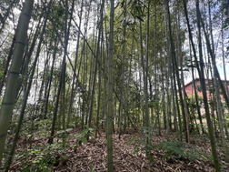

# 第 3.10 节 磁盘结构

## 文件系统

首先我们欣赏以下两张照片：

前一张图是竹子，第二张图是若干棵行道树。

亚里士多德认为种子之所以能长成大树，是因为种子暗含着一种潜能，并且在环境满足的情况下，有实现为长成一棵树的可能性（参见 《形而上学》 1049b）。而人的不同就在于人没有固定不变的潜能，这也契合了儒家学说“君子不器”（《论语·为政》）。理解 UNIX 目录与 Windows 目录的异同，对于深入理解操作系统的设计与实现是很重要的。

我们都听说过一个故事，竹子（Bambusoideae）开花意味着大片竹林的死亡。这是因为，大部分看似茂密繁盛的竹林，极有可能到头来只有一棵竹子真实存活。这些竹子都是从相同的地下根系生长出来的，虽然看起来是多个竹子，它们其实是一个整体。这也是雨后春笋的来历。无论他们相隔多远，仍旧一荣俱荣，一损俱损。这就是 UNIX 的目录——系统中的所有目录都依赖于根（root）。根（`/`）是一切目录的起点。比如 `/home/ykla/nihao`、`/bin/sh`、`/etc/fstab` 他们追根溯源，都是从根出发的。换言之，如果你删除 `/`，那么等于删除了整个系统，所有设备上的目录都会被删除。

行道树则不然，每棵普通的行道树都是独立生长的。无论他们靠的多么紧密，他们仍然是独立的。行道树与 Windows 目录类似，都是独立的——`C:\Program Files (x86)\Google\Update`、`D:\BaiduNetdiskDownload\工具列表`、`E:\123\app`：`C`、`D`、`E` 盘都是独立的，互不干扰。你格式化 `D` 盘，并不会影响 `E` 盘存储的文件。甚至，即使你在 PE 中格式化了 `C` 盘（可能不会叫 `C` 盘），也不会影响 `E` 盘中的文件。

事实上 Windows 的“盘符”根本不存在，有经验的装机人员会发现，在 PE 中，`C` 盘会变成其他诸如 `X` 等盘符。正在使用中的 Windows，其盘符也可以随意分配。Windows 下真正判断一个分区是不是 `C` 盘，是靠 GPT 分区类型的 UUID（如我的 `C` 盘分区类型 UUID 是 `EBD0A0A2-B9E5-4433-87C0-68B6B72699C7` ）以及唯一 ID 来判断的（配置写入 EFI 文件），而不是靠盘符。盘符是抽象出来的，实际上没有意义。这也就是为什么你在其他操作系统上包括 Windows 自己（如双系统）都看不到 `C` 盘的根本原因，因为不存在一个硬编码的，写入文件系统的 `C` 盘标识。只有在真正启动系统时，Windows 才会知道到底谁是 `C` 盘，并写入注册表。至于其他盘符的分配，则完全靠运气，出现 `D` 盘变 `E` 盘的问题也屡见不鲜：因为某虚拟光驱可能在开机时突然插入了等等……

>**思考题**
>
>阅读《深入解析 Windows 操作系统 （第7版）（卷2）》（9787115619747，人民邮电出版社）及其他相关文献资料，回答问题：在以往传统的 BIOS + MBR 引导下，Windows 如何识别 `C` 盘？第 3.9 节 磁盘结构