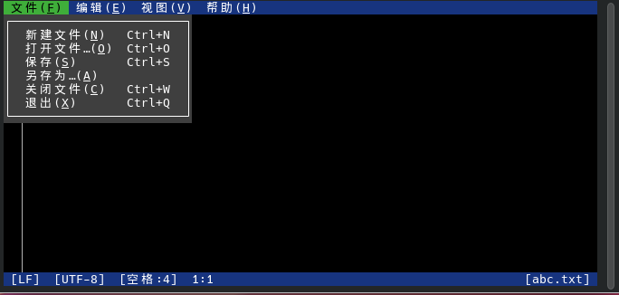

# 3.6 文本编辑器

## `ee` 编辑器基本用法

`ee` 是 FreeBSD 基本系统内置的编辑器。

`ee` 的用法比 [nano](https://www.redhat.com/zh/blog/getting-started-nano)（一款 GNU 编辑器）还要简单上许多，你从其名字“easy editor”（简单的编辑器）就能看出来。

比如

```sh
# ee a.txt
```

可以直接编辑，就和 `nano` 或 Windows 记事本一样。

按 **ESC 键**，会显示提示框，按两次 **回车键** 即可保存。

## `vi` 编辑器基本用法

FreeBSD 还有一款内置的编辑器是 `vi`，用法较为复杂。有别于大多数类 UNIX 操作系统将 `vi` 链接到了 `vim` 的做法，BSD 系统内是真正的 `vi`（实际上是 `nvi`，即新 vi，4.4BSD 再实现）。

- macOS 下的 `vi`

```sh
$ ls -al /usr/bin/vi   
lrwxr-xr-x  1 root  wheel  3  4 12 13:16 /usr/bin/vi -> vim
```

打开 BSD 的 `vi` 后默认处于“命令模式”，此时输入 `i`，可以进入到“文本模式”，这时候就可以顺利编辑文本了。需要注意的是，**删除键（退格键）** 不起作用，或者说和 **Insert 键** 表现的一样。要删除文本的话，需要按 **Delete 键**。

```sh
bc123
~      
~
~
```

>**技巧**
>
>空行会显示为 `~`。

编辑完成后，按 **ESC 键** 即可从从文本模式退回到命令模式。

在命令模式下，输入 `:`，即可输入命令，例如：`:q` 是退出不保存、`:wq` 是保存并退出、`:wq!` 是强制保存、`:q!` 是强制退出。


```sh
ABC
~
~
:wq
```

## microsoft-edit

microsoft-edit 是微软开源的文本编辑器，原生支持中文、交互界面简单、可使用鼠标操作。

- 使用 pkg 安装：

```sh
# pkg ins microsoft-edit
```

- 还可以使用 Ports 安装：

```sh
# cd /usr/ports/editors/microsoft-edit/ 
# make install clean
```

使用方式：


```sh
$ msedit abc.txt
```




操作非常简单，不再赘述。

