# 3.1 使用 Hyper-V 安装 FreeBSD

本节介绍 FreeBSD 操作系统在 Microsoft Hyper-V 虚拟化平台上的部署方法。

## Hyper-V 简介

虚拟化管理程序是一种创建和运行虚拟机的软件，可以在单个物理主机上同时运行多个独立的操作系统。

Hyper-V 是微软公司（Microsoft）为 Windows 和 Windows Server 开发的企业级虚拟化管理程序，属于系统内置组件。

Hyper-V 分为 Gen 1（第一代）和 Gen 2（第二代）两种虚拟机架构，两种架构在硬件支持和启动方式上存在技术差异。

Gen 1 与 Gen 2 的区别如下表所示：

| Hyper-V 代系 | 硬盘 | 启动方式 |
| ------------ | ---- | -------- |
| Gen 1 | IDE + SCSI | 仅支持 MBR |
| Gen 2 | 仅 SCSI | 仅支持 UEFI（包含安全启动及 PXE 支持） |

系统快速创建的虚拟机默认为 Gen 2 架构。

> **注意**
>
> 使用 Gen 2 时请关闭安全启动，否则系统无法启动。具体操作步骤为：点击“设置”，选择“安全”，取消勾选“启用安全启动”。截至 2025 年 12 月 20 日，FreeBSD 尚不支持安全启动。

| Hyper-V 代系 | FreeBSD 版本 | 鼠标 | 键盘 | 备注 |
| ------------ | ------------ | ---- | ---- | ---- |
| Gen 1 | 13.0 | 支持 | 不支持 | / |
| Gen 2 | 13.0 | [不支持](https://bugs.freebsd.org/bugzilla/show_bug.cgi?id=221074) | 支持 | 需修改参数 `sysctl kern.evdev.rcpt_mask=6`（启用 evdev，让 Xorg 正确检测 PS/2 设备） |
| Gen 2 | 14.0 | 支持 | 支持 | 参见：FreeBSD Project. src[EB/OL]. [2026-03-26]. <https://cgit.FreeBSD.org/src/commit/?id=21f4e817fde79d5de79bfbdf180d358ca5f48bf9>. |

## 测试环境

本节基于以下软硬件环境进行测试与演示，实验结果具有一定的环境依赖性。

- Windows 11 23H2 专业版
- FreeBSD 14.1-RELEASE（`FreeBSD-14.1-RELEASE-amd64-disc1.iso`）
- Hyper-V 版本：10.0.22621.4249
- 使用第二代 Hyper-V 虚拟机

## 安装 Hyper-V

> **注意**
>
> Windows 家庭版和家庭中文版不支持 Hyper-V。

在 Windows 系统中启用 Hyper-V 功能组件，需以管理员权限执行相关命令，以确保操作的合法性与系统配置的正确性。

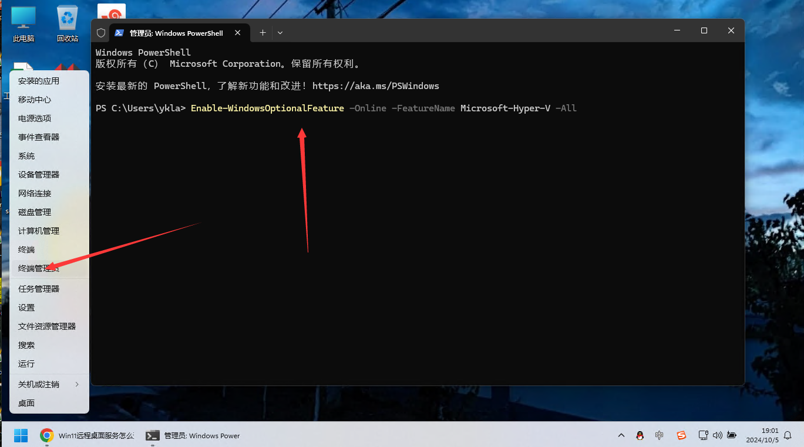

右键单击 Windows 徽标，在弹出的菜单中选择“终端（管理员）”。启用 Hyper-V 需要使用 `Enable-WindowsOptionalFeature` 命令，该命令将启用 Windows 的 Hyper-V 可选功能组件，包括虚拟机管理程序、管理工具等核心模块。输入以下命令：

```powershell
PS C:\Users\ykla> Enable-WindowsOptionalFeature -Online -FeatureName Microsoft-Hyper-V -All 
是否立即重启计算机以完成此操作?
[Y] Yes  [N] No  [?] 帮助 (默认值为“Y”): 
# 此处按回车键确认重启以完成 Hyper-V 的安装
```

## 创建虚拟机

安装完成 Hyper-V 后，按照以下步骤创建虚拟机。

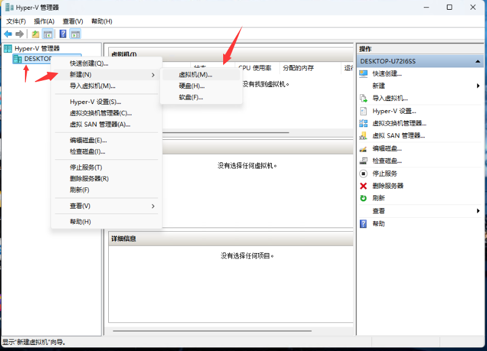

右键单击 Hyper-V 管理器中的主机名，选择“新建”→“虚拟机”。

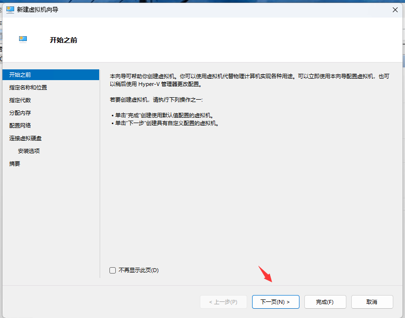

点击“下一页”。

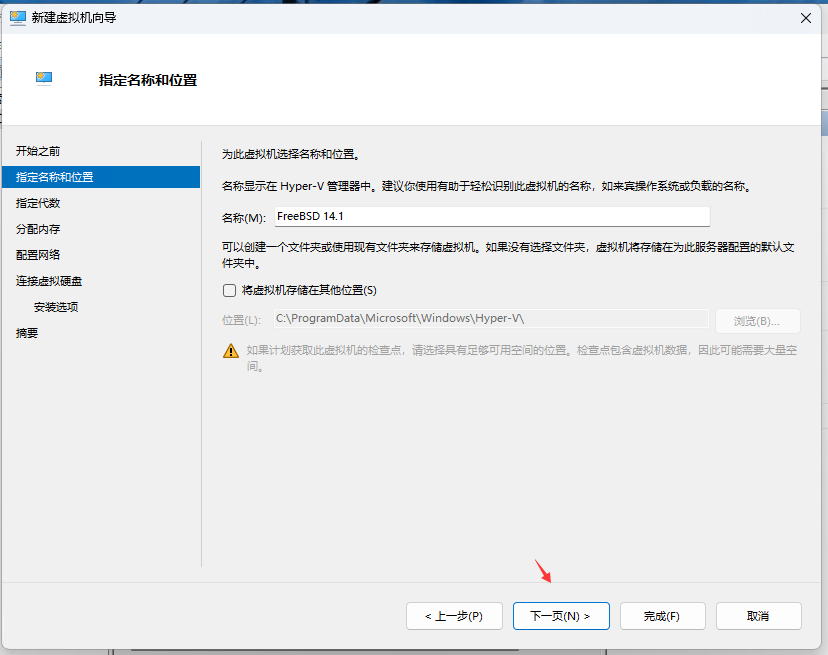

为虚拟机设置名称，然后点击“下一页”。

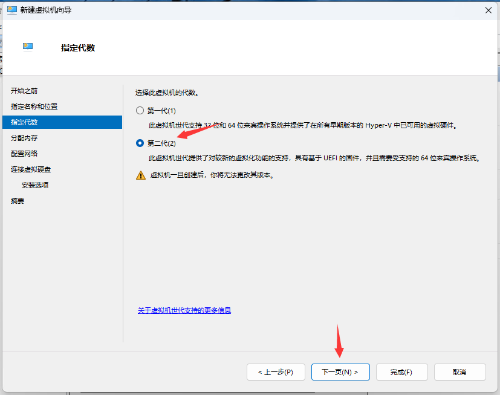

选择“第二代”。然后点击“下一页”。

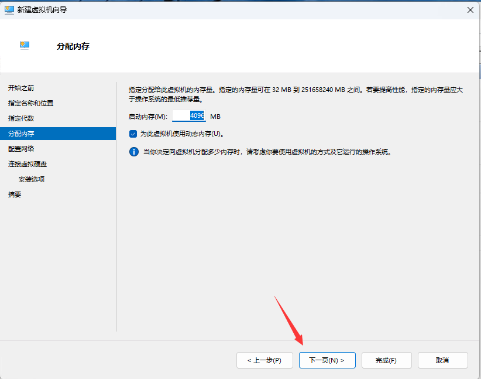

设置内存大小，然后点击“下一页”。

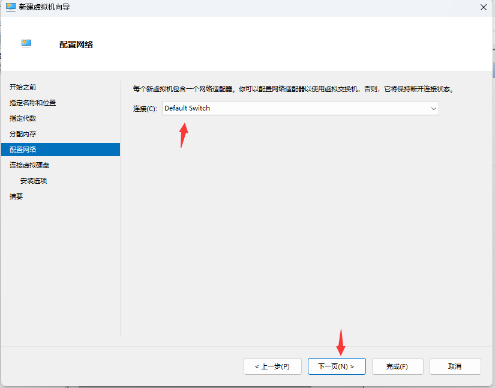

设置网络，然后点击“下一页”。

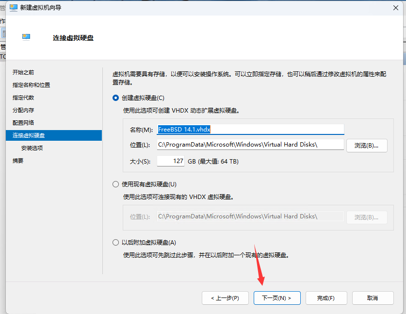

指定虚拟硬盘的名称、大小及存储位置，然后点击“下一页”。

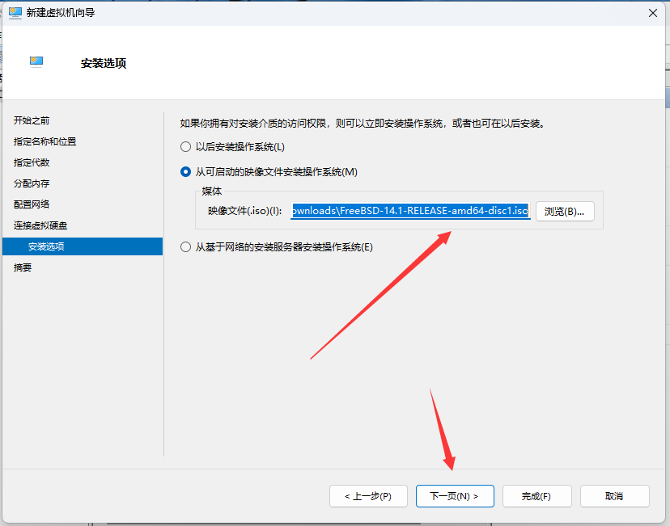

点击“浏览”，找到并选中已下载的 `FreeBSD-14.1-RELEASE-amd64-disc1.iso` 文件，然后点击“下一页”。

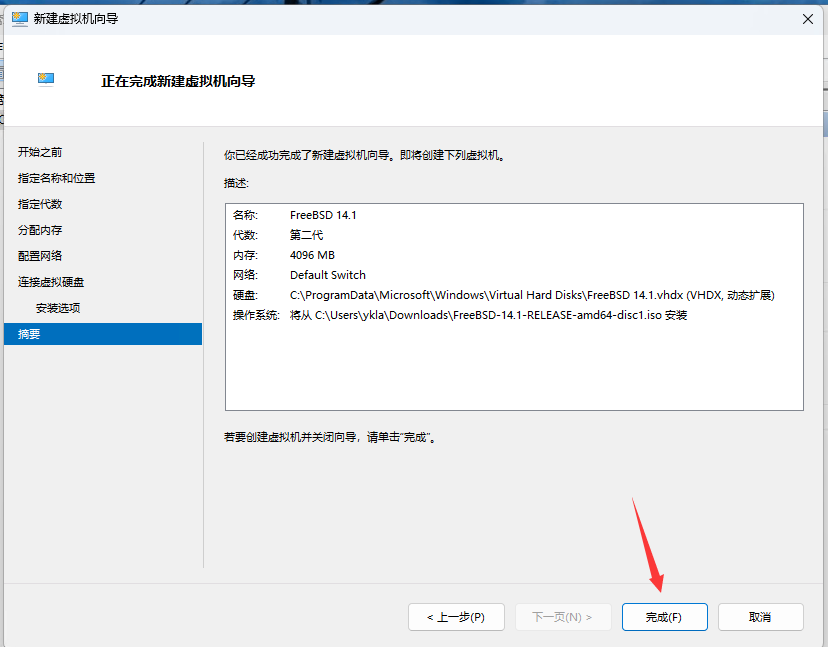

点击“完成”。

## 调整虚拟机

虚拟机创建完成后，需要对部分设置进行调整。

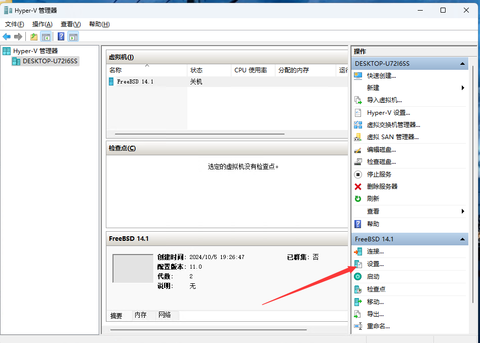

点击“设置”。

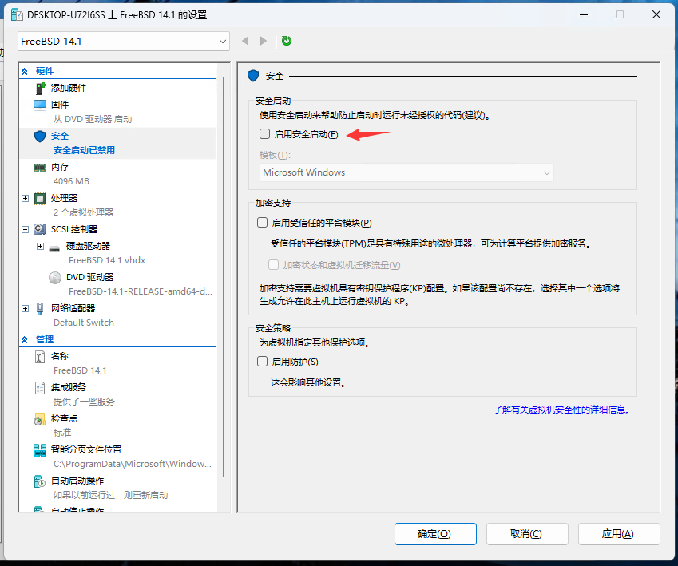

由于 FreeBSD 尚未支持安全启动，请务必关闭安全启动，否则将无法从安装介质启动安装程序。

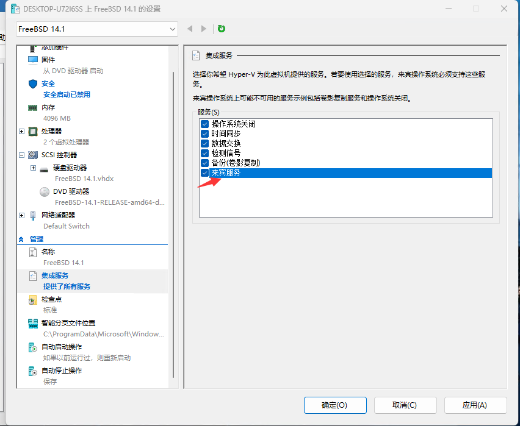

请勾选“来宾服务”。来宾服务是 Hyper-V 集成服务的一部分，提供宿主机与虚拟机之间的文件交换、时间同步等集成功能。其作用详见参考文献。

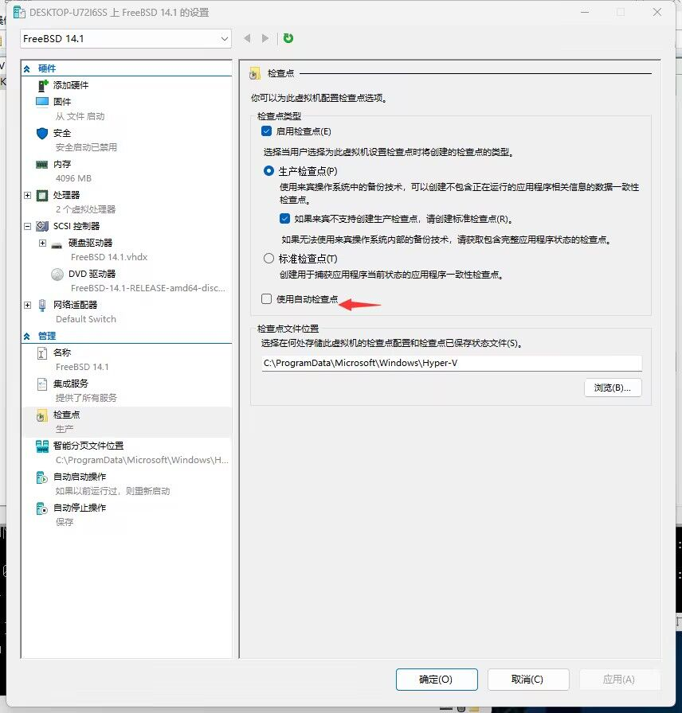

可选择关闭“使用自动检查点”（即关闭自动快照功能），其作用详见参考文献。

## 安装 FreeBSD

虚拟机设置调整完成后，即可开始安装 FreeBSD 系统。

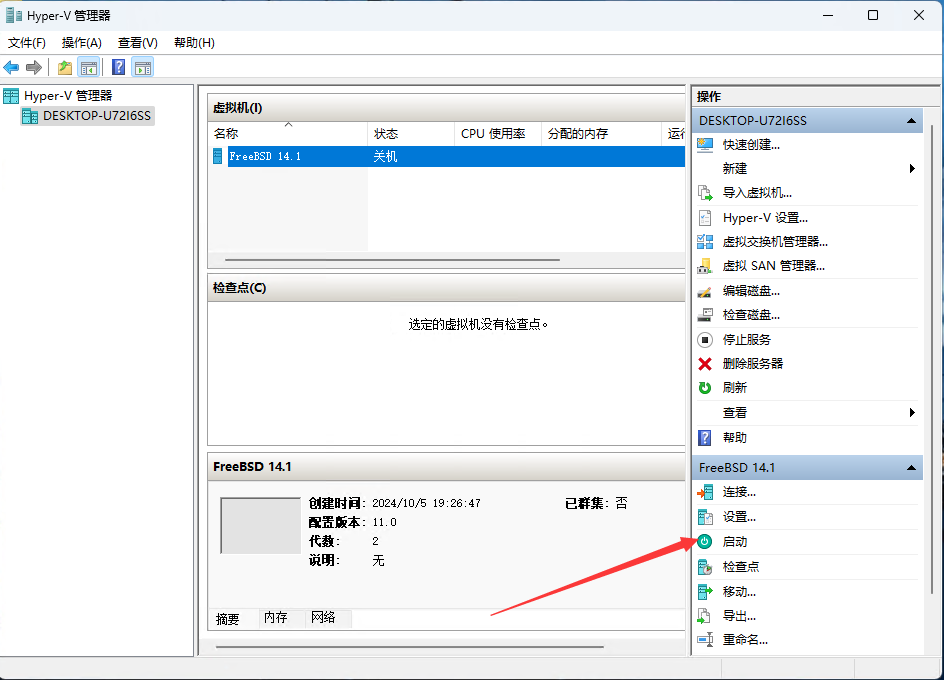

启动该虚拟机。

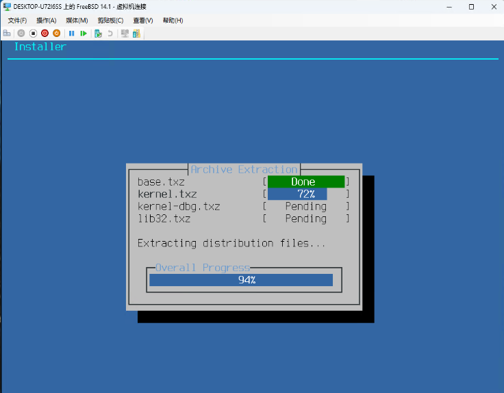

按提示开始安装 FreeBSD。

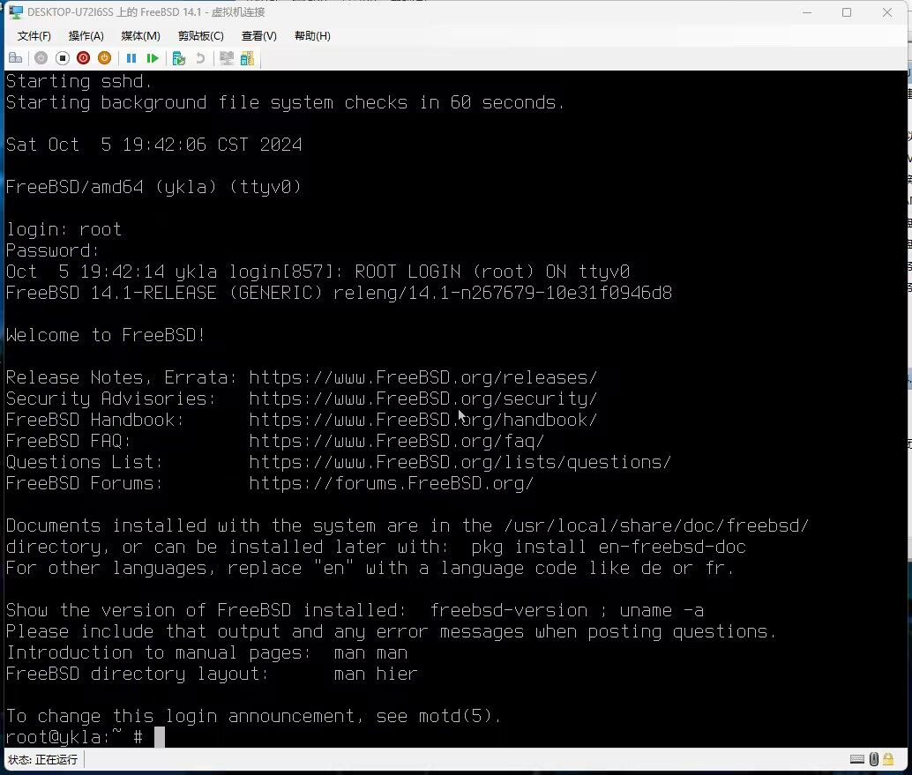

安装完成。

## 测试桌面

安装完成后，可对虚拟机进行基本功能测试。

鼠标和键盘均可正常工作，可在宿主机和虚拟机间无缝切换，但虚拟机桌面分辨率无法自适应调整。建议检查 Hyper-V 集成服务安装并参考 FreeBSD 文档以获取显示配置指南。


删除虚拟机前，必须先将其关闭。

## 参考文献

- 微软. 安装 Hyper-V[EB/OL]. (2025-05-23)[2026-04-04]. <https://learn.microsoft.com/zh-cn/windows-server/virtualization/hyper-v/get-started/install-hyper-v?tabs=powershell&pivots=windows>. 指出家庭版并不支持 Hyper-V 虚拟化技术。
- 微软. Windows Server 和 Windows 中的 Hyper-V 虚拟化[EB/OL]. [2026-03-26]. <https://learn.microsoft.com/zh-cn/windows-server/virtualization/hyper-v/overview>. 微软官方对 Hyper-V 的说明，详细介绍了 Hyper-V 虚拟化架构与功能特性。
- 微软. 在 Windows 上安装 Hyper-V[EB/OL]. [2026-03-26]. <https://learn.microsoft.com/zh-cn/virtualization/hyper-v-on-windows/quick-start/enable-hyper-v>. 微软官方教程，提供了多种 Hyper-V 启用方法。
- 微软. Hyper-V 集成服务[EB/OL]. [2026-03-26]. <https://learn.microsoft.com/zh-cn/virtualization/hyper-v-on-windows/reference/integration-services>. 详细说明了 Hyper-V 集成服务的功能与配置方法。
- 微软. 使用检查点将虚拟机恢复到以前的状态[EB/OL]. [2026-03-26]. <https://learn.microsoft.com/zh-cn/virtualization/hyper-v-on-windows/user-guide/checkpoints?source=recommendations&tabs=hyper-v-manager%2Cpowershell>. 介绍了 Hyper-V 检查点的创建与使用方法。
- 微软. 在 Hyper-V 中在标准检查点与生产检查点之间进行选择[EB/OL]. [2026-03-26]. <https://learn.microsoft.com/zh-cn/windows-server/virtualization/hyper-v/manage/choose-between-standard-or-production-checkpoints-in-hyper-v>. 对比了标准检查点与生产检查点的差异与适用场景。
- nanorkyo. FreeBSD13 を Hyper-V 環境 にインストールしてみた 所感[EB/OL]. [2026-03-26]. <https://qiita.com/nanorkyo/items/d33e1befd4eb9c004fcd>. 提供了 FreeBSD 在 Hyper-V 环境下的安装经验与技巧。

## 课后习题

1. 查找 FreeBSD 源代码中关于 `kern.evdev.rcpt_mask` 的实现，逐行注释并分析原理。

2. 探索哪些 Hyper-V 虚拟化设置能够优化虚拟化体验。
