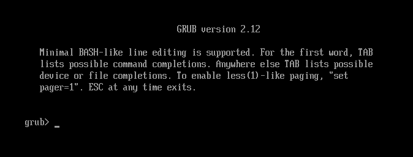
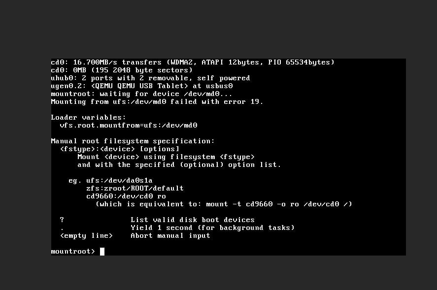

# 3.10 KVM、QEMU 等平台安装 FreeBSD（传统引导和 MBR 分区表）

本节研究在 KVM/QEMU 等硬件辅助虚拟化平台上，通过传统 BIOS + MBR 方式部署 FreeBSD 的技术方案，特别适用于不直接提供 FreeBSD 镜像的云服务环境。

> **注意**
>
> 此方法不支持 OpenVZ、LXC 等容器化技术，因为其本质上不属于完整的虚拟化解决方案，宿主机与客户机共享内核。由于内核已经是 Linux，因此无法运行 FreeBSD 系统。
>
> 此方法不支持 UEFI 引导模式（BIOS + GPT 分区表同样不支持），仅支持传统 BIOS + MBR 引导方式，请确保环境符合要求。

> **警告**
>
> 请注意数据安全，以下教程具有一定风险，且要求操作者具备相应的操作能力与系统管理知识。

## 概述

本节介绍在 KVM、QEMU 等平台上安装 FreeBSD 的方法。在多数采用 KVM、QEMU 虚拟化架构的服务商中，大部分不直接提供 FreeBSD 系统支持，只能通过特殊方法手动安装。

这些服务商虽然在部分机型上提供 FreeBSD 系统镜像，但支持并不完善，例如自带镜像默认未启用 `BBR`，而部分机型则完全不提供 FreeBSD 支持。

本方法无需使用 mfsLinux 作为安装介质，也无需通过 `dd` 命令进行安装。

mfsBSD 是一款完全载入内存的 FreeBSD 系统，类似于 Windows PE（Preinstallation Environment）系统。

本节通过 GRUB2 借助 MEMDISK 模块将 mfsBSD 载入内存盘，并从中启动。进而通过 mfsBSD 中的 `bsdinstall` 命令安装 FreeBSD。

## 获取现有网络配置

部分服务器可能未启用 DHCP 服务，而需要手动指定 IP，这种情况多见于小型厂商的服务器。

安装前，请在原 Linux 系统中确认 IP 地址和子网掩码。

可以使用命令 `ip addr` 和 `ip route show` 查看网关信息。

## 准备 mfsBSD

需要下载 mfsBSD。可以下载到本地计算机，再通过 SCP、SFTP 或 WinSCP 等工具上传至服务器；也可以直接在服务器上使用命令行下载。

> **注意**
>
> 仅支持 IPv6 的服务器无法通过命令行下载，因为 mfsBSD 的下载地址不支持 IPv6 网络。
>
> 针对该问题，已通过邮件与作者沟通，但截至发稿时尚未收到回应。

### 内存 ≤ 512 MB

下载 mfsBSD Mini 14.1-RELEASE ISO 镜像：

```sh
# wget https://mfsbsd.vx.sk/files/iso/14/amd64/mfsbsd-mini-14.1-RELEASE-amd64.iso
```

校验码（官网链接指向错误，已反馈但未获回复）：[checksums](https://mfsbsd.vx.sk/files/iso/14/amd64/mfsbsd-mini-14.1-RELEASE-amd64.iso.sums.txt)

> **技巧**
>
> 内存小于或等于 4 GB 的机器不建议使用 ZFS 文件系统。
>
> 同时，mfsBSD Mini 可能无法正常加载 `zfs` 内核模块。
>
> 此种情况下仅可使用 UFS 文件系统。

### 内存 > 512 MB

下载 mfsBSD 14.2-RELEASE AMD64 ISO 镜像：

```sh
# wget https://mfsbsd.vx.sk/files/iso/14/amd64/mfsbsd-14.2-RELEASE-amd64.iso
```

校验码：[checksums](https://mfsbsd.vx.sk/files/iso/14/amd64/mfsbsd-14.2-RELEASE-amd64.iso.sums.txt)

### 准备 mfsBSD.iso

将下载的 mfsBSD 重命名为 `mfsbsd.iso`，并放置在 `/boot` 目录下（否则可能因 LVM 导致硬盘分区无法识别）。

## 获取 memdisk

memdisk 是 syslinux 软件提供的工具，用于将 ISO 镜像加载到内存中。

> **警告**
>
> 请注意，GRUB2 自带的 `memdisk.mod` 模块并非此处所需的 MEMDISK。
>
> memdisk 必须通过包管理器安装的 syslinux 软件提供。

### 安装 syslinux

不同 Linux 发行版安装 syslinux 的命令有所不同。

- Debian/Ubuntu

```bash
# apt install syslinux
```

- Rocky Linux

```bash
# dnf install syslinux
```

### 提取 memdisk

从已安装的 syslinux 包中提取 memdisk 文件到 `/boot`：

```sh
# cp /usr/lib/syslinux/memdisk /boot/
```

## 取消隐藏的 GRUB 菜单

取消 GRUB2 菜单自动隐藏设置：

```bash
# grub2-editenv - unset menu_auto_hide
```

## 启动 mfsBSD

重启并进入 GRUB 菜单后，按 `c` 键进入命令行模式：




```sh
ls # 显示磁盘。如果显示的磁盘为 (hd0,gptxxx)，说明该平台不支持本节方法。
ls (hd0,msdos2)/
linux16 (hd0,msdos2)/memdisk iso
initrd (hd0,msdos2)/mfsbsd.iso
boot # 输入 boot 后按回车从 mfsBSD 继续启动
```

> **注意**
>
> 如果遇到问题，可尝试切换到串口控制台（`console=comconsole`），或检查镜像完整性。

在 Proxmox 中，可直接点击界面上的 `xterm.js` 按钮进入串口控制台排查问题。


## 为 mfsBSD 配置网络

mfsBSD 的 `root` 默认密码为 `mfsroot`。可以使用 SSH 工具连接后进行安装。

> **技巧**
>
> 如果平台支持 DHCP 自动获取网络配置，可跳过本节。

重启进入 mfsBSD 后，配置网络。

以接口 `vtnet0` 为例，配置 IPv4：

> **警告**
>
> 请将下面的示例替换为实际 IP 地址和路由信息。

```sh
# ifconfig vtnet0 inet 192.0.2.123/24 # 为网卡 vtnet0 设置 IPv4
# route add -inet default 192.0.2.1 # 设置默认网关/路由
```

检查网络配置：

```sh
# ifconfig vtnet0 # 显示网卡接口 vtnet0 的网络信息
# route -n show -inet6 # 显示 IPv6 的路由表
```

## 开始安装

使用 `kldload zfs` 加载 zfs 模块，然后运行 `bsdinstall`。

该步骤可参照其他章节的方法安装。

## 故障排除与未竟事宜

### GPT 分区表下如何安装？

可参考以下资料：

- Konstantin Kelemen. Booting mfsBSD via PXE with UEFI[EB/OL]. (2019-10-24)[2026-03-29]. <https://unix.stackexchange.com/questions/563053/booting-mfsbsd-via-pxe-with-uefi>.
- FreeBSD Forums. Booting mfsBSD via iPXE on EFI[EB/OL]. (2018-10-05)[2026-03-29]. <https://forums.freebsd.org/threads/booting-mfsbsd-via-ipxe-on-efi.66169/>.

待解决、待尝试。

### VMware、VirtualBox 无法按照此方法安装

对于 VirtualBox，可尝试将虚拟化引擎选择为“KVM”后再次引导（测试环境未能成功引导，结果可能因环境而异）。


### 待尝试的方案

以下方案尚未经过验证，供读者参考尝试。

- `dd` 写入 [VM-IMAGES 列表下的镜像](https://download.freebsd.org/releases/VM-IMAGES/14.3-RELEASE/amd64/Latest/)
- `dd` 写入 [FreeBSD-14.3-RELEASE-amd64-memstick](https://download.freebsd.org/releases/ISO-IMAGES/14.3/FreeBSD-14.3-RELEASE-amd64-memstick.img)
- 在 QEMU 平台上，尝试直接使用 `dd`



思路：在该界面可使用 `?` 命令查看磁盘信息，有望继续完成引导。

- 通过 mfsLinux `dd` mfsBSD


此问题尚待验证。

## 参考文献

- mfsBSD. mfsBSD — minimalistic FreeBSD distribution[EB/OL]. [2026-04-17]. <https://mfsbsd.vx.sk/>. mfsBSD 项目主页，提供完全载入内存的 FreeBSD 系统镜像。
- syslinux Wiki. MEMDISK[EB/OL]. [2026-04-17]. <https://wiki.syslinux.org/wiki/index.php?title=MEMDISK>. MEMDISK 模块说明，用于将 ISO 镜像加载到内存中作为虚拟磁盘使用。

## 课后习题

1. 查阅 MEMDISK 模块的技术文档，分析其将 ISO 镜像加载至内存作为虚拟磁盘的工作原理，并评估该方案在 UEFI 环境下的兼容性限制。
2. 使用 `dd` 命令将 FreeBSD VM-IMAGES 镜像写入虚拟磁盘，记录实验结果并从磁盘格式和分区表层面分析失败或成功的技术原因。
3. 分析 GPT 分区表与 MBR 分区表在无远程控制台安装场景下的技术差异，论证本节仅支持传统 BIOS + MBR 方式的原因，并评估 UEFI + GPT 方案的可行性。
