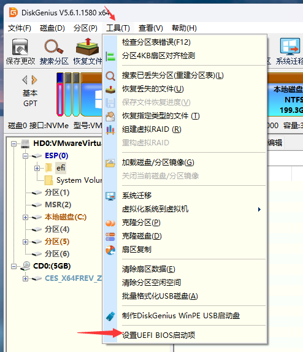

# 3.11 rEFInd 引导管理器（多系统引导管理）

在多系统环境下，频繁通过 BIOS 固件界面切换操作系统存在效率低下的问题。

可以借助 [rEFInd](https://www.rodsbooks.com/refind/) 实现类似于 Clover 的可视化启动菜单效果，在开机时直观地选择要进入的操作系统。

`rEFInd` 派生自 `rEFIt`，其名称结合了“refind”（意为“重新发现”或“改进”）与“EFI”（Extensible Firmware Interface，可扩展固件接口），主要用于管理 UEFI 启动，具有良好的图形化界面与可配置性。

首先需要下载 rEFInd 软件。打开下载页面 [Getting rEFInd from Sourceforge](https://www.rodsbooks.com/refind/getting.html)，点击 `A binary zip file` 链接即可开始下载。本节撰写时使用的版本为 `refind-bin-0.14.2.zip`。

下载的压缩包中，仅部分文件是必需的启动文件。只需要其中的 `refind` 文件夹，其余文件可忽略。

`refind` 文件夹中也仅包含部分必需的启动文件。所有文件名中包含 `aa64` 或 `ia32` 的文件均可删除（通常仅保留 `x64` 版本）。

最终需要保留的文件如下图所示。


将 `refind.conf-sample` 文件复制一份，并重命名为 `refind.conf`。

通常无需手动配置。但若出现无法自动识别现有操作系统的情况，请按以下方法手动添加引导项：

打开 `refind.conf` 文件，在任意空白处添加如下配置：

```ini
menuentry "FreeBSD" {
	icon \EFI\refind\icons\os_freebsd.png
	volume "FreeBSD"
	loader \EFI\freebsd\loader.efi
}

menuentry "Windows 10" {
	icon \EFI\refind\icons\os_win.png
	volume "Windows 10"
	loader \EFI\Microsoft\Boot\bootmgfw.efi
}
```

目录结构：

```sh
EFI/
├── refind/
│   ├── refind.conf        # rEFInd 主配置文件
│   ├── refind.conf-sample # rEFInd 示例配置文件
│   ├── refind_x64.efi     # rEFInd 64 位启动文件
│   ├── icons/
│   │   ├── os_freebsd.png # FreeBSD 图标
│   │   └── os_win.png    # Windows 图标
│   └── themes/
│       └── Matrix-rEFInd/
│           └── theme.conf  # Matrix 主题配置
├── freebsd/
│   └── loader.efi        # FreeBSD 引导加载程序
└── Microsoft/
    └── Boot/
        └── bootmgfw.efi   # Windows 启动管理器
```

使用 [DiskGenius](https://www.diskgenius.com/) 将处理后的 `refind` 文件夹复制到 EFI 系统分区（ESP）的 `EFI` 目录下。


## 添加启动项

使用 [DiskGenius](https://www.diskgenius.com/) 添加 UEFI 引导项。



点击菜单栏的“工具”，选择“设置 UEFI BIOS 启动项”。


在新窗口中点击“添加”，然后浏览并选中 `refind` 文件夹内的 `refind_x64.efi` 文件。


将该启动项移动至列表顶部，设为第一启动项。保存设置并重启电脑以测试效果。


重启后，在 rEFInd 界面中选择任一操作系统选项，应可正常进入。

## 附录：rEFInd 主题

rEFInd 支持多种图形化主题。

本例以 Matrix-rEFInd（灵感来源于电影《黑客帝国》）主题为例进行说明。

项目地址为：[Matrix-rEFInd](https://github.com/Yannis4444/Matrix-rEFInd/)

下载项目压缩包 `Matrix-rEFInd-master.zip` 并解压。将解压得到的文件夹 `Matrix-rEFInd-master` 重命名为 `Matrix-rEFInd`。

在本地新建一个名为 `themes` 的目录，将重命名后的 `Matrix-rEFInd` 文件夹放入其中。

将此 `themes` 目录整体复制到 EFI 系统分区中的 `EFI\refind\` 目录下。

编辑 `refind.conf` 文件（若无法直接在 ESP 中编辑，可将其复制到桌面，修改后覆盖原文件），在文件末尾添加一行：

```ini
include themes/Matrix-rEFInd/theme.conf
```

即可调用主题 Matrix-rEFInd。

重启之后观察效果：


> **技巧**
>
> 如果在虚拟机（如 VMware、VirtualBox）中操作，由于其 UEFI 固件的屏幕分辨率限制，rEFInd 界面可能无法同时显示所有操作系统选项，需通过方向键切换查看，这与上图所示的效果可能不同。

## 参考文献

- SMITH R W. rEFInd Boot Manager[EB/OL]. [2026-04-17]. <https://www.rodsbooks.com/refind/>. rEFInd 官方网站，该引导管理器派生自 rEFIt 项目，用于管理 UEFI 环境下的多系统启动。

## 课后习题

1. 研究 rEFInd 的自动操作系统检测机制，分析它如何扫描 EFI 系统分区并识别不同的操作系统，尝试手动添加一个自定义启动项并验证。

2. 使 [Clover](https://github.com/cloverhackycolor/cloverbootloader/) 等更多类似软件适配 FreeBSD。

3. 尝试创建一个 FreeBSD 特色主题。
