# 3.2 使用 VMware Workstation Pro 安装 FreeBSD

本节介绍在 VMware Workstation Pro 虚拟化平台上部署 FreeBSD 操作系统的完整流程与关键配置细节。

VMware Workstation Pro 是一款 Type-2 虚拟机监视器（Hypervisor），运行在宿主操作系统之上，通过二进制翻译（binary translation）和硬件辅助虚拟化（hardware-assisted virtualization，基于 Intel VT-x 或 AMD-V 技术）实现 x86 指令集的虚拟化。

## 视频教程

以下视频教程演示了在 Windows 11 上安装 VMware Workstation Pro 17 的过程，具有直观的操作演示，可供读者参考：

FreeBSD 中文社区. 001-Windows 11 安装 VMware 17[EB/OL]. [2026-04-04]. <https://www.bilibili.com/video/BV1Qji2YLEgS>.

## 镜像下载

在开始安装之前，需要先下载 FreeBSD 的安装介质镜像。

> **提示**
>
> 虚拟机也可以使用 FreeBSD 官方构建的 [虚拟机镜像](https://download.freebsd.org/releases/VM-IMAGES/15.0-RELEASE/amd64/Latest/)，该类镜像经过预配置，使用时需要手动扩容，文件系统可选 UFS 与 ZFS。
>
> 虚拟机一般使用 `FreeBSD-15.0-RELEASE-amd64-disc1.iso` 等类似文件名和后缀的 ISO 光盘镜像，但 `FreeBSD-15.0-RELEASE-amd64-memstick.img` 并非只能用于 U 盘刻录，虚拟机同样可以使用，具体使用方法可参考其他章节。

## 配置虚拟机

镜像下载完成后，在 VMware Workstation Pro 中创建新的虚拟机，按照以下步骤进行配置。


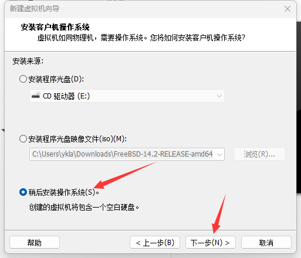

请务必选择“稍后安装操作系统”，否则可能导致启动问题。

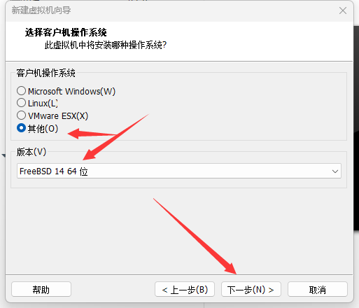

请选择“其他”，然后选择 FreeBSD。

> **技巧**
>
> 在测试环境中，选择其他操作系统类型也能正常启动，但为保持配置一致性并避免潜在兼容性问题，建议选择 FreeBSD。对于低版本的 FreeBSD，虚拟机增强工具没有开源，可能会出现问题。

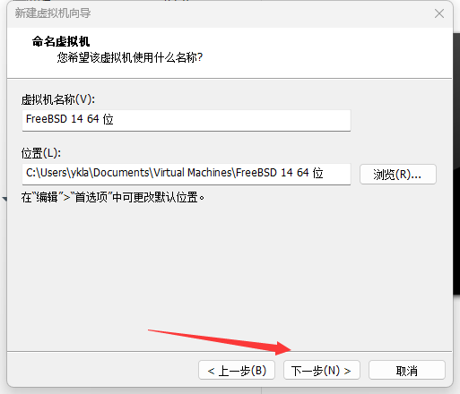

虚拟机通常会占用较大的磁盘空间。若不希望系统盘（如 C 盘）空间不足，请自行调整虚拟机的存储位置。


请根据实际需要调整虚拟磁盘的最大大小。默认值可能偏小。若要安装图形化桌面环境，建议分配至少 20 GB 的磁盘空间。

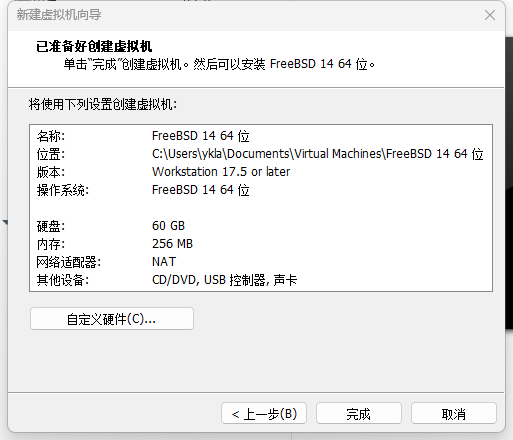

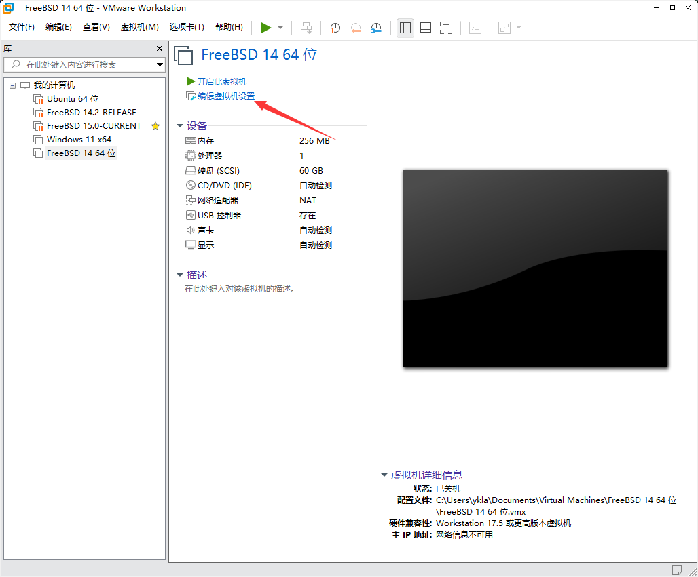


默认的 256 MB 内存可以启动系统，但不建议用于实际使用。最低建议配置为 512 MB。


默认的 1 个 CPU 核心可以启动，但为了获得更好的性能，建议根据宿主机资源情况进行调整。

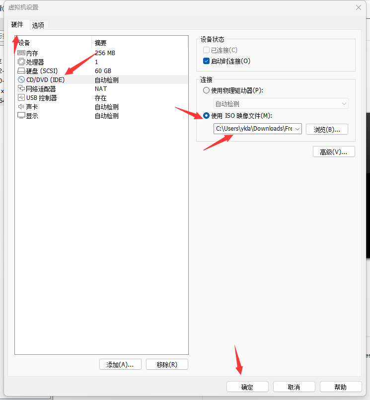

在“使用 ISO 映像文件”处，点击“浏览”，找到并选中下载的 `FreeBSD-15.0-RELEASE-amd64-disc1.iso` 文件。

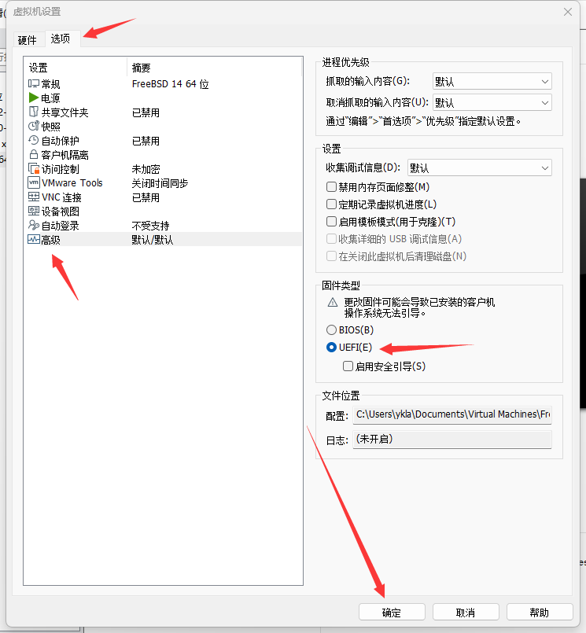

> **技巧**
>
> 经过测试，FreeBSD 亦支持 UEFI 下 VMware 的显卡驱动。（2025 年 3 月 24 日）

> **警告**
>
> 由于 FreeBSD Bug 250580 – VMware UEFI guests crash in virtual hardware after r366691[EB/OL]. (2020-10-24)[2026-04-04]. <https://bugs.freebsd.org/bugzilla/show_bug.cgi?id=250580>. 的存在，FreeBSD 11-RELEASE/12-RELEASE 在 VMware 的 UEFI 环境下可能无法启动。经测试，FreeBSD 13.0-RELEASE 可正常启动。

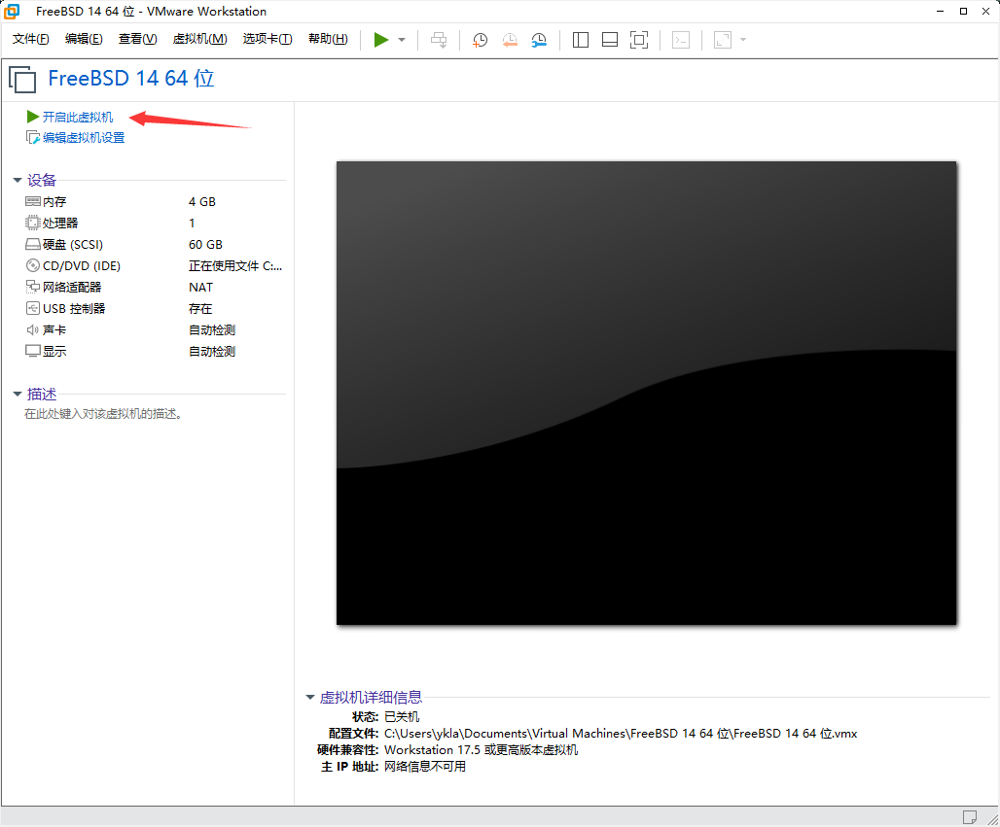


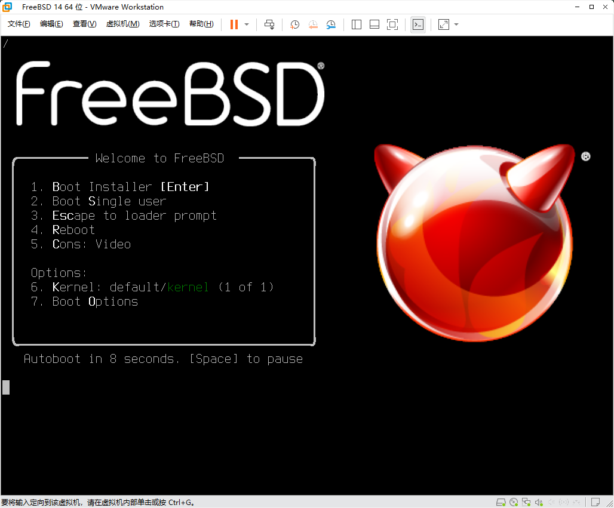

## 网络设置

请使用 NAT 模式（默认设置）。如果虚拟机无法与宿主机（物理机）通信，请打开 VMware 的“编辑”菜单，选择“虚拟网络编辑器”，点击“还原默认设置”，直至配置恢复正常。

> **注意**
>
> 经过测试，桥接模式的虚拟机在与宿主机传递文件时，网速较慢。

> **技巧**
>
> 如果“还原默认设置”无效，且网络适配器列表异常（例如始终只有单个模式），可尝试根据下图所示手动配置网络。

> **警告**
>
> NAT 模式的“名称”与宿主机的 `控制面板\网络和 Internet\网络连接` 中的 `VMware Network Adapter VMnet8` 绑定，默认绑定的是 `8`。换言之，NAT 模式的“名称”默认必须指定为下图所示的 `VMnet8`，否则虚拟机将无法联网。
>
> 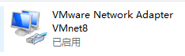


通常情况下无需进行手动设置。如果虚拟机内网络接口一直提示 `no link`，请尝试重启宿主机，然后打开 VMware 的虚拟网络编辑器，再次执行“还原默认设置”操作（不推荐手动配置，可能无效）。

如果无法连接网络，可尝试在虚拟机内将 DNS 服务器设置为 `223.5.5.5`。其他网络配置方法请参阅本章其他小节。

如果配置为桥接模式后始终无法通过 DHCP 获取 IP 地址，可尝试将网络适配器的“桥接到”选项从“自动”改为宿主机当前正在使用的物理网卡。


## 虚拟机增强工具与显卡驱动

VMware 的半虚拟化驱动程序（VMware Tools，亦称 Open VM Tools）通过 HGFS（Host-Guest File System）等专有协议提供图形加速、共享文件夹、剪贴板共享等功能，可改善虚拟机的 I/O 性能和用户体验。

为实现虚拟机与宿主机的良好集成，需安装 xf86-video-vmware（VMware 显卡驱动）和 xf86-input-vmmouse（VMware 虚拟鼠标驱动）。pkg 命令如下：

```sh
# pkg install xf86-video-vmware open-vm-tools xf86-input-vmmouse
```

或者使用 Ports 系统编译安装：

```sh
# cd /usr/ports/x11-drivers/xf86-video-vmware/ && make install clean
# cd /usr/ports/emulators/open-vm-tools/ && make install clean
# cd /usr/ports/x11-drivers/xf86-input-vmmouse/ && make install clean
```

> **注意**
>
> 如果不需要图形界面支持，可以安装无 X11 依赖的版本（仍然是 Port `emulators/open-vm-tools`）：
>
> ```sh
> # pkg install open-vm-tools-nox11
> ```

安装完成后，通常无需额外配置便可实现虚拟机屏幕的自动缩放功能。

> **注意**
>
> 即使在 Wayland 环境下，也需要安装该驱动。

> **技巧**
>
> 如果屏幕显示不正常（过大），请尝试以下操作：编辑虚拟机设置→硬件→显示器→监视器→指定监视器设置→任意监视器的最大分辨率，设置为宿主机的分辨率或略低于宿主机分辨率。具体步骤可参考故障排除部分。

### 鼠标集成：宿主机与虚拟机鼠标自由切换

请先安装显卡驱动和虚拟机增强工具。

```sh
# service moused enable        # 启用 moused 服务并写入系统配置
# Xorg -configure             # 生成 Xorg 默认配置文件
# mv /root/xorg.conf.new /usr/local/share/X11/xorg.conf.d/xorg.conf  # 安装 Xorg 配置文件
```

相关文件结构：

```sh
/
├── root/
│   └── xorg.conf.new # 生成的 Xorg 默认配置文件
└── usr/
    └── local/
        └── share/
            └── X11/
                └── xorg.conf.d/
                    └── xorg.conf # 最终安装的 Xorg 配置文件
```

编辑 `/usr/local/share/X11/xorg.conf.d/xorg.conf` 文件，修改以下段落（其他部分保持不变）：

```ini
Section "ServerLayout"
        Identifier     "X.org Configured"
        Screen          0  "Screen0" 0 0
        InputDevice    "Mouse0" "CorePointer"
        InputDevice    "Keyboard0" "CoreKeyboard"
        Option          "AutoAddDevices" "Off"  # 添加此行到此处：禁止 Xorg 自动添加输入设备
EndSection

…………此处省略一部分…………

Section "InputDevice"
      Identifier  "Mouse0"
      Driver      "vmmouse"  # 修改 mouse 为 vmmouse：使用 VMware 虚拟鼠标驱动
      Option      "Protocol" "auto"
      Option      "Device" "/dev/sysmouse"
      Option      "ZAxisMapping" "4 5 6 7"
EndSection

…………此处省略一部分…………
```

### 共享文件夹

请先安装虚拟机增强工具（Open VM Tools）。

#### 在物理机中设置共享文件夹

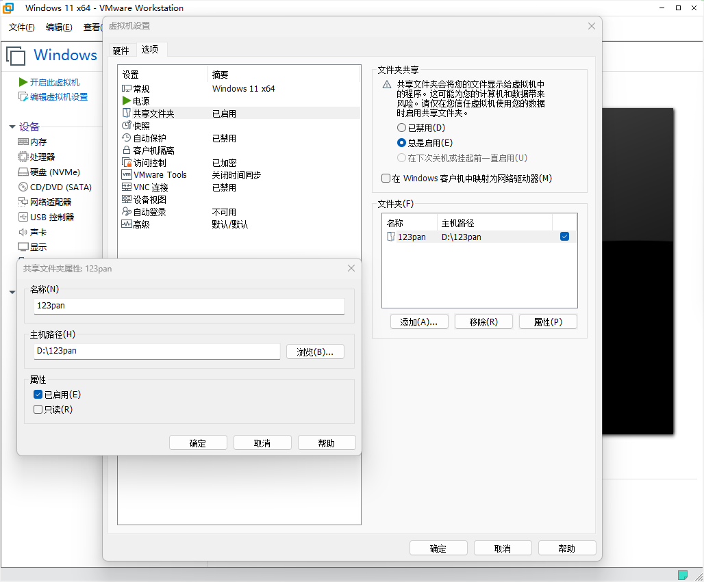

> **注意**
>
> 此示例中虚拟机名称显示为“Windows 11”，这是因为该虚拟机被配置为 Windows 11 与 FreeBSD 双系统，属正常情况。

列出当前可用的 VMware 共享文件夹：

```sh
# vmware-hgfsclient
123pan
```

#### 加载 fuse 模块

将以下内容添加到 `/boot/loader.conf` 文件中：

```sh
fusefs_load="YES"
```

可在系统启动时加载 fusefs 内核模块。

相关文件结构：

```sh
/
├── boot/
│   └── loader.conf    # 系统启动加载配置文件
├── etc/
│   └── fstab          # 文件系统挂载配置
└── mnt/
    └── hgfs/          # VMware 共享文件夹挂载点
```

#### 挂载

##### 手动挂载

> **注意**
>
> 请将以下命令中的 `123pan` 替换为在 VMware 中设置的共享文件夹名称。

将 VMware 共享目录 `123pan` 挂载到 `/mnt/hgfs`：

```sh
# vmhgfs-fuse .host:/123pan /mnt/hgfs
```

##### 自动挂载

编辑 `/etc/fstab` 文件。添加以下挂载条目（请将 `123pan` 替换为实际的共享文件夹名称）：

```sh
.host:/123pan      /mnt/hgfs    fusefs  rw,mountprog=/usr/local/bin/vmhgfs-fuse,allow_other,failok 0 0
```

系统将自动挂载 VMware 共享目录。

挂载 fstab 中所有未挂载的文件系统，检查有无错误（若无错误输出则正常），错误的配置可能导致系统无法正常启动：

```sh
# mount -al
```

#### 查看共享文件夹

列出已挂载的 VMware 共享文件夹内容：

```sh
# ls /mnt/hgfs/
Downloads
# ls /mnt/hgfs/Downloads/
零跑
```


文件内容一致。

#### 参考文献

- MaRcOGO. 解决 vmware 上 Ubuntu 共享文件夹[EB/OL]. (2022-07)[2026-03-26]. <https://www.cnblogs.com/MaRcOGO/p/16463460.html>. 提供了 VMware 共享文件夹配置的整体方法框架。
- FreeBSD Forums. fuse: failed to open fuse device[EB/OL]. [2026-03-26]. <https://forums.freebsd.org/threads/fuse-failed-to-open-fuse-device.44544/>. 解决了 fuse 设备无法打开的问题（如 `fuse: failed to open fuse device: No such file or directory`），为共享文件夹配置提供了关键参考。
- FreeBSD Forums. VMware shared folders[EB/OL]. [2026-03-26]. <https://forums.freebsd.org/threads/vmware-shared-folders.10318/>. 详细介绍了 FreeBSD 下 VMware 共享文件夹的具体挂载方法。

## 故障排除与未竟事宜

在使用 VMware 安装和运行 FreeBSD 的过程中，可能会遇到以下问题。

> **注意**
>
> 在使用 Windows 远程桌面或其他 XRDP 工具远程另一台 Windows 桌面，并使用其上面运行的 VMware 虚拟机操作 FreeBSD 时，鼠标通常会变得难以控制。这是正常现象。

- 每次进入图形界面，窗口都会异常扩大。

调整虚拟机的最大分辨率可解决该问题。


硬件→显示→监视器→指定监视器设置→任意监视器的最大分辨率 (M)，将其由默认最大的 `2560 x 1600`（2.5K / WQXGA）改为其他较小值，亦可自定义数值。

- 没有声音

加载声卡后若仍然没有声音，请将音量调至 100% 后再进行确认，因为默认音量极低。

## 课后习题

1. 在博通官网下载最新版本的 VMware Workstation Pro。
2. 就境内软件和境外软件，分别分析如何辨别软件的官方分发网站。
3. 解释为什么人们往往对“官方网站”分发的软件持有一种天然的信任感（例如“只从官方网站下载软件”这种说法），这种信任是正确可靠的吗？（参见 DMkiIIer. Warning: HWMonitor 1.63 download on the official site may contain malware? [EB/OL]. r/pcmasterrace, Reddit, (2026-04-10)[2026-04-11]. <https://www.reddit.com/r/pcmasterrace/comments/1sh4e5l/warning_hwmonitor_163_download_on_the_official/>）
