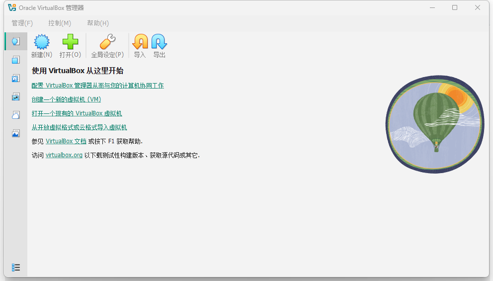
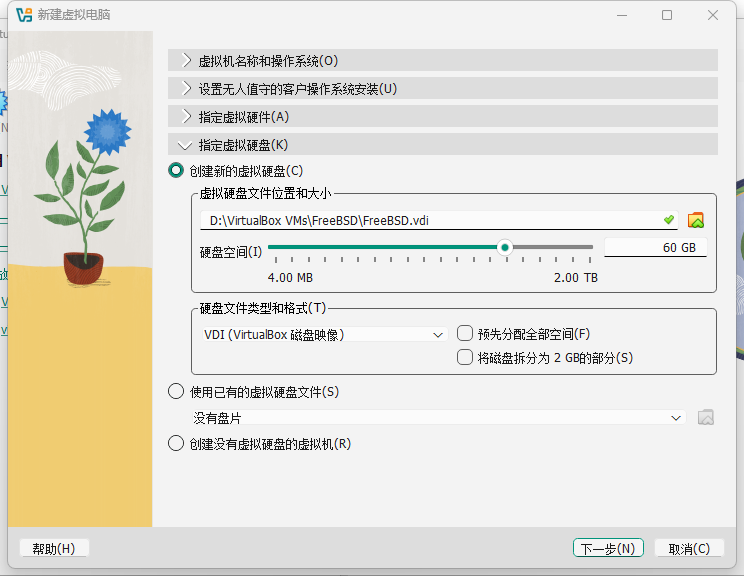
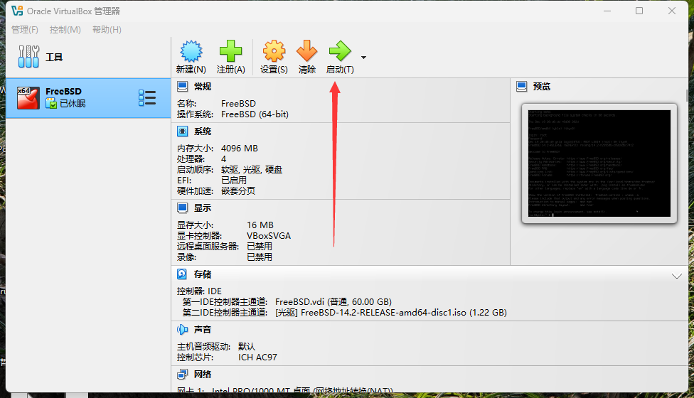
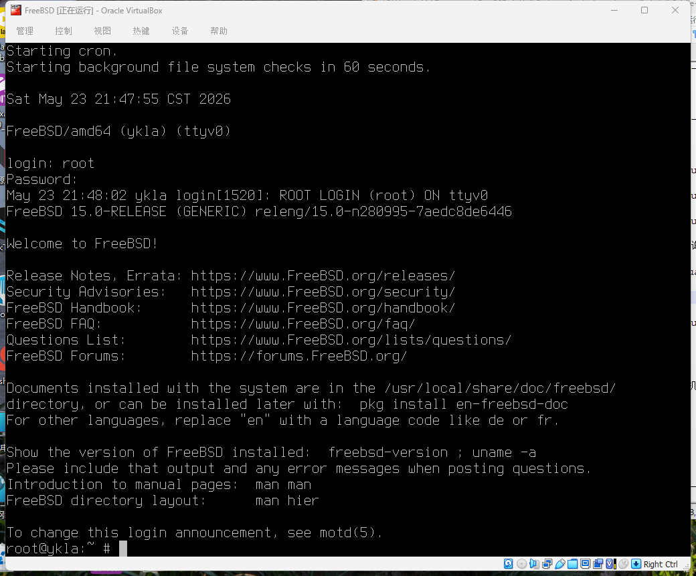
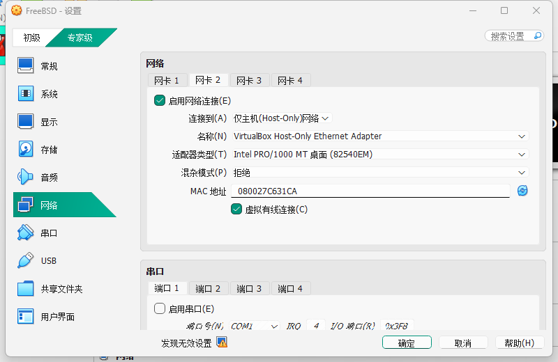

# 3.3 使用 VirtualBox 安装 FreeBSD

Oracle VirtualBox 是 Type-2 虚拟机监视器（Hypervisor），通过虚拟设备模拟（device emulation）和半虚拟化（paravirtualization）技术为虚拟机提供计算、存储和网络资源。VirtualBox 支持多种虚拟磁盘映像格式，默认使用 VDI（Virtual Disk Image），也兼容 VMDK（VMware）、VHD（Microsoft）等格式。

## 下载 VirtualBox

下载并安装 VirtualBox 虚拟机软件。

访问官方网站，点击页面右侧的 `Download` 按钮下载对应版本的安装程序。

[https://www.virtualbox.org](https://www.virtualbox.org)

## 安装设置

VirtualBox 安装完成后，创建并配置虚拟机。以下演示基于 VirtualBox 7.1.4 和 Windows 11 24H2。



选择“新建”。


名称输入“FreeBSD”，下方的相关选项会自动补全。


设置内存大小与 CPU 数量，并开启 EFI 支持选项。

> **技巧**
>
> 在 UEFI 模式下显卡可以正常驱动；而在 Wayland 下，由于缺少对应的 DRM/KMS（Direct Rendering Manager/Kernel Mode Setting，直接渲染管理器/内核模式设置）驱动支持，暂时无法使用。DRM/KMS 是 Linux/FreeBSD 等系统中用于管理显卡显示的内核子系统。



调整硬盘大小。


打开设置。


显卡控制器使用 `VBoxSVGA`。

> **警告**
>
> 不要勾选下方的“启用 3D 加速”选项，否则将导致无法使用 `VBoxSVGA` 控制器。



开始安装。


> **注意**
>
> 在较低版本的 VirtualBox 中，FreeBSD 安装完成后请手动关机并卸载或删除安装光盘，否则会再次进入安装界面。

安装后的系统：



## 网络设置

在虚拟网络方面，VirtualBox 提供 NAT、桥接（Bridged）、内部网络（Internal）、仅主机（Host-Only）等多种网络模式，每种模式对应不同的网络拓扑和连通性。

### 方法一：桥接模式

> **技巧**
>
> VirtualBox 中的桥接模式可以使各方向的网络互通。

桥接是实现宿主机与虚拟机互通的简单方法，虚拟机可以获得一个与宿主机在同一网段的 IP 地址。例如，若宿主机 IP 为 192.168.31.123，则虚拟机 IP 可能为 192.168.31.x。


设置后执行 `# dhclient em0`（为了长期生效可在 `/etc/rc.conf` 文件中加入 `ifconfig_em0="DHCP"`）。

如果无法访问互联网，请将 DNS 设置为 `223.5.5.5`。如不清楚具体操作，请参阅本章其他部分。

### 方法二：NAT 与仅主机模式

> **注意**
>
> 与 VMware 不同，VirtualBox 的默认 NAT 模式下，宿主机和虚拟机无法直接互通。虚拟机可以访问宿主机的特殊地址 `10.0.2.2` 及其上运行的服务，但宿主机无法访问虚拟机的端口，各虚拟机之间网络也相互隔离。参见：Oracle. Network Address Translation (NAT)[EB/OL]. [2026-03-26]. <https://www.virtualbox.org/manual/topics/networkingdetails.html#network_nat>. 也可以按照手册中的端口转发来连通网络。

网络设置较为复杂，桥接模式未必能够生效。若要通过宿主机（如 Windows 11）控制虚拟机中的 FreeBSD 系统，需设置两块网卡：一块为 NAT 网络模式的网卡用于连接互联网，另一块为仅主机模式的网卡用于与宿主机互通。如图所示：


> **技巧**
>
> 在网卡类型下拉列表中，“网络地址转换（NAT）”与“NAT 网络”选项类似。根据 Oracle Corporation. 6.3. Network Address Translation (NAT)[EB/OL]. [2026-04-04]. <https://www.virtualbox.org/manual/topics/networkingdetails.html#network_nat>. 主要区别在于：“NAT 网络”模式下的虚拟机之间可以互通，而“网络地址转换（NAT）”模式下的虚拟机网络则是相互隔离的。



使用命令 `# ifconfig` 查看状态，如果第二块网卡 `em1` 没有获取到 IP 地址，请手动通过 DHCP 获取：`# dhclient em1`（为了长期生效，可在 `/etc/rc.conf` 文件中加入 `ifconfig_em1="DHCP"`）。

按这种方式设定的网络，虚拟机与宿主机所在的局域网无法互通。若无法连接互联网，请设置 DNS 为 `223.5.5.5`。若不熟悉相关操作，请参阅本章相关小节。

## 显卡驱动与增强工具

VirtualBox 的 Guest Additions 是一组运行在虚拟机内部的驱动程序和系统服务，提供共享文件夹、鼠标指针集成、自动调整客户机显示分辨率、无缝窗口模式等功能。

### 安装工具

- 使用 pkg 安装：

```sh
# pkg install virtualbox-ose-additions-72
```

或者使用 Ports：

```sh
# cd /usr/ports/emulators/virtualbox-ose-additions-72/
# make install clean
```

## 查看安装说明

安装完成后，可通过以下命令查看增强工具的配置说明。

```sh
root@ykla:/home/ykla # pkg info -D virtualbox-ose-additions-72
virtualbox-ose-additions-7.2.6.1500068:
On install:
VirtualBox Guest Additions are installed.
# VirtualBox 客户端增强功能已安装。

To enable and start the required services:

# sysrc vboxguest_enable="YES"
# sysrc vboxservice_enable="YES"
# 启用所需服务，使用 sysrc 添加开机启动项。

To start the services, restart the system.
# 要启动服务，请重启系统。

In some situations, a panic will occur when the kernel module loads.
Having no more than one virtual CPU might mitigate the issue.
# 某些情况下，加载内核模块时可能发生 panic。限制为单核虚拟 CPU 有可能缓解该问题。

For features such as window scaling and clipboard sharing, membership of
the wheel group is required. With username "jerry" as an example:

# pw groupmod wheel -m jerry
# 要启用窗口缩放、剪贴板共享等功能，用户需加入 wheel 组。
# 示例命令将用户 jerry 添加到 wheel 组。

The settings dialogue for FreeBSD guests encourages use of the VMSVGA
graphics controller. Whilst this might suit installations of FreeBSD
without a desktop environment (a common use case), it is not appropriate
where Guest Additions are installed.
# VirtualBox 会建议 FreeBSD 使用 VMSVGA 显卡控制器。
# 这对不含桌面的 FreeBSD 系统较为合适，但在已安装 Guest Additions 的环境下并不推荐。

Where Guest Additions are installed:

1. prefer VBoxSVGA
# 如果已安装 Guest Additions，应优先选择 VBoxSVGA 作为显卡控制器。

2. do not enable 3D acceleration (doing so will invisibly
   lose the preference for VBoxSVGA)
# 不要启用 3D 加速，否则 VBoxSVGA 的设置会被暗中忽略。

You may ignore the yellow alert that encourages use of VMSVGA.

# 可以忽略提示使用 VMSVGA 的黄色警告信息。
```

> **技巧**
>
> 请使用 UEFI，Xorg 可以自动识别驱动，**无需** 手动配置 `/usr/local/etc/X11/xorg.conf`（经测试，手动配置反而导致性能下降）。

## 服务管理

安装增强工具后，需启用相关服务并设置开机自启。

- 启用服务并开机自启：

```sh
# service vboxguest enable   # 启用 VirtualBox Guest Additions 驱动
# service vboxservice enable # 启用 VirtualBox 服务
```

- 启动服务，调整权限（以普通用户 ykla 为例）：

```sh
# service vboxguest restart  # 重启 vboxguest 服务，可能提示找不到模块，但不影响使用
# service vboxservice restart # 重启 vboxservice 服务
# pw groupmod wheel -m ykla  # 将普通用户 ykla 添加到 wheel 组以获得管理权限，请替换为实际用户
```

## 故障排除与未竟事宜

### EFI 下无法正常关机

编辑 `/etc/sysctl.conf` 文件，添加以下内容：

```ini
hw.efi.poweroff=0	# 禁用 EFI 电源关闭功能，使系统通过 ACPI 正常关机
```

然后重启系统，再执行关机即可恢复正常，即使用 ACPI 而非 UEFI 接口进行关机操作。

### 参考文献

- mib. 12.0-U8.1 -> 13.0-U2 poweroff problem & solution[EB/OL]. (2022-12-23)[2026-03-26]. <https://www.truenas.com/community/threads/12-0-u8-1-13-0-u2-poweroff-problem-solution.104813/>. 提供了 EFI 环境下 FreeBSD 关机问题的解决方案。
- FreeBSD Forums. EFI: VirtualBox computer non-stop after successful shutdown of FreeBSD[EB/OL]. (2022-04-28)[2026-03-26]. <https://forums.freebsd.org/threads/efi-virtualbox-computer-non-stop-after-successful-shutdown-of-freebsd.84856/>. 详细分析了 VirtualBox 中 FreeBSD 关机异常的技术原因与修复方法。

### 鼠标被捕获在虚拟机窗口内，无法移出

请先按右侧的 `Ctrl` 键（默认设置下键盘左右各有一个 `Ctrl`），如果因自动缩放需要还原屏幕或找不到菜单栏，请按 `Home` + 右侧 `Ctrl`。

> **技巧**
>
> 在标准 108 键键盘上，`Home` 键位于 `Scroll Lock` 键的下方。

### UEFI 固件设置

开机时反复按 `Esc` 键进入 VirtualBox 虚拟机的 UEFI 固件设置。

## 课后习题

1. 查阅 FreeBSD 内核中 `hw.efi.poweroff` 参数的实现（`sys/dev/efidev/`），分析该参数影响关机流程的机制，并通过修改参数值对比关机行为的差异。
