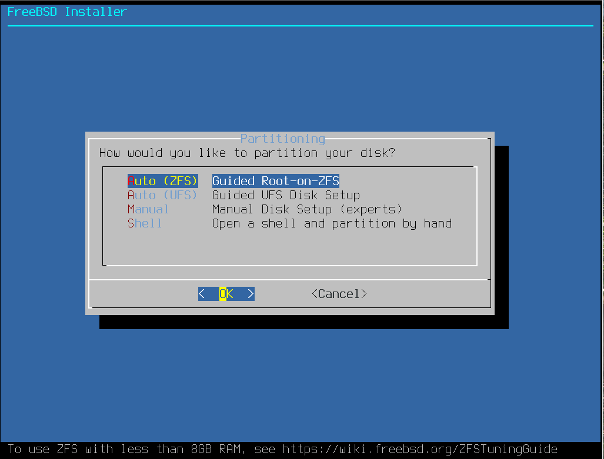
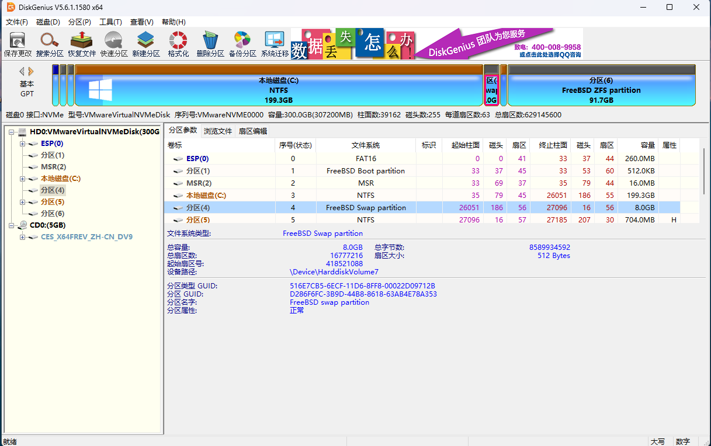

# 3.4 安装双系统（先安装 FreeBSD）

本节介绍在同一物理设备上部署 FreeBSD 与 Windows 双系统，先安装 FreeBSD、再安装 Windows。

## 安装 FreeBSD 14.2-RELEASE

首先安装 FreeBSD 14.2-RELEASE 系统，未特别说明之处均采用默认设置与参数。




> **技巧**
>
> 如果在此处设置 `P Partition Scheme` 为 `GPT (UEFI)` 而非其他（仅较早的计算机才需选择 `GPT (BIOS+UEFI)` 等选项），后续分区与系统更新过程会更加简单，也能实现 4K 对齐。


此处需要设置一个大的临时交换分区，该数值表示计划中的交换分区与 Windows 系统分区容量之和。如此设置是为了后续安装 Windows 时能够直接使用这部分空间，避免额外的分区操作。在本节中，交换分区（swap）大小为 8 GB，其余 200 GB 空间预留给 Windows。请修改 `S Swap Size` 的大小。


列出系统磁盘分区情况：

```sh
# gpart show
=>     9  639659  cd0  MBR  (1.2G)
       9  639659       - free -  (1.2G)

=>     9  639659  iso9660/14_2_RELEASE_AMD64_CD  MBR  (1.2G)
       9  639659                                 - free -  (1.2G)

=>       40  629145520  nda0 GPT  (300G)
         40     532480    1  efi  (260M)
     532520       1024    2  freebsd-boot  (512K)
     533544        984       - free -  (492K)
     534528  436207616    3  freebsd-swap  (208G)
  436742144  192401408    4  freebsd-zfs  (92G)
  629143552       2008       - free -  (1.0M)

```

显示交换分区和交换文件的使用情况（单位为 MB/GB）：

```sh
# swapinfo -mh
Device              Size     Used    Avail Capacity
/dev/nda0p3          208G       0B     208G     0%
```

可以看到交换分区的大小是所设定的 208 GB（其中 200 GB 预留给 Windows 操作系统）。

编辑 **/etc/fstab** 文件，在 swap 对应行的行首添加 `#` 字符将其注释，本例中该行是第三行，以此避免系统在启动时挂载这个大的交换分区，为后续安装 Windows 作准备：

```sh
# Device                Mountpoint      FStype  Options         Dump    Pass#
/dev/gpt/efiboot0               /boot/efi       msdosfs rw              2       2
#/dev/nda0p3             none    swap    sw              0       0
```

## 安装 Windows 11

FreeBSD 安装完成后，安装 Windows 系统。

插入 Windows 启动盘，设置 BIOS 从该启动盘启动，开始安装 Windows。此时系统会识别到这块硬盘上的现有分区结构，只需要使用之前预留的空间。


在分区时，删除（Delete Partition）整个 208 GB 的交换分区（本例中为“磁盘 0 分区 3”），因为这部分空间正是为 Windows 预留的。


然后点击创建分区（Create Partition），如果提示出错，点击刷新（Refresh）。Windows 安装程序会自动在未分配空间上创建它需要的分区，包括 MSR 分区、系统分区和恢复分区。

然后选中 208 GB 的“磁盘 0 未分配空间”，点击“下一步”进行安装。


## 还原交换分区（swap）

Windows 安装完成后，为 FreeBSD 还原交换分区。分配了 208 GB 空间，其中有 8 GB 是为交换分区预留的。需要使用工具 [DiskGenius](https://www.diskgenius.com/)。


打开 DiskGenius，压缩 C 盘，释放 8 GB 的未分配空间。Windows 系统安装完成后，C 盘占用了之前预留的大部分空间，只需要从 C 盘末尾压缩出 8 GB。


将这 8 GB 空间格式化为 `FreeBSD Swap partition` 类型，然后点击“保存更改”。这一步操作是将新创建的交换分区标记为 FreeBSD 可以识别的类型。




回到 FreeBSD，查看磁盘分区情况：

```sh
# gpart show
=>       34  629145533  nda0  GPT  (300G)
         34          6        - free -  (3.0K)
         40     532480     1  efi  (260M)
     532520       1024     2  freebsd-boot  (512K)
     533544        984        - free -  (492K)
     534528      32768     3  ms-reserved  (16M)
     567296  417953792     4  ms-basic-data  (199G)
  418521088   16777216     5  freebsd-swap  (8.0G)
  435298304    1441792     6  ms-recovery  (704M)
  436740096       2048        - free -  (1.0M)
  436742144  192401408     7  freebsd-zfs  (92G)
  629143552       2015        - free -  (1.0M)

```

可以看到，`nda0p5`（分区 5）即为新建的交换分区。接下来测试启用指定交换分区 **/dev/nda0p5**：

```sh
# swapon /dev/nda0p5
```

未产生错误，亦无任何提示，表明操作成功，系统已经可以正常识别并使用这个新的交换分区。

编辑 **/etc/fstab** 文件，在 swap 对应行的行首删去注释符号 `#`，并将分区改为正确的值，在本例中如下第三行：

```sh
# Device                Mountpoint      FStype  Options         Dump    Pass#
/dev/gpt/efiboot0               /boot/efi       msdosfs rw              2       2
/dev/nda0p5             none    swap    sw              0       0
```

重启后再次查看既有的交换分区情况：

```sh
# swapinfo -mh
Device              Size     Used    Avail Capacity
/dev/nda0p5         8.0G       0B     8.0G     0%
```

列出系统中所有 ZFS 池及其状态：

```sh
# zpool list
NAME    SIZE  ALLOC   FREE  CKPOINT  EXPANDSZ   FRAG    CAP  DEDUP    HEALTH  ALTROOT
zroot  91.5G   922M  90.6G        -         -     0%     0%  1.00x    ONLINE  -
# zfs list
NAME                 USED  AVAIL  REFER  MOUNTPOINT
zroot                922M  87.8G    96K  /zroot
zroot/ROOT           919M  87.8G    96K  none
zroot/ROOT/default   919M  87.8G   919M  /
zroot/home           224K  87.8G    96K  /home
zroot/home/ykla      128K  87.8G   128K  /home/ykla
zroot/tmp            104K  87.8G   104K  /tmp
zroot/usr            288K  87.8G    96K  /usr
zroot/usr/ports       96K  87.8G    96K  /usr/ports
zroot/usr/src         96K  87.8G    96K  /usr/src
zroot/var            668K  87.8G    96K  /var
zroot/var/audit       96K  87.8G    96K  /var/audit
zroot/var/crash       96K  87.8G    96K  /var/crash
zroot/var/log        188K  87.8G   188K  /var/log
zroot/var/mail        96K  87.8G    96K  /var/mail
zroot/var/tmp         96K  87.8G    96K  /var/tmp
```

## 课后习题

1. 在 UFS 文件系统下重复本节双系统安装流程，记录 ZFS 与 UFS 在分区布局和引导配置上的差异。
2. 查阅 FreeBSD 源代码中 swap 分区的实现（`sys/dev/swap/`），比较 freebsd-swap 与 Linux swap 在磁盘格式和内核接口层面的差异。
3. 双系统环境中引导加载程序（如 rEFInd、GRUB 或 FreeBSD loader）必须在不同操作系统的启动约定间做出仲裁。分析当 Windows 更新覆盖 UEFI 启动顺序后 FreeBSD 引导链被破坏的恢复路径，并设计一套自动修复脚本。
