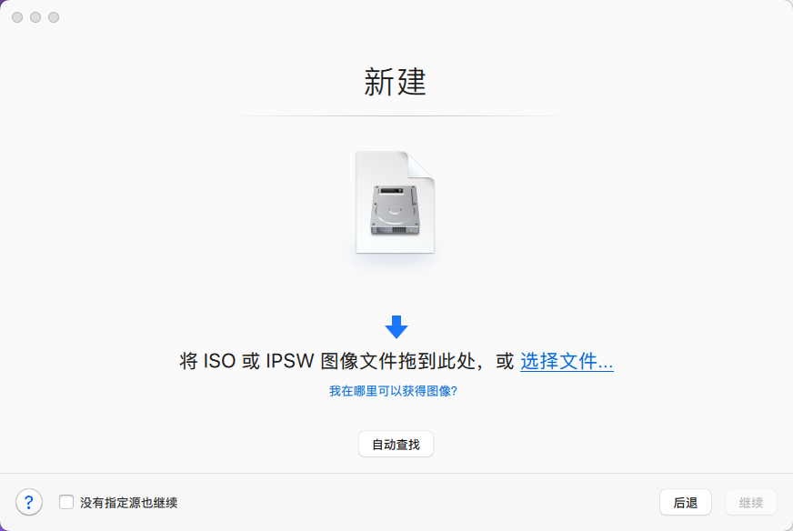
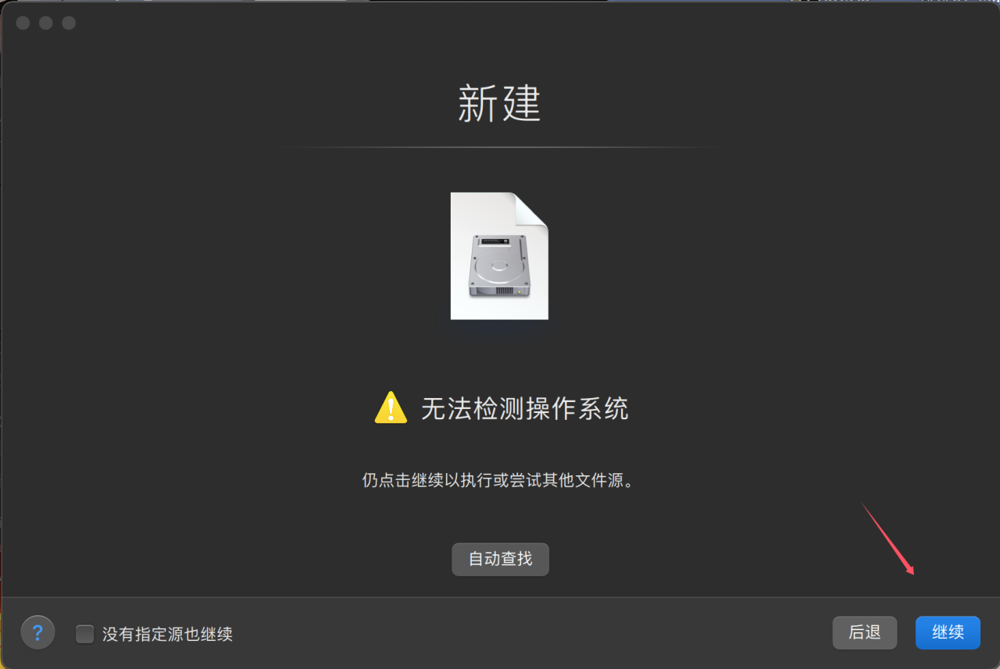
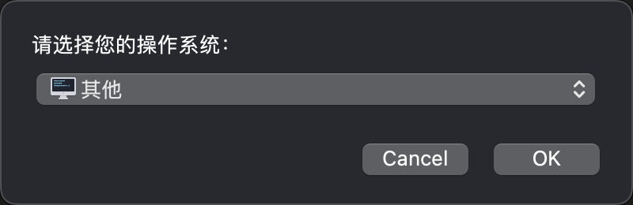
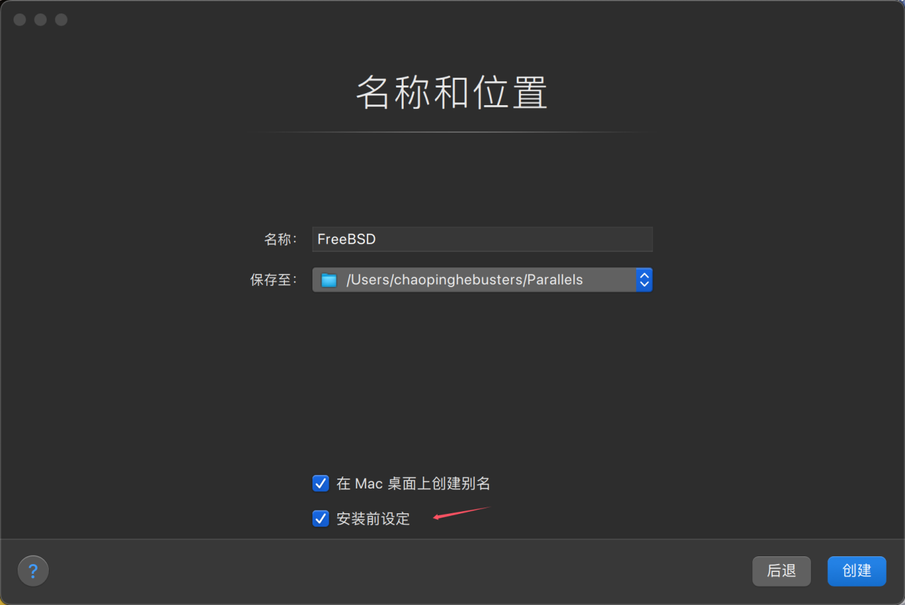
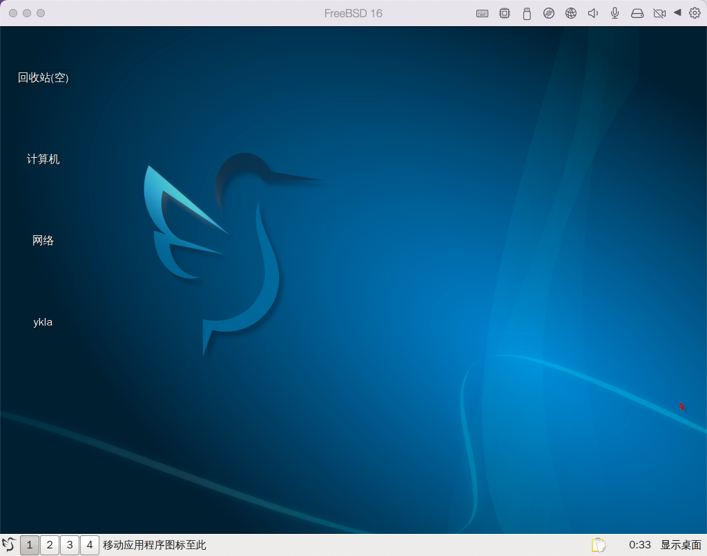
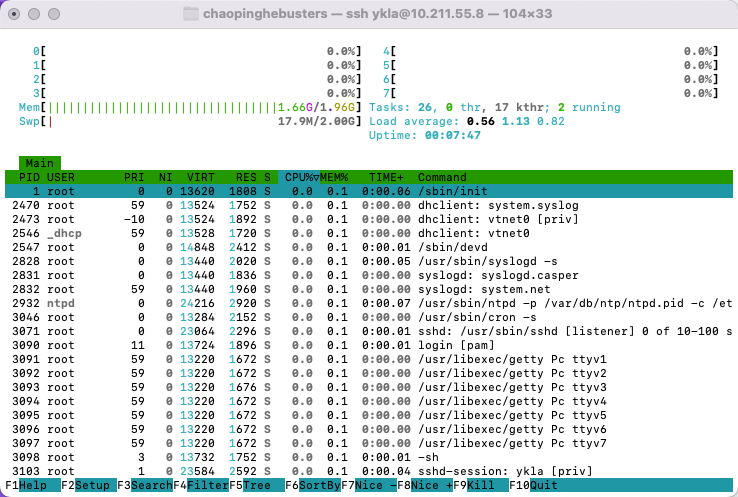

# 3.6 基于 Apple M1 和 Parallels Desktop 20 安装 FreeBSD

本节基于 Apple M1（macOS 14.7）及 Parallels Desktop 20.1.3-55743 环境进行实验与演示。

在 Parallels Desktop 20 中，FreeBSD 15.0-CURRENT 的图形界面（不支持自动缩放）、键盘和鼠标均可正常工作，系统整体运行情况良好。

> **注意**
>
> 由于补丁 FreeBSD Project. acpi_ged: Handle events directly[EB/OL]. [2026-03-26]. <https://reviews.freebsd.org/D42158>. 未合入 FreeBSD 14，版本 14 会在安装界面报错（参见 FreeBSD Forums. Virtualizing FreeBSD 14 CURRENT on macOS M2 via Parallels 19[EB/OL]. [2026-03-26]. <https://forums.freebsd.org/threads/virtualizing-freebsd-14-current-on-macos-m2-via-parallels-19.93266/>），因此仅支持安装 15 及以上版本。

## 安装

环境准备完成后，按照以下步骤安装 FreeBSD。



选择“通过映像文件安装 Windows、Linux 或 macOS”，然后点击“继续”。


点击“手动选择”，然后继续。


点击“选择文件……”。


选中 FreeBSD 镜像。

> **警告**
>
> 本节基于 Apple M1，故选择的 FreeBSD 架构应为 aarch64。



界面会提示“未能检测操作系统”，可忽略此提示，直接点击“继续”。



在操作系统类型中选择“其他”。



> **技巧**
>
> Parallels Desktop 20 的默认设置通常已足够，且默认使用 UEFI 引导，一般无需调整硬件配置。


开始安装 FreeBSD 系统。



开机后进入 FreeBSD。



手动安装桌面环境后，桌面正常运行。

## 鼠标无法移动

若在 Parallels Desktop 中遇到 FreeBSD 鼠标无法移动的问题，可在 `/boot/loader.conf.local`（推荐使用本地配置扩展文件，避免直接修改系统默认配置 `/boot/loader.conf`）中添加如下配置：

```sh
ums_load="YES"
```

### 参考文献

- FreeBSD Forums. Issue(s) booting FreeBSD 12.2 aarch64 on Parallels Desktop on Apple Silicon[EB/OL]. (2021-01-30)[2026-03-26]. <https://forums.freebsd.org/threads/issue-s-booting-freebsd-12-2-aarch64-on-parallels-desktop-on-apple-silicon.78654/>. 提供了 Apple Silicon 上 Parallels Desktop 中 FreeBSD 启动问题的讨论与解决方案。

## 虚拟机工具

使用 pkg 安装虚拟机工具：

```sh
# pkg install parallels-tools
```

若提示找不到软件包，可通过 Ports 编译安装虚拟机工具：

```sh
# cd /usr/ports/emulators/parallels-tools/
# make install clean
```

> **注意**
>
> 若通过 Ports 编译安装，需确保当前系统的源代码位于 `/usr/src` 目录下。

### 参考文献

- FreshPorts. parallels-tools Parallels Desktop Tools for FreeBSD[EB/OL]. [2026-03-26]. <https://www.freshports.org/emulators/parallels-tools/>. 提供了 Parallels Desktop 虚拟机工具的 FreeBSD Port 信息与安装说明。

## 课后习题

1. 查阅 FreeBSD 源代码中 `acpi_ged` 驱动的提交记录，分析其在 ARM64 平台上处理 ACPI 通用事件的核心逻辑。
2. 分析 Parallels Desktop 虚拟机工具的 Port 源代码（`emulators/parallels-tools/`），梳理其长期未更新的技术原因。
3. 查阅 FreeBSD 源代码中 `ums` 与 `usbhid` 两种 USB 鼠标驱动的实现，比较其在设备探测、事件报告和电源管理方面的差异。
