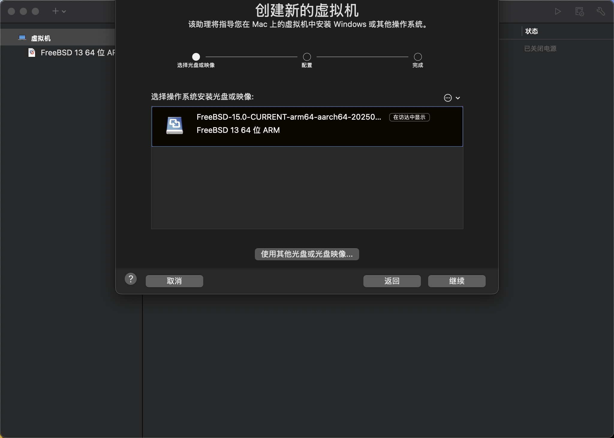
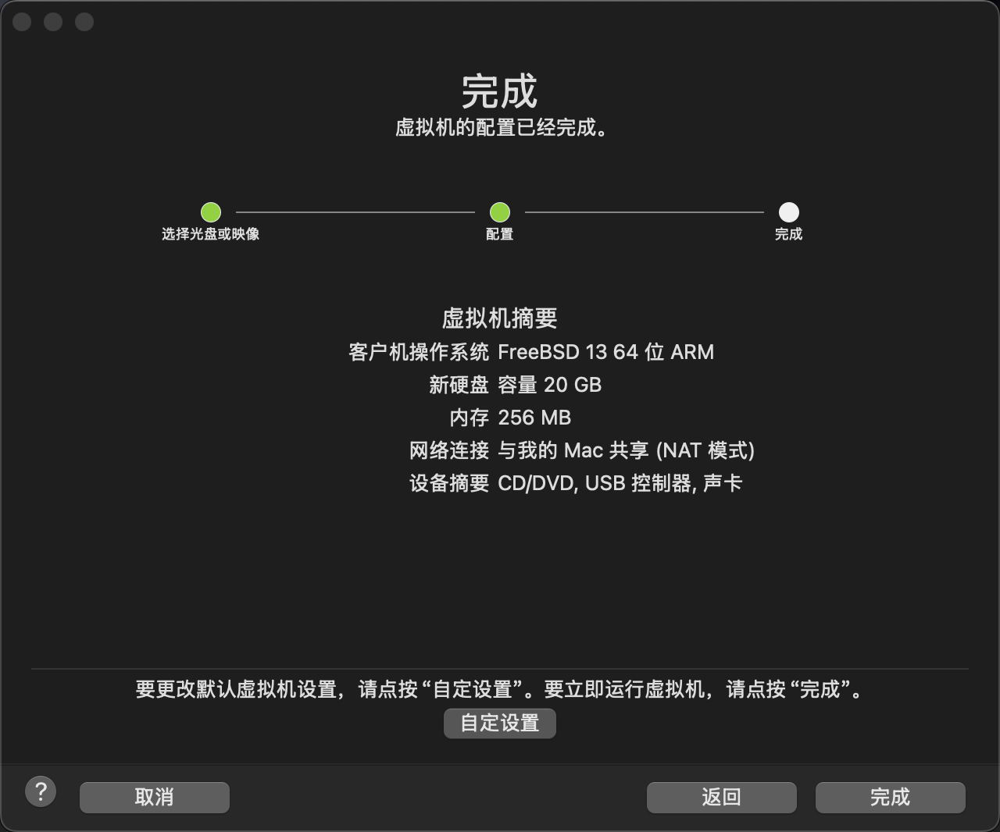
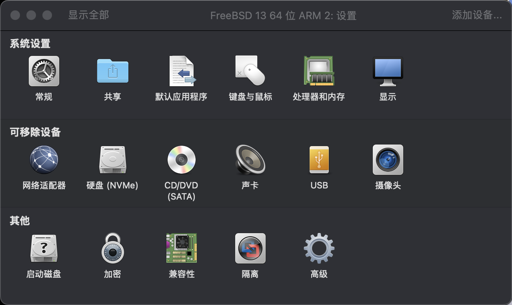
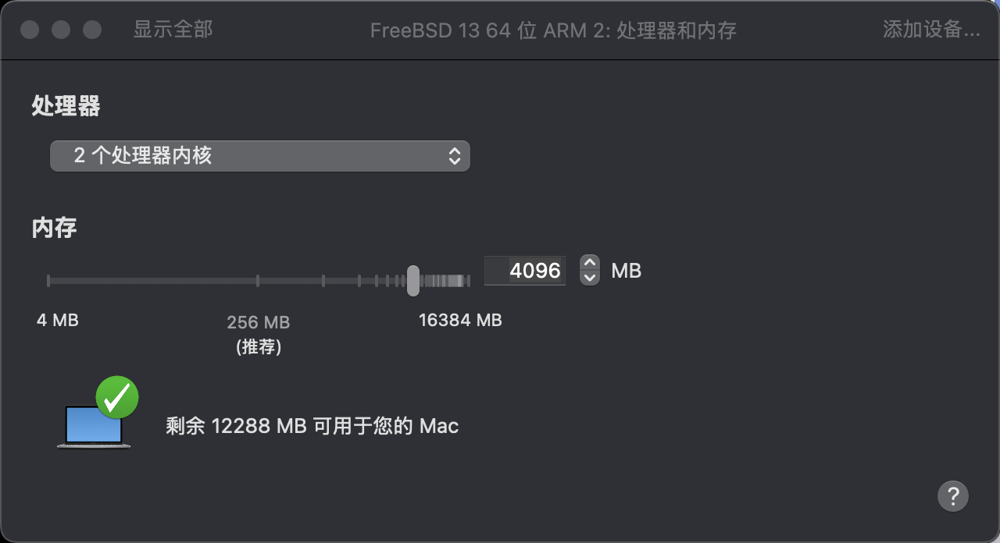
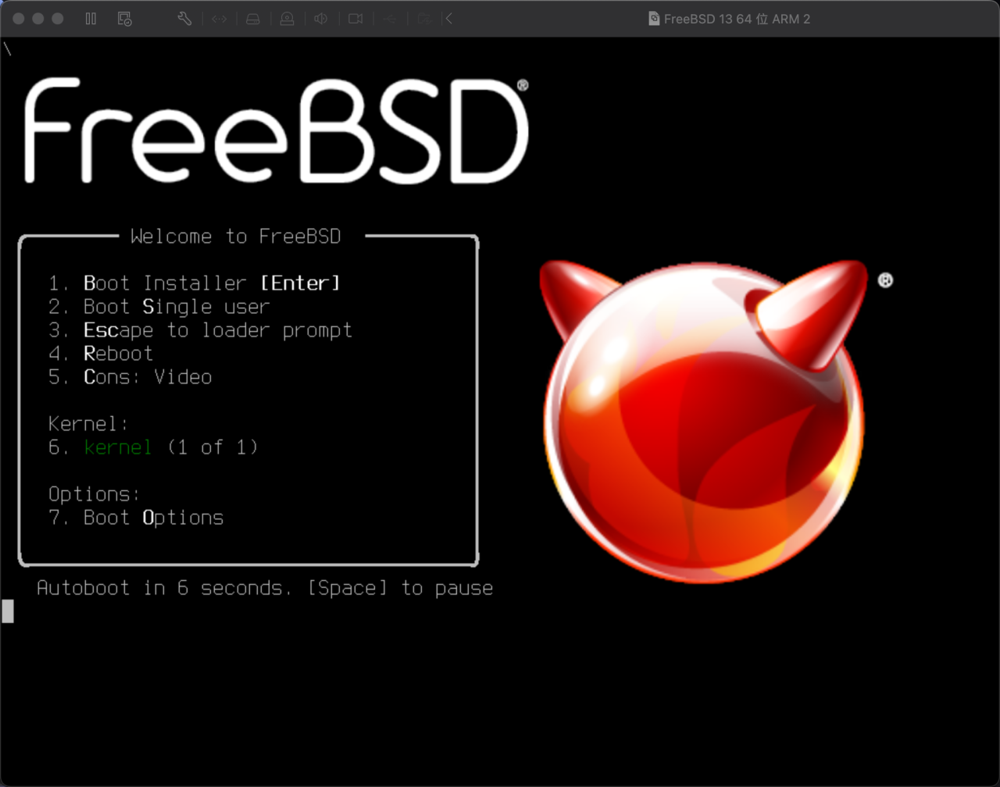
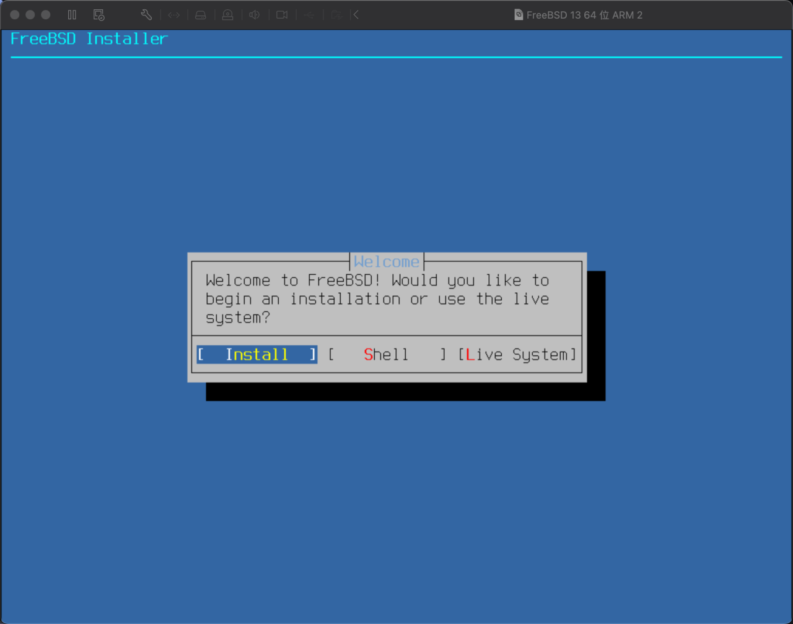
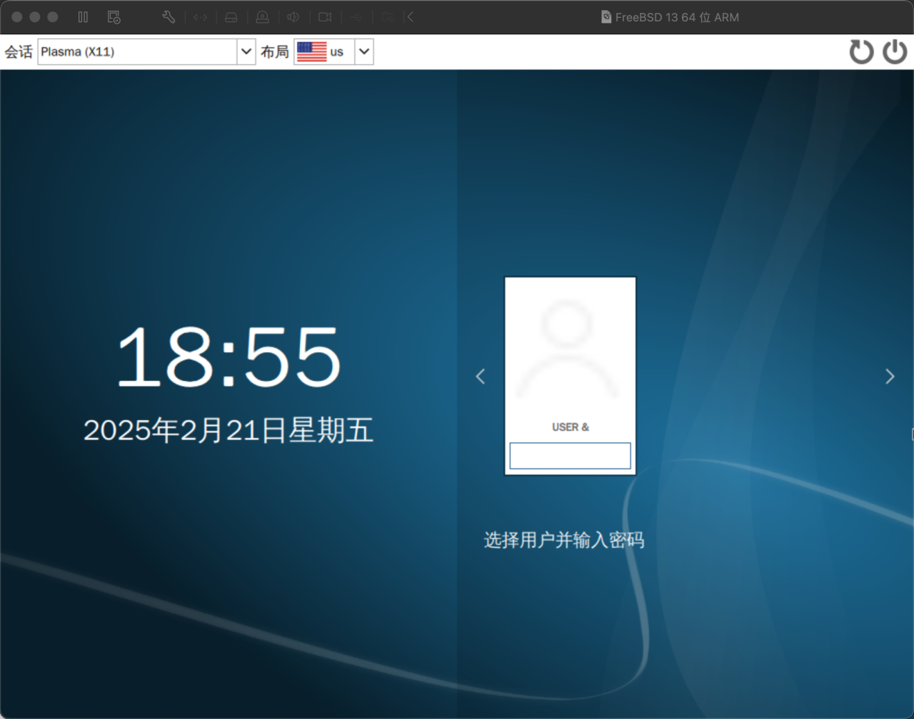

# 3.7 基于 Apple M1 和 VMware Fusion Pro 安装 FreeBSD

本节介绍在 Apple M1 架构设备上，通过 VMware Fusion Pro 虚拟化平台部署 FreeBSD 操作系统的技术方案。

本文基于 macOS 15.3.1、VMware Fusion Pro 13.6.2、FreeBSD 15.0 以及默认的 UEFI 设置进行测试。经实验验证，14.2-RELEASE 亦可正常工作。

> **注意**
>
> 如果使用 macOS 14，可能存在键盘无法输入的故障，需特别注意此兼容性问题。

## 下载 FreeBSD

首先需要下载适合 Apple M1 架构的 FreeBSD 镜像。由于 Apple M1 为 ARM 架构，请下载带有 `aarch64` 字样的镜像。**不要** 下载 `amd64` 架构的镜像，否则将无法正常运行。

## 配置虚拟机

镜像下载完成后，开始配置虚拟机。



选择下载的 FreeBSD 镜像。



默认的内存大小可能不足，请点击“自定设置”。



点击“处理器和内存”。



修改处理器数量和内存大小。`4096 MB` 即 4 GB。

## 开始安装





## 配置桌面

无需安装任何虚拟机增强工具即可使用。




窗口大小无法自由调整。

## 故障排除与未竟事宜

### 鼠标无法移动

编辑 `/boot/loader.conf`，加入以下内容即可：

```sh
hw.usb.usbhid.enable="1"    # 启用 USB HID 设备支持
usbhid_load="YES"           # 配置系统启动时自动加载 USB HID 驱动
```

### 参考文献

- FreeBSD Forums. Mouse does not work in VMWARE Fusion and Freebsd 14.2[EB/OL]. (2025-01-16)[2026-03-26]. <https://forums.freebsd.org/threads/mouse-does-not-work-in-vmware-fusion-and-freebsd-14-2.96563/>. 详细介绍了 VMware Fusion 中 FreeBSD 鼠标无法工作问题的解决方案与 USB HID 驱动配置方法。

## 课后习题

1. 研究 USB HID 子系统在 FreeBSD 中的实现，分析 `hw.usb.usbhid.enable` 参数如何改变内核对 USB 输入设备的处理方式，尝试在不同版本 FreeBSD 上验证该参数的行为差异。

2. 在 VMware Fusion 中尝试配置屏幕自动缩放功能，分析该功能缺失的技术障碍。

3. 对比 macOS 14 与 macOS 15 中 VMware Fusion 的键盘支持差异，查找相关内核变更记录。
