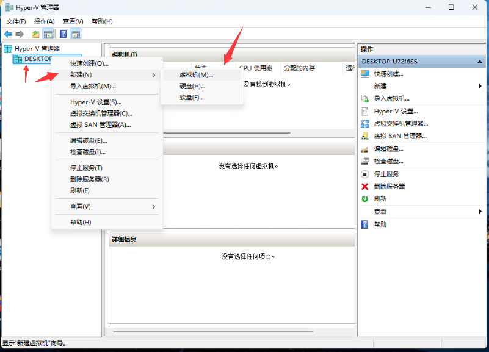
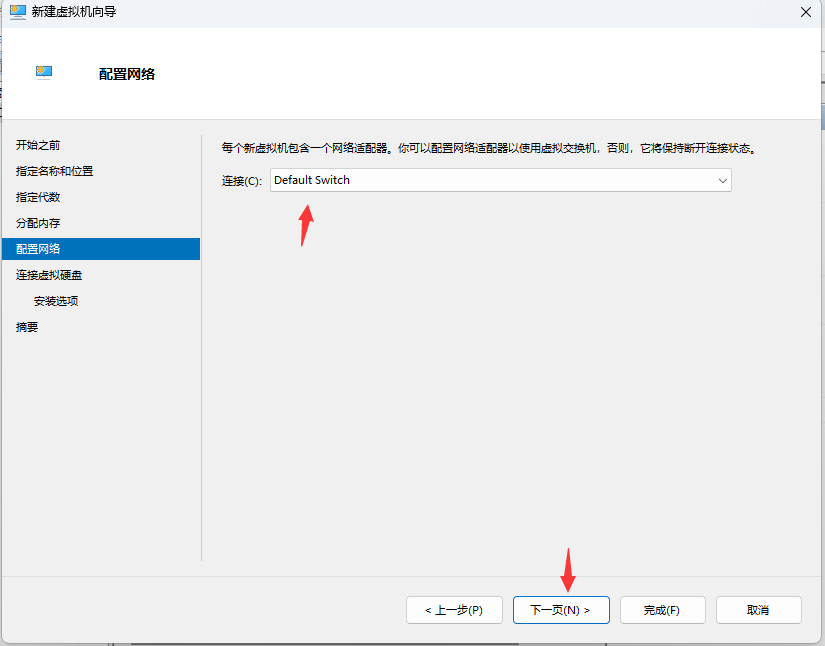
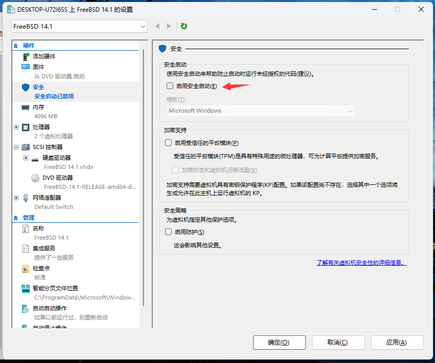
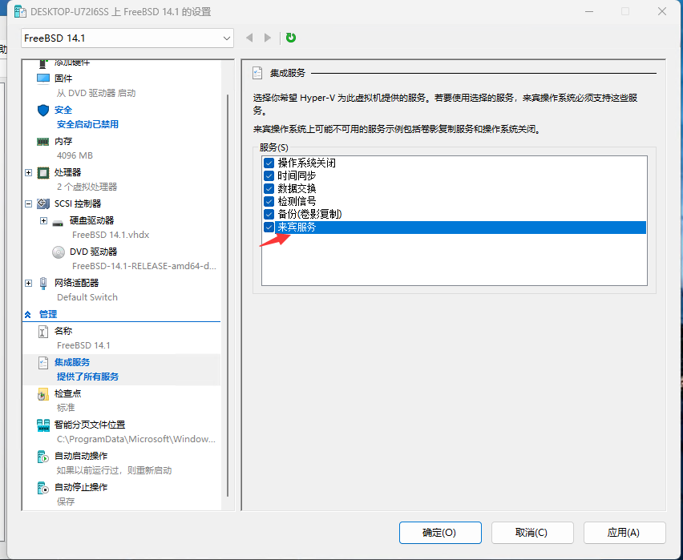
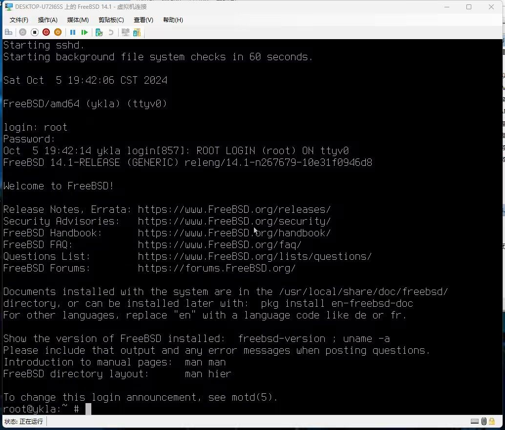

# 3.1 使用 Hyper-V 安装 FreeBSD

## Hyper-V 简介

Hyper-V 是微软为 Windows/Windows Server 开发的企业级虚拟机管理程序技术（系统内置），分为 `Gen 1`（第一代）和 `Gen 2`（第二代）。

>**注意**
>
>Windows 家庭版/家庭中文版并不支持 Hyper-V。

`Gen 1` 和 `Gen 2` 区别如下：

| Hyper-V 代数 |    硬盘    |             启动引导              |
| :----------: | :--------: | :-------------------------------: |
|    Gen 1     | IDE + SCSI |              仅 MBR               |
|    Gen 2     |  仅 SCSI   | 仅 UEFI + 安全启动支持 + PXE 支持 |

系统快速创建的为 `Gen 2`。

>**注意：**
>
>使用 Gen 2 时请关闭安全启动，否则系统无法启动！点击设置：点击“安全”——> 取消勾选“启用安全启动。截至 2025.2.1，FreeBSD 尚不支持安全启动。

| Hyper-V 代数 | FreeBSD 版本 |                                鼠标                                |  键盘  |                                              备注                                              |
| :----------: | :----------: | :----------------------------------------------------------------: | :----: | :--------------------------------------------------------------------------------------------: |
|    Gen 1     |     13.0     |                                支持                                | 不支持 |                                               /                                                |
|    Gen 2     |     13.0     | [不支持](https://bugs.freebsd.org/bugzilla/show_bug.cgi?id=221074) |  支持  |                          需要修改参数 `sysctl kern.evdev.rcpt_mask=6`                           |
|    Gen 2     |     14.0     |                                支持                                |  支持  | 参见 [源代码](https://cgit.FreeBSD.org/src/commit/?id=21f4e817fde79d5de79bfbdf180d358ca5f48bf9) |

### 参考文献

- [Windows Server 和 Windows 中的 Hyper-V 虚拟化](https://learn.microsoft.com/zh-cn/windows-server/virtualization/hyper-v/overview)，微软官方对 Hyper-V 的说明。

## 测试环境

- Windows 11 23H2 专业版
- FreeBSD 14.1-RELEASE（`FreeBSD-14.1-RELEASE-amd64-disc1.iso`）
- Hyper-V 版本：10.0.22621.4249
- 使用第二代 Hyper-V

## 安装 Hyper-V


右键单击 Windows 徽标，在弹出窗口中右键单击“终端管理员”，输入以下内容：

```powershell
PS C:\Users\ykla> Enable-WindowsOptionalFeature -Online -FeatureName Microsoft-Hyper-V -All 
是否立即重启计算机以完成此操作?
[Y] Yes  [N] No  [?] 帮助 (默认值为“Y”): 
# 此处按回车键确定重启完成 Hyper-V 的安装
```


## 创建虚拟机



右键单击这台主机的主机名，选择“新建”——>“虚拟机”。


点击“下一页”。


起个名字，然后点击“下一页”。


选择“第二代”。然后点击“下一页”。


设置内存大小，然后点击“下一页”。



设置网络，然后点击“下一页”。


选择虚拟硬盘名称、大小、存储位置。然后点击“下一页”。


点击“浏览”，找到下载的 `FreeBSD-14.1-RELEASE-amd64-disc1.iso`，选中。然后点击“下一页”。


点击“完成”。

## 调整虚拟机


点击“设置”



请务必关闭安全启动。



请勾选“来宾服务”。作用见参考文献。


可选择关闭“使用自动检查点”，即关闭自动快照。作用见参考文献。


## 安装 FreeBSD


启动虚拟机。


开始安装。



安装完成。

## 测试桌面

鼠标、键盘均表现正常，可无缝切换。但是桌面大小无法调整。


必须先关机才能删除虚拟机。

## 参考文献

- [在 Windows 上安装 Hyper-V](https://learn.microsoft.com/zh-cn/virtualization/hyper-v-on-windows/quick-start/enable-hyper-v)，微软官方教程，还有多种方法可选
- [Hyper-V 集成服务](https://learn.microsoft.com/zh-cn/virtualization/hyper-v-on-windows/reference/integration-services)，对各种 Hyper-V 服务进行了详细说明
- [使用检查点将虚拟机恢复到以前的状态](https://learn.microsoft.com/zh-cn/virtualization/hyper-v-on-windows/user-guide/checkpoints?source=recommendations&tabs=hyper-v-manager%2Cpowershell)
- [在 Hyper-V 中在标准检查点与生产检查点之间进行选择](https://learn.microsoft.com/zh-cn/windows-server/virtualization/hyper-v/manage/choose-between-standard-or-production-checkpoints-in-hyper-v)
- [FreeBSD13 を Hyper-V 環境 にインストールしてみた 所感](https://qiita.com/nanorkyo/items/d33e1befd4eb9c004fcd)，值得看看
