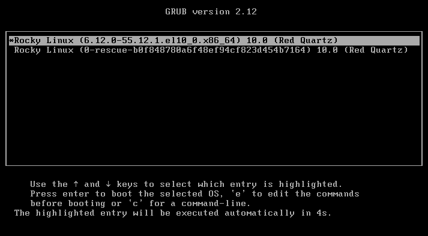

# 3.10 云服务器安装 FreeBSD（基于 KVM、QEMU 等平台）

> **注意**
>
> 不支持 OpenVZ、LXC 虚拟机，因为他们本质上不属于虚拟机，宿主机与客户机共享内核。内核都是 Linux 了，哪里还有 FreeBSD？
>
> 不支持 UEFI 引导模式（BIOS + GPT 分区表亦不支持），仅支持传统 BIOS + MBR 方式引导。

> **警告**
>
> 请注意数据安全，以下教程有一定危险性和要求你有一定的动手能力。

## 概述

在各种以 KVM、QEMU 为虚拟架构的服务器厂商中，大部分都没有 FreeBSD 系统的支持，只能通过特殊的方法自己暴力安装。

最常见的用 KVM 虚拟化的厂商就是搬瓦工、Linode。它们虽说在部分机型上有提供 FreeBSD 系统镜像支持，但是支持都不完善，比如自带镜像默认都不支持 `BBR`，部分机型更是没有 FreeBSD 系统支持。

本操作不需要 mfsLinux 作为介质通过 `dd` 的方式安装。

mfsBSD 是一款完全载入内存的 FreeBSD 系统，类似于 Windows 的 PE 系统。

本文通过 Grub2 借助 Memdisk 模块将 mfsBSD 载入为内存盘，并从中启动。然后再通过 mfsBSD 中的 `bsdinstall` 命令安装 FreeBSD。

## 获取现有网络配置

有的服务器也许并不使用 DHCP 服务，而需要手动指定 IP——多见于小厂服务器。

安装前请在原有的 Linux 系统上看看自己的 IP 及 netmask。

可以用命令 `ip addr` 及 `ip route show` 查看网关信息。

## 准备 mfsBSD

我们需要下载 mfsBSD：既可以下载到本地计算机，然后使用 SCP、SFTP、WinSCP 等你熟悉的东西传入服务器；亦可直接在服务器使用命令行进行下载。

> **注意**
>
> 仅支持 IPv6 地址的服务器不能在服务器使用命令行进行下载，因为 mfsBSD 的下载地址不支持 IPv6 网络。
>
> 此问题笔者已与作者发邮件沟通，但截止发文时尚未得到回应。

### 内存 <= 512 MB

下载 mfsBSD Mini：

```sh
# wget https://mfsbsd.vx.sk/files/iso/14/amd64/mfsbsd-mini-14.1-RELEASE-amd64.iso
```

检验码（官网的链接指向错误，已反馈但无回复）：[checksums](https://mfsbsd.vx.sk/files/iso/14/amd64/mfsbsd-mini-14.1-RELEASE-amd64.iso.sums.txt)

>**技巧**
>
>内存不大于 4G 的机器不建议使用 `zfs` 作为文件系统。
>
>同时 mfsBSD Mini 可能也无法正常加载 `zfs` 内核模块。
>
>这种情况下你只能使用 `ufs` 文件系统。

### 内存 > 512 MB

下载 mfsBSD 完整版：

```sh
# wget https://mfsbsd.vx.sk/files/iso/14/amd64/mfsbsd-14.2-RELEASE-amd64.iso
```

检验码：[checksums](https://mfsbsd.vx.sk/files/iso/14/amd64/mfsbsd-14.2-RELEASE-amd64.iso.sums.txt)

### 准备 mfsBSD.iso

将下载的 mfsBSD 重命名为 `mfsbsd.iso`，并放在 `/boot` 下面（否则可能会因为 LVM 造成硬盘分区无法识别）。

## 获取 memdisk

> **警告**
>
> GRUB2 的 `memdisk.mod` 模块不是 MEMDISK。
>
> memdisk 需要由包管理器安装的软件 syslinux 提供。

### 安装 syslinux

- Debian/Ubuntu

```bash
# apt install syslinux
```

- Rocky Linux

```bash
# dnf install syslinux
```

### 提取 memdisk

从已安装的 syslinux 包中提取 memdisk 文件到 `/boot`

```sh
# cp /usr/lib/syslinux/memdisk /boot/
```

## 取消隐藏的 GRUB 菜单

现在大多数发行版的 grub 菜单都是默认隐藏的，需要在开机时按 **Esc** 才能进入，但是有时候会直接进入 BIOS。故，直接取消隐藏比较方便。

```sh
# grub2-editenv - unset menu_auto_hide
```

## 启动 mfsBSD

重启到 grub，按 `c` 键进入命令行操作：




```sh
ls # 显示磁盘。如果你显示磁盘为 (hd0,gptxxx)，说明你的平台不支持此教程
ls (hd0,msdos2)/
linux16 (hd0,msdos2)/memdisk iso
initrd (hd0,msdos2)/bsd.iso
boot # 输入 boot 后回车即可从 mfsBSD 继续启动
```

> **注意**：
>
> 如果遇到问题，可尝试切换到串口控制台（`console=comconsole`）或检查镜像完整性。

在 Proxmox 中，可以直接按下菜单里的 `xterm.js` 按钮进入串口控制台进行问题排查


## 为 mfsBSD 配置网络

mfsBSD 的 `root` 密码默认是 `mfsroot`。你可以使用 ssh 工具进行连接以进行安装。

>**技巧**
>
>如果平台支持 DHCP，你可以跳过此小节。

重启进入到 mfsBSD 后，配置网络。

以接口 `vtnet0` 举例，配置 IPv4：

>**警告**
>
>下面的请换成你的 IP 地址和路由情况：

```sh
# ifconfig vtnet0 inet 192.0.2.123/24 # 为网卡 vtnet0 设置 IPv4
# route add -inet default 192.0.2.1 # 设置默认网关/路由
```

检查：

```sh
# ifconfig vtnet0 # 显示网卡接口 vtnet0 的网络信息
# route -n show -inet6 # 显示 IPv6 的路由表
```

## 开始安装

使用 `kldload zfs` 加载 zfs 模块，然后运行 `bsdinstall`。

这部分你可以参照其他章节的方法安装。

## 故障排除与未尽事宜

### GPT 分区表下如何安装？

也许可以参考：

- [Booting mfsBSD via PXE with UEFI](https://unix.stackexchange.com/questions/563053/booting-mfsbsd-via-pxe-with-uefi) 与 [Booting mfsBSD via iPXE on EFI](https://forums.freebsd.org/threads/booting-mfsbsd-via-ipxe-on-efi.66169/) 采用 PXE 方式引导。
- [FreeBSD 下搭建 PXE 服务器](https://book.bsdcn.org/freebsd-shou-ce/di-34-zhang-gao-ji-wang-luo/34.10.-shi-yong-pxe-jin-hang-wu-pan-cao-zuo)

待解决、待尝试。

### VMWare、VirtualBox 无法按照此方法安装

鉴于 VirtualBox 可以选择虚拟化，选择为 `kvm` 可再次尝试。（笔者的机器无法引导，也许你能成功）


### 待尝试的方案

- `dd` 写入 [VM-IMAGES 列表下的镜像](https://download.freebsd.org/releases/VM-IMAGES/14.3-RELEASE/amd64/Latest/)
- `dd` 写入 [FreeBSD-14.3-RELEASE-amd64-memstick](https://download.freebsd.org/releases/ISO-IMAGES/14.3/FreeBSD-14.3-RELEASE-amd64-memstick.img)
- 在 QEMU 平台上，尝试直接 `dd`


思路：这个页面可以继续使用命令 `?` 查看磁盘信息，也许可以接着引导。

- 通过 mfsLinux `dd` mfsBSD


待解决。
