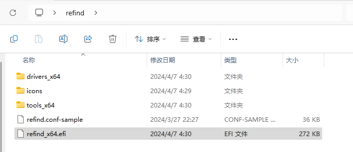
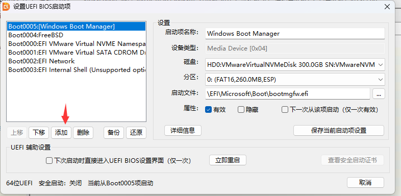
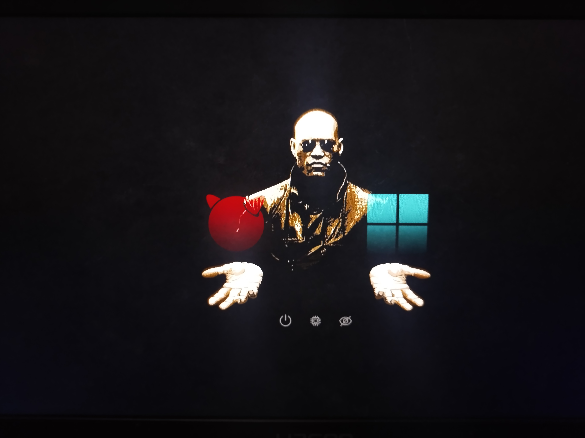

# 3.11 配置 rEFInd（双系统用）

在 BIOS 中来回切换确实很麻烦，我们可以借助 [rEFInd](https://www.rodsbooks.com/refind/) 实现类似于 Clover 的效果，在开机时选择要进入的操作系统。

`rEFInd` 派生自 `rEFIt`，其名称结合了“refind”（意为“重新发现”或“改进”）与“EFI”（Extensible Firmware Interface，可扩展固件接口），主要用于管理 UEFI 启动。

打开下载页面 [Getting rEFInd from Sourceforge](https://www.rodsbooks.com/refind/getting.html)，点击 `A binary zip file` 链接即可开始下载。本文撰写时使用的版本为 `refind-bin-0.14.2.zip`。

下载的压缩包中，仅部分文件是必需的启动文件。我们只需要其中的 `refind` 文件夹，其余文件可忽略。

`refind` 文件夹中也仅包含部分必需的启动文件。所有文件名中包含 `aa64` 或 `ia32` 的文件均可删除（通常仅保留 `x64` 版本）。

最终需要保留的文件如下图所示。



将 `refind.conf-sample` 文件复制一份，并重命名为 `refind.conf`。

>**技巧**
>
>通常无需手动配置。但若出现无法自动识别现有操作系统的情况，请按以下方法手动添加引导项：
>
>打开 `refind.conf` 文件，在任意空白处添加如下配置：
>
>```ini
>menuentry "FreeBSD" { 
>	icon \EFI\refind\icons\os_freebsd.png 
>	volume "FreeBSD"
>	loader \EFI\freebsd\loader.efi 
>}
>
>menuentry "Windows 10" { 
>	icon \EFI\refind\icons\os_win.png
>	volume "Windows 10"  
>	loader \EFI\Microsoft\Boot\bootmgfw.efi 
>}
>```

使用 [DiskGenius](https://www.diskgenius.com/) 将处理好的 `refind` 文件夹复制到 EFI 系统分区（ESP）中的 `EFI` 目录下。


## 添加启动项

使用 [DiskGenius](https://www.diskgenius.com/) 添加 UEFI 引导项。


点击菜单栏的“工具”，选择“设置 UEFI BIOS 启动项”。



在新窗口中点击“添加”，然后浏览并选中 `refind` 文件夹内的 `refind_x64.efi` 文件。


将该启动项移动至列表顶部，将其设为第一启动项。保存设置并重启电脑以测试效果。


重启后，在 rEFInd 界面中选择任一操作系统选项，应可正常进入。

## 附录：rEFInd 主题

rEFInd 支持多种图形化主题。

本例以 Matrix-rEFInd（灵感来源于电影《黑客帝国》）主题为例进行说明。

项目地址为：[Matrix-rEFInd](https://github.com/Yannis4444/Matrix-rEFInd/)

下载项目压缩包 `Matrix-rEFInd-master.zip` 并解压。将解压得到的文件夹 `Matrix-rEFInd-master` 重命名为 `Matrix-rEFInd`。

在本地新建一个名为 `themes` 的目录，将重命名后的 `Matrix-rEFInd` 文件夹放入其中。

将此 `themes` 目录整体复制到 EFI 系统分区中的 `EFI\refind\` 目录下。

编辑 `refind.conf` 文件（若无法直接在 ESP 中编辑，可将其复制到桌面，修改后再覆盖回去），在文件末尾添加一行：

```ini
include themes/Matrix-rEFInd/theme.conf
```

重启：



>**技巧**
>
>如果在虚拟机（如 VMware、VirtualBox）中操作，由于其 UEFI 固件的屏幕分辨率限制，rEFInd 界面可能无法同时显示所有操作系统选项，需通过方向键切换查看，这与上图所示的效果可能不同。
