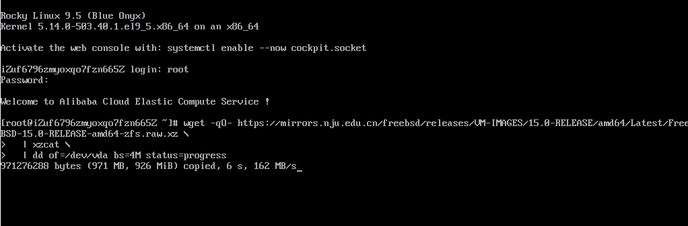
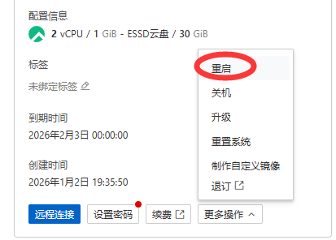
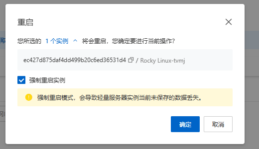
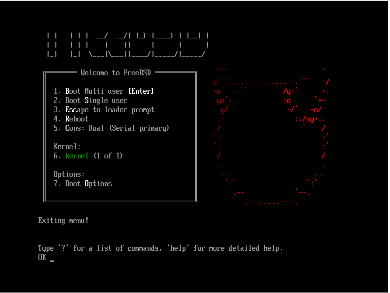
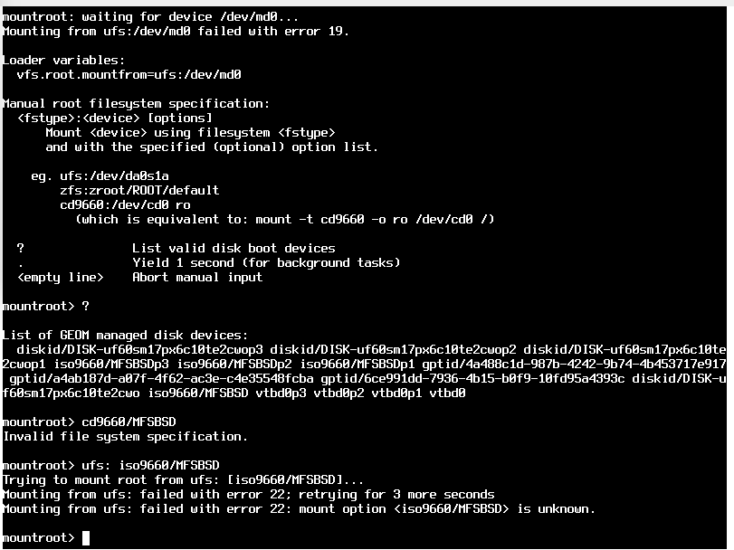
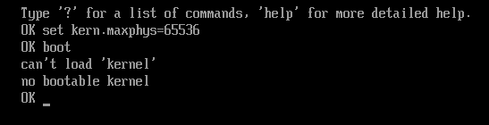
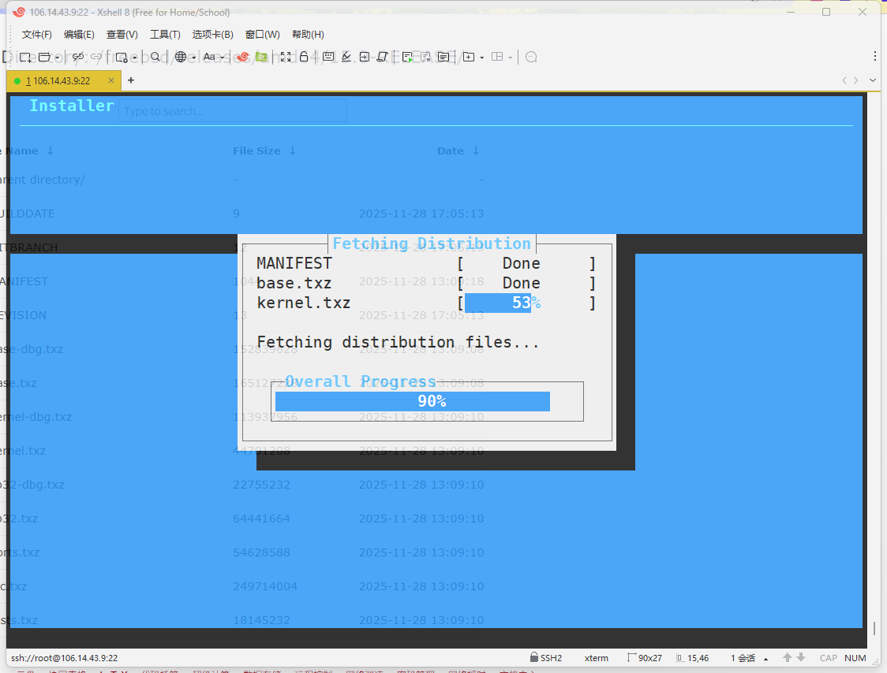
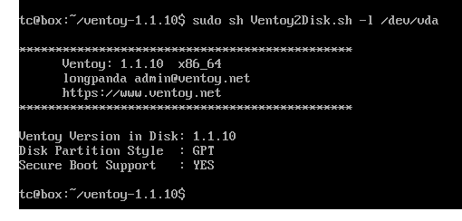
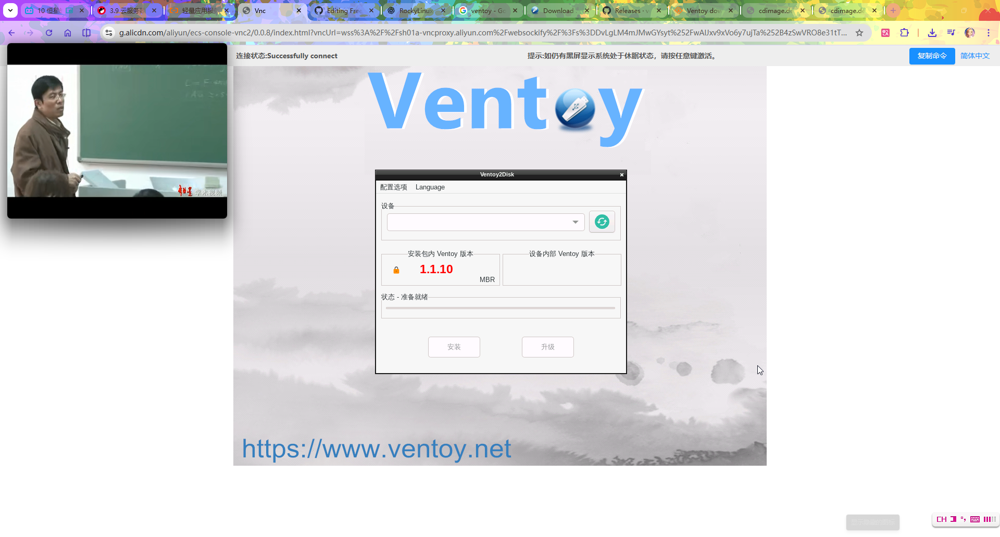
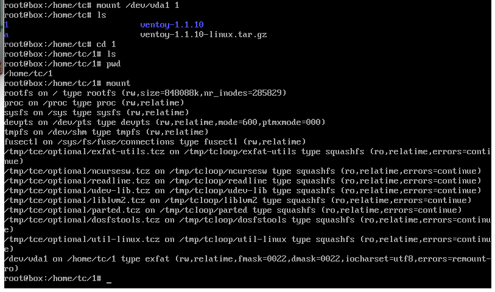

# 3.12 阿里云轻量应用服务器安装 FreeBSD（UEFI 和 GPT 分区表）

本文在实际操作中尝试了若干方法，但最终只有两种方法相对成功。为了便于有意探索的读者进行研究，未完成的方法将在“未竟事项”部分列出。

## 服务器环境


首先将服务器重置为 Rocky Linux 9，该发行版在服务器市场占据主流地位，通常由大多数厂商提供。

### 救援登录


本文描述的大部分操作通过 VNC 连接（救援登录）进行。


为方便使用，读者可将救援登录临时设置为默认登录方式。


救援登录如上所示。可通过右上角的“复制命令”将较冗长的命令复制到系统内部。

### 验证服务器是否处于 UEFI 环境

本文针对 UEFI 启动环境和 GPT 分区表，因此必须首先确认服务器是否处于该环境。由于不同服务器环境存在差异，本节提供多种方法供读者参考。

- 通过系统固件判断当前系统是以 UEFI 还是 BIOS 模式启动：

```sh
# [ -d /sys/firmware/efi ] && echo UEFI || echo BIOS
UEFI
```

- 通过 UEFI 启动项管理工具判断启动模式：

```sh
# efibootmgr
BootCurrent: 0003
Timeout: 0 seconds
BootOrder: 0006,0000,0001,0002,0003,0004,0005
Boot0000* UiApp
Boot0001* UEFI Floppy
Boot0002* UEFI Floppy 2
Boot0003* UEFI Misc Device
Boot0004* UEFI PXEv4 (MAC:00163E45BC81)
Boot0005* EFI Internal Shell
Boot0006* rocky
```

### 服务器的磁盘分区情况

- 通过文件系统类型与磁盘使用情况（同时请读者注意 `/boot/efi`）判断：

```sh
# df -Th
Filesystem     Type      Size  Used Avail Use% Mounted on
devtmpfs       devtmpfs  4.0M     0  4.0M   0% /dev
tmpfs          tmpfs     447M     0  447M   0% /dev/shm
tmpfs          tmpfs     179M  2.8M  176M   2% /run
efivarfs       efivarfs  256K  7.4K  244K   3% /sys/firmware/efi/efivars
/dev/vda3      xfs        30G  3.4G   27G  12% /
/dev/vda2      vfat      100M  7.1M   93M   8% /boot/efi	# 标志着系统可能正在使用 UEFI 模式
tmpfs          tmpfs      90M     0   90M   0% /run/user/0
```

- 通过文件系统静态挂载配置判断：

```sh
# cat /etc/fstab

#
# /etc/fstab
# Created by anaconda on Mon May 26 09:36:59 2025
#
# Accessible filesystems, by reference, are maintained under '/dev/disk/'.
# See man pages fstab(5), findfs(8), mount(8) and/or blkid(8) for more info.
#
# After editing this file, run 'systemctl daemon-reload' to update systemd
# units generated from this file.
#
UUID=a1a902bf-090a-4942-b533-c016a4e1c142 /                       xfs     defaults 0 0
UUID=638D-9E50          /boot/efi               vfat    defaults,uid=0,gid=0,umask=077,shortname=winnt 0 2
```

- 查看块设备的 UUID 和文件系统类型：

```sh
# blkid
/dev/vda2: SEC_TYPE="msdos" UUID="638D-9E50" TYPE="vfat" PARTUUID="a4ab187d-a07f-4f62-ac3e-c4e35548fcba"
/dev/vda3: LABEL="root" UUID="a1a902bf-090a-4942-b533-c016a4e1c142" TYPE="xfs" PARTUUID="4a488c1d-987b-4242-9b74-4b453717e917"
/dev/vda1: PARTUUID="6ce991dd-7936-4b15-b0f9-10fd95a4393c"
```

- 探测指定块设备的文件系统信息：

```sh
# blkid -p /dev/vda1
/dev/vda1: PART_ENTRY_SCHEME="gpt" PART_ENTRY_UUID="6ce991dd-7936-4b15-b0f9-10fd95a4393c"PART_ENTRY_TYPE="21686148-6449-6e6f-744e-656564454649" PART_ENTRY_NUMBER="1" PART_ENTRY_OFFSET="2048" PART_ENTRY_SIZE="2048" PART_ENTRY_DISK="253:0"
```

BIOS Boot 分区用于兼容传统 BIOS 启动。

### 查看系统主机名及系统信息

```sh
# hostnamectl
 Static hostname: iZuf6796zmyoxqo7fzn665Z
       Icon name: computer-vm
         Chassis: vm 🖴
      Machine ID: 37ef1ea9b706405ea6df432d1348dc03
         Boot ID: 33fa5e31444449efb3888ceca163022e
  Virtualization: kvm
Operating System: Rocky Linux 9.5 (Blue Onyx)
     CPE OS Name: cpe:/o:rocky:rocky:9::baseos
          Kernel: Linux 5.14.0-503.40.1.el9_5.x86_64
    Architecture: x86-64
 Hardware Vendor: Alibaba Cloud
  Hardware Model: Alibaba Cloud ECS
Firmware Version: 0.0.0
```

### 查看网络信息

- 显示所有网络接口及其 IP 地址信息：

```sh
# ip a
1: lo: <LOOPBACK,UP,LOWER_UP> mtu 65536 qdisc noqueue state UNKNOWN group default qlen 1000
    link/loopback 00:00:00:00:00:00 brd 00:00:00:00:00:00
    inet 127.0.0.1/8 scope host lo
       valid_lft forever preferred_lft forever
    inet6 ::1/128 scope host
       valid_lft forever preferred_lft forever
2: eth0: <BROADCAST,MULTICAST,UP,LOWER_UP> mtu 1500 qdisc fq_codel state UP group default qlen 1000
    link/ether 00:16:3e:45:bc:81 brd ff:ff:ff:ff:ff:ff
    altname enp0s5
    altname ens5
    inet 172.24.0.80/18 brd 172.24.63.255 scope global dynamic noprefixroute eth0
       valid_lft 1892159248sec preferred_lft 1892159248sec
    inet6 fe80::216:3eff:fe45:bc81/64 scope link
       valid_lft forever preferred_lft forever
```

- 显示系统的路由表：

```sh
# ip route show
default via 172.24.63.253 dev eth0 proto dhcp src 172.24.0.80 metric 100
172.24.0.0/18 dev eth0 proto kernel scope link src 172.24.0.80 metric 100
```

- 列出所有 PCI 总线及其设备信息：

```sh
# lspci
00:00.0 Host bridge: Intel Corporation 440FX - 82441FX PMC [Natoma] (rev 02)
00:01.0 ISA bridge: Intel Corporation 82371SB PIIX3 ISA [Natoma/Triton II]
00:01.1 IDE interface: Intel Corporation 82371SB PIIX3 IDE [Natoma/Triton II]
00:01.2 USB controller: Intel Corporation 82371SB PIIX3 USB [Natoma/Triton II] (rev 01)
00:01.3 Bridge: Intel Corporation 82371AB/EB/MB PIIX4 ACPI (rev 03)
00:02.0 VGA compatible controller: Cirrus Logic GD 5446
00:03.0 Communication controller: Red Hat, Inc. Virtio console
00:04.0 SCSI storage controller: Red Hat, Inc. Virtio block device
00:05.0 Ethernet controller: Red Hat, Inc. Virtio network device
00:06.0 Unclassified device [00ff]: Red Hat, Inc. Virtio memory balloon
```

## 通过裸磁盘映像安装 FreeBSD

>**警告**
>
>你将丢失所有数据，请做好备份工作再进行。经过测试，操作后，快照将可能无法正确回滚，但是自定义镜像可间接还原。

下载并写入 FreeBSD ZFS 镜像到 `/dev/vda`：

```sh
# wget -qO- https://mirrors.nju.edu.cn/freebsd/releases/VM-IMAGES/15.0-RELEASE/amd64/Latest/FreeBSD-15.0-RELEASE-amd64-zfs.raw.xz | xzcat | dd of=/dev/vda bs=4M status=progress
```

参数说明：

- `wget -qO- URL`：`-q` 静默模式，不显示下载过程；`-O-` 将下载内容输出到标准输出（stdout）
- `xzcat`：解压 xz 格式文件，并将解压后的内容输出到标准输出
- `dd of=/dev/vda`：将输入写入 `/dev/vda` 设备，注意不是某个分区，是对整块磁盘进行写入。
- `bs=4M`：设置块大小为 4MB，提高写入效率
- `status=progress`：显示 dd 的写入进度



随后使用阿里云网页上的“更多操作”，再选择里面的“重启”




勾选“强制重启实例”这一选项。




执行强制重启以进入 FreeBSD。




根据读者反馈与实际测试，在 VMware ESXi 等半虚拟化平台上安装或升级 FreeBSD 时可能会遇到故障（例如阿里云的 VirtIO-BLK 存储设备驱动的问题）。


此时，需在 FreeBSD 系统启动时，在启动器菜单界面（上图所示界面），按下 **ESC** 键。进入命令提示符“OK”，随后输入 `set kern.maxphys=65536`（设置内核最大物理 I/O 大小为 65536 字节，大块 I/O 有时会触发驱动或缓存问题）进行确认，再输入 `boot` 方可正常启动。


FreeBSD 系统完全启动后：在引导加载器配置文件中设置最大 I/O 缓冲区大小：

```sh
# echo "kern.maxphys=65536" >> /boot/loader.conf
```

如果不进行上述设置，系统开机仍可能卡在引导界面。

正常执行安装流程，选择 ZFS 分区方式。


显示 FreeBSD 系统磁盘分区表及分区信息：

```sh
root@freebsd:~ # gpart show
=>      34  62914486  vtbd0  GPT  (30G)
        34       348      1  freebsd-boot  (174K)
       382     66584      2  efi  (33M)
     66966   2097152      3  freebsd-swap  (1.0G)
   2164118  60750402      4  freebsd-zfs  (29G)
```

观察发现，系统已自动扩展磁盘容量。

再查看 FreeBSD 系统网络接口信息：

```sh
root@freebsd:~ # ifconfig
vtnet0: flags=1008843<UP,BROADCAST,RUNNING,SIMPLEX,MULTICAST,LOWER_UP> metric 0 mtu 1500
	options=ec07bb<RXCSUM,TXCSUM,VLAN_MTU,VLAN_HWTAGGING,JUMBO_MTU,VLAN_HWCSUM,TSO4,TSO6,LRO,VLAN_HWTSO,LINKSTATE,RXCSUM_IPV6,TXCSUM_IPV6,HWSTATS>
	ether 00:16:3e:45:bc:81
	inet 172.24.0.80 netmask 0xffffc000 broadcast 172.24.63.255
	inet6 fe80::216:3eff:fe45:bc81%vtnet0 prefixlen 64 scopeid 0x1
	media: Ethernet autoselect (10Gbase-T <full-duplex>)
	status: active
	nd6 options=23<PERFORMNUD,ACCEPT_RTADV,AUTO_LINKLOCAL>
lo0: flags=1008049<UP,LOOPBACK,RUNNING,MULTICAST,LOWER_UP> metric 0 mtu 16384
	options=680003<RXCSUM,TXCSUM,LINKSTATE,RXCSUM_IPV6,TXCSUM_IPV6>
	inet 127.0.0.1 netmask 0xff000000
	inet6 ::1 prefixlen 128
	inet6 fe80::1%lo0 prefixlen 64 scopeid 0x2
	groups: lo
	nd6 options=23<PERFORMNUD,ACCEPT_RTADV,AUTO_LINKLOCAL>
```

可通过 ping 常用网站，确认网络连接正常。

显示内核启动信息和内核日志：

```sh
root@freebsd:~ # dmesg
---<<BOOT>>---
Copyright (c) 1992-2025 The FreeBSD Project.
Copyright (c) 1979, 1980, 1983, 1986, 1988, 1989, 1991, 1992, 1993, 1994
	The Regents of the University of California. All rights reserved.
FreeBSD is a registered trademark of The FreeBSD Foundation.
FreeBSD 15.0-RELEASE releng/15.0-n280995-7aedc8de6446 GENERIC amd64
FreeBSD clang version 19.1.7 (https://github.com/llvm/llvm-project.git llvmorg-19.1.7-0-gcd708029e0b2)
VT(efifb): resolution 800x600
CPU: Intel(R) Xeon(R) Platinum (2499.96-MHz K8-class CPU)
  Origin="GenuineIntel"  Id=0x50654  Family=0x6  Model=0x55  Stepping=4
  Features=0x1f83fbff<FPU,VME,DE,PSE,TSC,MSR,PAE,MCE,CX8,APIC,SEP,MTRR,PGE,MCA,CMOV,PAT,PSE36,MMX,FXSR,SSE,SSE2,SS,HTT>
  Features2=0xfffa3203<SSE3,PCLMULQDQ,SSSE3,FMA,CX16,PCID,SSE4.1,SSE4.2,x2APIC,MOVBE,POPCNT,TSCDLT,AESNI,XSAVE,OSXSAVE,AVX,F16C,RDRAND,HV>
  AMD Features=0x2c100800<SYSCALL,NX,Page1GB,RDTSCP,LM>
  AMD Features2=0x121<LAHF,ABM,Prefetch>
  Structured Extended Features=0xd19f07ab<FSGSBASE,TSCADJ,BMI1,AVX2,SMEP,BMI2,ERMS,INVPCID,AVX512F,AVX512DQ,RDSEED,ADX,SMAP,CLFLUSHOPT,CLWB,AVX512CD,AVX512BW,AVX512VL>
  XSAVE Features=0xf<XSAVEOPT,XSAVEC,XINUSE,XSAVES>
  TSC: P-state invariant
Hypervisor: Origin = "KVMKVMKVM"
real memory  = 1073741824 (1024 MB)
avail memory = 929538048 (886 MB)
Event timer "LAPIC" quality 600
ACPI APIC Table: <BOCHS  BXPCAPIC>
FreeBSD/SMP: Multiprocessor System Detected: 2 CPUs
FreeBSD/SMP: 1 package(s) x 1 core(s) x 2 hardware threads
random: registering fast source Intel Secure Key Seed
random: fast provider: "Intel Secure Key Seed"
arc4random: WARNING: initial seeding bypassed the cryptographic random device because it was not yet seeded and the knob 'bypass_before_seeding' was enabled.
ioapic0 <Version 1.1> irqs 0-23
Launching APs: 1
random: entropy device external interface
kbd1 at kbdmux0
efirtc0: <EFI Realtime Clock>
efirtc0: registered as a time-of-day clock, resolution 1.000000s
kvmclock0: <KVM paravirtual clock>
Timecounter "kvmclock" frequency 1000000000 Hz quality 975
kvmclock0: registered as a time-of-day clock, resolution 0.000001s
smbios0: <System Management BIOS> at iomem 0x3dbcc000-0x3dbcc01e
smbios0: Entry point: v2.1 (32-bit), Version: 2.8, BCD Revision: 2.8
aesni0: <AES-CBC,AES-CCM,AES-GCM,AES-ICM,AES-XTS>
acpi0: <BOCHS BXPCFACP>
acpi0: Power Button (fixed)
acpi0: Sleep Button (fixed)
cpu0: <ACPI CPU> on acpi0
atrtc0: <AT realtime clock> port 0x70-0x71,0x72-0x77 irq 8 on acpi0
atrtc0: registered as a time-of-day clock, resolution 1.000000s
Event timer "RTC" frequency 32768 Hz quality 0
Timecounter "ACPI-fast" frequency 3579545 Hz quality 900
acpi_timer0: <24-bit timer at 3.579545MHz> port 0xb008-0xb00b on acpi0
pcib0: <ACPI Host-PCI bridge> port 0xcf8-0xcff on acpi0
pci_link4: BIOS IRQ 10 for 0.1.INTA is invalid
pci_link3: BIOS IRQ 11 does not match initial IRQ 10
pci_link2: BIOS IRQ 11 does not match initial IRQ 10
pci_link1: BIOS IRQ 10 does not match initial IRQ 11
pci0: <ACPI PCI bus> on pcib0
isab0: <PCI-ISA bridge> at device 1.0 on pci0
isa0: <ISA bus> on isab0
atapci0: <Intel PIIX3 WDMA2 controller> port 0x1f0-0x1f7,0x3f6,0x170-0x177,0x376,0xc060-0xc06f at device 1.1 on pci0
ata0: <ATA channel> at channel 0 on atapci0
ata1: <ATA channel> at channel 1 on atapci0
uhci0: <Intel 82371SB (PIIX3) USB controller> port 0xc040-0xc05f irq 11 at device 1.2 on pci0
usbus0: controller did not stop
usbus0 on uhci0
usbus0: 12Mbps Full Speed USB v1.0
pci0: <bridge> at device 1.3 (no driver attached)
vgapci0: <VGA-compatible display> mem 0x80000000-0x81ffffff,0x82001000-0x82001fff at device 2.0 on pci0
vgapci0: Boot video device
virtio_pci0: <VirtIO PCI (legacy) Console adapter> port 0xc020-0xc03f mem 0x82000000-0x82000fff irq 11 at device 3.0 on pci0
virtio_pci1: <VirtIO PCI (legacy) Block adapter> mem 0x800000000-0x800000fff,0x800001000-0x800001fff at device 4.0 on pci0
vtblk0: <VirtIO Block Adapter> on virtio_pci1
vtblk0: 30720MB (62914560 512 byte sectors)
virtio_pci2: <VirtIO PCI (legacy) Network adapter> mem 0x800002000GEOM: vtbd0: the secondary GPT header is not in the last LBA.
-0x800002fff,0x800003000-0x800003fff at device 5.0 on pci0
vtnet0: <VirtIO Networking Adapter> on virtio_pci2
vtnet0: Ethernet address: 00:16:3e:45:bc:81
vtnet0: netmap queues/slots: TX 1/4096, RX 1/2048
000.000850 [ 452] vtnet_netmap_attach       vtnet attached txq=1, txd=4096 rxq=1, rxd=2048
virtio_pci3: <VirtIO PCI (legacy) Balloon adapter> port 0xc000-0xc01f irq 10 at device 6.0 on pci0
vtballoon0: <VirtIO Balloon Adapter> on virtio_pci3
acpi_syscontainer0: <System Container> port 0xaf00-0xaf1f on acpi0
atkbdc0: <Keyboard controller (i8042)> port 0x60,0x64 irq 1 on acpi0
atkbd0: <AT Keyboard> irq 1 on atkbdc0
kbd0 at atkbd0
atkbd0: [GIANT-LOCKED]
fdc0: <floppy drive controller> port 0x3f2-0x3f5,0x3f7 irq 6 drq 2 on acpi0
fdc0: does not respond
device_attach: fdc0 attach returned 6
uart: ns8250: UART FCR is broken (0x1)
uart0: <16550 or compatible> port 0x3f8-0x3ff irq 4 flags 0x10 on acpi0
uart0: console (115200,n,8,1)
attimer0: <AT timer> at port 0x40 on isa0
Timecounter "i8254" frequency 1193182 Hz quality 0
Event timer "i8254" frequency 1193182 Hz quality 100
attimer0: non-PNP ISA device will be removed from GENERIC in FreeBSD 16.
Timecounter "TSC-low" frequency 1250000111 Hz quality 1000
Timecounters tick every 10.000 msec
ugen0.1: <Intel UHCI root HUB> at usbus0
ZFS filesystem version: 5
uhub0 on usbus0
ZFS storage pool version: features support (5000)
uhub0: <Intel UHCI root HUB, class 9/0, rev 1.00/1.00, addr 1> on usbus0
Trying to mount root from zfs:zroot/ROOT/default []...
random: unblocking device.
uhub0: 2 ports with 2 removable, self powered
ugen0.2: <QEMU QEMU USB Tablet> at usbus0
usbhid0 on uhub0
usbhid0: <QEMU QEMU USB Tablet, class 0/0, rev 2.00/0.00, addr 2> on usbus0
hidbus0: <HID bus> on usbhid0
Dual Console: Serial Primary, Video Secondary
intsmb0: <Intel PIIX4 SMBUS Interface> irq 9 at device 1.3 on pci0
intsmb0: intr IRQ 9 enabled revision 0
smbus0: <System Management Bus> on intsmb0
hms0: <QEMU QEMU USB Tablet> on hidbus0
hms0: 3 buttons and [XYW] coordinates ID=0
vtcon0: <VirtIO Console Adapter> on virtio_pci0
lo0: link state changed to UP
vtnet0: link state changed to UP
```

## 通过 mfsBSD 间接安装 FreeBSD

通过 WinSCP 将 mfsBSD ISO 镜像传入 Rocky Linux：


将 mfsBSD ISO 镜像写入 `/dev/vda`（块大小 4MB，并显示进度）：

```sh
# dd if=mfsbsd-14.2-RELEASE-amd64.iso of=/dev/vda bs=4M status=progress
25+1 records in
25+1 records out
105928704 bytes (106 MB, 101 MiB) copied, 0.206646 s, 513 MB/s
```

强制重启实例，启动到 mfsBSD。在启动到启动项菜单界面时，参照上节配置 `kern.maxphys`，否则将无法正确识别硬盘。

>**警告**
>
>不可使用精简系统 `mfsbsd-mini-14.2-RELEASE-amd64.iso` 进行代替，将无法调整可调参数 `kern.maxphys`，进而造成启动失败。
>
>
>
> 手动指定可调参数后仍然失败。
>
>

完全启动后，输入密码登录到 root 账户，密码是 `mfsroot`。

观察 mfsBSD 磁盘分区情况：

```sh
root@mfsbsd:~ # gpart show
=>      34  62914493  vtbd0  GPT  (30G) [CORRUPT]
        34      2014         - free -  (1.0M)
      2048      2048      1  bios-boot  (1.0M)
      4096    204800      2  efi  (100M)
    208896  62705631      3  linux-data  (30G)

=>      34  62914493  iso9660/MFSBSD  GPT  (30G) [CORRUPT]
        34      2014                  - free -  (1.0M)
      2048      2048               1  bios-boot  (1.0M)
      4096    204800               2  efi  (100M)
    208896  62705631               3  linux-data  (30G)

=>      34  62914493  diskid/DISK-uf69bteajghre1t7oe0z  GPT  (30G) [CORRUPT]
        34      2014                                    - free -  (1.0M)
      2048      2048                                 1  bios-boot  (1.0M)
      4096    204800                                 2  efi  (100M)
    208896  62705631                                 3  linux-data  (30G)
```

注意到，大部分分区都被标记为了 `[CORRUPT]`，这会影响系统的安装。因此必须先修复 GPT 分区表：

```sh
root@mfsbsd:~ # gpart recover vtbd0	# 恢复 vtbd0 磁盘的分区表信息
vtbd0 recovered
root@mfsbsd:~ # gpart show
=>      40  62914487  vtbd0  GPT  (30G)
        40      2008         - free -  (1.0M)
      2048      2048      1  bios-boot  (1.0M)
      4096    204800      2  efi  (100M)
    208896  62705631      3  linux-data  (30G)

=>      40  62914487  iso9660/MFSBSD  GPT  (30G)
        40      2008                  - free -  (1.0M)
      2048      2048               1  bios-boot  (1.0M)
      4096    204800               2  efi  (100M)
    208896  62705631               3  linux-data  (30G)

=>      40  62914487  diskid/DISK-uf69bteajghre1t7oe0z  GPT  (30G)
        40      2008                                    - free -  (1.0M)
      2048      2048                                 1  bios-boot  (1.0M)
      4096    204800                                 2  efi  (100M)
    208896  62705631                                 3  linux-data  (30G)
```

### UFS 安装

执行 `bsdinstall` 开始安装即可，流程可参见本章其他相关文章。



安装后，使用 Juice SSH 连接 FreeBSD 机器：


### ZFS 安装

本次实验的机器仅有 1G 内存，在 mfsBSD 占用约 100M 后，可用内存只有不到 800M。因此指定 ZFS 安装会报错“Distribution extract failed”（分发文件解压失败）：


让我们来看看实际发生了什么，退出到 Shell 界面，通过以下命令观察：

```sh
# dmesg

…………无关输出已经省略…………

ZFS storage pool version: features support (5000)
pid 1151 (zpool) is attempting to use unsafe AIO requests - not logging anymore
pid 1562 (distextract), jid 0, uid 0, was killed: failed to reclaim memory
```

“failed to reclaim memory”表示内存回收失败。解压进程 1562 被强制终止，显然是内存不足导致的。

待进一步测试，感兴趣的读者也可以在测试后提交 PR。

## 故障排除与未竟事项


### 文件系统不支持在线压缩

EXT2、EXT3、EXT4、Btrfs 和 XFS 文件系统均不支持在线压缩。目前对此尚无解决方案。

### 找不到 UEFI 启动项，启动后直接进入 UEFI Shell


确认所选镜像确实支持 UEFI 启动，例如 mfslinux 和 TinyCore-current.iso 不支持 UEFI 启动。

### 找不到根分区

应将镜像写入整个磁盘（例如 `/dev/vda`），而非单个分区（例如 `/dev/vda2`），否则可能出现如下错误：


即使手动指定根分区，仍可能出现如下错误：


### 通过 Ventoy 安装 FreeBSD

Ventoy 是新一代多系统启动 U 盘解决方案，其项目官网地址为 [Ventoy](https://www.ventoy.net/cn/index.html)。

基本思路是通过内存盘系统将 Ventoy 写入整个硬盘，然后将 Ventoy 创建的容量较大的磁盘分区挂载到内存盘，再将 FreeBSD 系统写入该磁盘分区。随后强制重启实例，并从 Ventoy 启动进行系统安装。

随后强制重启实例，启动到 Ventoy 进行系统安装。

#### Ventoy 使用方法

从南京大学镜像站下载 Ventoy 的 Linux 压缩包：

```sh
# wget "http://mirrors.nju.edu.cn/github-release/ventoy/Ventoy/Ventoy%201.1.10%20release/ventoy-1.1.10-linux.tar.gz"
```

在当前目录解压 Ventoy 的文件和目录：

```sh
# tar xvf ventoy-1.1.10-linux.tar.gz
# ls	# 列出所有文件
ventoy-1.1.10  ventoy-1.1.10-linux.tar.gz
```

安装 Ventoy 到硬盘：

```sh
# cd ventoy-1.1.10/	# 进入 Ventoy 目录
# ls	# 列出 Ventoy 的文件和目录
boot                    README          VentoyGUI.aarch64   VentoyPlugson.sh
CreatePersistentImg.sh  tool            VentoyGUI.i386      VentoyVlnk.sh
ExtendPersistentImg.sh  ventoy          VentoyGUI.mips64el  VentoyWeb.sh
plugin                  Ventoy2Disk.sh  VentoyGUI.x86_64    WebUI
# sh Ventoy2Disk.sh -I -g /dev/vda	# 执行安装
```


Ventoy2Disk.sh 参数说明：

- `-I`：强制安装
- `-g`：使用 GPT 分区表

通过命令来验证 Ventoy 安装情况：



读者可通过 [Linux 系统安装 Ventoy —— 命令行界面](https://www.ventoy.net/cn/doc_start.html#doc_linux_cli)了解更多信息。

#### 使用 Ventoy LiveCD 写入 Ventoy

Ventoy LiveCD 下载地址为 [安装包](https://www.ventoy.net/cn/download.html)。

Ventoy LiveCD 并非 Ventoy 本体，而是一种用于安装 Ventoy 的内存盘系统映像。参见 [Ventoy LiveCD 使用说明](https://www.ventoy.net/cn/doc_livecd.html)。

在使用 dd 将镜像写入整块硬盘后，强制重启实例，Ventoy LiveCD 可以正常启动。



在配置选项中允许所有类型的磁盘。


将 Ventoy 安装到整块磁盘中。


强制重启实例后，系统可以正确启动到 Ventoy。


Ventoy 目前不支持在线下载 ISO 镜像文件。

于是我们陷入了一种困境。

因此，需要使用其他内存盘在启动 Ventoy 之前，将镜像写入硬盘。

#### 使用 TinyCorePure64 写入 Ventoy

TinyCorePure64 属于 [Core 项目](http://www.tinycorelinux.net/welcome.html)，该项目是旨在提供高度模块化的系统，同时支持社区自定义构建。

TinyCorePure64 能够在启动后完全载入内存，同时重启后亦将丢失所有数据。

TinyCorePure64 下载地址是 [x86 Pure 64](http://www.tinycorelinux.net/ports.html)，进入页面后点击“Core Pure 64 Latest Build”选择“TinyCorePure64-16.2.iso”或类似版本下载即可。

>**注意**
>
>不要错误地下载“CorePure64”，CorePure64 并不支持 UEFI 启动环境。

```sh
# dd if=TinyCorePure64-16.2.iso of=/dev/vda bs=4M status=progress conv=fdatasync
```

强制重启实例以启动到 TinyCorePure64。


选择最后一项“corew”，因为默认图形界面（tc）在通过 VNC 执行命令时可能出现异常。同时，其 GUI 下无法运行 Ventoy GUI，这是由于 libc 格式不兼容所致。

观察分区情况：



详细看看：


由于 TinyCorePure64 是精简发行版，缺少许多 Ventoy 所需工具，因此需要手动安装。

配置 Tiny Core Linux 镜像源地址，指定使用网易开源镜像站作为下载源：

```sh
# echo http://mirrors.163.com/tinycorelinux/ > /opt/tcemirror
```


安装 exFAT 工具、分区工具、FAT 文件系统工具、Linux 工具集及证书组件：

```sh
$ tce-load -wi exfat-utils parted dosfstools util-linux openssl ca-certificates
```

>**技巧**
>
>该包管理器无法在 root 权限下运行。

使用指定用户代理从镜像站下载 FreeBSD 15.0 Bootonly ISO 镜像至 Ventoy：

```sh
# wget --user-agent="Mozilla/5.0 (Windows NT 10.0; Win64; x64)" https://mirrors.nju.edu.cn/freebsd/releases/ISO-IMAGES/15.0/FreeBSD-15.0-RELEASE-amd64-bootonly.iso
```

强制重启实例到 Ventoy。


在引导菜单中设置可调参数 `kern.maxphys` 后，继续启动 FreeBSD 系统。


列出磁盘分区情况：


磁盘处于只读状态，无法进行任何操作，包括删除分区表、格式化或使用 dd 写零。

均报错如下：


因此无法执行任何安装操作。

## 附录：可能会用到的实用命令

卸载 EFI 分区示例：

```sh
# umount /dev/vda2
```

将 EFI 分区重新格式化为 FAT32 文件系统：

```sh
# mkfs.vfat -F 32 /dev/vda2
mkfs.fat 4.2 (2021-01-31)
```

查看 `/dev/vda2` 分区的文件系统类型：


```
# blkid /dev/vda2
/dev/vda2: UUID="35FB-D455" TYPE="vfat" PARTUUID="a4ab187d-a07f-4f62-ac3e-c4e35548fcba"
```
