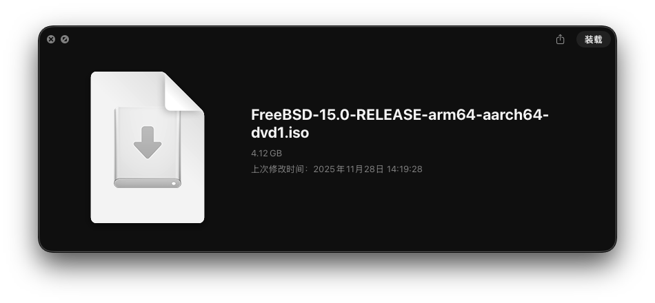
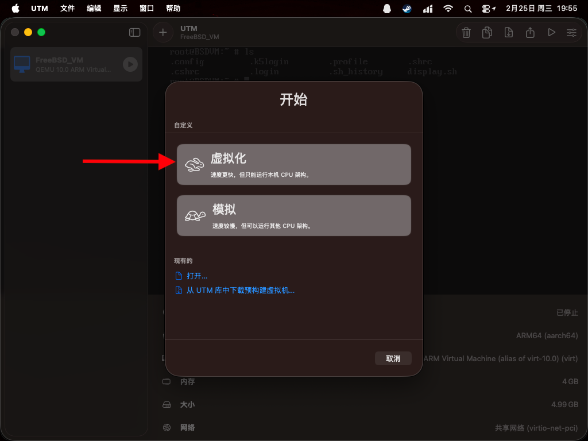
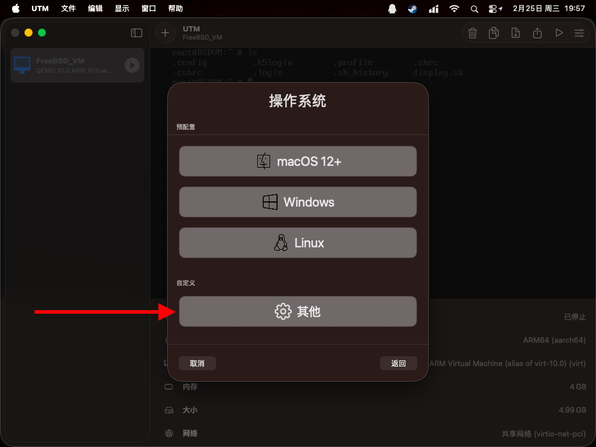
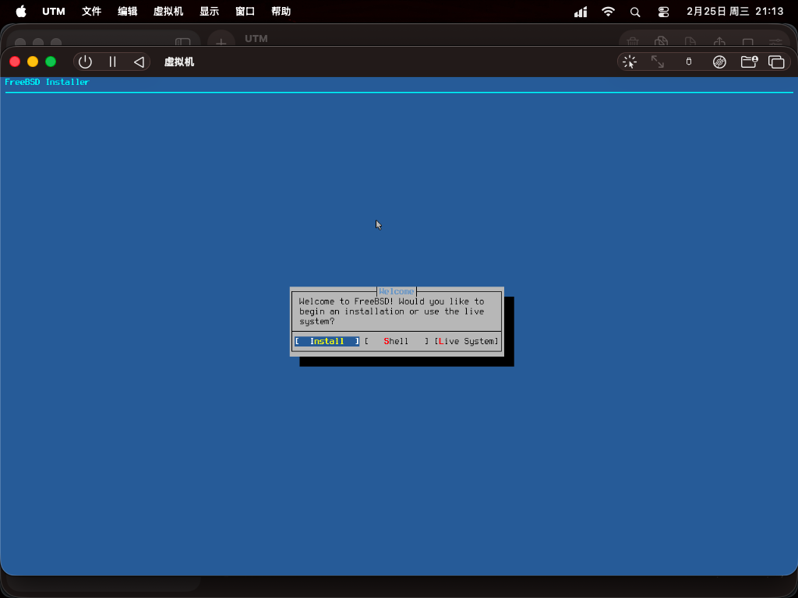
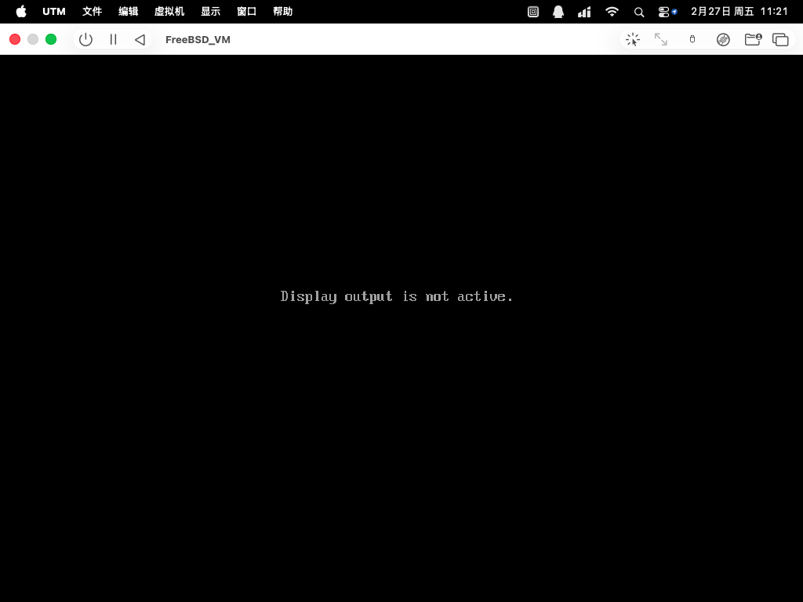

# 3.13 基于 Apple M1 和 UTM 安装 FreeBSD

首先下载 FreeBSD 的安装介质镜像。注意自己下载的是 aarch64 的还是 amd64 的，除非有特殊需求，建议下载 aarch64 的，相同架构速度快一些，性能损失小。



接下来新建一个虚拟机，点击窗口上的加号。


如果你下载的是 aarch64 的镜像，选择“虚拟化”，如果是 amd64 的镜像，选择“模拟”。



操作系统选择“其他”。



内存默认的 4GB 能适应大多数情况，初始状态下 FreeBSD 15 会占用大约 500M 的内存，有需求可以自己增加或者减少内存。CPU 核心按需设置，M1 芯片可以设置成 4 。


启动设备选择 CD/DVD 映像 ，点击“浏览”按钮选择你下载好的安装介质镜像。


存储空间默认 64GB ，初始状态 FreeBSD 会使用 5GB 左右的空间，可以根据需求调节。


共享目录可以暂时跳过。


以上步骤设置完以后点击存储即可，想要进一步设置可以勾选“打开虚拟机设置”，或者点击存储以后点击右上角设置按钮打开设置。


点击大大的播放按钮即可启动虚拟机。


启动 FreeBSD 安装介质镜像，按 Enter 可以跳过三秒的等待时间。


进入安装程序，鼠标默认可用，可以按下 Control + Option 快捷键捕获鼠标光标，再次按下此快捷键即可解除捕获。



系统基础安装完成，终端能正常运行，在虚拟机里面执行 ifconfig 看到 IP 以后可以在宿主机的终端模拟器中连接。


## 未竟事宜

直接启动 Xorg 默认的窗口管理器 TWM 会报错，输出内容如下：

```
voosk@BSDVM:~ $ startx
xauth:  file /home/voosk/.serverauth.3074 does not exist


X.Org X Server 1.21.1.20
X Protocol Version 11, Revision 0
Current Operating System: FreeBSD BSDVM 15.0-RELEASE FreeBSD 15.0-RELEASE releng/15.0-n280995-7aedc8de6446 GENERIC arm64

Current version of pixman: 0.46.2
	Before reporting problems, check http://wiki.x.org
	to make sure that you have the latest version.
Markers: (--) probed, (**) from config file, (==) default setting,
	(++) from command line, (!!) notice, (II) informational,
	(WW) warning, (EE) error, (NI) not implemented, (??) unknown.
(==) Log file: "/var/log/Xorg.0.log", Time: Fri Feb 27 10:59:53 2026
(==) Using system config directory "/usr/local/share/X11/xorg.conf.d"
scfb trace: probe start
scfb trace: probe done
scfb: PreInit 0
scfb: PreInit done
scfb: ScfbScreenInit 0
	bitsPerPixel=32, depth=24, defaultVisual=TrueColor
	mask: ff0000,ff00,ff, offset: 16,8,0
mmap returns: addr 0x0 len 0x3e8000, fd 12, off 0
(EE)
Fatal server error:
(EE) AddScreen/ScreenInit failed for driver 0
(EE)
(EE)
Please consult the The X.Org Foundation support
	 at http://wiki.x.org
 for help.
(EE) Please also check the log file at "/var/log/Xorg.0.log" for additional information.
(EE)
(EE) Server terminated with error (1). Closing log file.
xinit: giving up
xinit: unable to connect to X server: Connection refused
xinit: server error
voosk@BSDVM:~ $
```

在 /boot/loader.conf 里面加入下面两行能成功启动 TWM ，但是虚拟机就看不到画面了（ssh仍然能连进去，说明只是显示问题）。

```
hint.virtio_gpu.0.disabled="1"
hint.vtgpu.0.disabled="1"
```

重启以后 startx 能够正常启动 TWM ，输出如下：

```
voosk@BSDVM:~ $ startx
xauth:  file /home/voosk/.serverauth.3072 does not exist


X.Org X Server 1.21.1.20
X Protocol Version 11, Revision 0
Current Operating System: FreeBSD BSDVM 15.0-RELEASE FreeBSD 15.0-RELEASE releng/15.0-n280995-7aedc8de6446 GENERIC arm64

Current version of pixman: 0.46.2
	Before reporting problems, check http://wiki.x.org
	to make sure that you have the latest version.
Markers: (--) probed, (**) from config file, (==) default setting,
	(++) from command line, (!!) notice, (II) informational,
	(WW) warning, (EE) error, (NI) not implemented, (??) unknown.
(==) Log file: "/var/log/Xorg.0.log", Time: Fri Feb 27 11:16:38 2026
(==) Using system config directory "/usr/local/share/X11/xorg.conf.d"
scfb trace: probe start
scfb trace: probe done
scfb: PreInit 0
scfb: PreInit done
scfb: ScfbScreenInit 0
	bitsPerPixel=32, depth=24, defaultVisual=TrueColor
	mask: ff0000,ff00,ff, offset: 16,8,0
mmap returns: addr 0xe4d20000 len 0x1d5000, fd 12, off 0
scfb: ScfbSave 0
scfb: ScfbSave done
scfb: ScfbScreenInit done
scfb: SaveScreen 0
scfb: SaveScreen done
twm: created fontset with 10 fonts (7 missing) for "-adobe-helvetica-bold-r-normal--*-120-*-*-*-*-*-*"
twm: created fontset with 10 fonts (7 missing) for "-adobe-helvetica-bold-r-normal--*-120-*-*-*-*-*-*"
twm: created fontset with 10 fonts (7 missing) for "-adobe-helvetica-bold-r-normal--*-100-*-*-*-*-*-*"
twm: created fontset with 10 fonts (7 missing) for "-adobe-helvetica-bold-r-normal--*-120-*-*-*-*-*-*"
twm: created fontset with 10 fonts (7 missing) for "-adobe-helvetica-bold-r-normal--*-100-*-*-*"
twm: created fontset with 2 fonts (15 missing) for "fixed"
```

虚拟机看不到画面，显示 Display output is not active.


