# 3.2 使用 VMware Workstation Pro 安装 FreeBSD


## 视频教程

- [001-Windows 11 安装 VMware 17](https://www.bilibili.com/video/BV1Qji2YLEgS)

## 镜像下载

>**提示**
>
>虚拟机也可以使用 FreeBSD 官方构建的 [虚拟机镜像](https://download.freebsd.org/releases/VM-IMAGES/14.2-RELEASE/amd64/Latest/)，需要手动扩容，文件系统可选 UFS 与 ZFS。
>
>虚拟机一般使用 `FreeBSD-14.2-RELEASE-amd64-disc1.iso` 等类似文件名和后缀的镜像，但是 `FreeBSD-14.2-RELEASE-amd64-memstick.img` 也并非只能用于 U 盘刻录，虚拟机同样可以使用，使用方法参考其他章节。


## 配置虚拟机


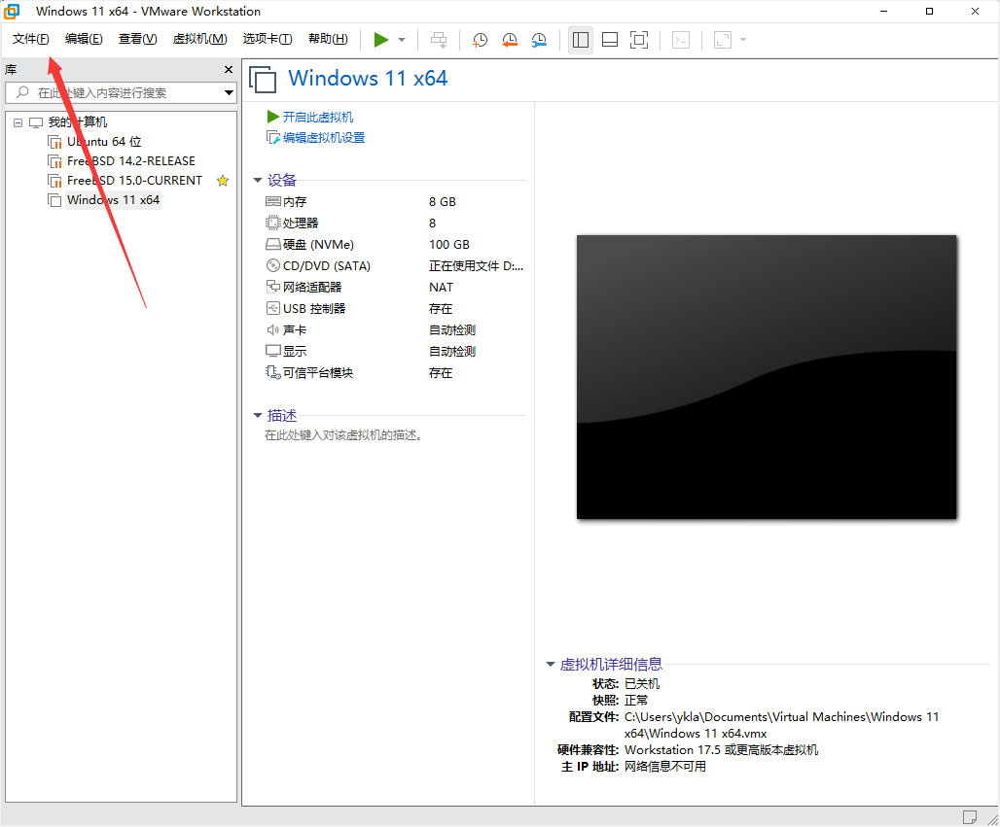


请务必选择“稍后安装操作系统”，否则可能导致启动问题。


请选择“其他”，然后选择 FreeBSD。

>**技巧**
>
>这一步实际上并无实质影响，甚至选择 Windows 也可以顺利启动。但是对于低版本的 FreeBSD，虚拟机增强工具没有开源，可能会出问题。

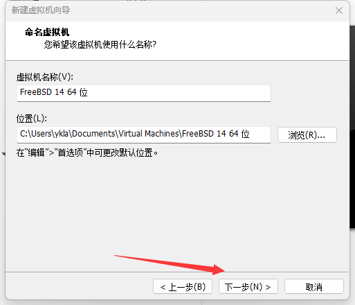

虚拟机通常会占用较大的磁盘空间。若您不希望系统盘（如 C 盘）空间被占满，请自行调整虚拟机的存储位置。

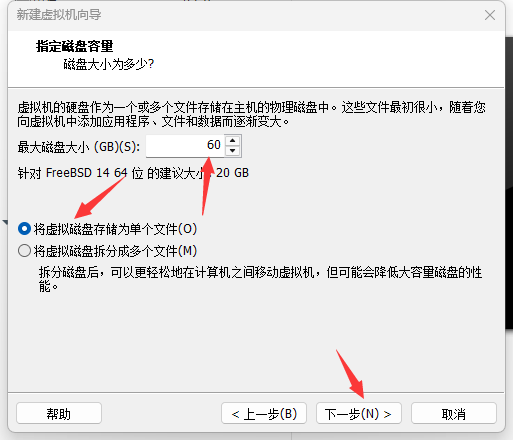

请根据实际需要调整虚拟磁盘的最大大小。默认值可能偏小。若要安装图形化桌面环境，建议分配至少 20 GB 的磁盘空间。


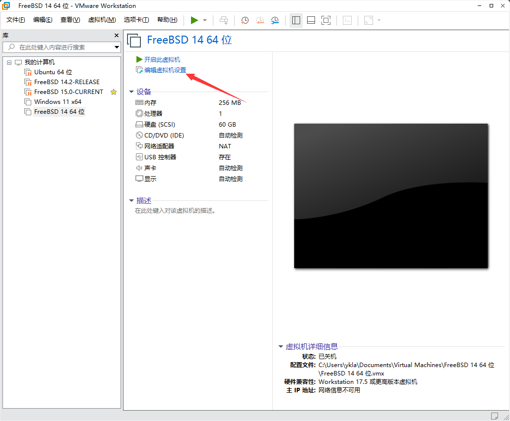


默认的 256 MB 内存可以启动系统，但不建议用于实际使用。最低建议配置为 512 MB。


默认的 1 个 CPU 核心可以启动，但为了获得更好的性能，建议根据主机资源情况进行调整。

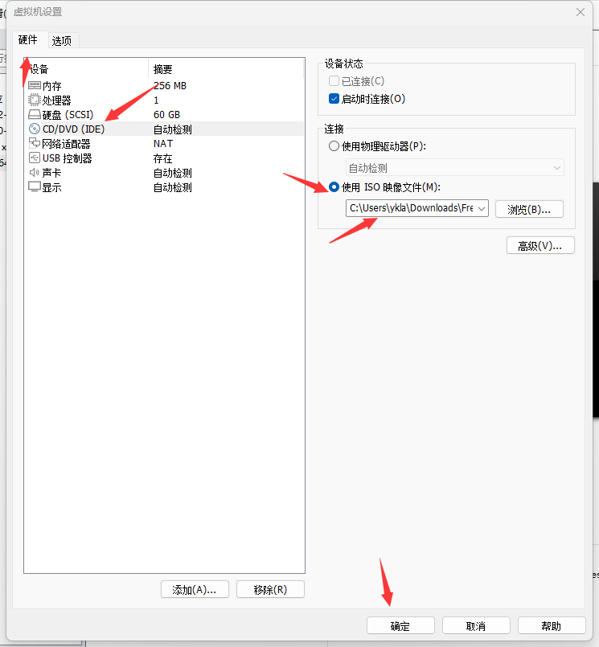

在“使用 ISO 映像文件”处，点击“浏览”，找到并选中您下载的 `FreeBSD-14.2-RELEASE-amd64-disc1.iso` 文件。


>**技巧**
>
> 经过测试，FreeBSD 也可以支持驱动 UEFI 下 VMware 的显卡。——2025.3.24


> **警告**
>
> 由于 [Bug 250580 - VMware UEFI guests crash in virtual hardware after r366691](https://bugs.freebsd.org/bugzilla/show_bug.cgi?id=250580) 的存在，FreeBSD 11/12 在 VMware 的 UEFI 环境下可能无法启动。经测试，FreeBSD 13.0 可正常启动。


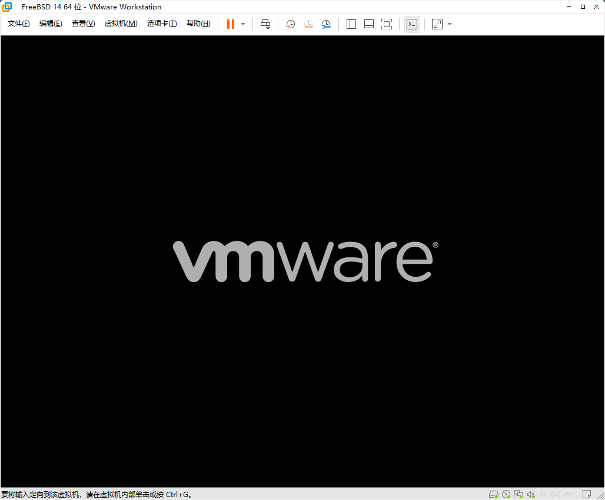


## 网络设置

请使用 NAT 模式（默认设置）。如果虚拟机无法与宿主机（物理机）通信，请打开 VMware 的“编辑”菜单，选择“虚拟网络编辑器”，点击“还原默认设置”，直至配置恢复正常。

>**注意**
>
>经过测试，桥接模式的虚拟机在与主机传递文件时，网速较慢。

>**技巧**
>
>如果“还原默认设置”无效，且网络适配器列表异常（例如始终只有单个模式），可尝试根据下图所示手动配置网络。

>**警告**
>
>NAT 模式的“名称”与你主机的 `控制面板\网络和 Internet\网络连接` 中的 `VMware Network Adapter VMnet8` 绑定，默认绑定的是 `8`。换言之，NAT 模式的“名称”默认必须指定为下图所示的 `VMnet8`，否则虚拟机将无法联网。
>
>


通常情况下无需进行手动设置。如果虚拟机内网络接口一直提示 `no link`，请尝试重启宿主机，然后打开 VMware 的虚拟网络编辑器，再次执行“还原默认设置”操作（不推荐手动配置，可能无效）。

如果无法连接网络，可尝试在虚拟机内将 DNS 服务器设置为 `223.5.5.5`。其他网络配置方法请参阅本章后续章节。

如果配置为桥接模式后始终无法通过 DHCP 获取 IP 地址，可尝试将网络适配器的“桥接到”选项从“自动”改为您主机当前正在使用的物理网卡。

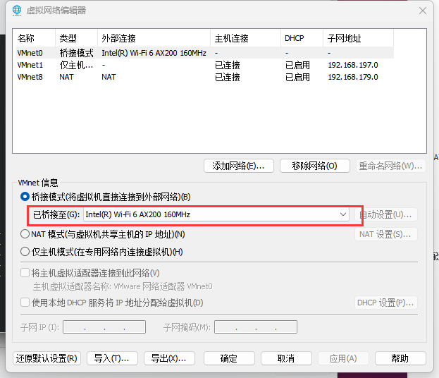

## 虚拟机增强工具与显卡驱动

安装 VMware 显卡驱动和虚拟机增强工具（Open VM Tools），使用 pkg 的命令如下：

```sh
# pkg install xf86-video-vmware open-vm-tools xf86-input-vmmouse
```

或者使用 Ports 系统编译安装：

```sh
# cd /usr/ports/x11-drivers/xf86-video-vmware/  && make install clean
# cd /usr/ports/emulators/open-vm-tools/ && make install clean
# cd /usr/ports/x11-drivers/xf86-input-vmmouse/  && make install clean
```

>**注意**
>
>如果不需要图形界面支持，可以安装无 X11 依赖的版本（仍然是 Port `emulators/open-vm-tools`）：
>
>```sh
># pkg install open-vm-tools-nox11
>```

安装完成后，通常无需额外配置即可实现虚拟机屏幕的自动缩放功能。

>**注意**
>
>即使在 Wayland 环境下，也需要安装该驱动。

>**技巧**
>
> 如果屏幕显示不正常（过大），请尝试：编辑虚拟机设置——> 硬件、设备——> 显示器——> 监视器、指定监视器设置——> 任意监视器的最大分辨率，设置为主机的分辨率或者略低于主机分辨率均可。


### 鼠标集成（主机虚拟机鼠标自由切换）

请先安装显卡驱动和虚拟机增强工具。

```sh
# service moused enable
# Xorg -configure
# mv /root/xorg.conf.new /usr/local/share/X11/xorg.conf.d/xorg.conf
```

编辑 `/usr/local/share/X11/xorg.conf.d/xorg.conf` 文件，修改以下段落（其他部分保持不变）：

```ini
Section "ServerLayout"
        Identifier     "X.org Configured"
        Screen          0  "Screen0" 0 0
        InputDevice    "Mouse0" "CorePointer"
        InputDevice    "Keyboard0" "CoreKeyboard"
        Option          "AutoAddDevices" "Off"  # 添加此行到此处
EndSection

…………此处省略一部分…………

Section "InputDevice"
      Identifier  "Mouse0"
      Driver      "vmmouse"  # 修改 mouse 为 vmmouse
      Option      "Protocol" "auto"
      Option      "Device" "/dev/sysmouse"
      Option      "ZAxisMapping" "4 5 6 7"
EndSection

…………此处省略一部分…………
```

### 共享文件夹

请先安装虚拟机增强工具（Open VM Tools）。

#### 在物理机设置共享文件夹


>**注意**
>
>此示例中虚拟机名称显示为“Windows 11”，这是因为该虚拟机被配置为 Windows 11 与 FreeBSD 双系统，属正常情况。

在 FreeBSD 虚拟机中查看设置的文件夹：

```sh
# vmware-hgfsclient
123pan
```

#### 加载 fuse 模块

加载 FUSE 内核模块。将以下内容添加到 `/boot/loader.conf` 文件中：

```sh
fusefs_load="YES"
```

#### 挂载

##### 手动挂载

>**注意**
>
>请将以下命令中的 `123pan` 替换为您在 VMware 中设置的共享文件夹名称。

```sh
# vmhgfs-fuse .host:/123pan /mnt/hgfs
```

##### 自动挂载

编辑 `/etc/fstab` 文件。添加以下挂载条目（请将 `123pan` 替换为您的共享文件夹名称）：

```sh
.host:/123pan      /mnt/hgfs    fusefs  rw,mountprog=/usr/local/bin/vmhgfs-fuse,allow_other,failok 0 0
```

添加后，请务必执行以下命令检查配置是否正确（若无错误输出则正常），错误的配置可能导致系统无法正常启动：

```sh
# mount -al
```

#### 查看共享文件夹

```sh
# ls /mnt/hgfs/
Downloads
# ls /mnt/hgfs/Downloads/
零跑
```

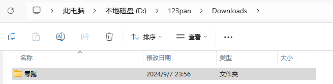

文件内容一致。

#### 参考文献

- [解决 vmware 上 Ubuntu 共享文件夹（2022 年 7 月）](https://www.cnblogs.com/MaRcOGO/p/16463460.html)，整体方法参考此处
- [fuse: failed to open fuse device](https://forums.freebsd.org/threads/fuse-failed-to-open-fuse-device.44544/)，解决 `fuse: failed to open fuse device: No such file or directory` 的问题
- [VMware shared folders](https://forums.freebsd.org/threads/vmware-shared-folders.10318/)，挂载方法参考此处


## 故障排除与未尽事宜

> **注意**
>
> 在使用 Windows 远程桌面或者其他 XRDP 工具远程另一台 Windows 桌面，并使用其上面运行的 VMware 虚拟机操作 FreeBSD 时，鼠标通常会变得难以控制。这是正常的！

- 每次进入图形界面，窗口都会异常扩大。

调整虚拟机的最大分辨率即可解决该问题。

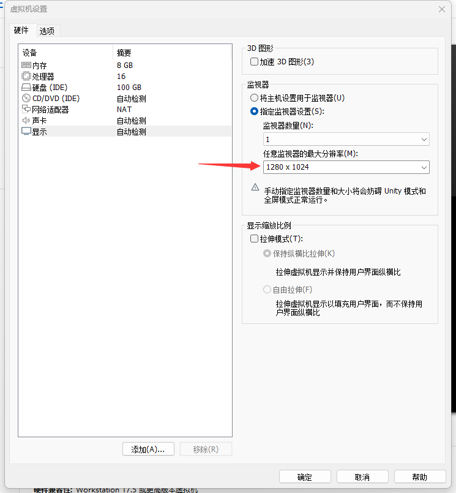

硬件——显示——监视器——任意监视器的最大分辨率 (M)，将其由默认最大的 `2560 x 1600`（2K）改成其他较小值即可，亦可自定义数值。

- 没有声音

加载声卡后若仍然没有声音，请将音量调至 100% 后再进行确认，因为默认音量几乎微不可闻。

## 附录：博通（Broadcom）账号相关

>**警告**
>
>博通官网频繁变动，无法始终提供一致的解决方案，请读者自行理解并操作；如仍无法完成，可加入中文社区聊天群寻求帮助。

### 博通（broadcom）账号注册

VMware 已被博通（Broadcom）收购。**因此，目前从官方下载任何相关产品均需先注册并登录博通账号。** 请注意，任何非博通官方域名（`broadcom.com`）的下载教程可能已失效。

>**博通（broadcom）账号的注册流程**
>
>- 打开 <https://support.broadcom.com/>
>
> 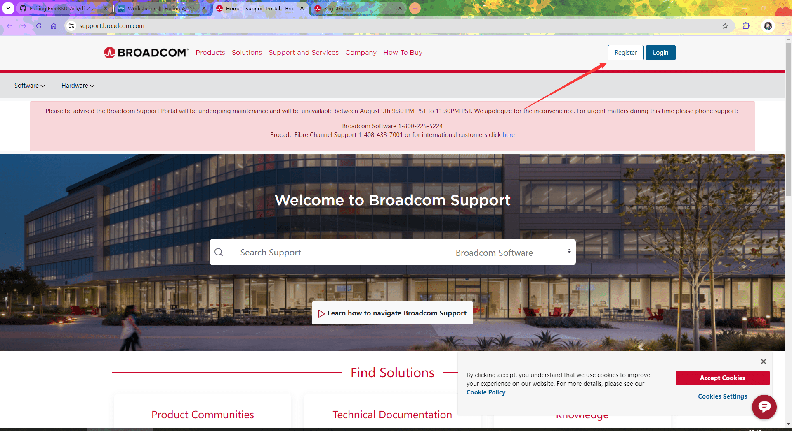
>
>- 点击右上角的“Register”（注册）（或者直接打开 <https://profile.broadcom.com/web/registration>）
>>
>>在页面“Email Address”（电子邮件）处输入你的电子邮箱。如果没有的话，可以用你的 QQ 号，然后直接加上一个 `@qq.com`——比如你的 QQ 号是 `1212111111`，那么你的 QQ 邮箱则为 `1212111111@qq.com`
>>
>>在页面“Enter text from image”（输入图片上的文本）处输入图片上的文本信息（实际上是验证码）。如果看不清或者不认识，可以点 `Enter text from image` 右侧的 🔁
>>点击“Next”（继续）
>>
>>如果你使用的是 QQ 号生成的邮箱，请打开 <https://wx.mail.qq.com/>。其他邮箱请在各自网站打开，如果不知道，请使用 QQ 邮箱。
>
>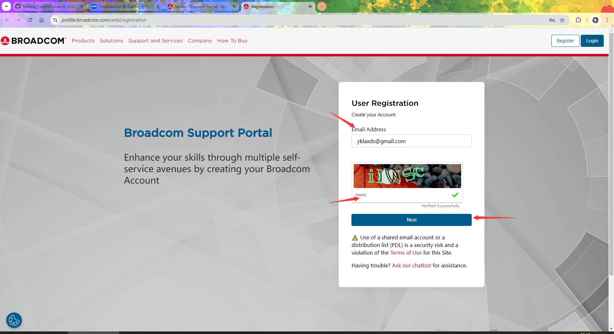
>
>- 把第五步得到的“Verification Code: 972980”，中的 972980（你的和我不一样，找你自己的）填到“Enter text from image”里面。
>
>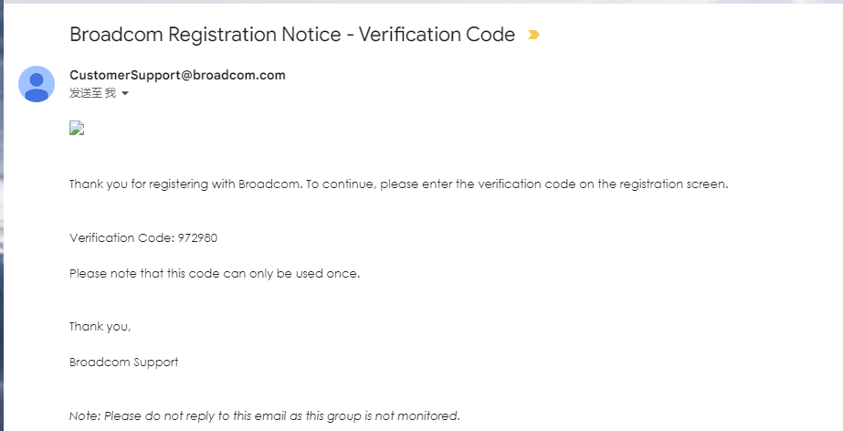
>
>- 点击“Verify & Continue”（确认并继续）
>
>
>
>- 完成注册
>
>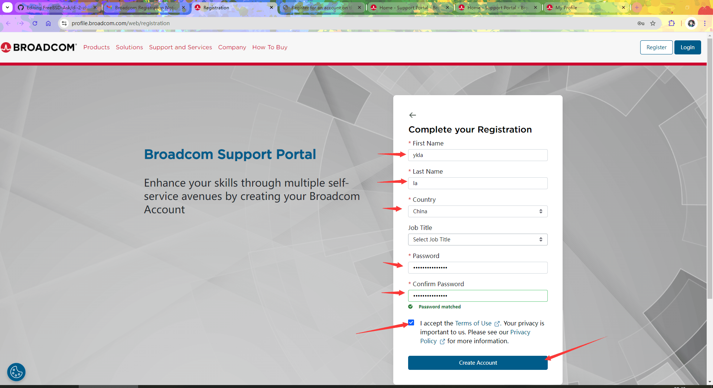
>
>- 结束注册流程
>  
>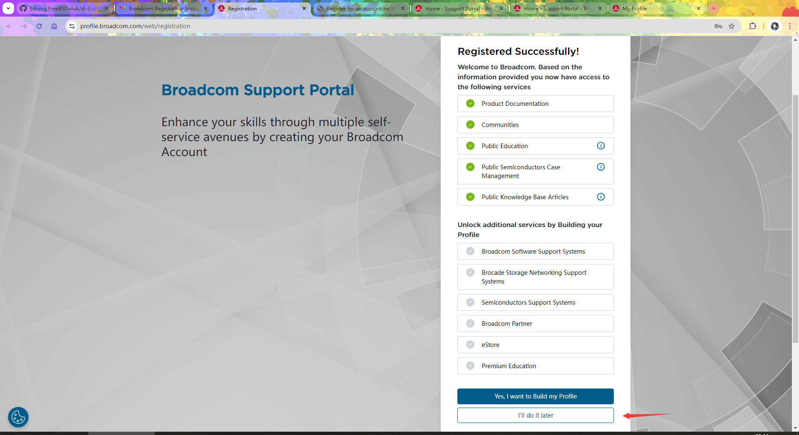


### 博通（broadcom）账号登录

>**博通（broadcom）账号登录流程**
>
>- 打开 <https://support.broadcom.com/>
>>
>>点击右上角的“Login”（登录）（或者直接打开 <https://support.broadcom.com/c/portal/login>）
>
>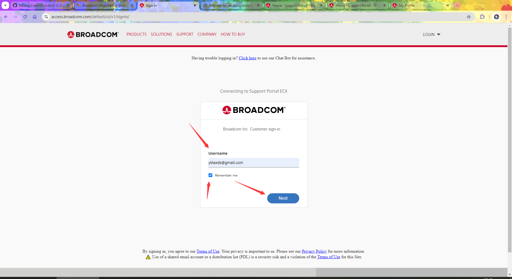
>
>- Username（用户名）就是你注册时候的邮箱。然后点“Next”（下一步）
>
>
>
>- 点击下一步
>
>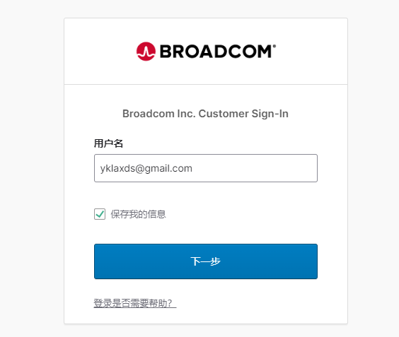
>
>- 点击登录
>
>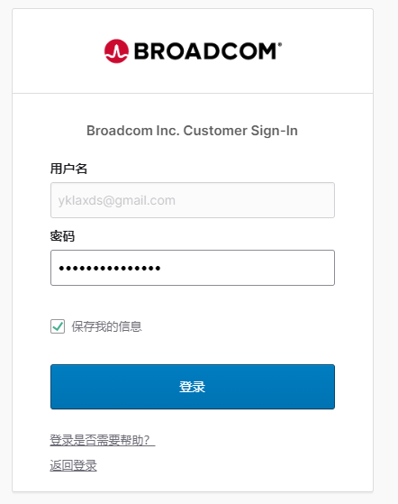
>
>- 登录完成
>
>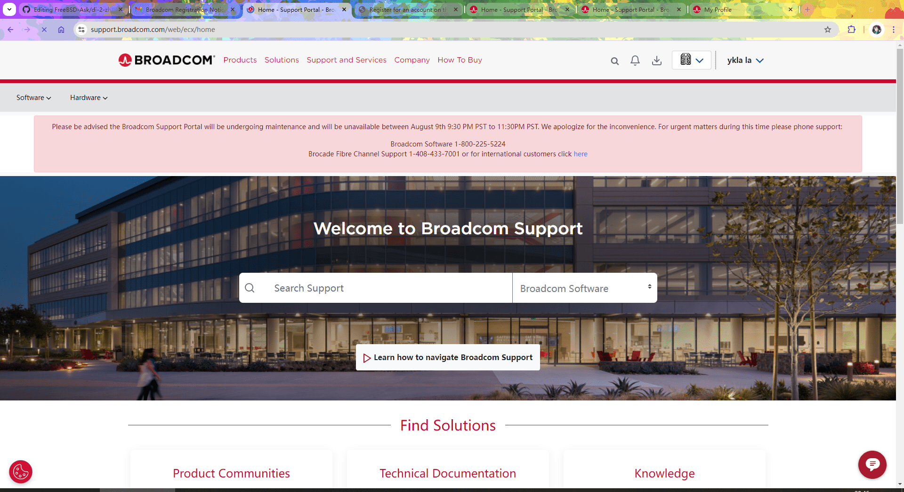

### VMware Workstation Pro 下载（推荐）

>**VMware Workstation Pro 下载流程**
>
>- 点击右上角对应图标（名字左侧第一个），选择“VMware Cloud Foundation”（VMware 云计算基础架构）
>  
>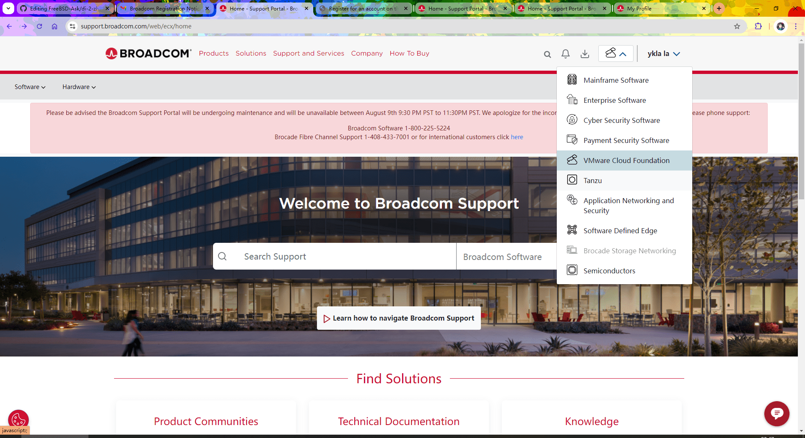
>
>- 点击右侧的“My Downloads”（我的下载）
>
>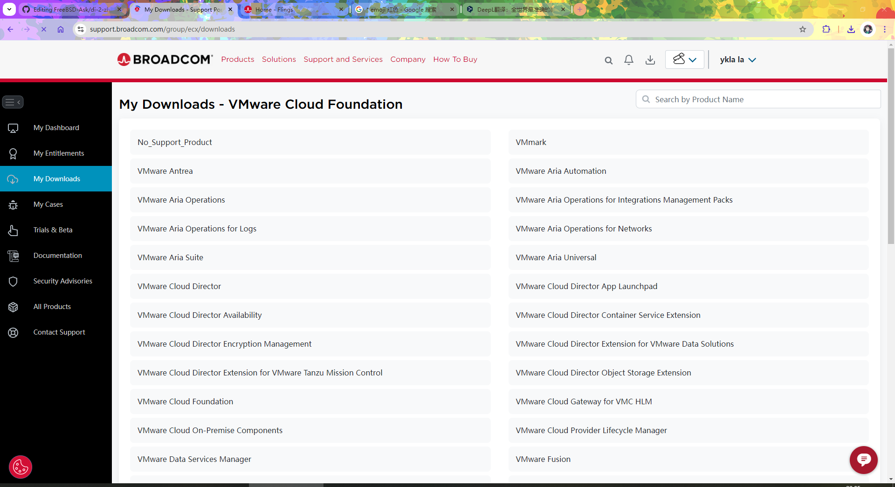
>
>- 往下翻，点击“VMware Workstation Pro“
>
>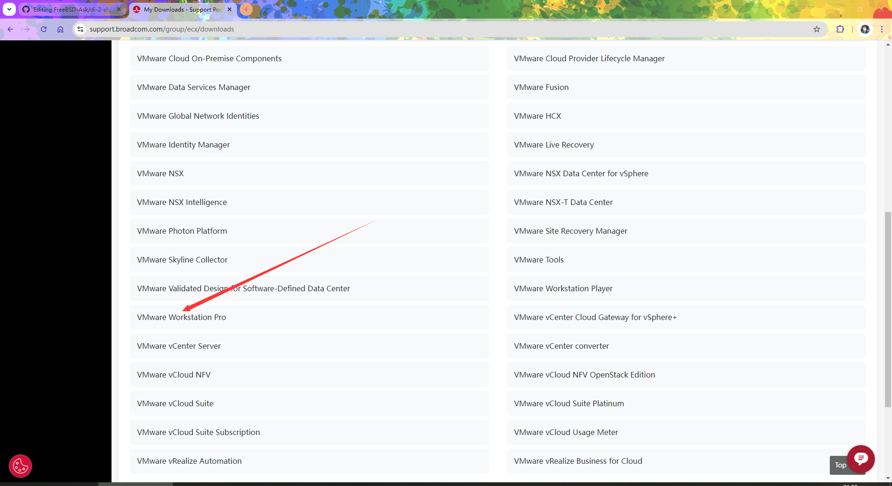
>
>- 点击“Release”（发行版），选择最顶部的那个，你看到的不一定和我一样。
>
>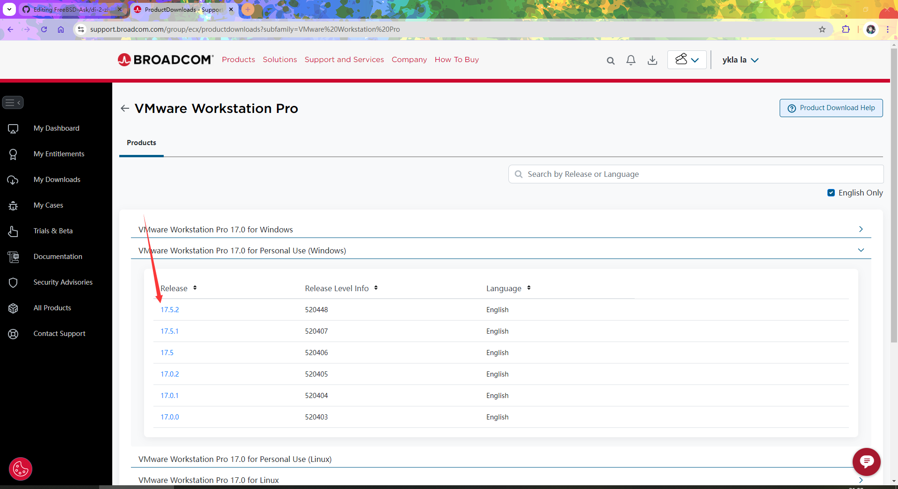
>
>**或者跳过上述步骤，直接打开 <https://support.broadcom.com/group/ecx/free-downloads>**
>
>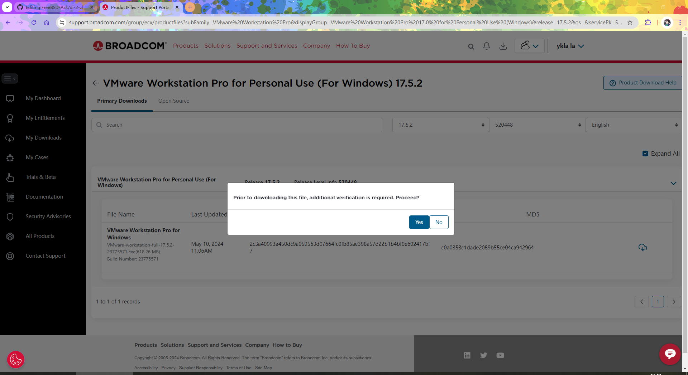
>
>- 把红色的 `*` 项目填写完成，不会写的自己编，最好不要抄我的。
>  
>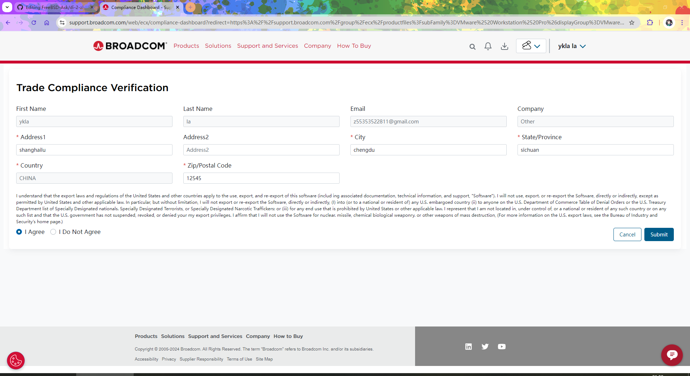
>
>- 勾选“I agree to Terms and Conditions”（我同意条款及条件）左侧的方框 ⬜，让他变成 🟦。（必须先点击“Terms and Conditions”弹窗新页面，再回来就能勾选了）
>  
>
>
>- 点击右侧箭头的云朵图片 ☁️ 即可下载
>  
>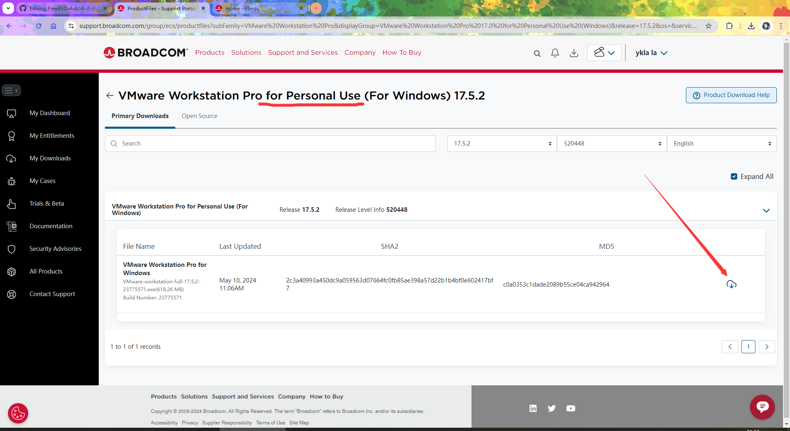


VMware Workstation Pro 目前对于个人用户来说是 **免费下载、免费使用、免费授权的。** **请勿从任何第三方站点下载。** 否则会造成一些未知的后果——90% 的问题都是由此产生的。


### 博通开源/社区产品

博通所有开源/社区产品都被整合到了这里进行下载。

如：Community Network Driver for ESXi、ESXi Arm Edition 等。

访问地址：<https://community.broadcom.com/flings/home>。目前任何非此域名教程（`community.broadcom.com`）均无效。

### VMware Workstation Player（已不再维护）

VMware Workstation Player 目前已弃用，且相较于 VMware Workstation Pro 功能存在较多缺失。不建议使用，非要下载，请点击 <https://support.broadcom.com/group/ecx/productdownloads?subfamily=VMware%20Workstation%20Player>。目前所有包含该软件的教程均为旧教程。
