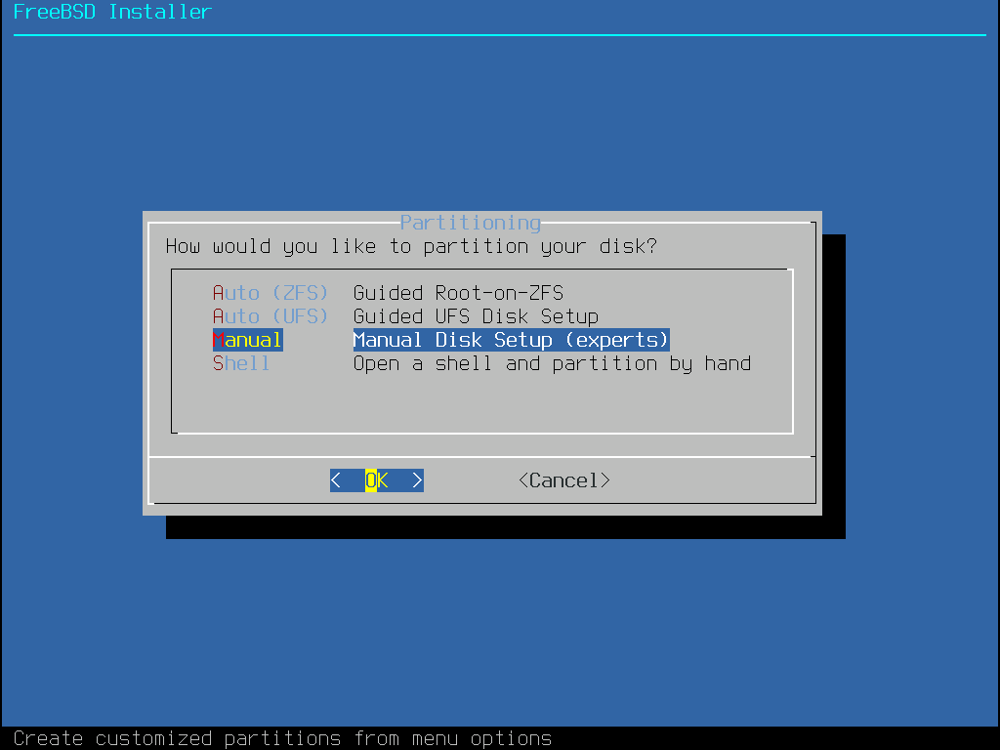
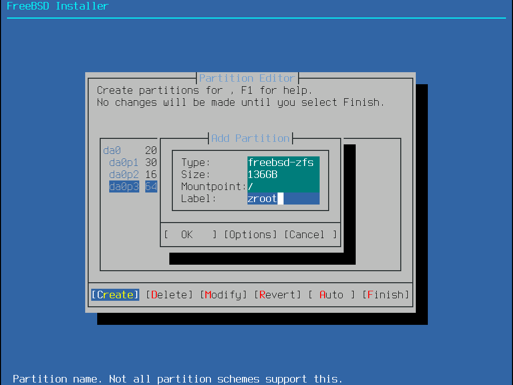
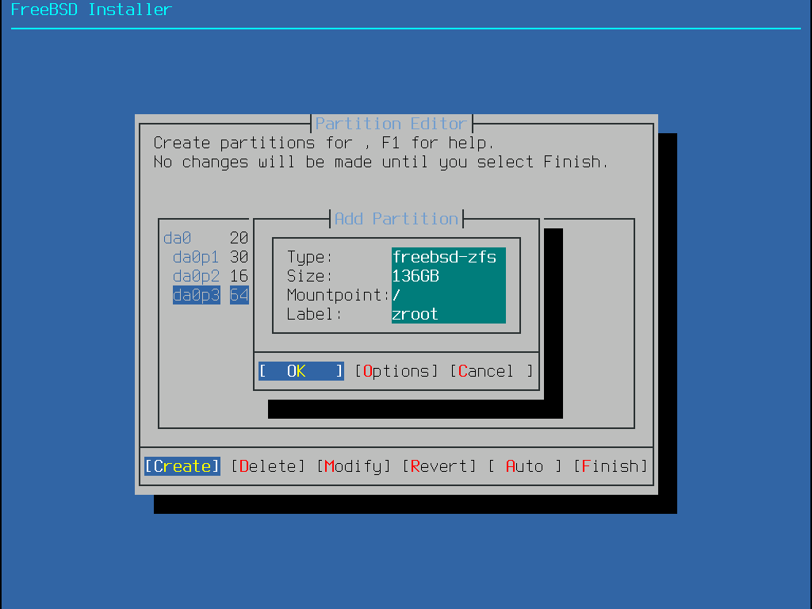
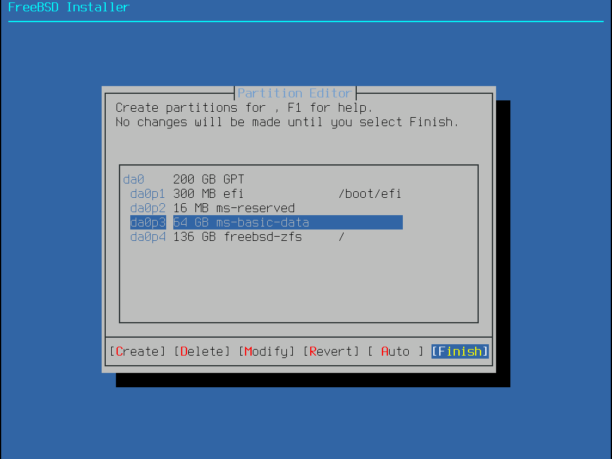
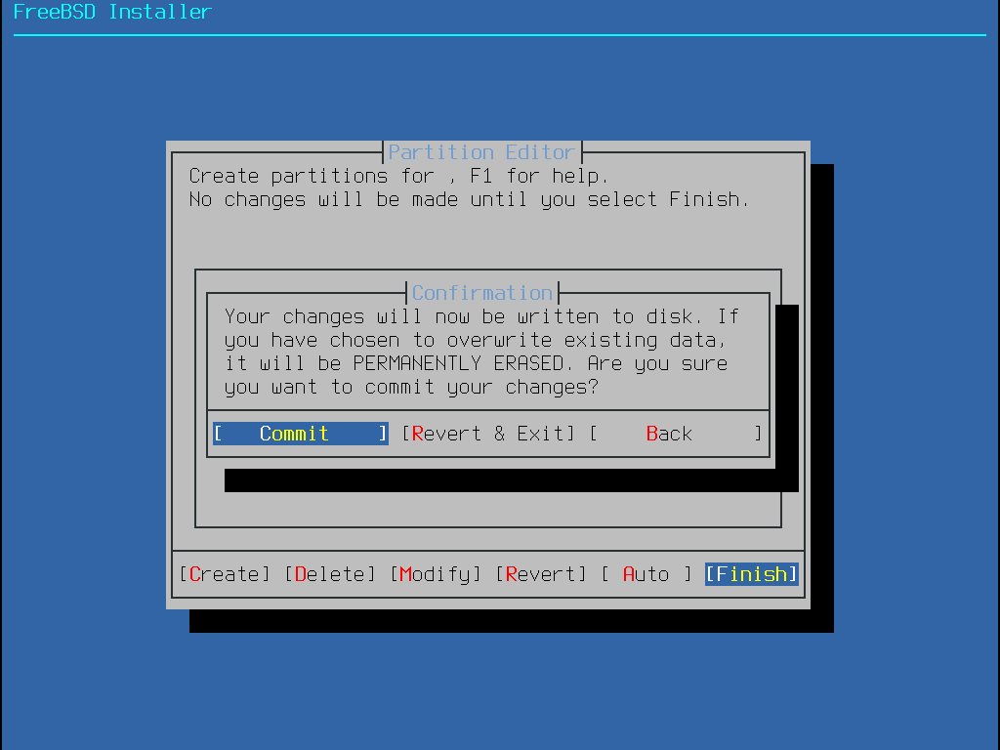
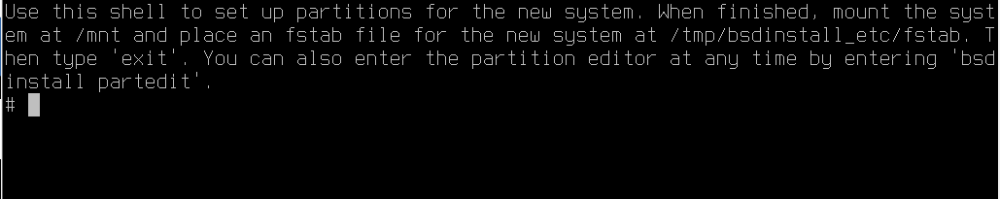

# 3.5 手动安装双系统（后安装 FreeBSD）

本文基于 `FreeBSD-14.2-RELEASE-amd64-disc1.iso`，演示在 UEFI 环境下，FreeBSD 14.2 RELEASE 与 Windows 11 24H2 的双系统安装。

>**技巧**
>
>本文示例要求先安装其他操作系统，再安装 FreeBSD。

## 简单方法（无众多数据集）

> **注意**
>
> 以此部分所述方法，在使用 ZFS 时，只会创建一个名为 `root` 的 zpool，并且直接挂载到 `/`。并不会像自动安装那样创建 `zroot/ROOT/default` 以及众多的数据集。你可以以后再创建数据集进行替换操作，但如果你想在安装开始就使用与自动安装相同的布局，请跳转到本节 Shell 分区部分。

首先需要为 FreeBSD 在硬盘留出空间：不一定要求是硬盘末尾，硬盘中间也可以，因为正常的 Windows 安装最后一个分区（本例中为 `nda0p4`）是恢复分区。分区完成后在 FreeBSD 下，看起来就是这样的：

```sh
# gpart show
=>       34  419430333  nda0  GPT  (200G)
         34       2014        - free -  (1.0M)
       2048     204800     1  efi  (100M) # EFI 分区
     206848      32768     2  ms-reserved  (16M) # MSR 分区
     239616  207992832     3  ms-basic-data  (99G) # 这个是 C 盘，原先有 200G 这么大。现在 C 盘和恢复分区之间空余了 100G
  417947648    1478656     4  ms-recovery  (722M) # 恢复分区
  419426304       4063        - free -  (100G)
```

你应关闭安全启动和快速启动——或者你还可以从 Windows 设置——> Windows 更新——> 高级选项——> 恢复——> 高级启动选择从 U 盘设备启动。然后正常引导 FreeBSD 进行安装流程，直至分区选择。



此处选择 `Manual`

>**技巧**
>
>其实这里调用的是软件 `sade`（sysadmins disk editor，系统管理员磁盘编辑器），`bsdconfig` 亦同。

这里可以看到硬盘分区。仅有一块硬盘：有 300M 的 EFI 系统分区、16M 的 MSR 分区、64G 的 Windows 系统分区（即 C 盘）以及未显示空闲空间。直接选择 `Create`（创建）。


此处，第一行输入分区类型（即下方会列出的 `Filesystem type`）。如要添加 swap 分区，请首先添加，后添加难以控制分区大小。在添加 UFS、ZFS 时，需在 `Mountpoint` 处添加 `/`，表示将分区挂载到 `/`。`Label` 是 FreeBSD 的卷标，方便识别分区，可以根据情况填或不填。此处使用 ZFS，不添加 swap 分区，并且填入卷标 `zroot`。



用 **TAB 键** 选择到 `OK` 按回车键。



这里会警告 ZFS 分区无法启动，但经过实测是可以正常启动的，选择 `Yes` 忽略：


>**注意**
>
>请将 Windows 创建的 300M 的 EFI 的挂载点设置为 `/boot/efi`。

选择 `Finish`（完成）



选择 `Commit`（确认）




之后会进入正常安装的流程。安装完成后：

```sh
# zfs list
NAME  USED   AVAIL  REFER  MOUNTPOINT
root  534M    130G   534M  nont
```

进入系统后可以看到，仅有一个 `root` 数据集。可以手动将数据集改为自动安装的样子，亦可参照下文在安装时进入 shell 进行分区。

## Shell 分区

仍然进行到分区选择，选择 `Shell`


之后会进入 TTY：



执行以下命令。

### 加载 ZFS 内核模块

```sh
# kldload zfs
```

### 配置 ZFS 对齐方式（只影响新创建的硬盘分区）

```sh
# 强制 4K 对齐
# sysctl vfs.zfs.vdev.min_auto_ashift=12
vfs.zfs.vdev.min_auto_ashift: 9 -> 12
```

>**技巧**
>
> `12` 即 2^12 = 4096 字节（4KB）的扇区大小。默认参数（命令 `sysctl vfs.zfs.vdev.min_auto_ashift` 可看到 ISO 的默认参数）是 `9`，即 2^9 = 512 字节。

>**思考题**
>
>若你使用 NVMe，则正常新装系统（UEFI+GPT，不带 freebsd-boot 分区）默认参数应是 `12`。但是 4K 对齐究竟对齐的是什么？因为 SSD 固态硬盘并没有所谓扇区。

### 创建分区

```sh
# 创建 swap 分区（-t），卷标为 swap（-l），大小为 4G（-s），对齐（-a），注意替换 nda0
# gpart add -a 4k -l swap -s 4G -t freebsd-swap nda0

# 创建 ZFS 分区，卷标为 zroot，使用全部空余空间，注意替换 nda0
# gpart add -a 4k -l zroot -t freebsd-zfs nda0
```

#### 查看分区情况

```sh
# gpart show
=>       34  419430333  nda0  GPT  (200G)
         34       2014        - free -  (1.0M)
       2048     204800     1  efi  (100M)
     206848      32768     2  ms-reserved  (16M)
     239616  207992832     3  ms-basic-data  (99G)
  208232448    8388608     5  freebsd-swap  (4.0G)
  216621056  201326592     6  freebsd-zfs  (96G)
  417947648    1478656     4  ms-recovery  (722M)
  419426304       4063        - free -  (2.0M)
```

### 挂载临时文件系统准备安装
  
```sh
# mount -t tmpfs tmpfs /mnt
```

### 创建 ZFS 池

```sh
# 创建 ZFS 池，暂时挂载至 /mnt（-o altroot=/mnt），使用 lz4 压缩（-O compress=lz4。可换成 zstd 等），关闭时间标签（-O atime=off），/dev/gpt/zroot 是我们刚建立的卷标
# zpool create -f -o altroot=/mnt -O compress=lz4 -O atime=off -m none zroot /dev/gpt/zroot
```

### 创建 ZFS 数据集

```sh
# 创建根数据集
# zfs create -o mountpoint=none zroot/ROOT
# 创建一个名为 `zroot/ROOT` 的数据集，不设置挂载点（`mountpoint=none`），通常用于作为系统底层的根数据集，可以用于创建下面的子数据集。

# 创建默认根数据集
# zfs create -o mountpoint=/ zroot/ROOT/default
# 创建一个名为 `zroot/ROOT/default` 的数据集，并将其挂载到根目录 `/`，用于系统的默认根文件系统。

# 创建 /home 数据集
# zfs create -o mountpoint=/home zroot/home
# 创建一个名为 `zroot/home` 的数据集，并挂载到 `/home`，通常用于存储用户主目录。

# 创建 /tmp 数据集，设置 exec 为 on，setuid 为 off
# zfs create -o mountpoint=/tmp -o exec=on -o setuid=off zroot/tmp
# 创建 `zroot/tmp` 数据集并挂载到 `/tmp`，允许执行文件（`exec=on`），但禁用 setuid（`setuid=off`）防止该目录中的文件使用 setuid 提升权限。

# 创建 /usr 数据集，并设置 canmount 为 off
# zfs create -o mountpoint=/usr -o canmount=off zroot/usr
# 创建 `zroot/usr` 数据集并挂载到 `/usr`，但由于设置 `canmount=off`，该数据集不会被自动挂载，通常用于特定的系统配置。

# 创建 /usr/ports 数据集，设置 setuid 为 off
# zfs create -o setuid=off zroot/usr/ports

# 创建 /usr/src 数据集
# zfs create zroot/usr/src

# 创建 /var 数据集，设置 canmount 为 off
# zfs create -o mountpoint=/var -o canmount=off zroot/var

# 创建 /var/audit 数据集，设置 exec 和 setuid 为 off
# zfs create -o exec=off -o setuid=off zroot/var/audit

# 创建 /var/crash 数据集，设置 exec 和 setuid 为 off
# zfs create -o exec=off -o setuid=off zroot/var/crash

# 创建 /var/log 数据集，设置 exec 和 setuid 为 off
# zfs create -o exec=off -o setuid=off zroot/var/log

# 创建 /var/tmp 数据集，设置 setuid 为 off
# zfs create -o setuid=off zroot/var/tmp

# 创建 /var/mail 数据集，设置 atime 为 on
# zfs create -o atime=on zroot/var/mail
# 创建 `zroot/var/mail` 数据集并设置 `atime=on`，意味着每次读取文件时都会更新访问时间，通常用于存放邮件数据。
```

>**技巧**
>
>上述参数来着自 [bsdinstall(8)](https://man.freebsd.org/cgi/man.cgi?bsdinstall(8))。你也可以在安装好的系统里用命令 `zfs get exec,setuid,mountpoint` 进行查看。代码位于 src `/usr.sbin/bsdinstall/scripts/zfsboot`。

### 修改文件夹权限

```sh
# 修改 /mnt/tmp 和 /mnt/var/tmp 权限为 1777，保证临时目录权限正确
# chmod 1777 /mnt/tmp
# chmod 1777 /mnt/var/tmp
```

### 设置交换分区到 `fstab`

```
# 配置 swap 分区挂载，注意替换 /dev/nda0p5，可以用命令 gpart show nda0 看一下
# printf "/dev/nda0p5\tnone\tswap\tsw\t0\t0\n" >> /tmp/bsdinstall_etc/fstab
```

>**技巧**
>
>`\t` 是一个转义字符，表示按了一次 Tab 键，此处用于对齐分割，换成空格也是一样的效果。你也可以使用 ee 编辑器手动写入（`ee /tmp/bsdinstall_etc/fstab`）对应条目：
>
>```sh
>/dev/nda0p5  none  swap  sw  0  0
>```
>
>下同。

### 设置启动项与 UEFI

```
# 设置 ZFS 启动路径为 zroot/ROOT/default
# zpool set bootfs=zroot/ROOT/default zroot

# 配置 FreeBSD 启动时加载 ZFS①
# printf 'zfs_enable="YES"\n' >> /tmp/bsdinstall_etc/rc.conf

# 挂载 EFI 系统分区
# 挂载现有 EFI 系统分区，注意替换 /dev/nda0p1
# mount -t msdosfs /dev/nda0p1 /media

# 在 EFI 系统分区创建启动目录
# mkdir -p /media/efi/freebsd

# 复制 EFI 启动文件到 EFI 系统分区
# cp /boot/loader.efi /media/efi/freebsd/

# 使用 efibootmgr 添加 UEFI 启动项
# efibootmgr --create --activate --label "FreeBSD" --loader "/media/efi/freebsd/loader.efi"

# 卸载 EFI 系统分区
# umount /media
# 退出 shell，FreeBSD 会继续安装流程
# exit  
```

- ①：`\n` 代表 Unix 换行。Windows 中每段结尾实际是 `\r\n`——即先回车再换行。此处等同于 `ee /tmp/bsdinstall_etc/rc.conf`，然后加入 `zfs_enable="YES"`。

### 完成

这样我们就手动创建了一套与自动安装相同的结构（`/home/用户名` 分区除外）

```sh
root@ykla:/home/ykla # zfs list
NAME                 USED  AVAIL  REFER  MOUNTPOINT
zroot                921M  91.6G    96K  none
zroot/ROOT           919M  91.6G    96K  none
zroot/ROOT/default   919M  91.6G   919M  /
zroot/home           128K  91.6G   128K  /home
zroot/tmp            104K  91.6G   104K  /tmp
zroot/usr            288K  91.6G    96K  /usr
zroot/usr/ports       96K  91.6G    96K  /usr/ports
zroot/usr/src         96K  91.6G    96K  /usr/src
zroot/var            636K  91.6G    96K  /var
zroot/var/audit       96K  91.6G    96K  /var/audit
zroot/var/crash       96K  91.6G    96K  /var/crash
zroot/var/log        156K  91.6G   156K  /var/log
zroot/var/mail        96K  91.6G    96K  /var/mail
zroot/var/tmp         96K  91.6G    96K  /var/tmp
```


## 参考文献

- [How to manually install FreeBSD on a remote server (with UFS, ZFS, encryption...)](https://stanislas.blog/2018/12/how-to-install-freebsd-server/)
- [RootOnZFS/GPTZFSBoot](https://wiki.freebsd.org/RootOnZFS/GPTZFSBoot)
