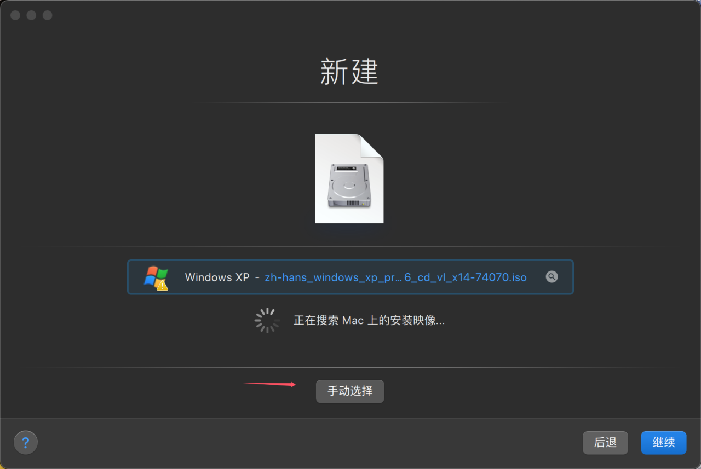
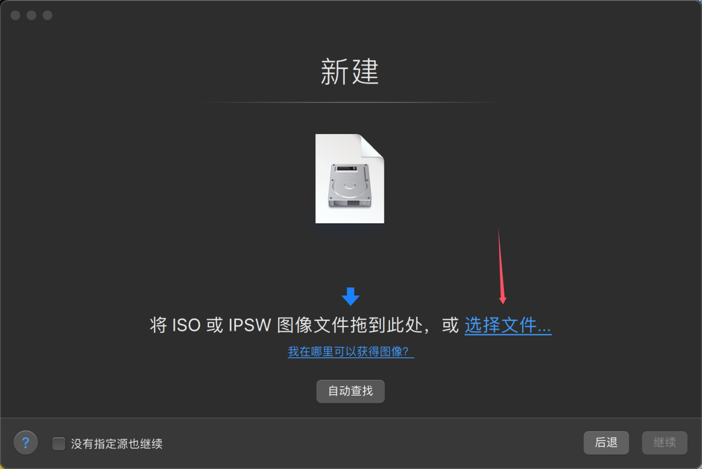
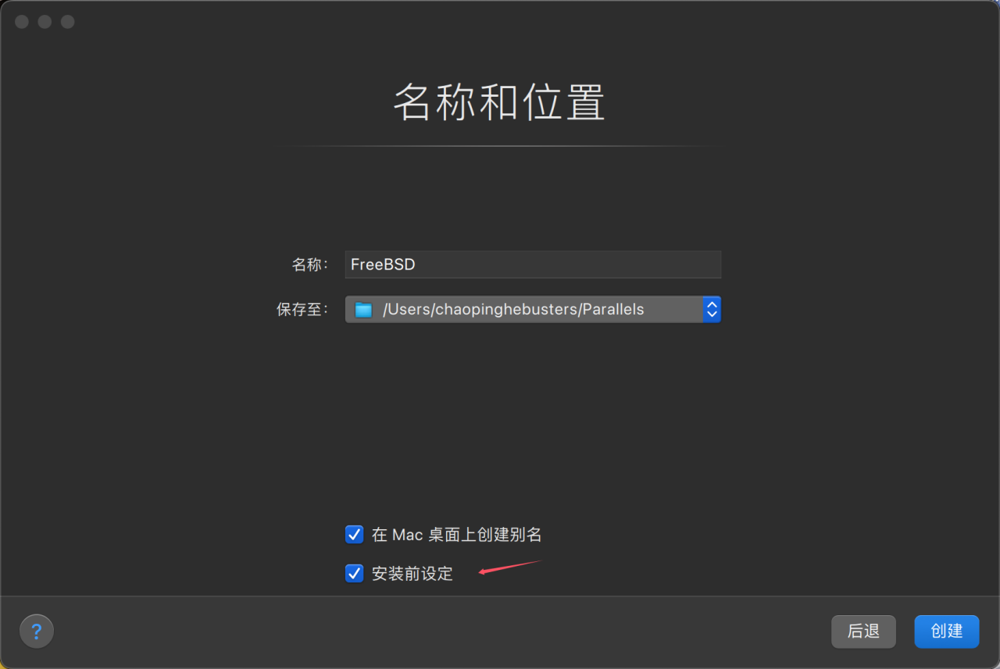
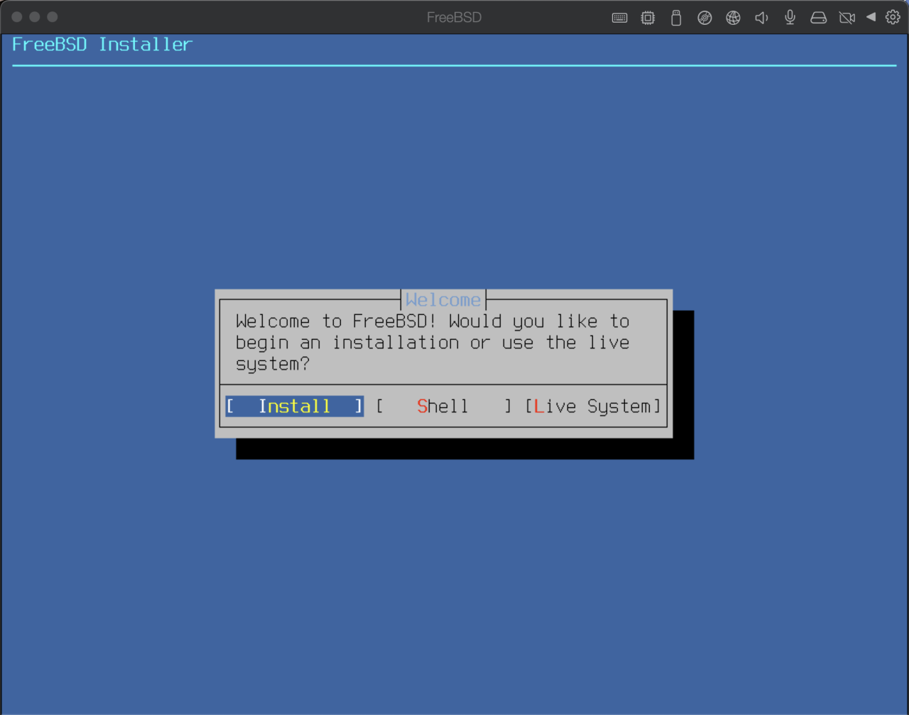

# 3.6 基于 Apple M1 & Parallels Desktop 20 安装 FreeBSD


本文基于 Apple M1（macOS 14.7）、Parallels Desktop 20.1.3-55743。

在 Parallels Desktop 20 中，FreeBSD 15.0 CURRENT 图形界面（不可自动缩放）、键盘、鼠标均正常。

>**注意**
>
>由于 [acpi_ged: Handle events directly](https://reviews.freebsd.org/D42158) 未被合并入 FreeBSD 14。故 14 无法安装，会在安装界面报错，参见 [Virtualizing FreeBSD 14 CURRENT on macOS M2 via Parallels 19](https://forums.freebsd.org/threads/virtualizing-freebsd-14-current-on-macos-m2-via-parallels-19.93266/)。所以只能安装 15 及以上。

## 安装


选择“通过映像文件安装 Windows、Linux 或 macOS”，然后继续。



点击“手动选择”，然后继续。



点击“选择文件……”。


选中 FreeBSD 镜像。

>**警告**
>
>本文基于 Apple M1，故你选择的 FreeBSD 架构应该是 aarch64！


会提示“无法检测操作系统”，不用管，点击“继续”即可。


操作系统选择“其他”即可。



>**技巧**
>
>Parallels Desktop 20 默认设置足矣，一般来说无需调整硬件配置，且是 UEFI。有需要的可以在这一步自行设置。



开始安装 FreeBSD。


开机进入 FreeBSD。


在手动安装桌面后，桌面正常。

## 解决鼠标不能移动之问题

- 解决 Parallels Desktop 中 FreeBSD 鼠标不能移动的问题，在 `/boot/loader.conf` 中加入：


```sh
ums_load="YES"
```


### 参考文献

[Issue(s) booting FreeBSD 12.2 aarch64 on Parallels Desktop on Apple Silicon](https://forums.freebsd.org/threads/issue-s-booting-freebsd-12-2-aarch64-on-parallels-desktop-on-apple-silicon.78654/)

## 虚拟机工具

安装：

```sh
# pkg install parallels-tools
```

如果提示找不到包：

```sh
# cd /usr/ports/emulators/parallels-tools/ 
# make install clean
```

>**注意**
>
>若使用 Ports 编译安装，需要有一份当前系统的源码位于 `usr/src`。

### 故障排除与未尽事宜

疑问：这个虚拟机工具看起来长期未更新，也并未起到什么肉眼可见的实质性作用？所以到底是干什么用的？

### 参考文献

- [parallels-tools Parallels Desktop Tools for FreeBSD](https://www.freshports.org/emulators/parallels-tools/)
