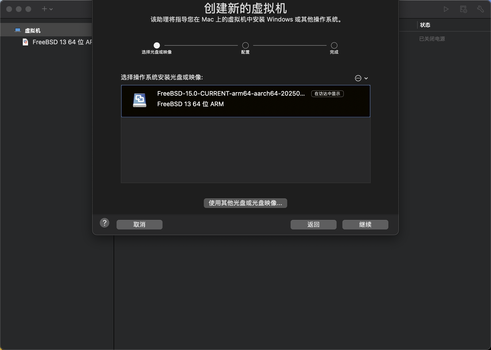
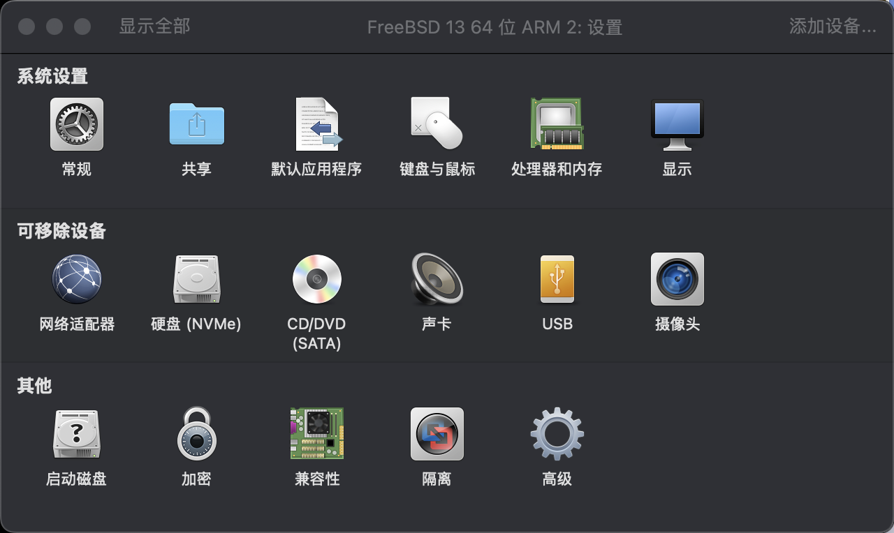
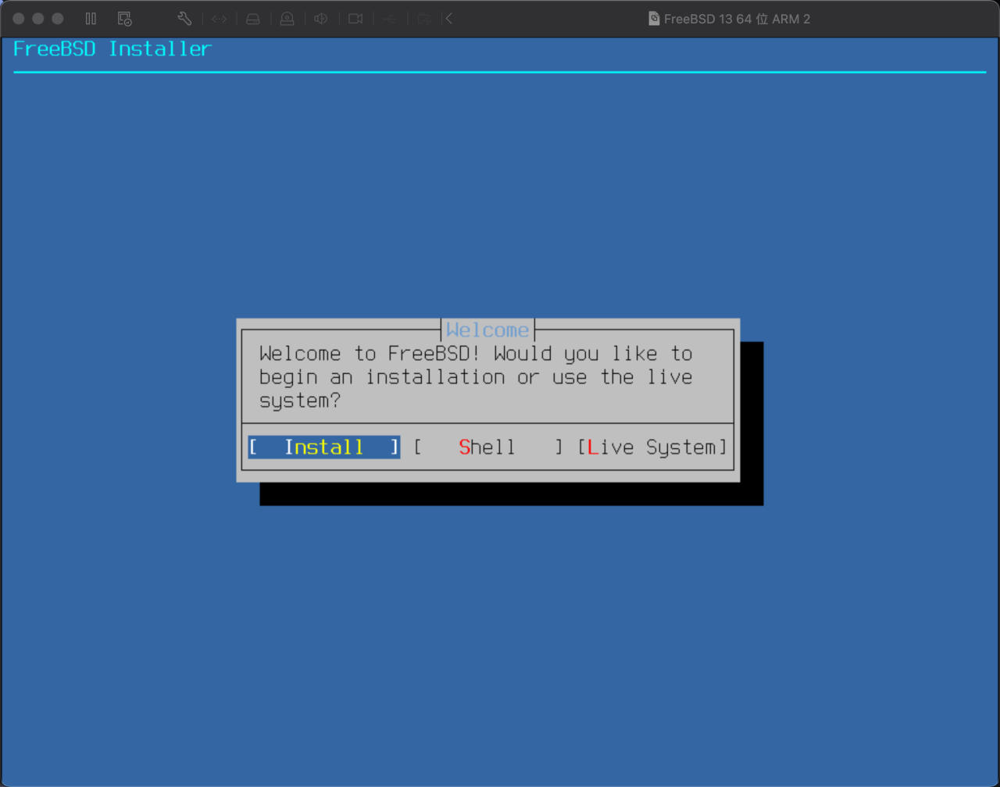
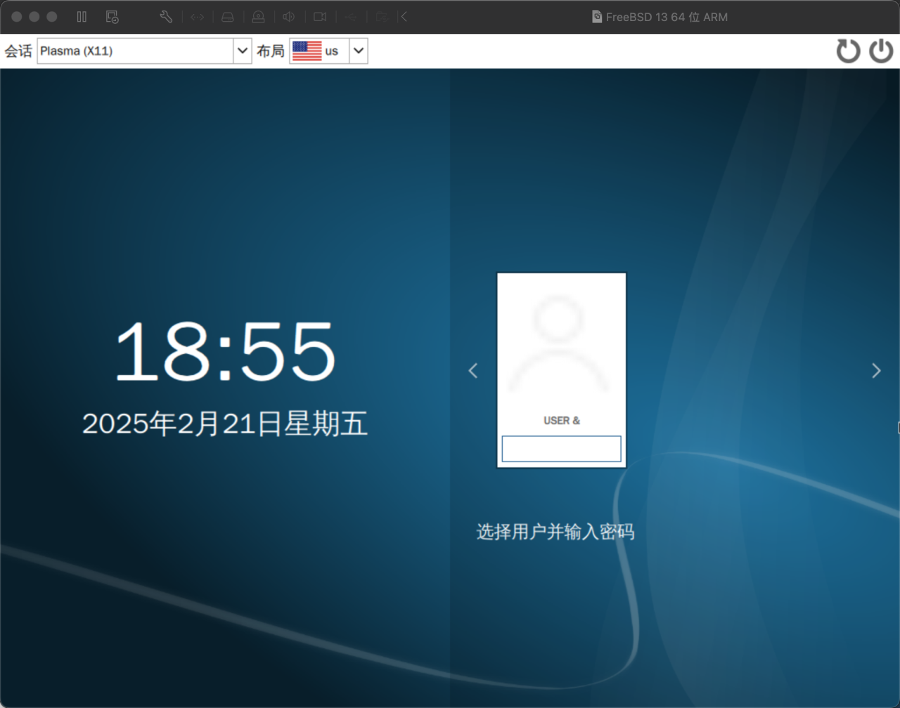
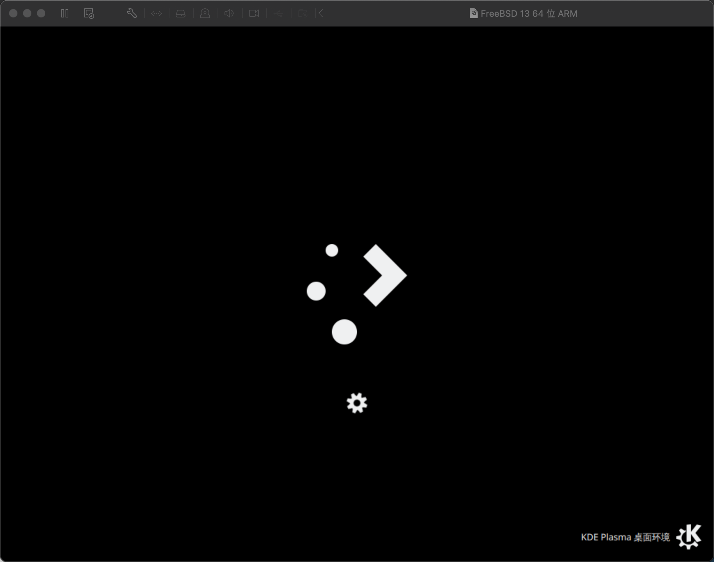
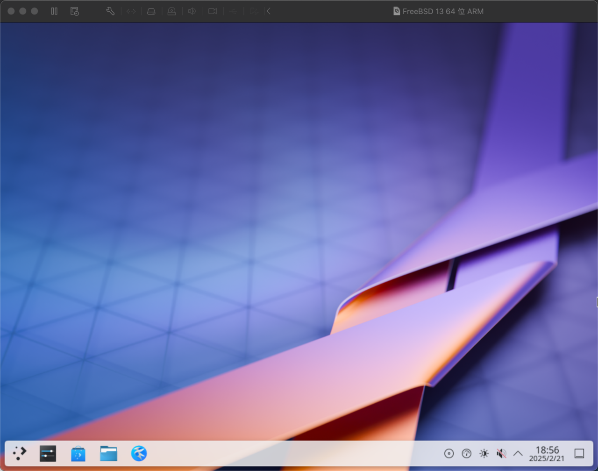

# 3.7 基于 Apple M1 & VMware Fusion Pro 安装 FreeBSD

本文基于 macOS 15.3.1、VMware Fusion Pro 13.6.2、FreeBSD 15.0，UEFI（默认）。经过测试 14.2-RELEASE 亦可。

>**注意**
>
>如果你使用 macOS 14，则可能存在键盘无法输入的故障。

## 下载 FreeBSD

由于苹果 M1 是 arm 架构，请下载带有 `aarch64` 字样的镜像。**不要** 下成 `amd64`。

## 配置虚拟机



选择下载的 FreeBSD 镜像。


默认的内存太小了，点击：“自定设置”



点击“处理器和内存”


修改处理器数量内存大小。`4096MB` 即 4G。

## 开始安装





## 配置桌面

无需安装任何虚拟机增强工具。







桌面不能抻拉。

## 故障排除与未竟事宜

### 解决鼠标不能移动的问题

编辑 `/boot/loader.conf`，加入：

```sh
hw.usb.usbhid.enable="1"
usbhid_load="YES"
```

即可。

#### 参考文献

- [Mouse does not work in VMWARE Fusion and Freebsd 14.2](https://forums.freebsd.org/threads/mouse-does-not-work-in-vmware-fusion-and-freebsd-14-2.96563/)
