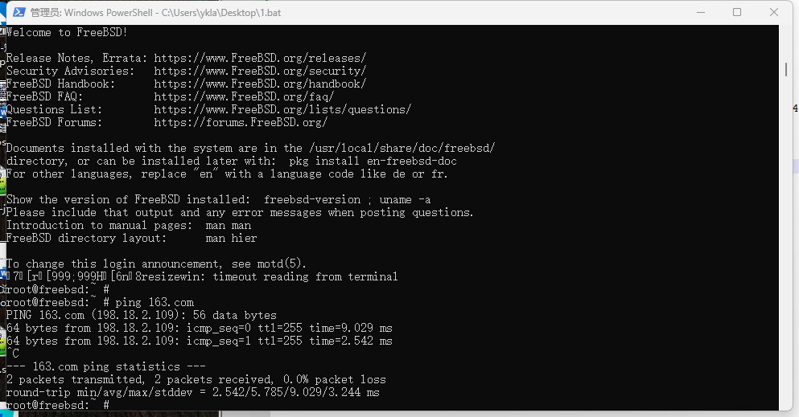

# 3.8 使用 QEMU 安装 RISC-V FreeBSD（基于 x86 Windows）

QEMU 是一款通过纯软件进行模拟的开源虚拟机监视器，支持多种处理器体系结构的模拟。

本文环境基于 Windows 11 24H2（宿主机，x86-64 架构）、FreeBSD 14.2-RELEASE（虚拟机，RISC-V 架构）以及 QEMU 20241220。

## QEMU

QEMU 下载地址：

[QEMU Binaries for Windows (64 bit)](https://qemu.weilnetz.de/w64/)，请下载列表中最新的安装程序。写作本文时，最新版本为 `qemu-w64-setup-20241220.exe`。大小为 174M。

下载后在 Windows 上安装 QEMU。

## RISC-V FreeBSD 磁盘镜像

RISC-V FreeBSD 磁盘镜像（以 FreeBSD 14.2 RELEASE 为例）：

<https://download.freebsd.org/releases/VM-IMAGES/14.2-RELEASE/riscv64/Latest/FreeBSD-14.2-RELEASE-riscv-riscv64-zfs.raw.xz>

下载后解压缩备用。

## OpenSBI

获取 OpenSBI（RISC-V Open Source Supervisor Binary Interface），其功能类似于启动固件。


### 安装 OpenSBI

使用 pkg 安装

```sh
# pkg install opensbi
```

或者使用 Ports 安装：

```sh
# cd /usr/ports/sysutils/opensbi/ 
# make install clean
```

### 提取 `fw_jump.elf`

```sh
# /etc/periodic/weekly/310.locate # 刷新 locate 数据库
# locate fw_jump.elf
/usr/local/share/opensbi/lp64/generic/firmware/fw_jump.elf
```

提取 `fw_jump.elf` 到 Windows 下备用。

## U-Boot

获取 U-Boot，功能上类似于 GRUB 2。


### 安装 U-Boot

使用 pkg 安装

```sh
# pkg install u-boot-qemu-riscv64
```

或者使用 Ports 安装：

```sh
# cd /usr/ports/sysutils/u-boot-qemu-riscv64/ 
# make install clean
```

### 提取 `u-boot.bin` 文件

```sh
# /etc/periodic/weekly/310.locate # 刷新数据库
# locate u-boot.bin
root@ykla:/home/ykla # locate u-boot.bin
/usr/local/share/u-boot/u-boot-qemu-riscv64/u-boot.bin
```

提取 `u-boot.bin` 到 Windows 下备用。

## 配置 Qemu

在桌面新建一个文本文件 `qemu.bat`，写入

```powershell
cd /d "C:\Program Files\qemu"
.\qemu-system-riscv64.exe ^
    -machine virt ^
    -smp 4 ^
    -cpu rv64 ^
    -m 4G ^
    -device virtio-blk-device,drive=hd ^
    -drive file="C:\Users\ykla\Desktop\FreeBSD-14.2-RELEASE-riscv-riscv64-zfs.raw",if=none,id=hd ^
    -device virtio-net-device,netdev=net ^
    -netdev user,id=net,hostfwd=tcp::8022-:22 ^
    -bios "C:\Users\ykla\Desktop\fw_jump.elf" ^
    -kernel "C:\Users\ykla\Desktop\u-boot.bin" ^
    -append "root=LABEL=rootfs" ^
    -nographic
```

参数说明：

- `^` 在 Windows 批处理脚本中用作续行符，可将一条长命令拆成多行书写。
- `smp` 为 CPU 数量
- `cpu` 指定 CPU 架构
- `m` 指定内存大小
- `hostfwd=tcp::8022-:22` 将宿主机的 8022 端口转发至虚拟机的 22 端口（SSH）

以上示例中，请将 `C:\Users\ykla\Desktop\` 替换为你自己的路径。

运行脚本即可。



输入用户名 `root` 并回车即可登录，默认没有密码。

由于在 PowerShell 和 CMD 中运行都会产生各种乱码（比如 `ee` 命令，或按 **TAB 键**）。

但该镜像默认未配置 SSH 服务与普通用户，因此无法直接通过 SSH 连接。

## 创建普通用户（如没有）

先创建一个普通用户（注意加入 wheel 组）：

```sh
# adduser 
Username: ykla
Full name:
Uid (Leave empty for default):
Login group [ykla]:
Login group is ykla. Invite ykla into other groups? []: wheel  # # 注意：请在此处输入 wheel，否则该用户将无法使用 `su` 命令提升权限
Login class [default]:
Shell (sh csh tcsh nologin) [sh]:
Home directory [/home/ykla]:
Home directory permissions (Leave empty for default):

Enable ZFS encryption? (yes/no) [no]: Use password-based authentication? [yes]:
Use an empty password? (yes/no) [no]:
Use a random password? (yes/no) [no]:
Enter password:
Enter password again:
Lock out the account after creation? [no]:
Username    : ykla
Password    : *****
Full Name   :
Uid         : 1001
ZFS dataset : zroot/home/ykla
Class       :
Groups      : ykla wheel
Home        : /home/ykla
Home Mode   :
Shell       : /bin/sh
Locked      : no
OK? (yes/no) [yes]:
adduser: INFO: Successfully created ZFS dataset (zroot/home/ykla).
adduser: INFO: Successfully added (ykla) to the user database.
Add another user? (yes/no) [no]:
Goodbye!
```

## 配置 sshd 服务

配置 sshd 服务如下：

```sh
# service sshd enable # 添加启动项
# service sshd start # 启动 sshd 服务
```

然后就可以在 Windows 上通过 ssh 连接了（IP 就是 `localhost`）：

```powershell
ssh ykla@localhost:8022
```

## 故障排除与未竟事宜

### 无法显示图形界面

待解决

## 参考文献

- [Create FreeBSD virtual machine using qemu. Run the VM using xhyve.](https://gist.github.com/zg/38a3afa112ddf7de4912aafc249ec82f)，有一些扩容方法
- [在 QEMU for Windows x64 上搭建 RISC-V 环境（Debian Linux）](https://naiv.fun/Ops/83.html)，有一些概念解释和整体框架
- [RISC-V Emulation Revisited](https://smist08.wordpress.com/2023/04/28/risc-v-emulation-revisited/)，各种参数来自此处。
