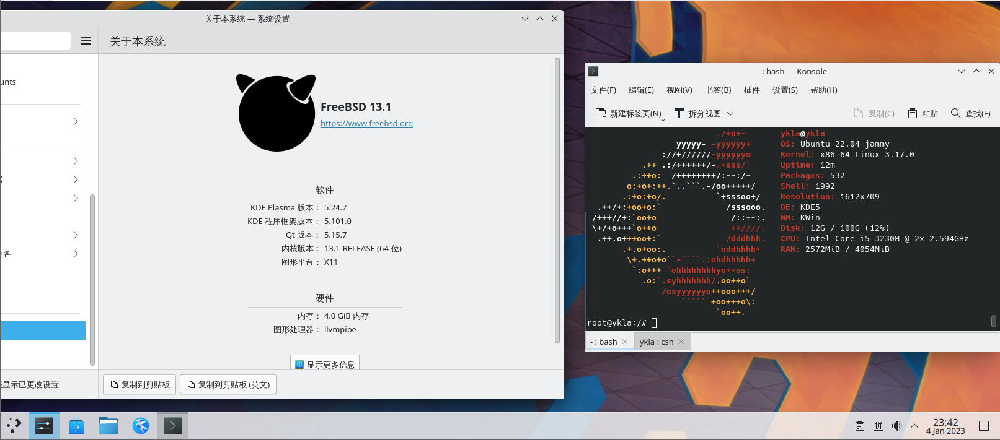

# 第 30.3 节 Linux 兼容层——基于 Ubuntu/Debian

> 视频教程：<https://www.bilibili.com/video/BV1iM4y1j7E9/>

## Ubuntu 兼容层

<figure><figcaption></figcaption></figure>

> **以下教程仅在 FreeBSD 13.1-release 测试通过。构建的是 Ubuntu 22.04 LTS（18.04\20.04 亦可）。兼容层使用技术实际上是 Linux jail，并非 chroot。**
>
> 类似的方法可以构建 Debian 兼容层。

**更多其他系统请看`/usr/local/share/debootstrap/scripts/`**

### 开始构建

```shell-session
# sysrc linux_enable="YES"
# sysrc kld_list+="linux linux64"
# kldload linux64
# service linux start
# sysrc dbus_enable="YES" #一般桌面已经配置
# service dbus start #一般桌面已经配置
```

```shell-session
# pkg install debootstrap
# debootstrap jammy /compat/ubuntu http://mirrors.ustc.edu.cn/ubuntu/
```

#### 挂载文件系统

将 `nullfs_load="YES"` 写入 `/boot/loader.conf`。

将以下行写入 `/etc/fstab`：

```shell-session
# Device        Mountpoint              FStype          Options                      Dump    Pass#
devfs           /compat/ubuntu/dev      devfs           rw,late                      0       0
tmpfs           /compat/ubuntu/dev/shm  tmpfs           rw,late,size=1g,mode=1777    0       0
fdescfs         /compat/ubuntu/dev/fd   fdescfs         rw,late,linrdlnk             0       0
linprocfs       /compat/ubuntu/proc     linprocfs       rw,late                      0       0
linsysfs        /compat/ubuntu/sys      linsysfs        rw,late                      0       0
/tmp            /compat/ubuntu/tmp      nullfs          rw,late                      0       0
/home           /compat/ubuntu/home     nullfs          rw,late                      0       0
```

检查挂载有无报错：

```shell-session
# mount -al
```

如果提示没有 home 文件夹，请新建之:

```shell-session
# mkdir /compat/ubuntu/home
```

重启：

```shell-session
# reboot
```

#### 进入 Ubuntu 兼容层

首先 chroot 进去 Ubuntu，移除会报错的软件：

```shell-session
# chroot /compat/ubuntu /bin/bash
# apt remove rsyslog # 此时已经位于 Ubuntu 兼容层了。
```

#### 换源

在卸载 rsyslog 之后，换源，由于 SSL 证书没有更新，所以还不能用 https 源：

```shell-session
# ee /compat/ubuntu/etc/apt/sources.list #此时处于 FreeBSD 系统！因为 Ubuntu 兼容层还没有文本编辑器。
```

写入：

```shell-session
deb http://mirrors.ustc.edu.cn/ubuntu/ jammy main restricted universe multiverse
deb-src http://mirrors.ustc.edu.cn/ubuntu/ jammy main restricted universe multiverse
deb http://mirrors.ustc.edu.cn/ubuntu/ jammy-security main restricted universe multiverse
deb-src http://mirrors.ustc.edu.cn/ubuntu/ jammy-security main restricted universe multiverse
deb http://mirrors.ustc.edu.cn/ubuntu/ jammy-updates main restricted universe multiverse
deb-src http://mirrors.ustc.edu.cn/ubuntu/ jammy-updates main restricted universe multiverse
deb http://mirrors.ustc.edu.cn/ubuntu/ jammy-backports main restricted universe multiverse
deb-src http://mirrors.ustc.edu.cn/ubuntu/ jammy-backports main restricted universe multiverse
```

进入 Ubuntu 兼容层，开始更新系统，安装常用软件：

```shell-session
# LANG=C #设定字符集，防止错误
# apt update && apt upgrade && apt install nano wget fonts-wqy-microhei  fonts-wqy-zenhei language-pack-zh-hans # 此时已经位于 Ubuntu 兼容层了。
```

### Shell 脚本

为方便读者，有如下脚本：

```shell-session
# fetch http://book.bsdcn.org/ubuntu.sh
# sh ubuntu.sh
```

脚本内容如下：

```shell-session
#/bin/sh

rootdir=/compat/ubuntu
baseurl="https://mirrors.ustc.edu.cn/ubuntu/"
codename=jammy

echo "begin to install ubuntu ..."
echo "check modules ..."

# check linux module
if [ "$(sysrc -n linux_enable)" = "NO" ]; then
        echo "linux module should be loaded. Continue?(N|y)"
        read answer
        case $answer in
                [Nn][Oo]|[Nn])
                        echo "linux module not loaded"
                        exit 1
                        ;;
                *)
                        sysrc linux_enable=YES
                        ;;
        esac
fi
echo "start linux"
service linux start

# check dbus
if ! /usr/bin/which -s dbus-daemon;then
        echo "dbus-daemon not found. install it [N|y]"
        read  answer
        case $answer in
            [Nn][Oo]|[Nn])
                echo "dbus not installed"
                exit 2
                ;;
            *)
                pkg install -y dbus
                ;;
        esac
    fi

if [ "$(sysrc -n dbus_enable)" != "YES" ]; then
        echo "dbus should be enable. Continue?(N|y)"
        read answer
        case $answer in
            [Nn][Oo]|[Nn])
                        echo "dbus not running"
                        exit 2
                        ;;
            *)
                        sysrc dbus_enable=YES
                        ;;
        esac
fi
echo "start dbus"
service dbus start

if ! /usr/bin/which -s debootstrap; then
        echo "debootstrap not found. install it? (N|y)"
        read  answer
        case $answer in
            [Nn][Oo]|[Nn])
                echo "debootstap not installed"
                exit 3
                ;;
            *)
                pkg install -y debootstrap
                ;;
        esac
    fi
echo "now we will bootstrap ${codename}.press any key."
read  answer

debootstrap ${codename} ${rootdir} ${baseurl}

if [ ! "$(sysrc -f /boot/loader.conf -qn nullfs_load)" = "YES" ]; then
        echo "nullfs_load should load. continue? (N|y)"
        read answer
        case $answer in
            [Nn][Oo]|[Nn])
                echo "nullfs not load"
				exit 4
                ;;
            *)
                sysrc -f /boot/loader.conf nullfs_load=yes
                ;;
        esac
    fi

if ! kldstat -n nullfs >/dev/null 2>&1;then
        echo "load nullfs module"
        kldload -v nullfs
fi

echo "mount some fs for linux"
echo "devfs ${rootdir}/dev devfs rw,late 0 0" >> /etc/fstab
echo "tmpfs ${rootdir}/dev/shm tmpfs rw,late,size=1g,mode=1777 0 0" >> /etc/fstab
echo "fdescfs ${rootdir}/dev/fd fdescfs rw,late,linrdlnk 0 0" >> /etc/fstab
echo "linprocfs ${rootdir}/proc linprocfs rw,late 0 0" >> /etc/fstab
echo "linsysfs ${rootdir}/sys linsysfs rw,late 0 0" >> /etc/fstab
echo "/tmp ${rootdir}/tmp nullfs rw,late 0 0" >> /etc/fstab
echo "/home ${rootdir}/home nullfs rw,late 0 0" >> /etc/fstab
mount -al

echo "add ustc apt sources"
echo "deb http://mirrors.ustc.edu.cn/ubuntu/ jammy main restricted universe multiverse" > /compat/ubuntu/etc/apt/sources.list
echo "deb-src http://mirrors.ustc.edu.cn/ubuntu/ jammy main restricted universe multiverse" >> /compat/ubuntu/etc/apt/sources.list
echo "deb http://mirrors.ustc.edu.cn/ubuntu/ jammy-security main restricted universe multiverse" >> /compat/ubuntu/etc/apt/sources.list
echo "deb-src http://mirrors.ustc.edu.cn/ubuntu/ jammy-security main restricted universe multiverse" >> /compat/ubuntu/etc/apt/sources.list
echo "deb http://mirrors.ustc.edu.cn/ubuntu/ jammy-updates main restricted universe multiverse" >> /compat/ubuntu/etc/apt/sources.list
echo "deb-src http://mirrors.ustc.edu.cn/ubuntu/ jammy-updates main restricted universe multiverse" >> /compat/ubuntu/etc/apt/sources.list
echo "deb http://mirrors.ustc.edu.cn/ubuntu/ jammy-backports main restricted universe multiverse" >> /compat/ubuntu/etc/apt/sources.list
echo "deb-src http://mirrors.ustc.edu.cn/ubuntu/ jammy-backports main restricted universe multiverse" >> /compat/ubuntu/etc/apt/sources.list

echo "remove rsyslog and install nano fonts-wqy-microhei  fonts-wqy-zenhei language-pack-zh-hans and wget"
chroot ${rootdir} /bin/bash -c "apt remove rsyslog && apt update && apt upgrade && apt install nano wget fonts-wqy-microhei  fonts-wqy-zenhei language-pack-zh-hans"
echo "Now you can run '#chroot /compat/ubuntu/ /bin/bash' Into Ubuntu"
```


## Debian 12（bookworm）仅限 FreeBSD 13.2 及以下版本


为方便读者，有如下脚本：

```shell-session
# fetch http://book.bsdcn.org/debian.sh
# sh debian.sh
```

脚本内容如下：

```shell-session
#/bin/sh

rootdir=/compat/debian
baseurl="https://mirrors.ustc.edu.cn/debian/"
codename=bookworm

echo "begin to install Debian 12 AKA bookworm ..."
echo "check modules ..."

# check linux module
if [ "$(sysrc -n linux_enable)" = "NO" ]; then
        echo "linux module should be loaded. Continue?(N|y)"
        read answer
        case $answer in
                [Nn][Oo]|[Nn])
                        echo "linux module not loaded"
                        exit 1
                        ;;
                *)
                        sysrc linux_enable=YES
                        ;;
        esac
fi
echo "start linux"
service linux start

# check dbus
if ! /usr/bin/which -s dbus-daemon;then
        echo "dbus-daemon not found. install it [N|y]"
        read  answer
        case $answer in
            [Nn][Oo]|[Nn])
                echo "dbus not installed"
                exit 2
                ;;
            *)
                pkg install -y dbus
                ;;
        esac
    fi

if [ "$(sysrc -n dbus_enable)" != "YES" ]; then
        echo "dbus should be enable. Continue?(N|y)"
        read answer
        case $answer in
            [Nn][Oo]|[Nn])
                        echo "dbus not running"
                        exit 2
                        ;;
            *)
                        sysrc dbus_enable=YES
                        ;;
        esac
fi
echo "start dbus"
service dbus start

if ! /usr/bin/which -s debootstrap; then
        echo "debootstrap not found. install it? (N|y)"
        read  answer
        case $answer in
            [Nn][Oo]|[Nn])
                echo "debootstap not installed"
                exit 3
                ;;
            *)
                pkg install -y debootstrap
                ;;
        esac
    fi
echo "now we will bootstrap ${codename}.press any key."
read  answer

debootstrap ${codename} ${rootdir} ${baseurl}

if [ ! "$(sysrc -f /boot/loader.conf -qn nullfs_load)" = "YES" ]; then
        echo "nullfs_load should load. continue? (N|y)"
        read answer
        case $answer in
            [Nn][Oo]|[Nn])
                echo "nullfs not load"
				exit 4
                ;;
            *)
                sysrc -f /boot/loader.conf nullfs_load=yes
                ;;
        esac
    fi

if ! kldstat -n nullfs >/dev/null 2>&1;then
        echo "load nullfs module"
        kldload -v nullfs
fi

echo "mount some fs for linux"
echo "devfs ${rootdir}/dev devfs rw,late 0 0" >> /etc/fstab
echo "tmpfs ${rootdir}/dev/shm tmpfs rw,late,size=1g,mode=1777 0 0" >> /etc/fstab
echo "fdescfs ${rootdir}/dev/fd fdescfs rw,late,linrdlnk 0 0" >> /etc/fstab
echo "linprocfs ${rootdir}/proc linprocfs rw,late 0 0" >> /etc/fstab
echo "linsysfs ${rootdir}/sys linsysfs rw,late 0 0" >> /etc/fstab
echo "/tmp ${rootdir}/tmp nullfs rw,late 0 0" >> /etc/fstab
echo "/home ${rootdir}/home nullfs rw,late 0 0" >> /etc/fstab
mount -al

echo "NOW I will should change 'compat.linux.osrelease'. continue? (Y|n)"
read answer
case $answer in
	[Nn][Oo]|[Nn])
		echo "close to success"
		exit 4
		;;
	[Yy][Ee][Ss]|[Yy]|"")
		echo "compat.linux.osrelease=6.2.10" >> /etc/sysctl.conf
		sysctl compat.linux.osrelease=6.2.10
                ;;
esac

echo "add ustc apt sources"
echo "deb http://mirrors.ustc.edu.cn/debian stable main contrib non-free non-free-firmware" > /compat/debian/etc/apt/sources.list
echo "# deb-src http://mirrors.ustc.edu.cn/debian stable main contrib non-free non-free-firmware" >> /compat/debian/etc/apt/sources.list
echo "deb http://mirrors.ustc.edu.cn/debian stable-updates main contrib non-free non-free-firmware" >> /compat/debian/etc/apt/sources.list
echo "# deb-src http://mirrors.ustc.edu.cn/debian stable-updates main contrib non-free non-free-firmware" >> /compat/debian/etc/apt/sources.list
echo "# deb http://mirrors.ustc.edu.cn/debian stable-proposed-updates main contrib non-free non-free-firmware" >> /compat/debian/etc/apt/sources.list
echo "# deb-src http://mirrors.ustc.edu.cn/debian stable-proposed-updates main contrib non-free non-free-firmware" >> /compat/debian/etc/apt/sources.list
echo "deb http://mirrors.ustc.edu.cn/debian-security/ stable-security main non-free contrib" >> /compat/debian/etc/apt/sources.list
echo "# deb-src http://mirrors.ustc.edu.cn/debian-security/ stable-security main non-free contrib" >> /compat/debian/etc/apt/sources.list
echo "Acquire::http::Pipeline-Depth \"0\";" > /compat/debian/etc/apt/apt.conf.d/99nopipelining
echo 'APT::Cache-Start "100000000";' | tee /compat/debian/etc/apt/apt.conf.d/70debcoebconf


echo "install nano fonts-wqy-microhei  fonts-wqy-zenhei and wget"
chroot ${rootdir} /bin/bash -c " apt update && apt --fix-broken install -y && apt upgrade && apt install nano wget fonts-wqy-microhei  fonts-wqy-zenhei -y"
echo "Now you can run '#chroot /compat/debian/ /bin/bash' Into debian"
```


## 安装 Windows 11 字体【可选。自制包，打包同时兼容与低版本 Ubuntu】

```shell-session
# apt install git
# git clone https://github.com/ykla/ttf-mswin11-zh-deb
# cd ttf-mswin11-zh-deb
# dpkg -i ttf-ms-win11-*.deb
```


## 运行 X11 软件

```shell-session
# xhost +local：#此时处于 FreeBSD 系统！
```

## 不知道程序的命令行启动命令是什么？

请按以下方法依次查找(以 `gedit` 为例)：

- 直接执行软件包名 `# gedit`；
- `whereis 软件包名`，定位后执行。`whereis gedit`；
- 通过软件图标定位，找到路径 `/usr/share/applications`,根据软件包名找到软件，用文本编辑器（如 `ee`、`nano`）打开。（软件图标本质上是一个文本文件，不是软连接或者图片），找到程序运行的命令复制到终端运行即可；
- 通过 `find` 命令全局查找 `# find / —name 软件包名`——`# find / —name gedit`。

> 如何查找软件？
>
> ```shell-session
> #apt search --names-only XXX
> ```
>
> 把 XXX 换成想要搜索的软件名即可。

## 缺失 .so 文件

- 首先看看缺失哪些 .so 文件，一般不会只缺失一个。

```shell-session
root@ykla:/# ldd /usr/bin/qq
	linux_vdso.so.1 (0x00007ffffffff000)
	libffmpeg.so => not found
	libdl.so.2 => /lib/x86_64-linux-gnu/libdl.so.2 (0x0000000801061000)
	libpthread.so.0 => /lib/x86_64-linux-gnu/libpthread.so.0 (0x0000000801066000)
…………………………以下省略……………………………………
```

可以看到 `libffmpeg.so => not found`，缺“libffmpeg.so”。

- 安装工具

```shell-session
# apt install apt-file
# apt-file update
```

- 查看 `libffmpeg.so` 属于哪个包：

```shell-session
root@ykla:/# apt-file search libffmpeg.so
qmmp: /usr/lib/qmmp/plugins/Input/libffmpeg.so
webcamoid-plugins: /usr/lib/x86_64-linux-gnu/avkys/submodules/MultiSink/libffmpeg.so
webcamoid-plugins: /usr/lib/x86_64-linux-gnu/avkys/submodules/MultiSrc/libffmpeg.so
webcamoid-plugins: /usr/lib/x86_64-linux-gnu/avkys/submodules/VideoCapture/libffmpeg.so
root@ykla:/#
```

可以看到多个包都提供了这个 so 文件，随便安装一个：

```shell-session
# apt install webcamoid-plugins
```

- 按照上述路径复制文件，并刷新 ldd 缓存：

```shell-session
# cp  /usr/lib/x86_64-linux-gnu/avkys/submodules/MultiSink/libffmpeg.so /usr/lib #复制到系统的 lib 中
# ldconfig
```

- 查看：

```shell-session
root@ykla:/# ldd /usr/bin/qq
	linux_vdso.so.1 (0x00007ffffffff000)
	libffmpeg.so => /lib/libffmpeg.so (0x0000000801063000)
…………………………以下省略……………………………………
```


> Systemd 不可用，但可以用`server xxx start`。
>
> 导入过 [https://github.com/zq1997/deepin-wine](https://github.com/zq1997/deepin-wine) 源以安装 deepin-qq，deepin-wechat 等软件，但都提示`段错误`。所有 Wine 程序都无法正常运行。如果你能解决这个问题，请提出 issue 或者 pull。

