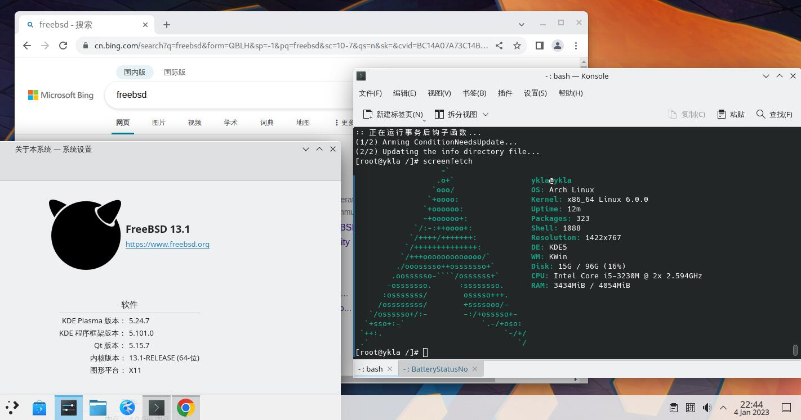

# 第30.4 Linux 兼容层——基于 ArchLinux

## ArchLinux 兼容层

<figure><figcaption></figcaption></figure>

>注:ArchLinux 兼容层看上去占用略大于 Ubuntu 兼容层是因为后方运行的谷歌 Chrome 浏览器。

> 以下部分参考 [从现有 Linux 发行版安装 Arch Linux](https://wiki.archlinuxcn.org/wiki/%E4%BB%8E%E7%8E%B0%E6%9C%89\_Linux\_%E5%8F%91%E8%A1%8C%E7%89%88%E5%AE%89%E8%A3%85\_Arch\_Linux)。
>
> **需要先配置好原生的 CentOS 兼容层。**

由于 Linux 兼容层默认内核是 3.17，太低了。直接构建的话，Arch 兼容层会在 chroot 的时候报错 `FATAL: kernel too old`。需要把 Linux 兼容层的内核版本改为 6.0.0（或其他较高版本）才可以：

```
# echo "compat.linux.osrelease=6.0.0" >> /etc/sysctl.conf
```

即可永久生效。

### 构建基本系统

```
# sysrc linux_enable="YES"
# sysrc kld_list+="linux linux64"
# kldload linux64
# service linux start
# sysrc dbus_enable="YES" #一般桌面已经配置
# service dbus start #一般桌面已经配置
```
```
# cd /home/ykla
# fetch http://mirrors.cqu.edu.cn/archlinux/iso/2023.01.01/archlinux-bootstrap-x86_64.tar.gz # 该链接为动态更新。
# tar xpvf archlinux-bootstrap-x86_64.tar.gz -C /compat --numeric-owner # 若有报错 exit 请无视之。-
# mv /compat/root.x86_64 /compat/arch # 重命名 /
```

### 挂载文件系统

将 `nullfs_load="YES"` 写入 `/boot/loader.conf`。

将以下行写入`/etc/fstab`：

```
# Device        Mountpoint            FStype          Options                      Dump    Pass#
devfs           /compat/arch/dev      devfs           rw,late                      0       0
tmpfs           /compat/arch/dev/shm  tmpfs           rw,late,size=1g,mode=1777    0       0
fdescfs         /compat/arch/dev/fd   fdescfs         rw,late,linrdlnk             0       0
linprocfs       /compat/arch/proc     linprocfs       rw,late                      0       0
linsysfs        /compat/arch/sys      linsysfs        rw,late                      0       0
/tmp            /compat/arch/tmp      nullfs          rw,late                      0       0
/home           /compat/arch/home     nullfs          rw,late                      0       0
```

检查挂载有无报错：

```
# mount -al
```

如果提示没有 home 文件夹，请新建之:

```
# mkdir /compat/arch/home
```

重启：

```
# reboot
```

### 基本配置

#### 初始化 pacman 密匙环

```
# cp /etc/resolv.conf /compat/arch/etc/ # 此时位于 FreeBSD！复制 DNS 解析。
# chroot /compat/arch /bin/bash # 此时已经是 Arch 兼容层了！
# pacman-key --init
# pacman-key --populate archlinux
```

#### 换源

由于新安装的 Arch 没有任何文本管理器，所以我们需要在 FreeBSD 中编辑相关文件：

```
# ee /compat/arch/etc/pacman.d/mirrorlist # 此时位于 FreeBSD！将下行添加至文件顶部。

Server = https://mirrors.tuna.tsinghua.edu.cn/archlinux/$repo/os/$arch
```

安装一些基本软件:

```
# pacman -S base base-devel nano yay wqy-zenhei
```

#### archlinuxcn 源配置

```
# nano /etc/pacman.conf # 将下两行添加至文件底部。

[archlinuxcn]
Server = https://mirrors.tuna.tsinghua.edu.cn/archlinuxcn/$arch
```
导入密钥：

```
# pacman -S archlinuxcn-keyring
```
**提示：若卡在 `Locally signing trusted keys in keyring` 超过五分钟，就 `ctrl`+`c` 中断了重来。**

由于 yay 及类似安装 aur 的软件均禁止直接 root，故需要在 chroot 中创建一个普通权限的用户（经测试 FreeBSD 中原有的普通用户不可用）：

```
# useradd -G wheel -m test
```

编辑 sudo 配置文件（若有红色警告请无视之）：

```
# nano /etc/sudoers

将 `%wheel ALL=(ALL) ALL` 前面的 `#` 删掉。
将 `%sudo ALL=(ALL:ALL) ALL` 前面的 `#` 删掉。
```

卸载 fakeroot 更改为 fakeroot-tcp，否则无法使用 aur：

> 该 Bug 见 <https://archlinuxarm.org/forum/viewtopic.php?t=14466>

```
# pacman -S fakeroot-tcp #会询问是否卸载 fakeroot，请确认并卸载。
```

#### 区域设置

> **提示：如果不设置则无法在 ArchLinux 的图形化程序中使用中文输入法。**

编辑 `/etc/locale.gen`，把 `zh_CN.UTF-8 UTF-8` 前面的注释 `#` 删掉。

重新生成区域文件：

```
# locale-gen
```
