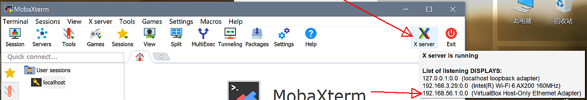
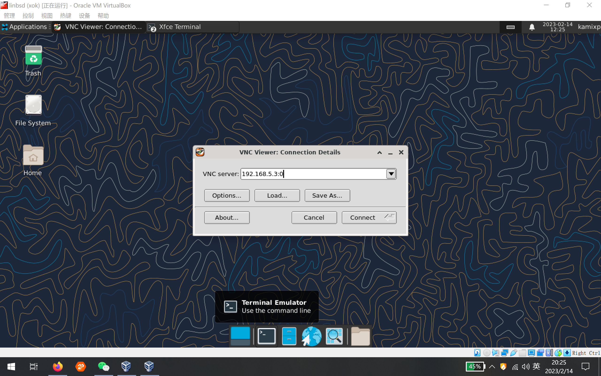
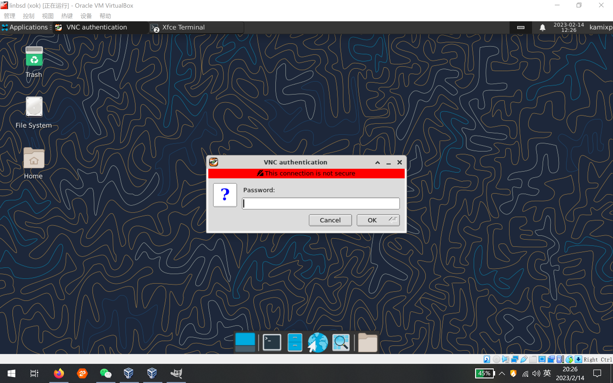
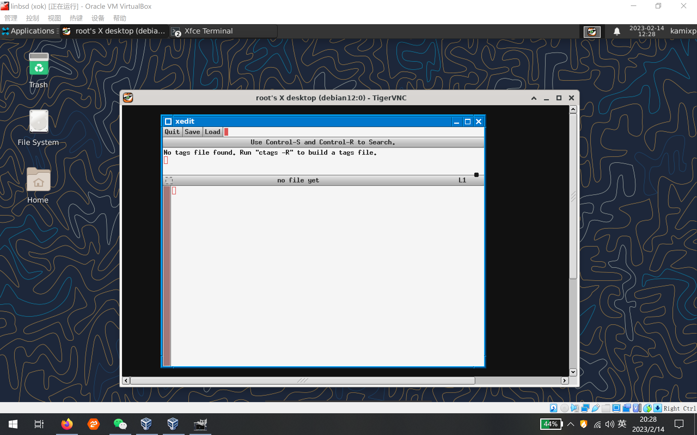

# 第 30.5 高级教程：Linux 兼容层与 Jail

## 概述

### 网络设定

文中会把所有 jail 绑定到虚拟接口 lo1 上，所有的 jail 相当于处于 FreeBSD 下的一个局域网，FreeBSD 主机相当于这个局域网的网关。所有 jail 的网络活动须经过 lo1 网络接口，所以要使用网络就要做网络转发，这里使用 pf 完成这个工作。 **这是网络访问的关键** 。

#### 准备网络接口

```
# sysrc cloned_interfaces+="lo1" # 增加一个克隆的网络接口 lo1
# service netif cloneup          # 启用克隆的网络接口
```

编辑 `/etc/pf.conf`

pf 防火墙的配置这里提供两种方式，请根据需要选取。

##### 方法一：

```
table <jails> persist
nat pass on em0 inet from <jails> to any -> em0
```

在防火墙中建立名为 jails 的表，并指定 persist 标志使防火墙总是保持这个表（即使没有相关的规则引用它）。表是 pf 防火墙的一种命名结构，可以保存地址和网络的集合。jails 表中的地址可以通过 NAT 访问网络。jails 表可以用 `pfctl` 进行增减以达到控制网络访问的目的。如 `pfctl -t jails -T add 192.168.5.1` 把`192.168.5.1` 加入 jails 表使其可以访问网络，`pfctl -t jails -T delete 192.168.5.1` 把 `192.168.5.1` 移出 jails 表使其不能访问网络。特点是手动管理麻烦，但灵活

##### 方法二:

```
nat pass on em0 inet from 192.168.5.1 to any -> em0
```

直接在 `/etc/pf.conf` 中写下规则，允许 192.168.5.1 访问网络，特点是规则固化在配置中，没有特别的需求的话这个挺方便的

#### 启用 pf 防火墙

**无论你想不想使用防火墙，不这样设置你在 Jail 中都没有网络**

```
# sysrc pf_enable=YES
# service pf start
```

### 加载必要的内核模块

```
# sysrc linux_enable=YES
# service linux start
```

这种方式自动完成 linux 兼容层各个模块的加载

### 准备目录

```
# mkdir /usr/jails  # 用于保存建立 jails 的相关文件
```

## 创建 debian jail

### 下载基本系统

这里以 Debian 12(bookworm) 为例：

构建 Ubuntu/Debian

```
# pkg install debootstrap #安装 debootstrap
# chmod 0700 /usr/local/sbin/debootstrap # 赋予权限。
# mkdir -p /usr/jails/debian
# debootstrap bookworm /usr/jails/debian https://mirrors.ustc.edu.cn/debian/ #此处使用了 USTC 镜像站
```

示例输出，如下：

```
I: Retrieving InRelease
I: Retrieving Packages
I: Validating Packages
I: Resolving dependencies of required packages...
I: Resolving dependencies of base packages...
I: Checking component main on https://mirrors.ustc.edu.cn/debian...
I: Retrieving adduser 3.130
I: Validating adduser 3.130
I: Retrieving apt 2.5.5
I: Validating apt 2.5.5
...
I: Extracting usr-is-merged...
I: Extracting util-linux...
I: Extracting util-linux-extra...
I: Extracting zlib1g...
root@freebsd:/root #
```

**注意** ：这里可能会提示有错误，无视即可。

### 创建 debian jail 实例

现在用 Debian 12 基本系统创建 jail 实例，命名为 debian。

#### 建立实例的基本配置

创建 `/etc/fstab.debian`,内容如下：

```
devfs      /usr/jails/debian/dev      devfs       rw                      0  0
tmpfs      /usr/jails/debian/dev/shm  tmpfs       rw,size=1g,mode=1777    0  0
fdescfs    /usr/jails/debian/dev/fd   fdescfs     rw,linrdlnk             0  0
linprocfs  /usr/jails/debian/proc     linprocfs   rw                      0  0
linsysfs   /usr/jails/debian/sys      linsysfs    rw                      0  0
/tmp       /usr/jails/debian/tmp      nullfs      rw                      0  0
```

在 `/etc/jail.conf` 中,加入以下内容（没有该文件就自己建一个）：

```
debian {                               # jail 名
  host.hostname = debian;              # jail 的主机名
  mount.fstab = /etc/fstab.debian;     # jail 使用的 fstab ，启动/关闭 jail 时，挂载/卸载对应的文件系统
  path = /usr/jails/debian;            # jail 使用的根目录
  devfs_ruleset = 4;                   # jail 挂载 devfs 的规则集的值，0 表示没有规则集，jail 会继承上级 jail 规则集，
                                       # 只在启用allow.mount，allow.mount.devfs 且 enforce_statfs 小于 2 时可以挂载 devfs
  enforce_statfs = 1;                  # 设置为 0 时，所有挂载点都是可用的，没有任何限制。
                                       # 设置为 1 时，只有 jail 根目录之下的挂载点是可见的。
                                       # 设置为 2(默认值)时，只能在 jail 目录所在的挂载点上操作，不能挂载 devfs、tmpfs 等。
  allow.mount;                         # 允许挂载文件系统
  allow.mount.devfs;                   # 允许挂载 devfs
  exec.start = '/bin/true';            # 见下
  exec.stop = '/bin/true';             # 见下
  persist;                             # 允许 jail 在没有任何进程的情况下存活
  allow.raw_sockets;                   # 允许 ping 等使用 raw socket,看需要写入
  interface = lo1;                     # 使用 lo1 作为网络接口
  ip4.addr = 192.168.5.1;              # 使用的 ipv4 地址
  ip6 = disable;                       # 禁用 ipv6
}
```

`exec.start` 指定启动 jail 时运行的命令，如果是 freebsd 做 jail 一般是 `exec.start = 'sh /etc/rc'` ,即使用 FreeBSD 的 rc 系统启动服务,但是 debian 中使用的是 systemd 作为 init 系统。jail 并不能使用 systemd ，所以不能使用相应的命令（ service 命令可用），所以在这里用 `/bin/true` 不做任何事安全的返回 true 就可以。问题就是（以 sshd 服务为例 ）在 debian jail 中启用 sshd 服务后（ `service ssh start` ）,如果重启 debian jail 那么 sshd 服务不会再次随 jail 启动而启动，这时可以写成 `exec.start = 'service ssh start'` ,这样启动 debian jail 时可以启动 sshd 服务，如果要启用更多的服务，则可以编写如下：

```
exec.start += 'service ssh start'
exec.start += 'service dbus start'
```

`exec.stop` 停止 jail 时运行的命令，如果是 freebsd 做 jail 一般是 `sh /etc/rc.shutdown jail`,这里同样因为 systemd 的原因用 `/bin/true` 安全的返回 true 就可以

#### 启用实例并允许网络访问

启动 jail

```
# jail -c debian
```

停止 jail

```
# jail -r debian
```

在 pf 防火墙中的 jails 表中加入 jail 的地址，以允许 jail 访问网络

```
# pfctl -t jails -T add 192.168.5.1
```

#### 更新系统

执行：

```
# jexec debian /bin/bash # 此时位于 FreeBSD！
Debian # apt remove rsyslog  # 此时位于 Debian Jail!
Debian # apt update # 此时位于 Debian Jail!
```

或者使用

```
# jexec -l debian /bin/bash -c 'apt remove rsyslog'
# jexec -l debian /bin/bash -c 'apt update'
```

至此，一个基于 Debian 12 的 linux jail 已经成功建立，同样的方法可以建立基于 debian 和 ubuntu 各版本的多个 jail.

### 开机启动 jail

开机时启动 jail

```
# sysrc jail_enable=YES
```

默认启动所有 jail，另外 `/etc/rc.conf` 中 可以用 `jail_list` 变量指定在开机时启动的 jail 的名字

编辑 `/etc/rc.conf` 写入：

```
jail_list = "debian"
```

或执行 `sysrc jail_list+=debian`

如果 `jail_list` 变量为空,则启动所有在 `/etc/jail.conf` 中配置的 jail

## 创建 Ubuntu jail

ubuntu jail 建立方法同上,以 Ubuntu 22.04(jammy) 为例，

### 构建基本系统并配置

```
# mkdir -p /usr/jails/ubuntu
# debootstrap jammy /usr/jails/ubuntu https://mirrors.ustc.edu.cn/ubuntu/
```

创建 `/etc/fstab.ubuntu`,内容如下：

```
devfs      /usr/jails/ubuntu/dev      devfs       rw                      0  0
tmpfs      /usr/jails/ubuntu/dev/shm  tmpfs       rw,size=1g,mode=1777    0  0
fdescfs    /usr/jails/ubuntu/dev/fd   fdescfs     rw,linrdlnk             0  0
linprocfs  /usr/jails/ubuntu/proc     linprocfs   rw                      0  0
linsysfs   /usr/jails/ubuntu/sys      linsysfs    rw                      0  0
/tmp       /usr/jails/ubuntu/tmp      nullfs      rw                      0  0
```

在 `/etc/jail.conf` 中写入 ubuntu 的配置，如下：

```
ubuntu {
  host.hostname = ubuntu;
  mount.fstab = /etc/fstab.ubuntu;
  path = /usr/jails/ubuntu;
  devfs_ruleset = 4;
  enforce_statfs = 1;
  allow.mount;
  allow.mount.devfs;
  exec.start = '/bin/true';
  exec.stop = '/bin/true';
  persist;
  allow.raw_sockets;
  interface = lo1;
  ip4.addr = 192.168.5.2;
  ip6 = disable;
}
```

### 启用实例并允许网络访问

```
# jail -c ubuntu # 启用实例
```

如果已经在 `/etc/rc.conf` 中设置 `jail_enable=YES`,也可以用

```
# service jail start ubuntu
```

开机启动可以参考 debian jail ，执行 `sysrc jail_list+=ubuntu`

在 pf 防火墙中的 jails 表中加入 jail 的地址，以允许 jail 访问网络

```
# pfctl -t jails -T add 192.168.5.2 # 允许网络访问
```

### 更新系统

```
# jexec ubuntu /bin/bash # 此时位于 FreeBSD！
Ubuntu # apt remove rsyslog  # 此时位于 Ubuntu Jail!
Ubuntu # apt update # 此时位于 Ubuntu Jail!
```

或者使用

```
# jexec -l debian /bin/bash -c 'apt remove rsyslog'
# jexec -l debian /bin/bash -c 'apt update'
```

过程和 debian jail 一样。

## 创建 AntiX linux jail

AntiX 基于 debian，并且不使用 systemd。

### 下载镜像文件并解压

先安装 `squashfs-tools` 以解压 linux 文件系统镜像。

```
# pkg install squashfs-tools
```

AntiX linux 提供四个镜像版本，full、base、core、net ，这里下载 core 版本：

```
# fetch https://mirrors.tuna.tsinghua.edu.cn/mxlinux-isos/ANTIX/Final/antiX-22/antiX-22_x64-core.iso
# mdconfig antiX-22_x64-core.iso
# mount -t cd9660 /dev/md0 /mnt
# mkdir -p /usr/jails/antix
# unsquashfs -d /usr/jails/antix /mnt/antiX/linuxfs
# touch /usr/jails/antix/dev/fd
# touch /usr/jails/antix/dev/shm
```

### 配置 Antix jail

创建 `/etc/fstab.antix`,内容如下：

```
devfs      /usr/jails/antix/dev      devfs       rw                      0  0
tmpfs      /usr/jails/antix/dev/shm  tmpfs       rw,size=1g,mode=1777    0  0
fdescfs    /usr/jails/antix/dev/fd   fdescfs     rw,linrdlnk             0  0
linprocfs  /usr/jails/antix/proc     linprocfs   rw                      0  0
linsysfs   /usr/jails/antix/sys      linsysfs    rw                      0  0
/tmp       /usr/jails/antix/tmp      nullfs      rw                      0  0
```

在 `/etc/jail.conf` 中写入(这里只展示 antix 相关部分)

```
antix {
  host.hostname = antix;
  mount.fstab = /etc/fstab.antix;
  path = /usr/jails/antix;
  devfs_ruleset = 4;
  enforce_statfs = 1;
  allow.mount;
  allow.mount.devfs;
  exec.start = '/etc/init.d/rc 3';
  exec.stop = '/etc/init.d/rc 0';
  persist;
  allow.raw_sockets;
  interface = lo1;
  ip4.addr = 192.168.5.3;
  ip6 = disable;
}
```

**注意**：这里 `exec.start` 设为 `/etc/init.d/rc 3`。在 debian jail 部分已经提到，debian 使用 systemd 做初始化系统，这在 jail 中不能使用，所以用 `/bin/true` 启动，以保证什么都不做，只是安全返回 true 值。antiX 不使用 systemd 做初始化系统，可以用 rc 进行初始化。在这里 `/etc/init.d/rc 3` 指定 antix jail 在启动时使用 rc 以第 3 运行级别初始化 jail。也就是在 debian jail 中提到的服务运行问题在这里并不存在（即可以直接在 jail 启动时运行服务，比如 sshd ）。

### 更新系统

设置开机启动，并启动

```
# sysrc jail_list+=antix
# jail -c antix   # 或者使用 service jail start antix 前面已经提到
```

在 pf 中允许网络访问，方法同上。

```
# pfctl -t jails -T add 192.168.5.3
```

现在进入 jail ：

```
# jexec antix /bin/bash     # 宿主机（FreeBSD）中
root@antix:/# echo "nameserver 223.5.5.5" > /etc/resolv.conf    # jail 中，注意提示符变化，先设置地址解析，这里使用阿里 dns
root@antix:/# echo "APT::Cache-Start 90000000;" >> /etc/apt/apt.conf   # `APT::Cache-Start` 是 apt 使用缓存的大小，默认 20m 太小，按提示增大
root@antix:/# apt update         # 可以先修改 `/etc/apt/sources.list.d/` 中的文件以使用镜像站，请参考各镜像站中 debian 的镜像站设置
root@antix:/# apt upgrade
root@antix:/# mandb       # apt upgrade 的时候显示 mandb 有几个权限错误，多执行几遍  `mandb` 命令就是。
```

## 创建 Alpine jail

```
# fetch http://mirrors.ustc.edu.cn/alpine/v3.17/releases/x86_64/alpine-minirootfs-3.17.1-x86_64.tar.gz
# mkdir -p /usr/jails/alpine
# tar zxf alpine-minirootfs-3.17.1-x86_64.tar.gz -C /usr/jails/alpine/
# touch /usr/jails/alpine/dev/shm
# touch /usr/jails/alpine/dev/fd
```

创建 `/etc/fstab.alpine`,内容如下：

```
devfs      /usr/jails/alpine/dev      devfs       rw                      0  0
tmpfs      /usr/jails/alpine/dev/shm  tmpfs       rw,size=1g,mode=1777    0  0
fdescfs    /usr/jails/alpine/dev/fd   fdescfs     rw,linrdlnk             0  0
linprocfs  /usr/jails/alpine/proc     linprocfs   rw                      0  0
linsysfs   /usr/jails/alpine/sys      linsysfs    rw                      0  0
#/tmp       /usr/jails/alpine/tmp      nullfs      rw                      0  0
```

在 `/etc/jail.conf` 中写入,

```
alpine {
  host.hostname = alpine;
  mount.fstab = /etc/fstab.alpine;
  path = /usr/jails/alpine;
  devfs_ruleset = 4;
  enforce_statfs = 1;
  allow.mount;
  allow.mount.devfs;
  exec.start = '/bin/true';  # minirootfs 里还没有初始化系统，所以还是用 '/bin/true'，下面会设置 openrc
  exec.stop = '/bin/true';
  persist;
  allow.raw_sockets;
  interface = lo1;
  ip4.addr = 192.168.5.4;
  ip6 = disable;
}
```

设置开机启动，并启动

```
# sysrc jail_list+=alpine
# jail -c alpine
```

在 pf 中允许网络访问，方法同上。

```
# pfctl -t jails -T add 192.168.5.4
```

现在进入 jail ：

```
freebsd # jexec alpine /bin/sh        # 初始只有 sh ,注意 shell 提示符变化
alpine # sed  -i 's/dl-cdn.alpinelinux.org/mirrors.ustc.edu.cn/' /etc/apk/repositories    # 修改镜像地址
alpine # echo 'nameserver 223.5.5.5' >> /etc/resolv.conf      #  初始没有这个文件，自建一个
alpine # apk update             # alpine 可以不使用 openrc 而使用程序，但是不能启动各种服务，只有在安装 openrc 后才能启动各项服务，所以最好安装 openrc 以获得更好的体验
alpine # apk add openrc         # 安装 openrc 作为初始化系统
alpine # mkdir /run/openrc
alpine # touch /run/openrc/softlevel      # openrc 提示在 docker/chroot/jail 环境中应该建立这个文件
alpine # exit    #注意 shell 提示符变化
freebsd # jail -r alpine    # 先关闭 alpine ，以使在 freebsd 宿主机中进行 openrc 配置
```

修改 `/etc/jail.conf` 中 alpine 的配置：

```
alpine {
  host.hostname = alpine;
  mount.fstab = /etc/fstab.alpine;
  path = /usr/jails/alpine;
  devfs_ruleset = 4;
  enforce_statfs = 1;
  allow.mount;
  allow.mount.devfs;
  exec.start = '/sbin/openrc default';  # 此处修改，使用 openrc 作初始化系统，以 default 运行级初始化系统
  exec.stop = '/sbin/openrc shutdown';  # 此处修改，使用 openrc 作初始化系统，以 shutdown 运行级运行关闭任务
  persist;
  allow.raw_sockets;
  interface = lo1;
  ip4.addr = 192.168.5.4;
  ip6 = disable;
}
```

重新启动 alpine

```
# jail -c alpine
```

## jail 中的 GUI

教程环境：Windows 10 物理机，在 virtualbox 安装了 FreeBSD 13.1 虚拟机。

FreeBSD 虚拟机中已部署 4 个 jail，如下,这里有一个 freebsd jail，为和 virtualbox 中的 FreeBSD 虚拟机作区分，将称其为 freebsd-jail

```
root@freebsd:~ # jls
   JID  IP Address      Hostname                      Path
     1  192.168.5.3     debian                      /usr/jails/debian
     2  192.168.5.4     ubuntu                    /usr/jails/ubuntu
     3  192.168.5.2     alpine                        /usr/jails/alpine
     4  192.168.5.1     freebsd-jail                  /usr/jails/freebsd-jail
root@freebsd:~ #
```

4 个 jail 各自安装 xclock,firefox，chrome,jwm 这些软件在 freebsd-jail, debian ,ubuntu ,alpine( alpine 使用 vnc 方法不成功，其它方法 xclock，xterm 可运行，firefox 和 chrome 未成功)都有成功，jwm 用于美化。注意不用安装 xorg。

其中 ubuntu 22.04 中 firefox、chrome 要求用 snap 安装，snap 需要 systemd,不能使用，所以使用 deb 包安装。方法如下：

```
# wget https://dl.google.com/linux/direct/google-chrome-stable_current_amd64.deb
# dpkg -i google-chrome-stable_current_amd64.deb
# apt install ./google-chrome-stable_current_amd64.deb
```

### 带 X Server 的终端

这里使用 MobaXterm

MobaXterm 默认配置，不做多余配置。



确保 X server 已经启用，记下 DISPLAY 值 ，格式是 hostname:displaynumber.screennumber 这里是 `192.168.56.1:0.0`

登录 jail （不限方式，可以是 ssh ，可以是 jexec 进入，不限用户，可以是普通用户，不一定是 root、wheel 组成员）

```
$ export DISPLAY=192.168.56.1:0.0  # jail 中 ，这里是 sh/zsh/bash,csh/tcsh 可以是 setenv DISPLAY 192.168.56.1:0.0,以下不再说明
$ xclock&
```


4 个 xclock 可以独立显示在 win 10 桌面上，效果比较理想

### 内嵌 X Server

X Server 里的 X Server,这里使用 Xnest/Xephyr,Xnest/Xephyr 对 X11 应用来说是 X Server，对宿主 X Server 来说是 X Client。

宿主机里安装 Xnest 或 Xephyr 两者择其一即可

```
# pkg install Xnest
# pkg install Xephyr
```

FreeBSD 中启用

```
$ Xephyr :1 -listen tcp  # 不需要 root 权限
```

- `:1` 即上面提到了 DISPLAY 值中的 displaynumber ，FreeBSD 系统 ip 为 10.0.2.15，所以完整的 DISPLAY 值为 10.0.2.15:1.0。因为 FreeBSD 系统 X Server 的 displaynumber 值为 0，所以从 1 开始

- `-listen tcp` 侦听 tcp 端口

在 4 个 jail 中，用上面相同的方法

```
$ export DISPLAY=10.0.2.15:1.0
$ xclock&
```

四个 jail 可以同时在 FreeBSD 开启的一个 Xnest/Xephyr 窗口中打开 xclock。但是此时的 xclock 因为没有窗口管理器，界面丑，且连最基本的拖动都做不到。可以在执行 xclock 前先执行 jwm，如下 。

```
$ export DISPLAY=10.0.2.15:1.0
$ jwm &
$ xclock&
```

这里注意 `jwm &` 执行一次够了，不需要每个 jail 都去执行一次。这里用 jwm 只是看重其轻量，xfce 等也是可以的，可以自行尝试，考虑性能重量级的我觉得没必要

### 共享主机 socket 方式

先在 FreeBSD 系统上执行

```
$ xhost +
```

关闭访问控制

然后在 jail 的 `fstab` 中加入下面内容,这里以 ubuntu jail 的 `fstab` 为例 ,其它 jail 参照修改就行

```
/tmp/.X11-unix   /usr/jails/ubuntu/tmp/.X11-unix    nullfs   ro   0  0
```

必要时先 `mkdir -p /usr/jails/ubuntu/tmp/.X11-unix`,确保有挂载点

重启 jail 后，在 jail 中执行

```
$ export DISPLAY=:0.0
$ xclock &
```

注意，上文提到 `fstab` 文件中有下面这样一行

```
#/tmp   /usr/jails/ubuntu/tmp   nullfs  rw    0  0
```

虽然很多教程中有这样写，但我认为是不安全的，所以注释掉不用。如果按这样写，那么 FreeBSD 的 `/tmp` 目录都将暴露在 jail 中，且因为是可读写的，在 jail 中就可以对 FreeBSD 的 `/tmp` 目录进行写入，这样破坏了 jail 与 FreeBSD 的隔离性，是不安全的。而只读挂载 `/tmp/.X11-unix` ，则大大提高安全性。

### X Server tcp 侦听加 xhost 连接管理

这里我使用的是 sddm 桌面管理器，使用其它桌面管理器的，请参考相应桌面管理器的文档进行，原理一样

FreeBSD 内新建 `/usr/local/etc/sddm.conf` （如果没有的话），修改 ServerArguments 内容如下：

```
[X11]
ServerArguments=-listen tcp
```

重启后，FreeBSD 上用下面方式加入 jail ip 以允许访问(不需要 root 权限）

```
$ xhost + 192.168.5.1  # 这里不建议用上面的提到 `xhost +` 方式关闭访问控制,以避免意料外的连接
```

然后在 jail 中，执行

```
$ export DISPLAY=:0.0
$ xclock &
```

这里把 DISPLAY 设为 `:0.0`,`127.0.0.1:0.0`,`10.0.2.15:0.0` 都成功了，上面几种方法也可以仔细尝试

### vnc

在 jail 中安装 vnc server ，可以用 tightvnc-server ，也可以用 tigervnc-server，这里以 debian jail 为例，在 jail 中执行

```
# apt install tightvncserver
$ vncpasswd           # 这里不要求 root 用户
Password:
Verify:
Would you like to enter a view-only password (y/n)? n
A view-only password is not used
$ vncserver :0        # 同样不要求 root 用户，vncserver 的端口号为5900加上冒号后的数字，现在为5900，`:1` 端口号5901，以此类推。
```

使用 vnc 客户端登录







### 一些说明

宿主机 X Server tcp 侦听加 xhost 连接管理的方式是安全性最差的一种，是 tcp 侦听默认关闭原因之一。共享宿主机 socket 的方式注意上面提到的两点安全性还是有保障的。前 4 种方法算是“回字的 4 种写法”，都算是 X Server 连接的变体。 带 X Server 的终端和共享 socket 的方式之外，其它三种方式最好在 jail 内再搭配个桌面。带 X Server 的终端、共享主机 socket 、vnc 这三种方式比较推荐。无论哪个方式，linux jail 中不要要求每个 X 应用都能运行，那真的很难做到，毕竟兼容层不是百分百兼容，freebsd jail 的话就好很多。除去共享宿主机 socket 的方法，其它方法都是可以应用的非 jail 环境的。

## Gentoo Linux 兼容层（portage 尚不可用）【测试使用】

### 构建基本系统

```
# sysrc linux_enable="YES"
# sysrc kld_list+="linux linux64"
# kldload linux64
# service linux start
# sysrc dbus_enable="YES" #一般桌面已经配置
# service dbus start #一般桌面已经配置
```

```
# wget https://mirrors.ustc.edu.cn/gentoo/releases/amd64/autobuilds/20230101T164658Z/stage3-amd64-systemd-20230101T164658Z.tar.xz #该链接不固定！自己找。
# mkdir -p /compat/gentoo
# tar xpvf stage3-amd64-systemd-20230101T164658Z.tar.xz -C /compat/gentoo --numeric-owner
```

编辑 `ee /etc/fstab`，加入：

```
# Device        Mountpoint              FStype          Options                      Dump    Pass#
devfs           /compat/gentoo/dev      devfs           rw,late                      0       0
tmpfs           /compat/gentoo/dev/shm  tmpfs           rw,late,size=1g,mode=1777    0       0
fdescfs         /compat/gentoo/dev/fd   fdescfs         rw,late,linrdlnk             0       0
linprocfs       /compat/gentoo/proc     linprocfs       rw,late                      0       0
linsysfs        /compat/gentoo/sys      linsysfs        rw,late                      0       0
/tmp            /compat/gentoo/tmp      nullfs          rw,late                      0       0
/home           /compat/gentoo/home     nullfs          rw,late                      0       0
```

```
# mount -al # 检查有无编写错误
```

编辑：

`ee /compat/gentoo/etc/portage/make.conf`

加入：

```
MAKEOPTS="-j2"
GENTOO_MIRRORS="https://mirrors.ustc.edu.cn/gentoo"
FEATURES="-ipc-sandbox -mount-sandbox -network-sandbox -pid-sandbox -xattr -sandbox -usersandbox"
```

进行常见配置：

```
# mkdir -p /compat/gentoo/etc/portage/repos.conf # 此时位于 FreeBSD！
# cp /compat/gentoo/usr/share/portage/config/repos.conf /compat/gentoo/etc/portage/repos.conf/gentoo.conf # 此时位于 FreeBSD！
# cp /etc/resolv.conf /compat/gentoo/etc/ # 此时位于 FreeBSD！复制 DNS 解析。
```

### 换源

```
# ee /compat/gentoo/etc/portage/repos.conf/gentoo.conf # 此处位于 FreeBSD！
```

把`sync-uri = rsync://rsync.gentoo.org/gentoo-portage` 修改为 `sync-uri = rsync://mirrors.tuna.tsinghua.edu.cn/gentoo-portage`

```
# chroot /compat/gentoo /bin/bash # 此处位于 Gentoo!
```

获取 Gentoo ebuild 数据库快照

```
# emerge-webrsync # 会产生 `Cannot change mode to rwxr-xr-x: Bad file descriptor` 权限错误。此处位于 Gentoo!
# chmod -R 755 /var/db/repos/gentoo #修正权限。此处位于 Gentoo!
# chown -R portage:portage /var/db/repos/gentoo # 无效，似乎 这个文件系统有问题。
# chown -R portage:portage /var/tmp/portage # 无效，似乎 这个文件系统有问题。
```

测试安装 screenfetch：

```
ykla / # emerge --ask screenfetch
setlocale: unsupported locale setting
setlocale: unsupported locale setting

 * IMPORTANT: 10 news items need reading for repository 'gentoo'.
 * Use eselect news read to view new items.


These are the packages that would be merged, in order:

Calculating dependencies... done!
[ebuild  N     ] app-misc/screenfetch-3.9.1  USE="-X -curl"

Would you like to merge these packages? [Yes/No] y

>>> Verifying ebuild manifests

>>> Emerging (1 of 1) app-misc/screenfetch-3.9.1::gentoo
 * screenfetch-3.9.1.tar.gz BLAKE2B SHA512 size ;-) ...                                                      [ ok ]
>>> Unpacking source...
>>> Unpacking screenfetch-3.9.1.tar.gz to /var/tmp/portage/app-misc/screenfetch-3.9.1/work
>>> Source unpacked in /var/tmp/portage/app-misc/screenfetch-3.9.1/work
>>> Preparing source in /var/tmp/portage/app-misc/screenfetch-3.9.1/work/screenFetch-3.9.1 ...
>>> Source prepared.
>>> Configuring source in /var/tmp/portage/app-misc/screenfetch-3.9.1/work/screenFetch-3.9.1 ...
>>> Source configured.
>>> Compiling source in /var/tmp/portage/app-misc/screenfetch-3.9.1/work/screenFetch-3.9.1 ...
>>> Source compiled.
>>> Test phase [not enabled]: app-misc/screenfetch-3.9.1

>>> Install app-misc/screenfetch-3.9.1 into /var/tmp/portage/app-misc/screenfetch-3.9.1/image
>>> Completed installing app-misc/screenfetch-3.9.1 into /var/tmp/portage/app-misc/screenfetch-3.9.1/image

 * Final size of build directory: 166 KiB
 * Final size of installed tree:    5 KiB

mkfifo: cannot set permissions of '/var/tmp/portage/app-misc/screenfetch-3.9.1/temp/multijob.rbwYPC': Bad file descriptor
 * ERROR: app-misc/screenfetch-3.9.1::gentoo failed:
 *   (no error message)
 *
 * If you need support, post the output of `emerge --info '=app-misc/screenfetch-3.9.1::gentoo'`,
 * the complete build log and the output of `emerge -pqv '=app-misc/screenfetch-3.9.1::gentoo'`.
 * The complete build log is located at '/var/tmp/portage/app-misc/screenfetch-3.9.1/temp/build.log'.
 * The ebuild environment file is located at '/var/tmp/portage/app-misc/screenfetch-3.9.1/temp/environment'.
 * Working directory: '/var/tmp/portage/app-misc/screenfetch-3.9.1/image'
 * S: '/var/tmp/portage/app-misc/screenfetch-3.9.1/work/screenFetch-3.9.1'
!!! post install failed; exiting.

>>> Failed to emerge app-misc/screenfetch-3.9.1, Log file:

>>>  '/var/tmp/portage/app-misc/screenfetch-3.9.1/temp/build.log'

 * Messages for package app-misc/screenfetch-3.9.1:

 * ERROR: app-misc/screenfetch-3.9.1::gentoo failed:
 *   (no error message)
 *
 * If you need support, post the output of `emerge --info '=app-misc/screenfetch-3.9.1::gentoo'`,
 * the complete build log and the output of `emerge -pqv '=app-misc/screenfetch-3.9.1::gentoo'`.
 * The complete build log is located at '/var/tmp/portage/app-misc/screenfetch-3.9.1/temp/build.log'.
 * The ebuild environment file is located at '/var/tmp/portage/app-misc/screenfetch-3.9.1/temp/environment'.
 * Working directory: '/var/tmp/portage/app-misc/screenfetch-3.9.1/image'
 * S: '/var/tmp/portage/app-misc/screenfetch-3.9.1/work/screenFetch-3.9.1'
```

测试**失败**，权限看上去还是有些问题，如果有人能解决请报告。

可能有用的信息：

```
ykla / # mount
zroot/ROOT/default on / type zfs (rw,noatime)
devfs on /dev type devfs (rw)
proc on /proc type proc (rw)
/sys on /sys type sysfs (rw)
tmpfs on /dev/shm type tmpfs (rw)
zroot/tmp on /tmp type zfs (rw,nosuid,noatime)
zroot/usr/ports on /usr/ports type zfs (rw,nosuid,noatime)
zroot on /zroot type zfs (rw,noatime)
zroot/usr/home on /usr/home type zfs (rw,noatime)
zroot/var/log on /var/log type zfs (rw,noexec,nosuid,noatime)
zroot/var/mail on /var/mail type zfs (rw)
zroot/var/tmp on /var/tmp type zfs (rw,nosuid,noatime)
zroot/var/crash on /var/crash type zfs (rw,noexec,nosuid,noatime)
zroot/var/audit on /var/audit type zfs (rw,noexec,nosuid,noatime)
zroot/usr/src on /usr/src type zfs (rw,noatime)
devfs on /dev type devfs (rw)
fdescfs on /dev/fd type fdescfs (rw)
devfs on /compat/gentoo/dev type devfs (rw)
tmpfs on /compat/gentoo/dev/shm type tmpfs (rw)
fdescfs on /compat/gentoo/dev/fd type fdescfs (rw)
proc on /compat/gentoo/proc type proc (rw)
/sys on /compat/gentoo/sys type sysfs (rw)
/tmp on /compat/gentoo/tmp type nullfs (rw,nosuid,noatime)
/usr/home on /compat/gentoo/home type nullfs (rw,noatime)
```

## 参考资料

> 其他更多可以运行的软件及方法见 [https://wiki.freebsd.org/LinuxApps](https://wiki.freebsd.org/LinuxApps)。

网站：

- [https://handbook.bsdcn.org/di-11-zhang-linux-er-jin-zhi-jian-rong-ceng/11.2.-pei-zhi-linux-er-jin-zhi-jian-rong-ceng.html](https://handbook.bsdcn.org/di-11-zhang-linux-er-jin-zhi-jian-rong-ceng/11.2.-pei-zhi-linux-er-jin-zhi-jian-rong-ceng.html)
- [https://www.freebsd.org/cgi/man.cgi?linux](https://www.freebsd.org/cgi/man.cgi?linux)
- <https://wiki.freebsd.org/Linuxulator>
- [https://wiki.freebsd.org/LinuxJails](https://wiki.freebsd.org/LinuxJails)
- [https://handbook.bsdcn.org/di-11-zhang-linux-er-jin-zhi-jian-rong-ceng/11.4.-shi-yong-debootstrap8-gou-jian-debian-ubuntu-ji-ben-xi-tong.html](https://handbook.bsdcn.org/di-11-zhang-linux-er-jin-zhi-jian-rong-ceng/11.4.-shi-yong-debootstrap8-gou-jian-debian-ubuntu-ji-ben-xi-tong.html)