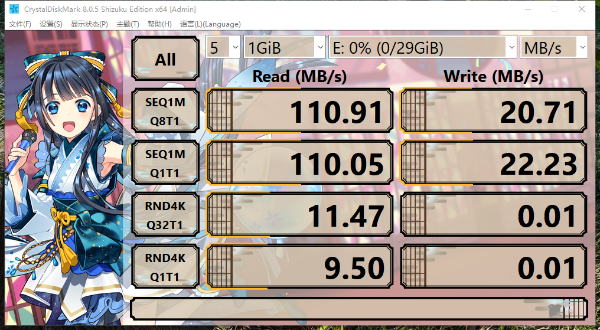
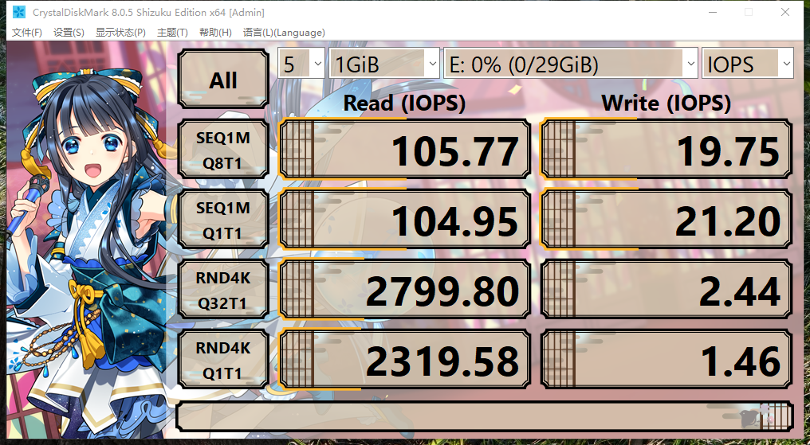

# 31.1 树莓派 FreeBSD 安装

## 树莓派概述

### 树莓派的技术背景

ARM 架构凭借低功耗、高集成度，在嵌入式与移动计算领域占据主导地位。

树莓派（Raspberry Pi）是一款基于 ARM 架构的单板计算机（Single-Board Computer，SBC），其设计特点是接口丰富，可支持多种外设扩展。标准接口包括：HDMI 视频输出、I²C 串行总线、USB 2.0/3.0 主机接口、I²S 音频接口、CSI 相机接口、GPIO（通用输入输出）引脚、UART 串口、RTC（实时时钟）接口、PWM（脉冲宽度调制）风扇控制、DSI 显示接口、PCIe 高速接口（需转接板实现）以及 POE（以太网供电）模块接口等。

在计算性能方面，树莓派的综合性能大致与同期的千元级智能手机（如采用高通处理器的红米系列）相当。

### 树莓派的应用领域

树莓派主要应用于嵌入式系统开发领域，典型案例包括机器人控制、家庭路由器构建以及视频监控系统搭建等。

### 树莓派的起源

剑桥大学圣约翰学院计算机科学专业时任教学主管（Director of Studies）Eben Upton 发现，当时青少年群体缺乏价格低廉且架构开放的计算设备用于学习实践，是剑桥大学计算机科学与技术系教学困境的主要原因。正因如此，树莓派项目的初始动机与解决这一教学困境密切相关。

~~“为了守护我们最爱的院系——我们所能做的，就是开发一块每个人都买得起的电路板！！”~~

虽然《LoveLive!》中的学园偶像未能达成目标，但树莓派项目最终取得了巨大成功，据 Raspberry Pi Ltd 声称已成为全球销量第三的通用计算机。

## 存储介质性能测试与选择

### 测试 U 盘/存储卡 4K 读写速度的必要性

在系统安装前，建议测试拟使用的 U 盘或存储卡的 4K 随机读写性能，具体测试方法参见本书附录 I（microSD 卡参数简介）。

自树莓派 3B+ 型号起，系统原生支持从 U 盘启动，无需额外硬件或软件修改。经实测，FreeBSD 12、13、14 版本均支持该功能。其性能瓶颈主要源于两方面因素：一是树莓派硬件本身受总线速率限制，接口性能存在上限；二是部分 U 盘产品的实际性能与标称值存在较大差距。因此系统启动速度相对缓慢。

各型号树莓派的 SD 卡总线模式如下：

| 型号 | SD 卡总线模式 | 说明 |
| ---- | ------------- | ---- |
| 树莓派 5 | SDR104（UHS-I） | 高速模式 |
| 树莓派 4 | DDR50（UHS-I） | 高速模式 |
| 树莓派 3 | High Speed（约 20–22 MB/s） | SD 卡控制器理论上支持 UHS-I，但存在已知的可靠性问题 |
| 树莓派 1/2 | High Speed（约 20–22 MB/s） | 不支持 UHS-I |

### 存储介质选择的关键指标

树莓派的 SD 卡接口对存储卡的传输速率存在硬件层面的限制，使用标称连续读写速度超过 100 MB/s 的存储卡无法显著提升用户体验，除非使用经过专门设计的超频读卡器，否则消费级设备几乎无法达到厂商标称的连续读写速率。

树莓派此类嵌入式系统，**4K 随机读写性能**才是影响系统响应速度的关键指标。在选择存储卡时，建议优先考虑达到 [A2 性能级别](https://www.kingston.com/cn/blog/personal-storage/microsd-sd-memory-card-naming-conventions) 的产品，该级别的性能标准为：随机读取不低于 4000 IOPS，随机写入不低于 2000 IOPS。需注意，A2 级别的完整性能依赖于主机设备对命令队列（Command Queueing，CQ）和缓存管理的支持，树莓派 4 及 5 已支持 CQ 扩展，而更早型号则不具备此功能，A2 卡在旧型号上的实际表现与 A1 卡差异不大。

### 典型 U 盘性能案例分析

部分 U 盘产品的 4K 随机写入性能甚至低于普通 A2 级别存储卡。

一个具有代表性的案例是金士顿（Kingston）DataTraveler 100 G3 USB 3.0 闪存盘（市场简称 DT100 G3）。根据实测数据，该产品的 4K 随机写入速度接近 `0` IOPS（实测工具无法测得有效结果），这将导致系统使用过程中出现严重的响应延迟。





### 参考文献

- Heath N. Inside the Raspberry Pi: The story of the $35 computer that changed the world[EB/OL]. [2026-03-25]. <https://www.techrepublic.com/article/inside-the-raspberry-pi-the-story-of-the-35-computer-that-changed-the-world/>. 讲述树莓派从教育项目成长为全球畅销单板计算机的发展历程。
- FreeBSD 中文社区. Raspberry Pi 树莓派中文文档[EB/OL]. [2026-03-25]. <https://rpicn.bsdcn.org>. 该文档是树莓派日常安装、配置与使用指南。
- 台灣樹莓派. 【教學/基礎】實測 Raspberry Pi 5 上的 SD 卡效能[EB/OL]. (2024-06-02)[2026-03-25]. <https://piepie.com.tw/52880/sd-card-performance-in-raspberry-pi-5>. 实测树莓派 5 不同 SD 卡的读写性能表现与差异。
- GR-Thunderstorm. Default Setting for the UHSMODE?[EB/OL]. (2024-04-23)[2026-03-25]. <https://forums.raspberrypi.com/viewtopic.php?t=75464>. 讨论树莓派 SD 卡 UHS 模式的默认配置与性能优化。
- 金士顿科技. DataTraveler 100 G3 USB 3.0 Flash Drive - 技术支持[EB/OL]. [2026-03-25]. <https://www.kingston.com/cn/support/technical/products/dt100g3>. 金士顿 DT100G3 U 盘的技术规格与支持文档。
- wintelguy.com. IOPS-MB 在线转换器：IOPS, MB/s, GB/day Converter[EB/OL]. [2026-03-25]. <https://wintelguy.com/iops-mbs-gbday-calc.pl>. IOPS 与 MB/s 等存储性能单位的在线转换工具。
- Raspberry Pi Ltd. Raspberry Pi SD Cards[EB/OL]. (2024-10)[2026-04-17]. <https://pip-assets.raspberrypi.com/categories/1270-sd-card/documents/RP-008381-DS-1-sd-card-product-brief.pdf>. 树莓派官方 A2 SD 卡产品说明，记载了 DDR50/SDR104 总线速度与命令队列（CQ）扩展支持。

## ARM 架构支持

FreeBSD 对不同硬件体系结构的支持采用等级划分机制。截至目前，AArch64（ARM64）架构属于 [一级架构](https://www.freebsd.org/platforms/)，该架构获得了 FreeBSD 项目的核心支持。但在软件生态的完整性方面，AArch64 架构仍略逊于 AMD64（x86-64）架构，仍有部分软件包目前无法通过 FreeBSD Ports 以源代码形式成功构建。

## 系统安装前的准备工作

### 硬件与软件准备清单

在开始安装前，需准备以下硬件设备和软件工具：

**硬件设备：**

- 一块树莓派开发板（具体型号不限）；
- 一根标准网线，用于网络连接；
- 一张符合性能要求的存储卡（建议 A2 级别）；
- 一根 CH340 芯片的 USB 转串口线，或一台分辨率不低于 1080P 的显示器（二者选其一，用于系统监控与调试）；
- 一台普通家用路由器（互联网连接非必需，仅用于局域网内设备互联）。

**软件工具（Windows 10/11 环境下）：**

- XShell：SSH 终端模拟软件，用于远程登录；
- WinSCP：SFTP 文件传输软件，用于文件管理。

## 基本安装流程概述

### 安装步骤概览

在树莓派上安装 FreeBSD 系统的基本操作流程如下：

1. 访问 FreeBSD 官方网站，下载与树莓派硬件型号匹配的 FreeBSD 系统镜像；
2. 下载完成后，解压镜像文件；
3. 使用 [Rufus](https://rufus.ie/zh/) 等工具将镜像写入存储卡，制作可启动介质；
4. 完成必要的硬件连接：接入 USB 以太网卡并连接网线，接入 HDMI 显示器（如使用视频输出方式）；
5. 将制作好的存储卡插入树莓派的存储卡插槽；
6. 接通电源，等待系统完成初始化（通常需要约五分钟）；
7. 登录路由器管理后台，查看树莓派获取的 IP 地址；
8. 通过 SSH 协议远程连接到运行 FreeBSD 系统的树莓派。

> **注意**
>
> 刻录完成后，需要挂载 FAT 分区并替换其中的所有文件，否则会出现启动显示异常（如花屏、彩虹屏）。替换的文件路径为：
>
> <https://github.com/FreeBSD-Ask/FreeBSD-rpi4-firmware>

## FreeBSD ZFS 与树莓派（适用于树莓派 4、5）

在树莓派上使用 ZFS 文件系统前，需确保固件为最新版本。操作步骤如下：

> **注意**
>
> FreeBSD 默认提供的 IMG 镜像使用 UFS 文件系统。需要使用 ZFS 的用户可先在存储卡上写入 img 镜像并正常启动，再插入 U 盘，加载 ZFS 模块，运行命令 `bsdinstall` 安装（安装位置选择 U 盘）。在 `bsdinstall` 界面中，需选择目标磁盘、设置分区方案并配置 ZFS 池。如需在存储卡上使用 ZFS，可反向操作，用 U 盘作为启动盘安装。

安装前说明：

`mmcsd0` 为存储卡，`da0` 为 U 盘。

以下操作将在 U 盘上创建一个使用 ZFS 的树莓派 FreeBSD 系统。使用标准镜像写入存储卡，启动后再插入空白 U 盘，U 盘需保持 FAT32 文件系统和 MBR 分区表。

查看系统磁盘分区表信息：

```sh
# gpart show
=>       63  246947777  mmcsd0  MBR  (118G)
         63       1985          - free -  (993K)
       2048     102400       1  fat16  [active]  (50M)
     104448  246835200       2  freebsd  (118G)
  246939648       8192          - free -  (4.0M)

=>        0  246835200  mmcsd0s2  BSD  (118G)
          0        128            - free -  (64K)
        128  230057856         1  freebsd-ufs  (110G)
  230057984   16777216         2  freebsd-swap  (8.0G)

=>      63  60088257  da0  MBR  (29G)
        63      4033       - free -  (2.0M)
      4096  60084224    1  fat32lba  [active]  (29G)
```

必须先加载 ZFS 模块，否则会出现类似 `sysctl: unknown oid 'vfs.zfs.min_auto_ashift'` 的分区错误。

```sh
# kldload zfs  # 加载 ZFS 内核模块
```

启动安装程序以安装 FreeBSD：

```sh
# bsdinstall
```

安装完成后，再次显示系统磁盘分区表信息：

```sh
$ gpart show
=>      34  60088253  da0  GPT  (29G)
        34         6       - free -  (3.0K)
        40    532480    1  ms-basic-data  (260M)
    532520      2008       - free -  (1.0M)
    534528   4194304    2  freebsd-swap  (2.0G)
   4728832  55357440    3  freebsd-zfs  (26G)
  60086272      2015       - free -  (1.0M)
```

## 树莓派 5

测试环境如下：

- 树莓派 5 8 GB
- FreeBSD 15.0-CURRENT
- 外接 RTL 8156B 网卡
- 启动盘为 256 GB NVMe SSD
- UEFI：[rpi5-uefi v0.3](https://github.com/worproject/rpi5-uefi)

> **警告**
>
> 本节不适用于 D0 步进版本以及 16 GB 内存版本。具体参见 <https://rpicn.bsdcn.org>。如果使用较新版本的固件，可能需要降级固件版本才能使用本节方法。

经测试验证，树莓派 5 8 GB 使用 [UEFI](https://github.com/worproject/rpi5-uefi) 和 FreeBSD 15.0（测试镜像 `FreeBSD-15.0-CURRENT-arm64-aarch64-20240628-14fee5324a9b-270986-memstick.img.xz`）可从存储卡、USB 设备或 M.2 扩展板（微雪的 [PCIe_TO_M.2_HAT+](https://www.waveshare.net/wiki/PCIe_TO_M.2_HAT+)）的 M.2 NVMe SSD 启动。后者兼容 PCIe 3.0 设备；树莓派 5 默认在 PCIe 2.0 x1 模式下运行，可通过固件参数 `dtparam=pciex1_gen=3` 启用 PCIe 3.0 速度，但稳定性取决于信号完整性。

内置网卡等硬件暂无驱动（可使用 USB 网卡）。风扇由固件控制，默认持续转动。HDMI 显示正常，USB 2.0 和 3.0 接口均正常工作。测试表明，KDE Plasma 5 桌面环境可正常输出至 HDMI 显示器。

### 树莓派 5 与 HAT+

选购树莓派 5 扩展板时，请确认其符合 HAT+ 标准。不符合该标准的扩展板通常只能通过 PCIe FPC 获取电源。为符合相关规范，扩展板电力需求应为 5 V 2 A，即 10 W。

树莓派 5 提供的并非标准 PCIe 接口，而是自行设计的 FPC 接口，因此需要使用转接器才能将 PCIe 设备连接到树莓派 5。

根据树莓派 5 的排线规范，该接口最多只能提供 5 V 1 A，即最多 5 W 的电力。因此，树莓派的 HAT+ 规范要求扩展板还需从 GPIO 接口获取电源。

### 树莓派 5 8 GB 编译安装世界和内核

示例采用：[FreeBSD 15.0-CURRENT](https://cgit.freebsd.org/src/commit/?id=fef0e39f64a1db796ded8777dbee71fc287f6107)，且均使用默认参数。

显示当前 Git 仓库 freebsd-src 的提交哈希值：

```sh
root@ykla:/usr/src # git rev-parse HEAD
fef0e39f64a1db796ded8777dbee71fc287f6107
```

- 编译世界（用户空间）约用时 6 小时。

```sh
--- buildworld_epilogue ---
--------------------------------------------------------------
>>> World build completed on Tue Aug  6 04:01:22 CST 2024
>>> World built in 21438 seconds, ncpu: 4, make -j4
--------------------------------------------------------------
```

- 编译内核用时约 26 分钟。

```sh
--------------------------------------------------------------
>>> Kernel build for GENERIC completed on Tue Aug  6 07:22:22 CST 2024
--------------------------------------------------------------
>>> Kernel(s)  GENERIC built in 1564 seconds, ncpu: 4, make -j4
--------------------------------------------------------------
```

### 故障排除与未竟事宜

- `newfs_msdos /dev/gpt/efiboot0: operation not permitted`

该问题主要出现在使用 ZFS 存储卡安装系统到 U 盘时，目前尚无解决方案，只能使用另一块采用 UFS 文件系统的 U 盘启动盘安装 U 盘系统。

可能用到的命令：

> **警告**
>
> `gpart destroy -F` 将强制销毁指定磁盘的分区表，磁盘上所有数据将永久丢失。需确认 `da2` 是正确的目标磁盘。

`gpart destroy -F da2`，用于销毁此步骤错误创建的文件系统，以防止系统无法识别。

## 附录：使用串口

建议外接显示器或使用 CH340 USB 串口线，以防系统进程停滞时无法判断状态。

如使用 USB 串口线，建议购买采用 CH340 芯片的型号，否则可能出现进程停滞、无输出、无法输入、驱动安装失败或与 Windows 10 不兼容等问题。

如果使用显示器，屏幕分辨率应不低于 1080P（1920 x 1080），屏幕尺寸不应小于 8 英寸。否则即使接入显示器，也仅能看到屏幕亮起，但无法清晰查看文字。

如果接入了显示器，应确保树莓派和显示器同时通电。显示器可晚于树莓派通电，但不应过晚。

附 CH340 USB 转串口官方驱动下载地址：<https://www.wch.cn/downloads/CH341SER_EXE.html>

## 附录：FreeBSD 与树莓派 4B 8 GB 启动失败问题（变通方案）

如果出现彩虹屏导致无法启动，可下载 FreeBSD 14 镜像并写入存储卡，随后替换 FAT 分区内容。在 Windows 系统中，默认分区为隐藏分区，可使用 DiskGenius 等工具激活并分配盘符后进行访问；在 FreeBSD 系统中，可使用 `mount_msdosfs` 命令直接挂载 FAT 分区。

固件文件可从 <https://github.com/FreeBSD-Ask/FreeBSD-rpi4-firmware> 获取。

修改 `config.txt` 文件为以下内容：

```ini
arm_64bit=1              # 启用 64 位 ARM 架构模式
dtoverlay=disable-bt     # 禁用蓝牙设备树叠加层
dtoverlay=mmc            # 启用 MMC 设备树叠加层
device_tree_address=0x4000   # 指定设备树在内存中的地址
kernel=u-boot.bin         # 指定使用的内核文件
armstub=armstub8-gic.bin  # ARM 启动 stub 文件路径
hdmi_safe=0               # 禁用 HDMI 安全模式
force_turbo=0             # 保留动态频率调整（默认安全模式）
arm_freq=2000             # 设置 ARM CPU 频率为 2000 MHz（超频）
over_voltage=6            # 设置 CPU 电压提升值（超频）
```

### 参考文献

- Raspberry Pi Foundation. The config.txt file[EB/OL]. [2026-04-16]. <https://www.raspberrypi.com/documentation/computers/config_txt.html>. 记载“By default (force_turbo=0) the on-demand CPU frequency driver will raise clocks to their maximum frequencies when the Arm cores are busy, and will lower them to the minimum frequencies when the Arm cores are idle”。
