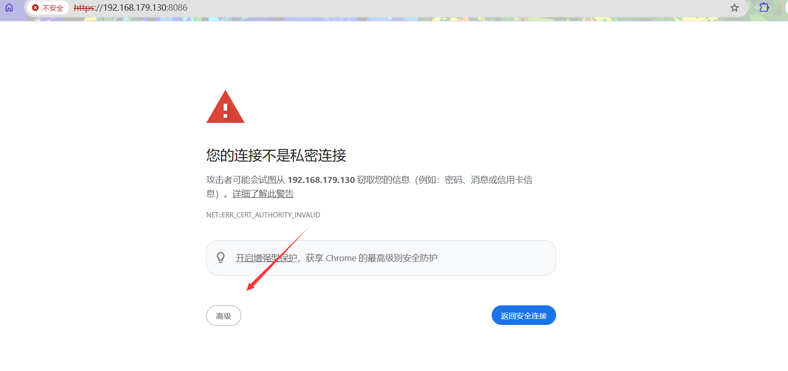
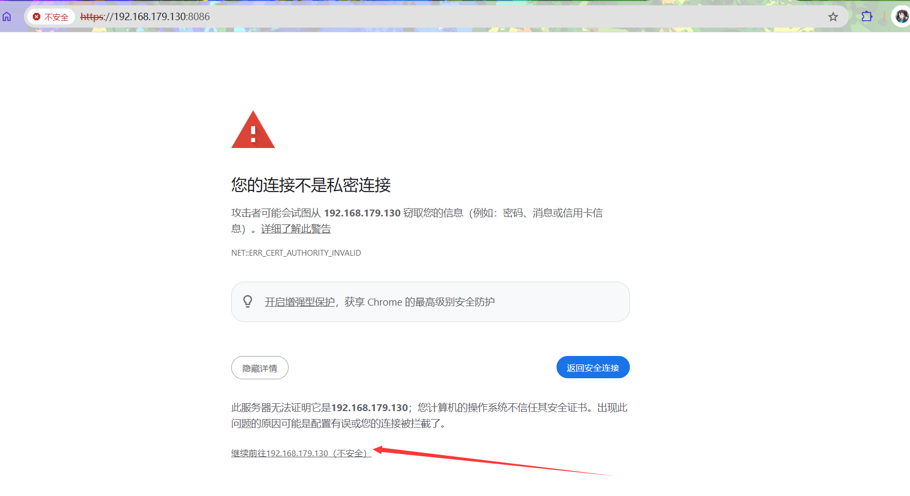
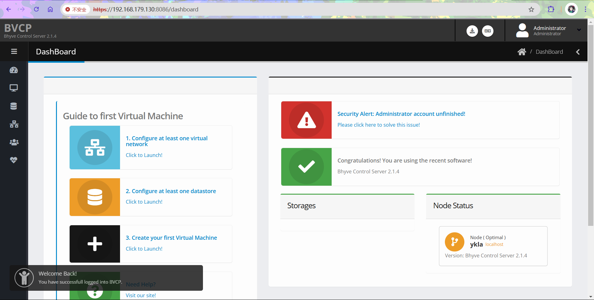
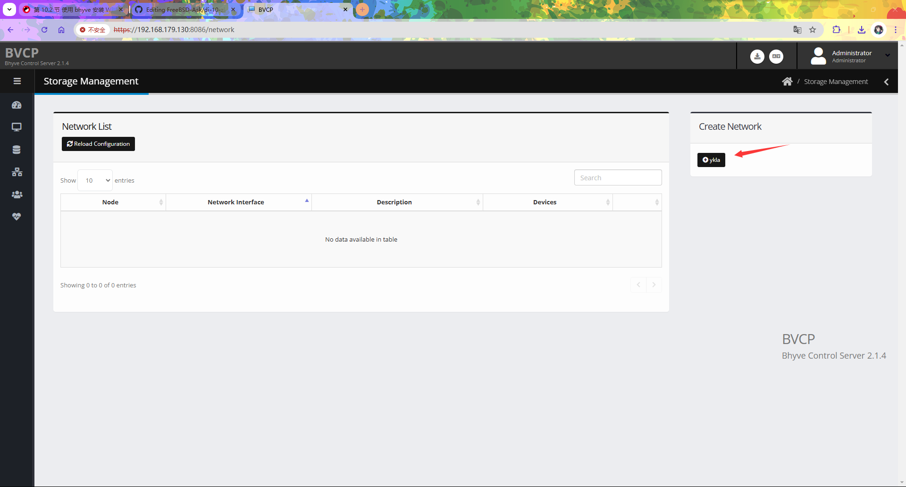
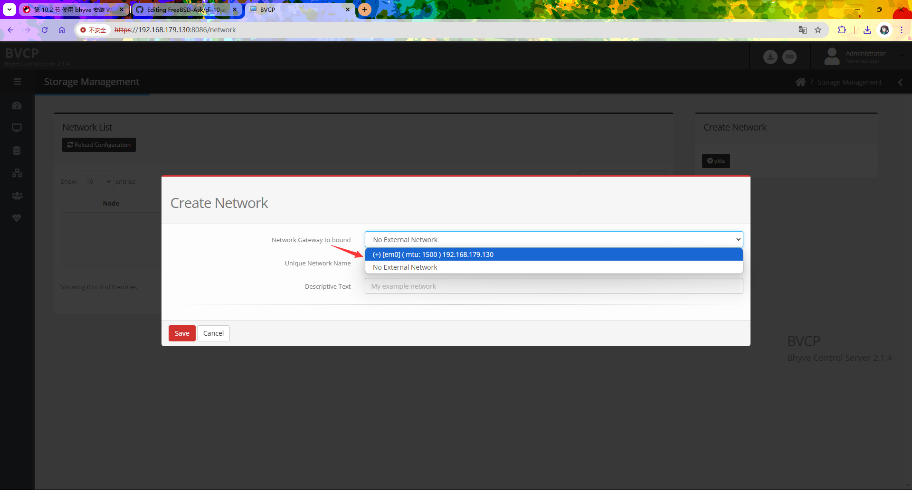
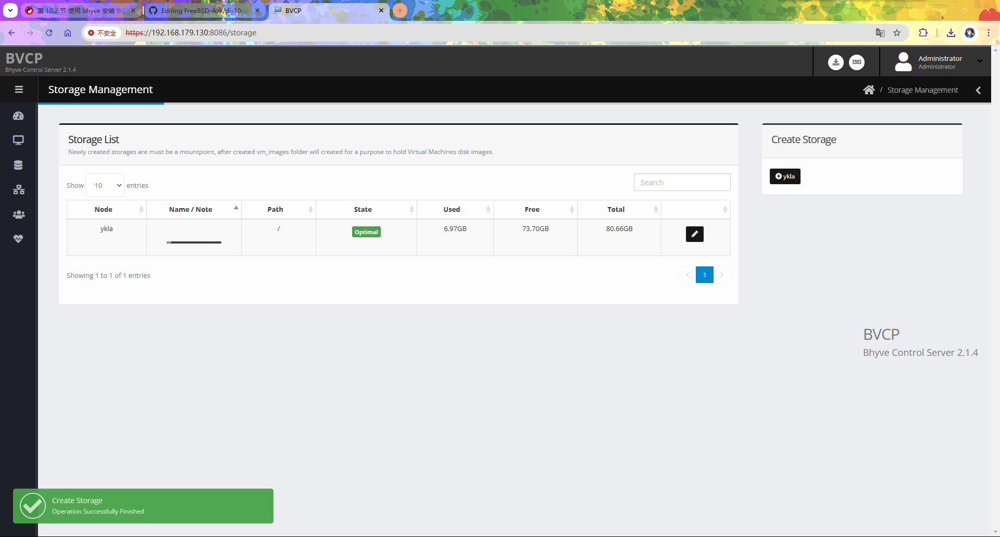
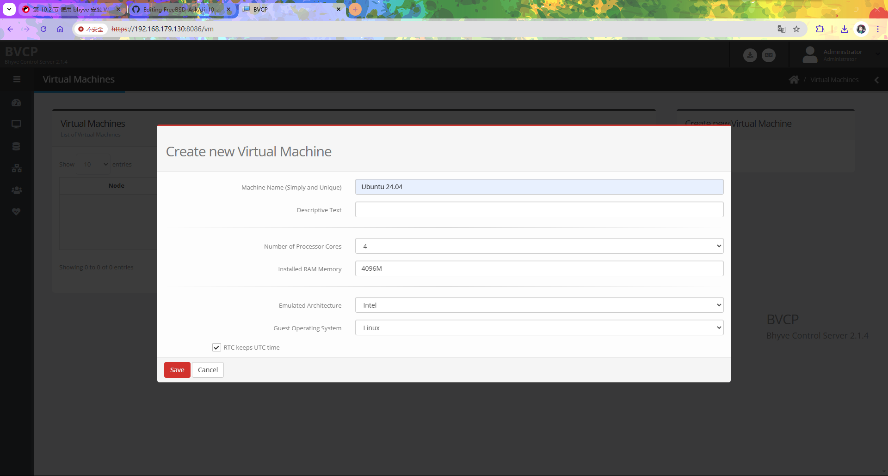
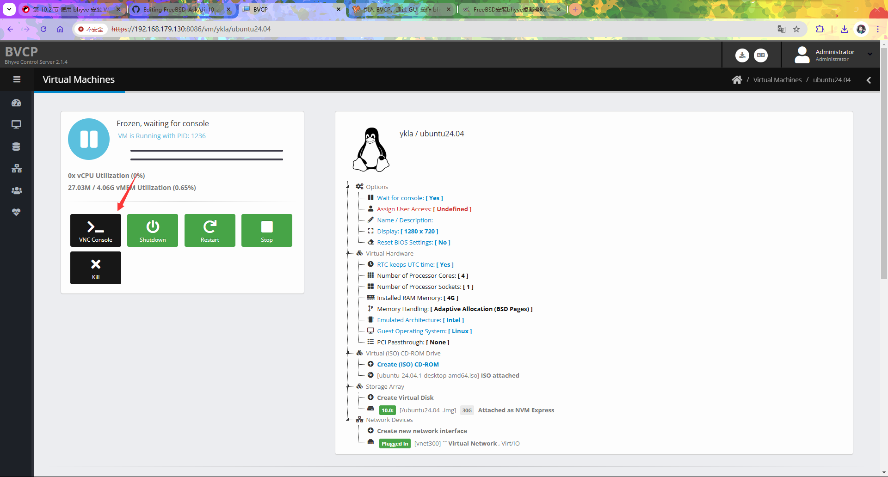
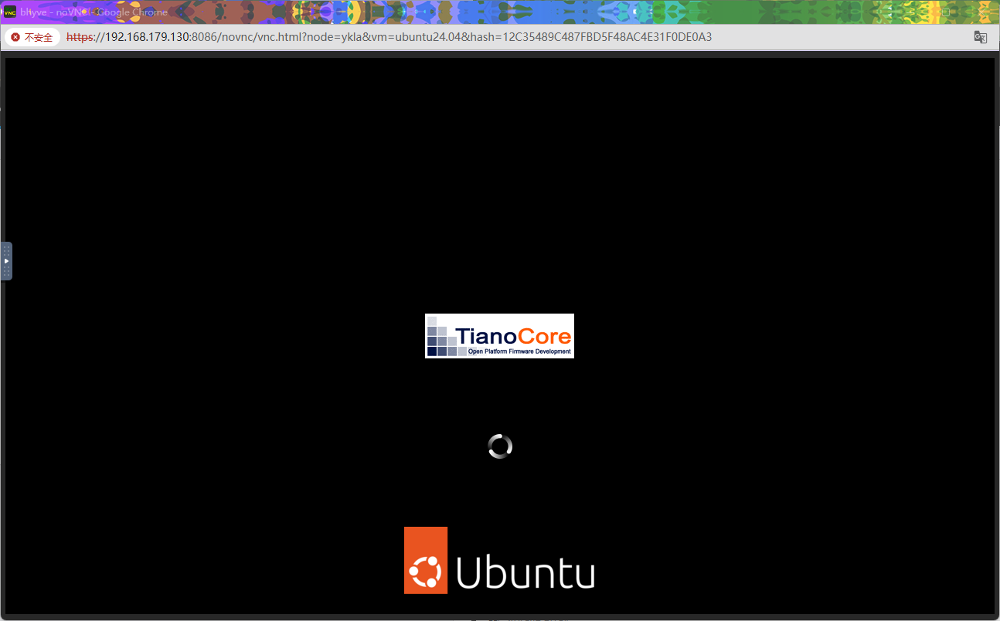
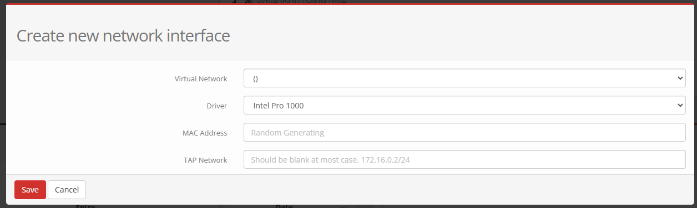

# 31.2 使用 BVCP 通过 Web 界面管理 bhyve 虚拟机

bhyve 是 FreeBSD 原生的虚拟机管理程序（hypervisor），通过 vmm 内核模块提供硬件辅助虚拟化支持，客户机操作系统可直接利用 CPU 虚拟化扩展指令集。

BVCP（bhyve Virtual-Machine Control Panel）是 bhyve 的 Web 图形化管理工具，可创建、启动、停止虚拟机。

本节实验环境基于 FreeBSD 14.2-RELEASE。BVCP 2.1.4 版本尚不支持中文本地化。

本软件项目仓库地址为：<https://github.com/DaVieS007/bhyve-webadmin>

> **技巧**
>
> 无需提前配置任何服务、加载任何模块或安装其他软件。按照本节步骤即可完成操作。

## 安装 BVCP

安装 BVCP 分为以下步骤：

- **下载 BVCP 分发文件**：使用 `fetch` 命令从官方服务器获取 BVCP 压缩包。

```sh
# fetch https://bhyve.npulse.net/release.tgz
```

- **解压缩 BVCP 分发文件**：将下载的压缩包解压到当前目录。

```sh
# tar -xzvf release.tgz
```

- **安装 BVCP**：进入解压后的目录并执行安装脚本，该脚本会自动完成软件部署、数据库初始化和服务配置。

```sh
# cd bhyve-webadmin
root@ykla:/home/ykla/bhyve-webadmin # ./install.sh
Installing BVCP into your FreeBSD Installation within seconds ...

Press [CTRL] + [C] to Abort !
bvcp_enable:  -> YES
 N  2024-12-21 11:32:35 | Kinga-Framework | 2024/02-17@build-336/FreeBSD64-L
 N  2024-12-21 11:32:35 | Product Name| BVCP-Backend
 N  2024-12-21 11:32:35 | Description | BVCP Bhyve Backend/Helper Module
 N  2024-12-21 11:32:35 | License | Community Edition
 N  2024-12-21 11:32:35 | Copyright   | All rights reserved for the author: nPulse.net / Viktor Hlavaji
 N  2024-12-21 11:32:35 | Guardian | Create Process, PID: 1132
 N  2024-12-21 11:32:35 | SW | VFS:BuiltIn Loaded
 N  2024-12-21 11:32:35 | ThreadPool | 10/10 Threads initialised
 N  2024-12-21 11:32:35 | LVM::MAIN | Initialising ..


                        ██████╗ ██╗   ██╗ ██████╗██████╗
                        ██╔══██╗██║   ██║██╔════╝██╔══██╗
                        ██████╔╝██║   ██║██║     ██████╔╝
                        ██╔══██╗╚██╗ ██╔╝██║     ██╔═══╝
                        ██████╔╝ ╚████╔╝ ╚██████╗██║
                        ╚═════╝   ╚═══╝   ╚═════╝╚═╝

 N  2024-12-21 11:32:35 | BVCP | Initialising BVCP-Backend 2.1.4 Application

  [>] Generating Entropy ... [217157D53CDD4122589AEE05D866C84C]

 Welcome to initial setup menu!
 The Software is located at: /var/lib/nPulse/BVCP

 The Software is producing pseudo filesystem scheme for virtual machines using symlinks
 Where to create metadata, iso_images, database, config, logs: (Does not need much space), default: [/vms]_>   # 按回车确认，安装所需的 iso_images 镜像将存放在此目录下

……省略一部分……


Bhyve Virtual-Machine Control Panel under FreeBSD

 N  2024-12-21 11:33:46 | BVCP | Initialising BVCP-Backend 2.1.4 Application
 N  2024-12-21 11:33:48 | BVCP | Starting Database ...
 (!) Admin Credentials recreated,
   - User: admin 		# 用户名 admin
   - Password: AdJFjNjG # 密码 AdJFjNjG

 N  2024-12-21 11:33:48 | SW | Program exited gracefully...
Installation Finished!

Navigate: https://[your-ip]:8086  # 访问地址为 https://[your-ip]:8086，如果在安装 BVCP 的机器上访问，可使用 https://localhost:8086
```

> **警告**
>
> 上述管理员密码在标准输出中以明文显示。**安装完成后请立即登录 Web 界面修改默认密码**，避免未经授权的访问。如安装过程在非安全环境中进行（如远程 SSH 会话、共享终端等），请确保输出内容未被他人截获。

> **技巧**
>
> 本节示例中出现的用户名 `ykla`、主机名 `ykla` 及路径 **/home/ykla** 均为示例，请根据自身环境替换为实际值。

文件结构：

```sh
/
├── var/
│   └── lib/
│       └── nPulse/
│           └── BVCP/ # BVCP 软件安装位置
└── vms/ # 虚拟机元数据、ISO 镜像、数据库、配置、日志存放目录
    └── iso_images/ # ISO 镜像存放目录
```

## 安装 Ubuntu 24.04

安装过程分为两个主要步骤：获取安装镜像和通过 Web 界面配置虚拟机。

- **下载 Ubuntu 24.04 安装镜像**：从中国科学技术大学镜像站获取 Ubuntu 24.04 桌面版安装镜像。

```sh
# fetch https://mirrors.ustc.edu.cn/ubuntu-releases/noble/ubuntu-24.04.1-desktop-amd64.iso
```

- **将镜像移动到 BVCP 镜像目录**：将下载的 ISO 文件移动到 BVCP 配置的镜像存放目录，以便 Web 界面识别和使用。

```sh
# mv ubuntu-24.04.1-desktop-amd64.iso /vms/iso_images
```

完成上述准备工作后，即可通过 Web 界面开始创建虚拟机。以下截图展示了完整的配置过程：






登录时忽略上方显示的电子邮件（email）字段，直接输入安装过程中生成的用户名 `admin` 和对应密码即可。


















安装完成后按回车键重启系统。



重启后进入新系统：


## 安装 Windows 11 IoT Enterprise LTSC, version 24H2 (x64) - DVD (English)

详细步骤与前文 Ubuntu 24.04 的安装说明类似，可参见前一节“使用 bhyve 及 vm-bhyve 工具安装 Windows 11”，此处仅列出关键区别。

在 `Create new network interface` 步骤中创建新网卡接口时，需要特别注意网卡类型的选择：



Windows 系统默认不包含其他网卡类型的驱动程序，因此请选择 `Intel PRO e1000` 网卡类型。


完成网卡配置后即可开始安装。


## 故障排除与未竟事宜

本节列出 BVCP 使用过程中可能遇到的问题及解决方法。

### 如何卸载 BVCP

如需卸载 BVCP，可参考官方文档（FreeBSD bhyve Project. Uninstallation of BVCP[EB/OL]. [2026-03-26]. <https://bhyve.npulse.net/uninstall>）。

## 参考文献

- たかちゃん. bhyve を GUI で 操作 する BVCP の 導入。[EB/OL]. running-dog.net, (2024-02-05)[2026-03-25]. <https://running-dog.net/2024/02/post_2933.html>. 提供了 BVCP 安装与配置的实用指南。
- FreeBSD bhyve Project. How to install BVCP[EB/OL]. [2026-03-25]. <https://bhyve.npulse.net/installation>. 官方安装说明，详细指导了 BVCP 部署流程。
- FreeBSD bhyve Project. TroubleShoot / Frequently Asked Questions (FAQ)[EB/OL]. [2026-03-25]. <https://bhyve.npulse.net/technical>. 常见疑难解答，提供故障排除方案。
- FreeBSD bhyve Project. Deploy Virtual Machine (Windows)[EB/OL]. [2026-03-25]. <https://bhyve.npulse.net/deploy_windows>. 官方 Windows 安装说明，详述了 Windows 虚拟机部署。
