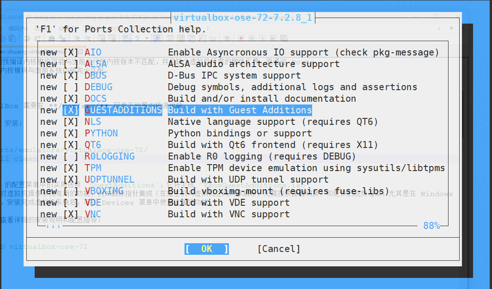
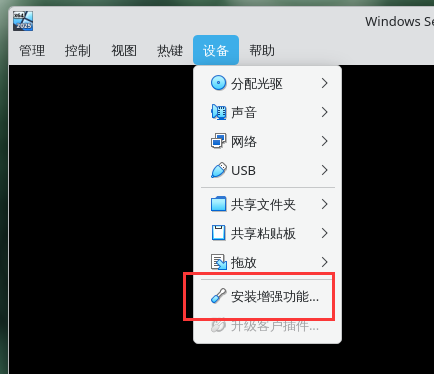
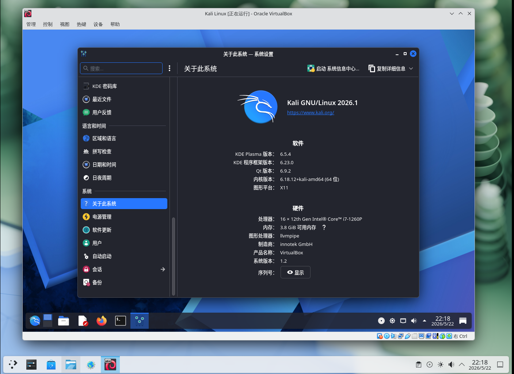

# 31.4 在 FreeBSD 上安装 VirtualBox

VirtualBox 是甲骨文（Oracle）公司开发的跨平台第二类虚拟机管理程序（Type-2 hypervisor），适用于包括 Windows、macOS、Linux 和 FreeBSD 在内的大多数操作系统。它同样可以运行 Windows 或类 UNIX 的虚拟机系统。

VirtualBox 自 7.0 版本起采用 GNU 通用公共许可证第三版（GPLv3）协议开源发布（4.0 至 6.1 版本为 GPLv2），支持 x86 与 AMD64 架构的硬件辅助虚拟化（Intel VT-x 与 AMD-V）。硬件辅助虚拟化技术使虚拟机可以直接访问部分硬件资源，显著提升虚拟化性能。

自 4.0 起，VirtualBox 只有开源版本（4.0 至 6.1 称 Open Source Edition，7.0 起基础包直接以 GPLv3 发布），其余组件以闭源扩展包（VirtualBox Extension Pack）的形式单独提供，**尚不支持** FreeBSD。自 7.0 起，EHCI 与 xHCI USB 控制器设备已包含在开源基础包中，无需扩展包即可使用 USB 2.0/3.0 直通功能；此前该功能由扩展包提供。扩展包当前仅提供 PXE 网络启动 ROM 及云集成等附加功能（注：VRDP 服务器、USB 智能卡模拟及磁盘与虚拟机加密自 7.2.6 起移入基础包；USB 摄像头自 7.2.2 起移入基础包）。

VirtualBox 在 FreeBSD 上有多个版本可供选择。7.2 版本为当前维护版本。各版本均提供无 X11 的 `-nox11` 变体（例如 **emulators/virtualbox-ose-nox11-72**），适用于无图形界面的服务器环境，仅可通过命令行工具 `VBoxManage` 操作。

## 安装 VirtualBox

本节安装 **emulators/virtualbox-ose-72**。

使用 pkg 安装的预编译内核模块可能与当前运行的内核版本不匹配，并且缺少虚拟机所需的增强工具，而通过 Ports 编译安装可以确保内核模块与当前系统内核完全匹配。

> **注意**
>
> 构建 VirtualBox 需要在 **/usr/src/** 目录下放置内核源代码。

推荐使用 Ports 安装：

```sh
# cd /usr/ports/emulators/virtualbox-ose-72/
# make config-recursive
# make install clean
```

需要在 Ports 配置菜单中选中实用选项 `GuestAdditions`，它将生成 **/usr/local/lib/virtualbox/additions/VBoxGuestAdditions.iso** 文件。



`GuestAdditions` 提供了多项对虚拟机操作系统有用的功能，例如鼠标指针集成（在宿主机与虚拟机之间共享鼠标，无需按快捷键切换）和更快的视频渲染，尤其是在 Windows 虚拟机中更为明显。虚拟机系统安装完成后，可在设置菜单中选择“安装增强功能...”。



可以通过以下命令查看详细的安装说明和配置指导：

```sh
# pkg info -D virtualbox-ose-72
```

## 文件结构

```sh
/
├── boot/
│   └── loader.conf # 内核模块加载配置
├── etc/
│   ├── rc.conf # 系统启动配置
│   ├── devfs.rules # DevFS 规则文件
│   └── vbox/
│       └── networks.conf # 旧版 VirtualBox 网络配置位置
├── tmp/
│   └── .vbox-*-ipc # VirtualBox IPC 临时文件
└── usr/
    ├── local/
    │   └── etc/
    │       └── vbox/
    │           └── networks.conf # VirtualBox 网络配置
    ├── ports/
    │   └── emulators/
    │       └── virtualbox-ose-72/ # VirtualBox Ports 目录
    └── src/ # 内核源代码目录
```

## 配置 VirtualBox

加载 vboxdrv 内核模块，该模块为 VirtualBox 提供核心虚拟化功能。除写入 **/boot/loader.conf** 外，也可通过 `kldload vboxdrv` 手动加载以即时生效。

- **加载内核模块**：将以下行写入 **/boot/loader.conf** 文件，设置系统在启动时加载 VirtualBox 内核模块

    ```ini
    vboxdrv_load="YES"
    ```

- **启用桥接网络支持**：允许虚拟机直接连接物理网络

    ```sh
    # service vboxnet enable
    ```

	默认情况下，**/dev/vboxnetctl** 的权限较为严格：

	```sh
	ls -loa  /dev/vboxnetctl
	crw-------  1 root wheel - 0x75  5月 22 19:07 /dev/vboxnetctl
	```

	需更改权限以启用桥接网络，请在 **/etc/devfs.conf** 中添加以下内容：

	```ini
	own     vboxnetctl root:vboxusers
	perm    vboxnetctl 0660
	```

- **用户组管理**：安装 VirtualBox 时会创建 vboxusers 用户组。必须将所有使用 VirtualBox 的用户都添加到该组和 `operator` 组（USB 支持）中。

    可使用 pw 命令添加用户 `ykla`（替换为实际用户）：

    ```sh
    # pw groupmod vboxusers -m ykla
	# pw groupmod operator -m ykla
    ```

	验证结果：

	```sh
	# id ykla
	uid=1001(ykla) gid=1001(ykla) groups=1001(ykla),0(wheel),5(operator),44(video),920(vboxusers)
	```

完成上述所有配置后，点击菜单中的“Oracle VM VirtualBox”启动 VirtualBox，如图所示：


尝试安装 Kali Linux：



### VirtualBox USB 支持和 DVD/CD 支持

VirtualBox 支持将 USB 设备传递给虚拟机操作系统。

为使普通用户能够使用 VirtualBox 的 DVD/CD 功能，必须具有对 **/dev/xpt0**、**/dev/cdN** 和 **/dev/passN** 的访问权限。将以下内容添加到 **/etc/devfs.rules** 文件（如不存在则创建）：

```ini
[system=10]
add path 'usb/*' mode 0660 group operator
```

同时为 USB 设备添加访问权限，设置文件模式为 `0660`，所属组为 `operator`。将以下内容添加到 **/etc/devfs.conf** 文件：

```ini
perm cd* 0660
perm xpt0 0660
perm pass* 0660
```

为了使用该规则集，需要设置 DevFS，编辑 **/etc/rc.conf** 文件并添加以下行：

```ini
devfs_system_ruleset="system"
```

重启 DevFS 服务以应用新的规则集：

```sh
# service devfs restart
```

虚拟机系统访问宿主机 DVD/CD 驱动器是通过共享物理设备实现的。在 VirtualBox 中，可通过虚拟机设置中的 Storage 窗口配置。如有需要，先创建空的 IDE CD/DVD 设备。随后在虚拟 CD/DVD 选择菜单中选择 Host Drive。此时会出现 Passthrough 复选框，勾选该项后虚拟机会直接访问硬件。例如，音频 CD 或刻录功能仅在该选项启用时可用。

自 VirtualBox 7.0 起，EHCI 与 xHCI USB 控制器设备已包含在开源基础包中，无需扩展包即可配置 USB 2.0/3.0 直通。

## 故障排除与未竟事宜

本节提供 VirtualBox 使用过程中可能遇到的问题及其解决方法。

### Windows 安装过程中停滞

请检查 `vboxnet` 服务的状态。

## 参考文献

- Oracle Corporation. VirtualBox and open source[2026-04-17]. <https://www.virtualbox.org/wiki/Editions>. 版本说明。
- Oracle Corporation. GPL[EB/OL]. (2022-10-10)[2026-04-17]. <https://www.virtualbox.org/wiki/GPL>. 从 4.0 版本到 6.1 版本（含），VirtualBox 基础包根据 GPLv2 授权分发。（VirtualBox 的某些部分，尤其是库，也可能以其他许可证发布。）
- Oracle Corporation. GPLv3[EB/OL]. (2022-10-10)[2026-04-17]. <https://www.virtualbox.org/wiki/GPLv3>. 从 7.0 版本开始，VirtualBox 基础包根据 GPLv3 许可证进行许可。Qt 库更改了其许可证，因此需要进行许可证变更以保持兼容性。
- Oracle. VirtualBox Licensing FAQ[EB/OL]. [2026-04-17]. <https://www.virtualbox.org/wiki/Licensing_FAQ>. VirtualBox 基础包以 GPLv3 发布，扩展包以 [PUEL](https://www.virtualbox.org/wiki/VirtualBox_PUEL)（VirtualBox 扩展包个人使用和教育许可证）许可。
- Oracle. Oracle VM VirtualBox Extension Pack[EB/OL]. [2026-04-17]. <https://docs.oracle.com/en/virtualization/virtualbox/7.0/user/Introduction.html>. 扩展包提供的附加功能随版本逐步移入基础包：EHCI 与 xHCI USB 控制器自 7.0 起移入；USB 摄像头自 7.2.2 起移入；VRDP、USB 智能卡模拟及磁盘与虚拟机加密自 7.2.6 起移入。
- FreeBSD Wiki. VirtualBox[EB/OL]. [2026-04-17]. <https://wiki.freebsd.org/VirtualBox>. FreeBSD 上 VirtualBox 的已知问题与故障排查。
- FreshPorts. virtualbox-ose-72[EB/OL]. [2026-04-17]. <https://www.freshports.org/emulators/virtualbox-ose-72/>. FreeBSD Ports 中 VirtualBox 各版本的当前维护状态。
