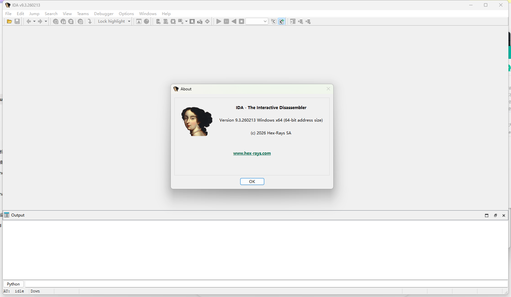
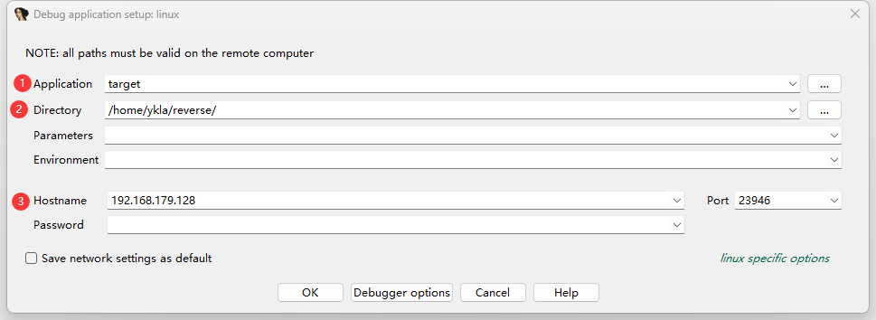
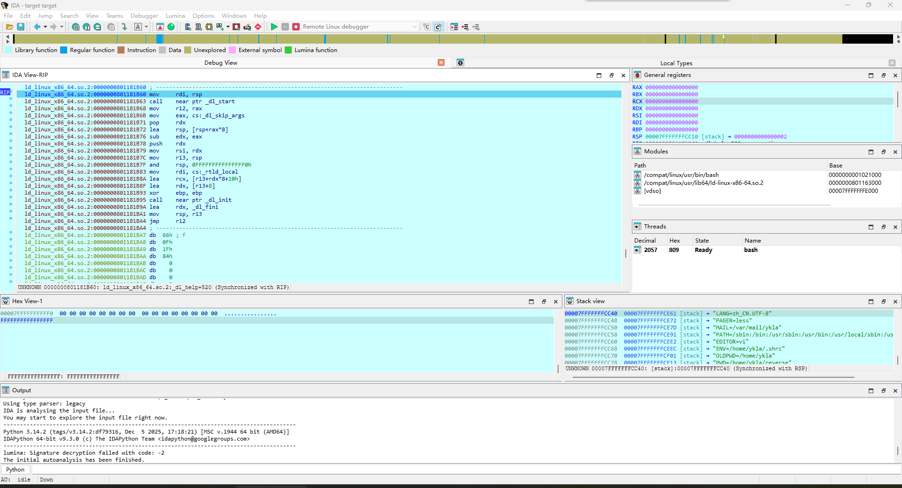

# 32.10 使用 IDA Pro 调试 FreeBSD

IDA Pro 采用客户端-服务器架构支持远程调试。Windows 端运行 IDA Pro 客户端，FreeBSD 端通过 Linux 兼容层运行 `linux_server` 调试服务器。本节基于 IDA Pro 9.3.260213 Windows x64 版本撰写。



## 远程调试原理

IDA Pro 的远程调试采用客户端-服务器架构：在目标系统（FreeBSD）上运行调试服务器程序，在分析系统（Windows）上运行 IDA Pro 客户端。两者通过网络通信，控制目标程序并交换调试信息。

FreeBSD 系统可通过 Linux 二进制兼容层运行 IDA 提供的 `linux_server` 调试服务器。该服务器负责监控目标程序执行、处理断点、获取寄存器与内存状态，并将信息传回 IDA Pro 客户端。

## 准备调试服务器

首先在 Windows 系统中，于 IDA 安装路径下的 **dbgsrv** 文件夹中找到 **linux_server** 文件。该文件是 IDA 提供的 64 位 Linux 调试服务器程序，可通过 FreeBSD 的 Linux 兼容层运行。

将 `linux_server` 复制到 FreeBSD 系统中，同时将需要远程调试的目标文件一并复制。可使用 WinSCP、SCP 或其他文件传输工具。

查看调试服务器文件详情：

```sh
$ file linux_server
linux_server: ELF 64-bit LSB executable, x86-64, version 1 (SYSV), dynamically linked, interpreter /lib64/ld-linux-x86-64.so.2, BuildID[sha1]=ff98293848c412e3ef45ee78dac017464ac3059f, for GNU/Linux 3.2.0, stripped
```

在 FreeBSD 系统中创建工作目录并放置文件：

```sh
# mkdir -p /home/ykla/reverse
# cp linux_server /home/ykla/reverse/
# cp target /home/ykla/reverse/
```

为调试服务器设置执行权限：

```sh
# chmod 755 /home/ykla/reverse/linux_server
```

相关文件结构：

```sh
/home/ykla
└── reverse/ # 逆向工程工作目录
    ├── linux_server # IDA 远程调试服务器
    └── target # 需要调试的目标文件
```

## 启动调试服务器

启动调试服务器：

```sh
# ./linux_server
IDA Linux 64-bit remote debug server(ST) v9.3.31. Hex-Rays (c) 2004-2026
2026-05-24 13:55:31 Listening on :::23946 (my ip 192.168.179.128)...
```

运行后调试服务器将监听默认端口，等待 IDA Pro 客户端连接。

## 配置 IDA Pro 客户端

请使用 64 位 IDA，按照如下步骤进行操作。

点击顶部菜单栏的“Debugger”（调试器），随后在菜单中选中“Run”（运行），在二级菜单中选中“Remote Linux debugger”（Linux 远程调试器）。




在调试配置界面中填写以下信息：

- ① `Application`：要调试的文件，本例中为 **target**；
- ② `Directory`：调试文件在虚拟机中的完整路径，例如 **/home/ykla/reverse/**；
- ③ `Hostname`：FreeBSD 系统的主机 IP 地址，本例中为 **192.168.179.128**；

配置完成后连接调试服务器，连接成功后即可开始调试。

服务器端将显示如下信息：

```sh
2026-05-24 14:01:05 [1] Accepting connection from ::ffff:192.168.179.1...
```

表示客户端（**192.168.179.1**）已连接到服务器。



即可开始分析程序。
