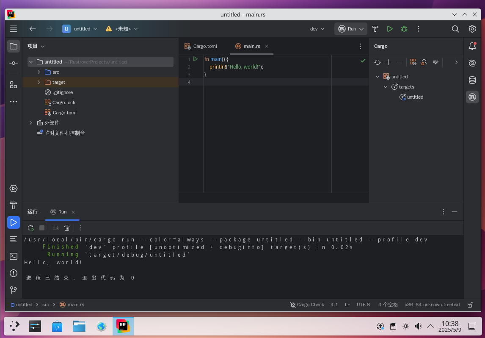

# 32.5 Rust 开发环境

本节在 FreeBSD 上配置 Rust（通过 rustup 或 pkg）开发环境，包括工具链安装与版本设置。

Rust 以内存安全和线程安全为核心设计目标，并发编程亦是其重要特性。

## 安装 Rust

使用 pkg 安装 Rust：

```sh
# pkg install rust
```

或者使用 Ports 安装：

```sh
# cd /usr/ports/lang/rust/
# make install clean
```

> **技巧**
>
> 最新开发版位于 Port `lang/rust-nightly`。

安装成功后，查看软件版本。

显示 Rust 编译器的版本信息：

```sh
$ rustc --version
rustc 1.95.0 (59807616e 2026-04-14) (built from a source tarball)
```

显示 Cargo（Rust 包管理器和构建工具）的版本信息：

```sh
$ cargo --version
cargo 1.95.0 (f2d3ce0bd 2026-03-21) (built from a source tarball)
```

## 为美好的世界献上祝福

使用 cargo 创建新项目：

```sh
$ cargo new ~/projects/greeting
    Creating binary (application) `greeting` package
note: see more `Cargo.toml` keys and their definitions at https://doc.rust-lang.org/cargo/reference/manifest.html
```

进入新创建的项目：

```sh
$ cd $_
```

编辑文本文件 `~/projects/greeting/src/main.rs`，确保包含如下代码（通常新建项目时已包含）：

```rust
fn main() {                               // Rust 程序入口函数
    println!("Hello, world!");            // 输出“Hello, world!”到控制台
}
```

保存后，运行：

```sh
$ cargo run
   Compiling greeting v0.1.0 (/home/ykla/projects/greeting)
    Finished `dev` profile [unoptimized + debuginfo] target(s) in 0.37s
     Running `target/debug/greeting`
Hello, world!
```

编译并运行当前 Rust 项目。

## JetBrains Rust 开发环境

使用 pkg 安装：

```sh
# pkg install jetbrains-rustrover
```

或者使用 Ports 安装：

```sh
# cd /usr/ports/devel/jetbrains-rustrover/
# make install clean
```



## 附录：通过 rustup 管理 Rust

rustup-init 用于以普通用户或非 root 用户身份安装和初始化 rustup。

rustup 是 Rust 官方的版本管理工具，可从官方渠道安装 Rust 编程语言，并能管理和切换不同版本的 Rust，从而无需依赖 Ports 中的 lang/rust 及 `lang/rust-nightly`。与其他编程语言的版本管理器类似，rustup 可便捷地获取和管理各种 Rust 版本。

### 安装 rustup

使用 pkg 安装：

```sh
# pkg install rustup-init
```

使用 Ports 安装：

```sh
# cd /usr/ports/devel/rustup-init/
# make install clean
```

### 管理 Rust

初始化 rustup 管理工具：

```sh
$ rustup-init --profile minimal --default-toolchain none -y
```

输出类似以下内容：

```sh
info: profile set to 'minimal'
info: default host triple is x86_64-unknown-freebsd
info: skipping toolchain installation


Rust is installed now. Great!

To get started you may need to restart your current shell.
This would reload your PATH environment variable to include
Cargo's bin directory ($HOME/.cargo/bin).

To configure your current shell, you need to source
the corresponding env file under $HOME/.cargo.

This is usually done by running one of the following (note the leading DOT):
. "$HOME/.cargo/env"            # For sh/bash/zsh/ash/dash/pdksh
source "$HOME/.cargo/env.fish"  # For fish
source "$HOME/.cargo/env.nu"    # For nushell
```

按照提示，根据所用 shell 将环境变量写入对应的配置文件。例如，sh 应写入 `~/.shrc`：

```sh
. $HOME/.cargo/env
```

> **警告**
>
> 注意命令行首的点（`.`），否则将提示错误“拒绝访问”。

重新加载 shell 配置：

```sh
$ . ~/.shrc
```

安装最新的 Rust 稳定版（Stable）工具链，并将其设置为系统的默认编译器。

```sh
$ rustup default stable
```

输出如下：

```sh
info: syncing channel updates for 'stable-x86_64-unknown-freebsd'
info: latest update on 2026-04-16, rust version 1.95.0 (59807616e 2026-04-14)
info: downloading component 'cargo'
 11.1 MiB /  11.1 MiB (100 %)   5.4 MiB/s in  3s
info: downloading component 'rust-std'
 27.5 MiB /  27.5 MiB (100 %)   7.6 MiB/s in  3s
info: downloading component 'rustc'
 88.4 MiB /  88.4 MiB (100 %)  15.1 MiB/s in 32s
info: installing component 'cargo'
info: installing component 'rust-std'
 27.5 MiB /  27.5 MiB (100 %)  11.7 MiB/s in  2s
info: installing component 'rustc'
 88.4 MiB /  88.4 MiB (100 %)  13.4 MiB/s in 37s
info: default toolchain set to 'stable-x86_64-unknown-freebsd'

  stable-x86_64-unknown-freebsd installed - rustc 1.95.0 (59807616e 2026-04-14)
```

## 参考文献

- Rust Project. The Rust Programming Language[EB/OL]. [2026-04-17]. <https://doc.rust-lang.org/book/>. Rust 官方编程指南，涵盖所有权、生命周期等核心概念。
