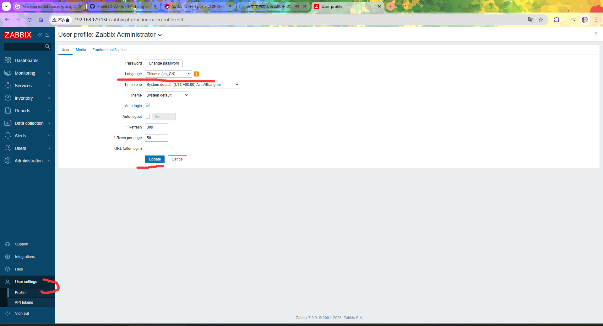
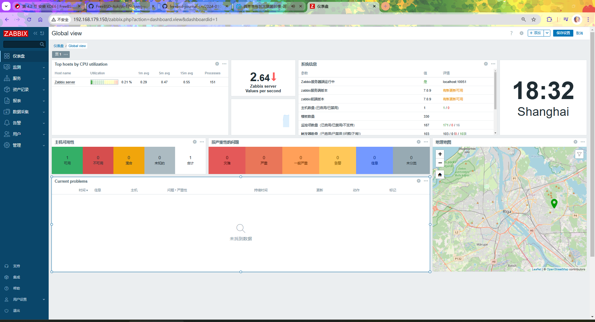

# 35.1 Zabbix 监控系统（基于 PostgreSQL）

Zabbix 是一款企业级分布式开源监控解决方案，可对网络设备、服务器、应用程序及云服务进行实时监控与告警。本节采用 Ports 方式，基于 PostgreSQL 给出完整安装与配置步骤。

## 安装 zabbix7-server

zabbix7-server 是服务器端（Zabbix Server），负责接收和处理监控数据，应安装在监控服务器上。

通过 pkg 安装将额外引入 MySQL 依赖，并可能导致绑定冲突，因此建议采用 Ports 方式安装，以更精确地控制依赖关系与配置选项。

```sh
# cd /usr/ports/net-mgmt/zabbix7-server/
# make config
```


依照图示配置，选中 `PGSQL` 选项后确认，随后执行编译安装命令，编译过程较为耗时：

```sh
# make install clean
```

## 安装 PostgreSQL

Zabbix 需要数据库以存储监控数据。

PostgreSQL 16 的安装、初始化及服务自启配置请参阅本书相关章节。

## 安装 Nginx

Zabbix 前端需要通过 Web 服务器访问。本节使用 Nginx 作为 Web 服务器。Nginx 的安装与服务自启配置请参阅本书相关章节。

## 安装 zabbix7-frontend

zabbix7-frontend 为 Web 前端（Zabbix Frontend），提供图形化的监控管理界面。

采用 pkg 安装：

```sh
# pkg install zabbix7-frontend-php83
```

上述安装过程将自动安装 PHP，本节安装的版本为 PHP 8.3。Zabbix 7.0.10 起也正式支持 PHP 8.4，如需使用可改用 `zabbix7-frontend-php84` 及相应的 php84 扩展包。具体可用版本可查阅 [zabbix7-frontend](https://www.freshports.org/net-mgmt/zabbix7-frontend)，该站点提供最新的包信息与兼容性说明。

也可采用 Ports 方式安装：

```sh
# cd /usr/ports/net-mgmt/zabbix7-frontend/
# make install clean
```

## PDO

Zabbix 前端需经 PHP 访问 PostgreSQL 数据库，因此必须安装相应的 PHP 数据库扩展。PDO（PHP Data Objects）是 PHP 访问数据库的统一接口。PHP 版本需与 Zabbix 前端兼容。

使用 pkg 安装 PHP 数据库扩展：

```sh
# pkg install php83-pdo_pgsql php83-pgsql
```

也可采用 Ports 方式安装 PHP 数据库扩展：

```sh
# cd /usr/ports/databases/php83-pdo_pgsql/ && make install clean
# cd /usr/ports/databases/php83-pgsql/ && make install clean
```

## 安装 zabbix7-agent

zabbix7-agent 为 Zabbix 的客户端代理程序，负责在被监控主机上采集监控数据并发送至 Zabbix Server。应安装在需要被监控的主机上，可部署于多台主机以实现分布式监控。

使用 pkg 安装 zabbix7-agent：

```sh
# pkg install zabbix7-agent
```

也可采用 Ports 方式安装 zabbix7-agent：

```sh
# cd /usr/ports/net-mgmt/zabbix7-agent/
# make install clean
```

## 守护进程

需将相关服务配置为系统启动时自动运行。

```sh
# service zabbix_server enable   # 将 Zabbix Server 服务配置为系统启动时自动运行
# service zabbix_agentd enable   # 将 Zabbix Agent 服务配置为系统启动时自动运行
# service php_fpm enable         # 将 PHP-FPM 服务配置为系统启动时自动运行
```

## 设置 PostgreSQL 数据库

需要在 PostgreSQL 中创建专门的数据库和用户供 Zabbix 使用，并导入 Zabbix 的初始数据。PostgreSQL 数据库初始化完成后，执行以下命令：

```sql
$ cd /usr/local/share/zabbix7/server/database/postgresql/             # 进入 Zabbix PostgreSQL 数据库初始化脚本目录
$ psql                                     # 启动 PostgreSQL 命令行客户端
psql (16.8)
Type "help" for help.

template1=# create database zabbix;                 -- 创建 zabbix 数据库
CREATE DATABASE

template1=# CREATE USER zabbix WITH PASSWORD 'your_strong_password';  -- 创建用户 zabbix 并设置强密码
CREATE ROLE

postgres=# GRANT USAGE, CREATE on SCHEMA public to zabbix;  -- 授权 zabbix 用户使用 public 模式并创建对象
GRANT

postgres=# GRANT ALL PRIVILEGES ON DATABASE zabbix TO zabbix;  -- 授权 zabbix 用户对 zabbix 数据库所有权限
GRANT

postgres=# ALTER DATABASE zabbix owner to zabbix;   -- 将 zabbix 数据库所有权转给 zabbix 用户
ALTER DATABASE

postgres=# \q                                     -- 退出 PostgreSQL 命令行
```

> **技巧**
>
> 上述示例中的 `your_strong_password` 为占位符，需要替换为实际的强密码。

必须先退出当前会话，再以正确的用户权限继续后续操作：

```text
$ psql -U zabbix zabbix # 使用用户账户 zabbix 登录到数据库 zabbix
psql (16.8, server 16.7)
Type "help" for help.

zabbix=> \i schema.sql -- 在 zabbix 数据库中执行 schema.sql 脚本以创建数据库结构
CREATE TABLE
CREATE INDEX
CREATE TABLE
CREATE INDEX
CREATE TABLE

……此处省略部分内容……

zabbix=> \i images.sql
INSERT 0 1
INSERT 0 1
INSERT 0 1
INSERT 0 1
INSERT 0 1

……此处省略部分内容……

zabbix=> \i data.sql
START TRANSACTION
INSERT 0 4
INSERT 0 1
INSERT 0 2

……此处省略部分内容……

zabbix=# \q -- 退出
$ exit # 退出数据库用户
root@ykla:~ #
```

### 参考文献

- ShowMe.Codes. PostgreSQL15 Public Schema 没有权限问题解决[EB/OL]. [2026-03-25]. <https://showme.codes/zh-cn/2024-01-01-postgresql15-public-schema-permission/>. 详述了 PostgreSQL 15+ 中 public schema 权限变更及解决方案。

## 设置 Zabbix Server

需要配置 Zabbix Server 的主要配置文件，以连接 PostgreSQL 数据库。

目录结构：

```sh
/
├── usr
│   └── local
│       ├── etc
│       │   └── zabbix7
│       │       ├── zabbix_server.conf     # Zabbix Server 配置文件
│       │       └── zabbix_agentd.conf     # Zabbix Agent 配置文件
│       ├── share
│       │   └── zabbix7
│       │       └── server
│       │           └── database
│       │               └── postgresql    # Zabbix PostgreSQL 数据库初始化脚本
│       └── www
│           └── zabbix7
│               └── conf
│                   ├── zabbix.conf.php           # Zabbix 前端配置文件
│                   └── zabbix.conf.php.example   # Zabbix 前端配置示例
└── var
    └── log
        └── zabbix
            ├── zabbix_server.log        # Zabbix Server 日志
            └── zabbix_agentd.log        # Zabbix Agent 日志
```

Zabbix Server 的主要配置文件位于 **/usr/local/etc/zabbix7/zabbix_server.conf**。

添加以下内容：

```ini
SourceIP=127.0.0.1           # Zabbix Server 发起连接时使用的源 IP 地址
LogFile=/var/log/zabbix/zabbix_server.log   # Zabbix Server 日志文件路径
DBHost=                        # 数据库主机地址，留空表示通过 UNIX 域套接字连接本地主机
DBName=zabbix                  # Zabbix Server 使用的数据库名称
DBUser=zabbix                  # 数据库用户名
DBPassword=your_strong_password  # 数据库用户密码（与上文创建的密码保持一致）
Timeout=4                      # Zabbix Server 与数据库或代理的超时时间（秒）
LogSlowQueries=3000            # 记录超过指定毫秒数的慢查询
StatsAllowedIP=127.0.0.1       # 允许访问 Zabbix Server 统计信息的 IP
```

## 设置 Zabbix Agent

需要配置 Zabbix Agent 的主要配置文件，以与 Zabbix Server 通信。Zabbix Agent 的配置文件位于 **/usr/local/etc/zabbix7/zabbix_agentd.conf**。

添加以下内容：

```ini
LogFile=/var/log/zabbix/zabbix_agentd.log   # Zabbix Agent 日志文件路径
SourceIP=127.0.0.1                          # Zabbix Agent 使用的源 IP 地址
Server=127.0.0.1                            # Zabbix Server IP 地址，被动检查
ServerActive=127.0.0.1                      # Zabbix Server IP 地址，主动检查
Hostname=ykla                               # 当前主机在 Zabbix Server 中的主机名
```

## 配置 Zabbix 前端

需要配置 Zabbix 前端的配置文件，以连接 PostgreSQL 数据库。Zabbix 前端配置文件模板位于 **/usr/local/www/zabbix7/conf/zabbix.conf.php.example** 文件（Zabbix Frontend 配置模板）。

复制 Zabbix 示例配置文件为正式配置文件：

```sh
# cp /usr/local/www/zabbix7/conf/zabbix.conf.php.example /usr/local/www/zabbix7/conf/zabbix.conf.php
```

编辑 **/usr/local/www/zabbix7/conf/zabbix.conf.php** 文件，将：

```ini
$DB['TYPE']                             = 'MYSQL';
$DB['SERVER']                   = 'localhost';
$DB['PORT']                             = '0';
$DB['DATABASE']                 = 'zabbix';
$DB['USER']                             = 'zabbix';
$DB['PASSWORD']                 = '';
```

修改如下：

```ini
$DB['TYPE']     = 'POSTGRESQL';   # 数据库类型设置为 PostgreSQL
$DB['SERVER']   = 'localhost';    # 数据库服务器地址
$DB['PORT']     = '0';            # 数据库端口，0 表示使用默认端口
$DB['DATABASE'] = 'zabbix';       # 数据库名称
$DB['USER']     = 'zabbix';       # 数据库用户名
$DB['PASSWORD'] = 'your_strong_password';  # 数据库用户密码
```

> **提示**
>
> 以上配置适用于本地开发测试环境。生产环境中建议：
>
> - 为 Zabbix Server、Agent 及 Web 前端之间的通信启用 TLS 加密
> - 使用 Nginx 反向代理配置 HTTPS，避免监控数据和登录凭证明文传输

### 配置 Nginx

需要配置 Nginx 以提供 Zabbix 前端的 Web 访问服务。备份原有 Nginx 主配置文件：

```sh
# cp /usr/local/etc/nginx/nginx.conf /usr/local/etc/nginx/nginx.conf.simple
```

编辑 **/usr/local/etc/nginx/nginx.conf** 文件，替换原有内容，修改如下：

```nginx
worker_processes 1;                              # 工作进程数量
events {
  worker_connections 1024;                       # 单个工作进程允许的最大连接数
}
http {
  include             mime.types;                # 引入 MIME 类型定义文件
  default_type        application/octet-stream; # 默认 MIME 类型
  sendfile            on;                        # 启用 sendfile 提高静态文件传输效率
  keepalive_timeout   65;                        # keepalive 超时时间（秒）
  server {
    listen            80;                        # 监听 HTTP 80 端口
    server_name       localhost;                 # 虚拟主机名称
    root /usr/local/www/zabbix7;                # 网站根目录
    index index.php index.html index.htm;        # 默认首页文件顺序
    location / {
      try_files $uri $uri/ =404;                # 请求文件不存在时返回 404
    }
    location ~ \.php$ {                           # 匹配 .php 文件请求
      fastcgi_split_path_info ^(.+\.php)(/.+)$; # 分割 PATH_INFO
      fastcgi_param SCRIPT_FILENAME $document_root$fastcgi_script_name; # PHP 脚本路径
      fastcgi_param PATH_INFO $fastcgi_path_info;                         # 设置 PATH_INFO
      fastcgi_param REMOTE_USER $remote_user;                             # 设置 REMOTE_USER
      fastcgi_pass   127.0.0.1:9000;                                      # FastCGI 服务地址
      fastcgi_index index.php;                                            # 默认 FastCGI 索引文件
      include fastcgi_params;                                             # 引入 FastCGI 参数文件
    }
  }
}
```

## 配置 PHP

需配置 PHP 以满足 Zabbix 前端的运行要求。

### 编辑 **/usr/local/etc/php.ini-production** 文件

将生产环境 PHP 配置文件复制为默认配置文件：

```sh
# cp /usr/local/etc/php.ini-production /usr/local/etc/php.ini
```

编辑 **/usr/local/etc/php.ini** 文件：

- 找到 `;date.timezone =` 修改为 `date.timezone = Asia/Shanghai`（需要删除原行首的分号 `;`）
- 找到 `post_max_size = 8M` 修改为 `post_max_size = 16M`
- 找到 `max_execution_time = 30`，修改为 `max_execution_time = 300`
- 找到 `max_input_time = 60`，修改为 `max_input_time = 300`

## 启动服务

所有配置完成后，需要按顺序启动相关服务，确保 Zabbix 监控系统正常运行。

```sh
# service postgresql restart    # 重启 PostgreSQL 服务
# service php_fpm start         # 启动 PHP-FPM 服务
# service nginx start           # 启动 Nginx 服务
# service zabbix_server start   # 启动 Zabbix Server 服务
# service zabbix_agentd start   # 启动 Zabbix Agent 服务
```

## 登录

服务启动成功后，可通过浏览器访问 Zabbix Web 前端完成登录与配置。Zabbix Web 前端的默认用户名和密码如下：

- 用户名：`Admin`
- 密码：`zabbix`

> **提示**
>
> 默认密码为公开信息，请登录后立即在「用户设置 → 修改密码」中更改为强密码。


## 配置中文

登录 Zabbix 后，可将界面语言设置为中文。






## 故障排除与未竟事宜

Zabbix 运行过程中如果出现异常，可通过查看相关日志文件排查。本节同时列出了若干待完善的事项。

### 日志

Zabbix 的日志文件分布在以下路径。

- 代理：**/var/log/zabbix/zabbix_agentd.log** 文件
- 服务器端：**/var/log/zabbix/zabbix_server.log** 文件
- PHP 相关错误：**/var/log/nginx/error.log** 文件

### 待解决

以下为若干待研究的问题：

- 中文显示乱码；
- 部分监控项未显示；
- HTTP 等安全配置有待完善。

## 参考文献

- FreeBSD Foundation. Monitor Your Hosts with Zabbix[EB/OL]. (2024-01)[2026-03-25]. <https://freebsdfoundation.org/our-work/journal/browser-based-edition/networking-10th-anniversary/practical-ports-monitor-your-hosts-with-zabbix/>. 提供了 FreeBSD 上 Zabbix 监控部署的完整实践指南。
