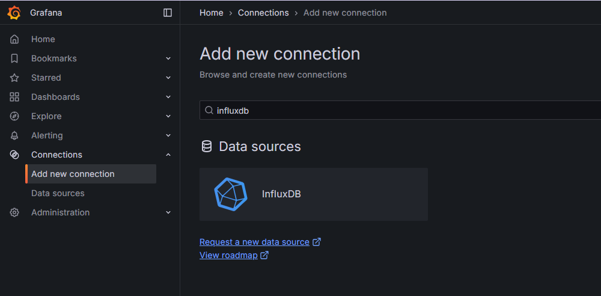
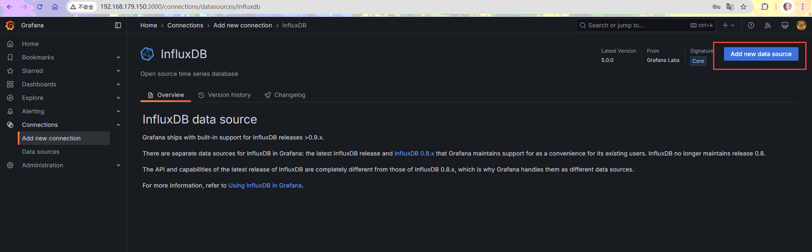
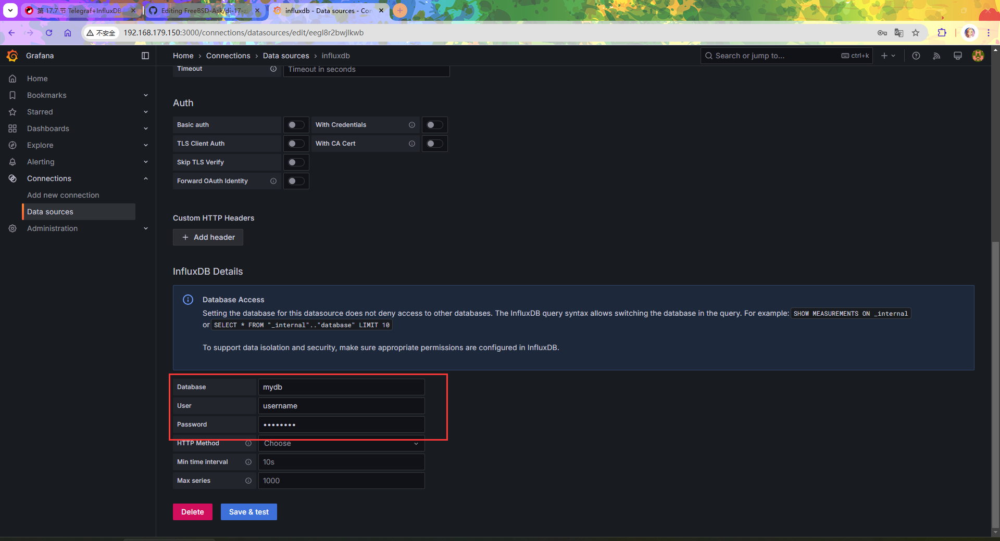
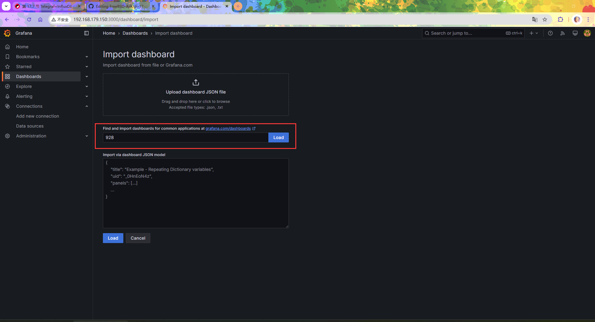
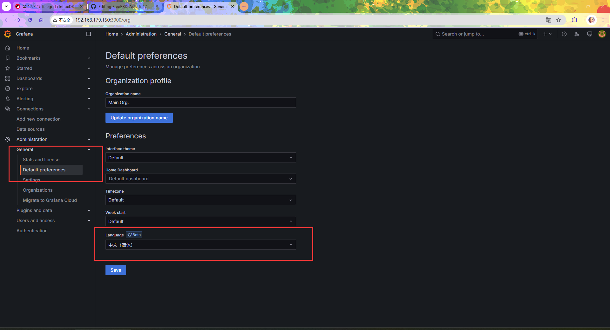

# 37.3 Telegraf、InfluxDB 与 Grafana 监控平台架构

系统监控是运维管理和性能优化的基础，通过实时采集、存储和可视化系统指标，可预警故障、分析性能、规划容量。

该架构属于 TIG 技术栈（Telegraf、InfluxDB、Grafana），是一套开源监控平台体系，遵循数据采集、存储与可视化分离的设计原则。

其中 InfluxDB 作为时序数据库负责高效存储监控数据，Telegraf 作为插件化的采集代理负责指标收集，Grafana 则提供可视化能力。

```sh
  FreeBSD 系统指标
  (CPU/内存/磁盘等)
         │
         │ 采集
         ▼
     Telegraf
   (采集代理)
         │
         │ 写入
         ▼
    InfluxDB
  (时序数据库)
         │
         │ 查询
         ▼
     Grafana
    (可视化)
```

## InfluxDB 安装与配置

InfluxDB 是一款存储和分析时间序列数据的开源数据库。FreeBSD Ports 中提供的版本为 1.8.10，该版本仍可使用，但 InfluxData 官方已推荐用户迁移至 InfluxDB 3.x。InfluxDB OSS v1 主线仍处于维护状态，最新版本为 v1.12.x。

### 安装 InfluxDB

使用 pkg 包管理器安装：

```sh
# pkg install influxdb
```

或者使用 Ports 方式安装：

```sh
# cd /usr/ports/databases/influxdb/
# make install clean
```

### 服务管理

安装完成后，需将 InfluxDB 服务配置为系统启动时自动运行并启动服务。

将 InfluxDB 服务配置为系统启动时自动运行：

```sh
# service influxd enable
```

启动 InfluxDB 服务：

```sh
# service influxd start
```

### 修改 InfluxDB 配置

如需自定义配置，可修改 InfluxDB 的配置文件 **/usr/local/etc/influxd.conf**。

修改完成后重启 InfluxDB 服务：

```sh
# service influxd restart
```

### 创建 InfluxDB 数据库

需在 InfluxDB 中为 Telegraf 创建数据库和用户。

```sql
# influx # 连接到 InfluxDB 数据库
Connected to http://localhost:8086 version 1.8.10
InfluxDB shell version: 1.8.10
> CREATE DATABASE mydb -- 创建 InfluxDB 数据库
> CREATE USER username WITH PASSWORD 'password' -- 创建数据库用户及密码，此处用户名为 username，密码为 password
> SHOW DATABASES -- 查看数据库
name: databases
name
----
_internal
mydb
>
> quit -- 退出 InfluxDB shell
```

> **技巧**
>
> 上述示例中的 `username`、`password` 为占位符，需要替换为实际的值。

## Telegraf

Telegraf 是一款采集和报告指标的代理程序。

### 安装 Telegraf

使用 pkg 包管理器安装：

```sh
# pkg install telegraf
```

或者使用 Ports 方式安装：

```sh
# cd /usr/ports/net-mgmt/telegraf/
# make install clean
```

### 加入启动项

安装完成后，需将 Telegraf 服务配置为系统启动时自动运行。

将 Telegraf 服务配置为系统启动时自动运行：

```sh
# service telegraf enable
```

此时暂不启动 Telegraf 服务。

### 配置 InfluxDB 连接

目录结构：

```sh
/usr/local/
└── etc/
    ├── influxd.conf              # InfluxDB 配置文件
    └── telegraf.conf             # Telegraf 配置文件
```

需要配置 Telegraf，以将采集的数据发送到 InfluxDB。此处使用的是 InfluxDB 1.8 版本。

需要在配置文件 **/usr/local/etc/telegraf.conf** 中做如下修改：

```ini
# 配置 InfluxDB 连接信息（需与上文创建的数据库账号密码一致）
[[outputs.influxdb]]        # 输出插件类型为 InfluxDB
  urls = ["http://127.0.0.1:8086"]  # InfluxDB 服务地址
  database = "mydb"                 # 要写入的数据库名称
  username = "username"             # 数据库用户名
  password = "password"             # 数据库密码
```

### 配置采集指标

需配置 Telegraf 的采集指标。配置文件路径为 **/usr/local/etc/telegraf.conf**：

此处收集系统的 CPU、磁盘（disk）、磁盘 IO（diskio）、内存（memory）、交换空间（swap）等指标。以下是 Telegraf 配置文件中的部分内容，其中部分参数默认启用，部分参数需手动取消注释。

```ini
# CPU
[[inputs.cpu]]

# 内存
[[inputs.mem]]

# swap
[[inputs.swap]]

# 磁盘
[[inputs.disk]]
  ignore_fs = ["tmpfs", "devtmpfs", "devfs", "iso9660", "overlay", "aufs", "squashfs"]

# 磁盘 IO
[[inputs.diskio]]

# 进程
[[inputs.processes]]

# 系统（运行时长等）
[[inputs.system]]

# 网络
[[inputs.net]]
```

### 启动服务

所有配置完成后，可启动 Telegraf 服务开始采集数据。

启动 Telegraf 服务：

```sh
# service telegraf start
```

## Grafana

Grafana 是一款开源的数据可视化和监控平台，可将 InfluxDB 等数据源中的数据以图表形式展示。

### 安装 Grafana

使用 pkg 包管理器安装：

```sh
# pkg install grafana
```

使用 Ports 方式安装 Grafana：

```sh
# cd /usr/ports/www/grafana/
# make install clean
```

### 守护进程

安装完成后，需将 Grafana 服务配置为系统启动时自动运行并启动服务。

将 Grafana 服务配置为系统启动时自动运行：

```sh
# service grafana enable
```

启动 Grafana 服务：

```sh
# service grafana start
```

### 登录 Grafana

Grafana 服务启动后，可通过浏览器访问其 Web 界面配置。Grafana 的默认登录地址为 `http://localhost:3000`。


- 默认登录用户名和密码：
  - Username（用户名）：`admin`
  - Password（密码）：`admin`


登录后系统将提示修改密码。

> **提示**
>
> 以上配置适用于本地开发测试环境。生产环境中建议为各组件通信启用 TLS 加密：Telegraf 输出插件支持 HTTPS、Grafana 建议配置 TLS 证书、InfluxDB 建议配置 HTTPS 端点。

### 配置数据源

需要在 Grafana 中配置数据源，以从 InfluxDB 读取数据。

- 登录后点击左上角的 **Connections** -> 选择 **Add new connection**


- 在右边的输入框中输入 `InfluxDB` -> 选择搜索结果中的 **InfluxDB**，点击



- 点击右上角的 **Add new data source** 按钮 -> 配置 InfluxDB 相关的内容。



- 在数据源配置页面填写相关的 InfluxDB 连接信息，需配置内容如下：

> **注意**
>
> 上面使用的是 InfluxDB 1.8，查询语言必须选择 `InfluxQL`（默认选项）

`URL` 输入：`http://localhost:8086`。


在数据源配置中，Database 输入 `mydb`，User 输入 `username`，Password 输入 `password`（这些值在创建 InfluxDB 数据库时设置）。



点击 `Save & Test` 按钮保存配置。显示连接成功并已获取数据：


### 配置 Dashboard

数据源配置完成后，可配置 Dashboard 可视化展示监控数据。选择展示数据的 Dashboard，可自行开发，也可使用 [官方模板库](https://grafana.com/grafana/dashboards/) 中社区贡献的仪表板资源。

此处导入 id 为 [928](https://grafana.com/grafana/dashboards/928-telegraf-system-dashboard/) 的模板，该模板专为 Telegraf 系统监控设计，展示系统指标。

- 导入模板，点击右上角的 `+` -> `Import dashboard` 进入导入模板页面。


- 选择 `id` 为 `928` 的模板导入，输入 `928`，再点击“Load”。



选择数据库。


- 模板最终效果


### 设置中文

依次进入 Home -> Administration -> General -> Default preferences -> Language，选择“简体中文”。



## 故障排除与未竟事宜

### 内核、网络、CPU 相关信息均未显示

Telegraf 在 FreeBSD 上通过 gopsutil 库使用 sysctl 等原生接口采集系统指标，不依赖 Linux 的 **/proc** 文件系统。若部分指标未显示，应检查对应输入插件是否已在配置文件中启用，以及 Telegraf 进程是否有足够的权限访问相关 sysctl 变量。

## 参考文献

- InfluxData. InfluxDB 1.x Documentation[EB/OL]. [2026-04-17]. <https://docs.influxdata.com/influxdb/v1/>. InfluxDB 1.x 官方文档，涵盖安装、配置与查询语法。
- InfluxData. InfluxDB 1.8 Release Notes[EB/OL]. [2026-04-17]. <https://docs.influxdata.com/influxdb/v1.8/about_the_project/releasenotes-changelog/>. 记录了 InfluxDB 1.8 系列的最终版本 v1.8.10（2021 年发布），v1.8 系列已不再维护，但 v1 主线仍继续更新。
- InfluxData. Telegraf 1.26 Configuration[EB/OL]. [2026-03-26]. <https://docs.influxdata.com/telegraf/v1.26/configuration/>. 提供 Telegraf 完整配置参数及插件使用说明。
