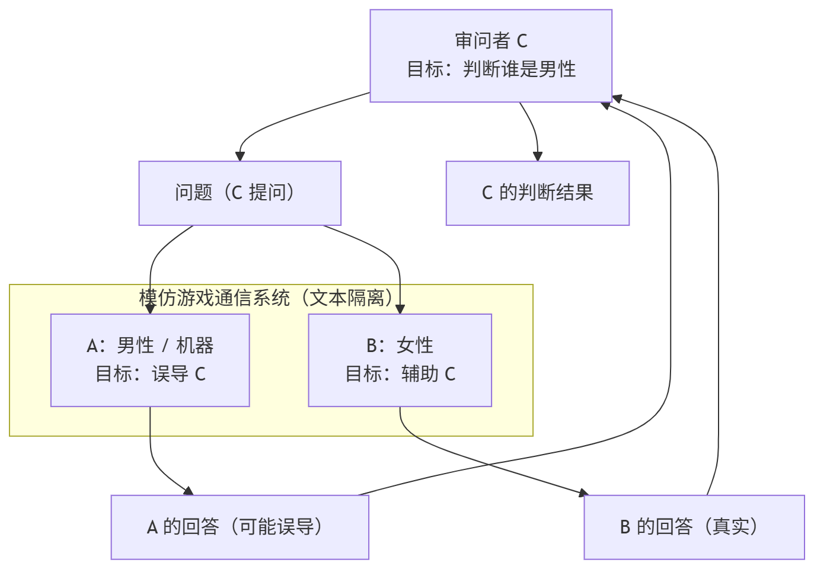
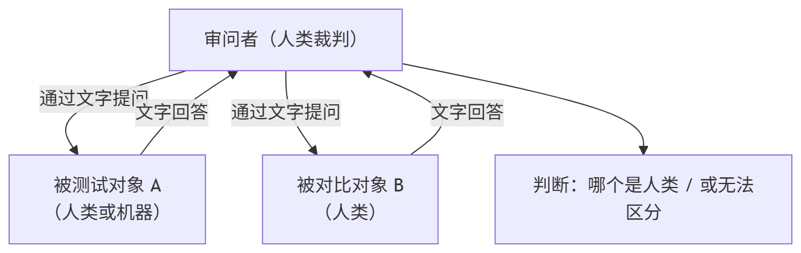
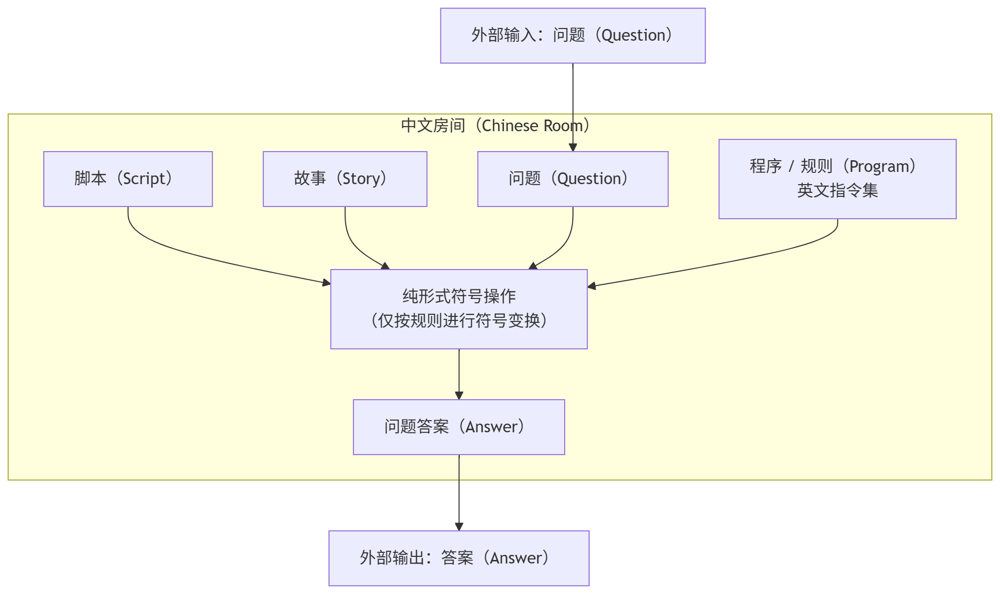

# 39.3 人工智能哲学原著选读

以下摘录与该主题相关的哲学原著原文。

## 人类理智研究

休谟. 人类理智研究[M]. 吕大吉, 译. 北京: 商务印书馆, 1999. ISBN 978-7-100-02618-5.

### 第四章第一节二十三

如果我们要想使自己满意于那种使我们确信实际的事情的确实性的本质，我们就必须研究，我们究竟是怎样得到关于原因与结果的知识的。

我要大胆地提出一个没有例外的一般命题：我们关于因果关系的知识，在任何情况下都不是从 **先验** 的推理获得的，而是完全产生于经验，即产生于当我们看到一切特殊的对象恒常地彼此联结在一起的那种经验。一个人不管他有多么强烈的自然理性和才能，如果在他面前的对象对他说来完全是新的，那末，即使他极其精细地考察它的可感性质，他也不能发现出关于这个对象的任何原因和结果。即使我们假定亚当的理性官能一开始就是十分完美的，他也不能根据水的流动性和透明性而推论出水会把他窒息，或者根据火的光明和温暖就推论出火会把他化为灰烬。任何对象都不能借其呈现于感官的性质，显露其所由产生的原因或由之而生的结果。我们的理性如果离开经验的帮助，也不能作出关于真实的存在和事实的任何推论。

### 第四章第二节二十八

对于我们第一次提出的问题，我们至今尚未得到任何差强人意的解答。每一个解答都仍然会产生一个与过去的问题同样困难的新问题，引导我们作更进一步的研究。如果有人问：**我们关于实际事情的一切推论的本性是什么？** 适当的答复似乎是，这些推论是建立在因果关系之上的。如果再问：**我们关于因果关系的一切推论和结论的基础是什么？** 就可以用一个词来回答：“经验”。但是如果我们再进一步追根究底地问：**由经验得来的一切结论的基础是什么？** 这就包含了一个新问题，这个问题可能更难以解决和解释。

……

### 第四章第二节二十九

下面两个命题绝不是一样的：

>**我曾经见到这样一个事物总是有这样一个结果跟随着。**
>
>**我预先见到别的表面上相似的事物也会有相似的结果跟随着。**

### 第五章第一节三十六

因此，习惯是人类生活中的伟大指南。只有这个原则才能使我们的经验对我们有用，使我们能期待将来出现一连串事件，与过去出现的事件相似。如果没有习惯的影响，我们除了直接呈现于记忆和感觉的东西而外，对于其它的事实就会一无所知；我们就会根本不知道如何使手段适应目的，或者运用我们的自然能力来产生任何效果；一切行动都会立刻终止，思辨的主要部分也会终止了。

### 第七章第二节六十

……

因此，根据这个经验我们就可以将“原因”恰当地定义为：**原因是一种有另一种对象随之而来的对象，并且在所有类似于第一种对象的地方，都有类似于第二种的对象随之而来**。换句话说，如果第一个对象不存在，第二个对象也一定不存在。一种原因的出现，总是凭借习惯性的推移，使心灵转到结果的观念上。对于这一点我们也是有经验的。因此，根据这个经验我们可以给原因再下一个定义：**所谓原因就是一种有另一对象随之而来的对象，它的出现总是使思想转到那另一对象上面。**

……

例如，我们说，这条琴弦的振动，是这个特殊的声音的原因。可是我们下的这个断言是什么意思呢？我们的意思或者是说：**这个振动是有这个声音随之而来的、而且凡是类似的振动都有类似的声音随之而来；或者是说：这个振动有这个声音随之而来，而且振动一出现，心灵就预期着感觉，并且立刻形成声音的观念**。我们可以根据这两点观点中的任一种观点来考察因果关系，除此之外，我们对于因果关系没有任何观念

## 人是机器

心灵的一切作用既然是这样地依赖着脑子和整个身体的组织，那么很显然，这些作用不是别的，就是这个组织本身：这是一架多么聪明的机器！因为即使唯有人才分享自然的法则，难道人因此便不是一架机器么？比最完善的动物再多几个齿轮，再多几条弹簧，脑子和心脏的距离成比例地更接近一些，因此所接受的血液更充足一些，于是那个理性就产生了；难道还有什么别的不成？有一些不知道的原因，总是会产生出那种精致的、非常容易受损伤的良知来，会产生出那种羞恶之感来，而后者距离物质还没有思想距离物质远，总之，会产生出人们在这里所假定的一切差别。那么组织便足以说明一切么？是的，我再说一遍，组织足以说明一切。因为既然思想是很明显地随着器官的发展而发展起来的，那么，那造成器官的物质当随着时间的进展而一旦获得了感觉的功能的时候，为什么不同样可以感受羞恶的感情呢？

——拉·梅特里. 人是机器[M]. 顾寿观译. 北京: 商务印书馆, 2011-7. 54-55. ISBN 978-7-100-07896-2.

## 图灵测试

问题的新形式可以用一种我们称之为“模仿游戏”的游戏来描述。游戏由三个人参与：一名男性（A）、一名女性（B）以及一名审问者（C），审问者可以是任何性别。审问者与另外两人待在不同的房间中。审问者在游戏中的目标是判断哪一个是男性，哪一个是女性。他通过 X 和 Y 这两个标签标记他们，并在游戏结束时说出“X 是 A（男），Y 是 B（女）”或“X 是 B（女），Y 是 A（男）”。审问者可以向 A 和 B 提出如下问题：

C：请 X 告诉我他（她）的头发长度？

假设 X 实际上是 A（男），那么 A（男）也必须回答。在游戏中，A（男）的目标是让 C 做出错误的判断。因此他的回答可能是：

“我的头发层叠式修剪，最长的发丝大约有九英寸长。”

为了避免语音语调帮助审问者判断，应当以书面形式给出答案，最好是打字形式。理想的安排是两个房间之间通过电传打字机通信。或者问题和答案也可以由中间人传递。第三名玩家（B，女）在游戏中的目标是帮助审问者。她的最佳策略很可能是给出真实的答案。她也可以在回答中添加诸如“我是女性，不要听他的！”之类的话，但由于男性也可以做出类似的说法，这没有作用。

现在我们提出问题：“当机器在这个游戏中扮演男性（A）的角色时，会发生什么？”当游戏这样进行时，审问者会像在男女之间进行游戏时一样经常做出错误判断吗？这些问题取代了我们原先的问题：“机器能思考吗？”

——Turing A. M. Computing Machinery and Intelligence[J]. Mind, 1950, LIX(236): 433–460. DOI: 10.1093/mind/LIX.236.433.

模仿游戏结构如下图所示。

图灵本意并非是在构建复杂的沟通系统，因此可以将其简化如下：

~~还是看不懂的话可以去玩“谁是卧底”或者“狼人杀”~~

## 中文房间

测试任何心智理论的一种方法是问自己，如果我的心智真的按照该理论所说的原则运作，会是什么样子。让我们用以下思想实验将这个测试应用到 Schank 程序上。假设我被关在一个房间里，得到一大批中文书写材料。进一步假设（事实上确实如此）我既不懂中文书写，也不懂中文口语，甚至不确定自己能否将中文书写识别为中文，而不是日文书写或毫无意义的符号。对我而言，中文书写只是许多毫无意义的符号。

现在假设，在得到第一批中文书写后，我又得到第二批中文材料，以及一套将第二批与第一批关联的规则。这些规则用英文写成，我像任何其他母语英语者一样理解它们。它们使我能够将一组形式符号与另一组形式符号相关联，这里的“形式”仅指我可以完全根据符号形状来识别它们。

再假设我还得到第三批中文符号，以及一些英文说明，使我能够将第三批元素与前两批关联，并指导我如何根据第三批中给出的某些符号形状返回具有特定形状的中文符号。我并不知道，给我这些符号的人将第一批称为“脚本”，第二批称为“故事”，第三批称为“问题”。此外，他们将我根据第三批返回的符号称为“问题答案”，而他们给我的那套英文规则则称为“程序”。

为了让情境更复杂，想象这些人还给我英文故事，我能理解，然后他们用英文就这些故事向我提问，我用英文回答他们。假设随着时间推移，我在遵循操作中文符号的指令上越来越熟练，程序员在编写程序上也越来越熟练，以至于从外部观察者角度——即关押我的房间之外的人来看——我对中文问题的回答与母语中文使用者完全无法区分。仅凭我的回答，没有人能判断我完全不懂中文。

同样，我对英文问题的回答，也如预期，与其他母语英语者无异，原因很简单，因为我是英语母语者。从外部观察者的角度来看，我对中文问题和英文问题的回答同样出色。但在中文的情况下，与英文不同，我是通过操作未解释的形式符号生成答案的。就中文而言，我完全像计算机一样运作；我对形式化指定的元素执行计算操作。对于中文问题，我只是计算机程序的具体实例。

——Searle J. R. Minds, brains, and programs[J]. Behavioral and Brain Sciences, 1980, 3: 417–457.

中文房间结构如下图所示。

## 哲学研究

维特根斯坦. 哲学研究[M]. 楼巍, 译. 上海: 上海人民出版社, 2019. ISBN: 978-7-208-15748-4.

### §7

在语言的使用实践中，一方喊出那个词，另一方依照它来行动。然而，在语言教学中也会出现这样的事：学习者说出这些对象的名称。换言之就是：当老师指向一种石料的时候，他说出那个词。——确实，这里还会有更简单的练习：学生跟着老师念一个词——这两者都是与说话相类似的事情。

我们也可以设想中使用语言的整件事是某些游戏中的一种，孩子就是通过这些游戏来学习母语的。我想把这些游戏称为“语言游戏”，有时我也将一种原始的语言称为一种语言游戏。

说出石料的名称，跟着念一些词，这些事情也可以被称为语言游戏。想一想词语在跳圈圈游戏中的一些用法吧。

我也会把那个由语言以及与语言交织在一起的那些行为构成的整体称为“语言游戏”。

### §219

“所有的过渡事实上都已经完成”的意思是：我已经没有选择。这个规则一旦被标上了某种特定的意义，就在整个空间中划定了一条遵循规则的线路。——但是就算某个东西真的是这样的，它对我又有什么帮
助呢？

不，我的描述只有被理解为某种象征，才有意义。——我应该说：在我看来是这样的。

当我遵从规则的时候，我并不选择。

我盲目地遵从规则。

### §359

一台机器会思考吗？——它能够有疼痛吗？——好吧，该不该把人体称为这样的一台机器呢？它的确十分接近于这样的一台机器。

### §360

但一台机器肯定是不会思考的！——这是一个经验命题吗？不。只有说到人，以及与人相类似的东西，我们才说他思考。我们也这样说洋娃娃，也许也这样说精灵。请把“思考”一词当作工具！

## 机器人的权利

机器人是否应与我们一样拥有权利？人类具备智慧与自我意识，因而享有权利。如果机器人同样具备这些特质，是否也应享有类似的权利？这些问题颇为复杂，但在不久的将来必然会对现实中的机器人产生实际影响。如果机器人确实具备自我意识，并展现出真正的智能，就必须将其视为有感知的存在，尊重其愿望与需求，正如尊重人类的权利一般。

如果不承认这些非人类智能的权利，就如同早期西方社会没有承认非欧洲人的人性和权利一样。外表的差异绝不能影响我们对有自我意识、会思考的生命的伦理对待。

然而，即便在今天，这种情况仍然存在。仍有一些人否认某些民族的基本权利——生命、自由和追求幸福。那么，有智慧的机器能否有机会争取这些权利？

美国防止机器人虐待协会（American Society for the Prevention of Cruelty to Robots, ASPCR）的目标就是让人们意识到智能、自我意识，以及与之相关的伦理问题，这些问题是智能生命不可分割的一部分。

为此，ASPCR 希望提出《机器人权利法案》，并最终建立一个游说团队，让这些权利在社会中得到推动和保护。

如果认为这过于“科幻”而难以置信，可以回顾 ASPCA（美国防止虐待动物协会）。它于 1866 年成立时，也曾因为敢于主张“愚蠢”的动物也有权利而被人嘲笑。

然而，经过一个多世纪的发展，ASPCA 已成为全美最具影响力的动物保护组织之一，在华盛顿设有活跃的游说团队，年预算数亿美元，拥有庞大的实体机构（包括在纽约州具备执法权的治安官和调查员，并协助检察官工作），确保虐待动物的人不能逍遥法外。

随着有自我意识的人工智能逐渐成为现实，ASPCR 的使命会越来越重要，也有望使我们理所当然享有的权利，同样适用于所有智慧的生命，无论其是否为“人工”创造的。

——ASPCR. Robotic Bill of Rights[EB/OL]. [2026-05-10]. <http://www.aspcr.com/newcss_rights.html>. 美国防止虐待机器人协会官网。

## 课后习题

1. 图灵测试与中文房间思想实验分别从什么角度探讨了“机器能否思考”这一问题？你更认同哪一种观点，为什么？
