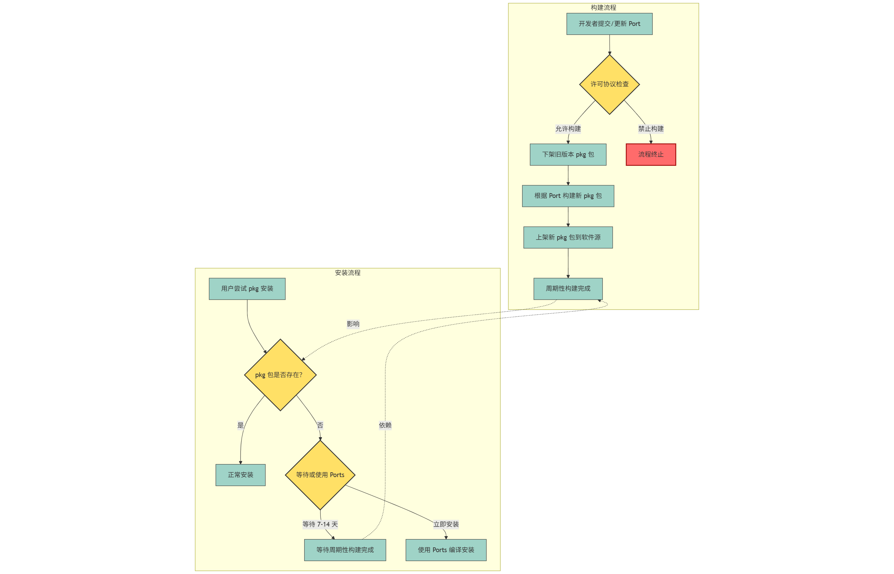

# 4.4 使用 pkg 管理二进制包

FreeBSD 二进制包管理器目前是 pkg，即“Package”，软件包的意思。

`pkg install` 可以缩写成 `pkg ins`，其他类似。

> **注意**
>
> pkg 只能管理第三方软件包，并不能起到升级系统，获取安全更新的作用。这是因为 FreeBSD 项目是把内核与用户空间作为一个整体来进行维护的，而不是像 Linux 那样 linus torvalds 负责维护内核，各个发行版的人负责维护 GNU 工具（他们这些软件实际上被设计为单个软件包，因此可以用包管理器更新与升级系统）。
>
>FreeBSD 现在也正[试图使用 pkg 来实现用户空间和内核的更新](https://wiki.freebsd.org/PkgBase)。解决上述问题。
>
> FreeBSD 使用 `freebsd-update` 来升级系统，获取安全补丁。<https://pkg-status.freebsd.org/> 可以查看当前的 pkg 编译状态。
>
>
> 偏好图形化的用户可以安装使用 `ports-mgmt/octopkg`，该工具是 pkg 的图形化前端，由 ghostbsd 开发。


>**技巧**
>
> 如果需要查询一个软件包在 FreeBSD 中的具体情况可以这样用：谷歌或者必应（必应很多时候搜索不出来）搜索“freebsd ports 包名”。如果无法使用，可以直接在网站里搜索包名 [https://www.freshports.org/](https://www.freshports.org/)。

## 如何从 Port 构建出 pkg



### 书里明确写有某个包，但是 pkg 安装的时候却提示没有

这个问题一般来说有两个回答：

- ① 在 Ports 中的确没有这个 Port：书里写错了、从 Ports 中移除了/改名了等
- ② Ports 中的确有这个 Port：FreeBSD 的 pkg 包是周期性构建的（因为 Ports 本身在更新），会经常存在没有特定 pkg 包存在的情况

具体是哪个问题造成的，建议查询 <https://www.freshports.org>，上面会显示软件包的依赖情况和 pkg 包的构建情况。

本书中一般会同时列出 Ports 安装方式，比如要查 Port `x11/budgie`，你可以这么做：直接访问 <https://www.freshports.org/x11/budgie/>。

一般来说，如果 Ports 中有这个 Port，但是 pkg 安装没有，等待 7-14 天一般就可以了（构建不出来的包系统会自动发报错给维护者的）。如要立刻安装使用，请使用 Ports。

## 安装 pkg

>**技巧**
>
>根据 man [pkg(7)](https://man.freebsd.org/cgi/man.cgi?query=pkg) 页面解释：
>
>>为了避免出现向后兼容问题，实际的 `pkg(8)` 工具不会预装在基本系统中。

基本系统默认没有 pkg，需要先下载一下 pkg：

```sh
root@ykla:/home/ykla # pkg # 输入 pkg  回车
The package management tool is not yet installed on your system.
Do you want to fetch and install it now? [y/N]: y # 请在这里输入 y 或 直接回车
Bootstrapping pkg from pkg+https://pkg.FreeBSD.org/FreeBSD:14:amd64/quarterly, please wait...
Verifying signature with trusted certificate pkg.freebsd.org.2013102301... done
Installing pkg-1.21.3...
Extracting pkg-1.21.3: 100%
pkg: not enough arguments
Usage: pkg [-v] [-d] [-l] [-N] [-j <jail name or id>|-c <chroot path>|-r <rootdir>] [-C <configuration file>] [-R <repo config dir>] [-o var=value] [-4|-6] <command> [<args>]

For more information on available commands and options see 'pkg help'.
```


>**技巧**
>
>如果长时间卡在 `Bootstrapping pkg from ……, please wait...`，请按 **Ctrl + C** 中断这一过程，换境内源后再进行。

>**技巧**
>
>如果提示 `00206176BC680000:error:0A000086:SSL routines:tls_post_process_server_certificate:certificate verify failed:/usr/src/crypto/openssl/ssl/statem/statem_clnt.c:1890:`，请先校准时间。
>
>```sh
># ntpdate -u pool.ntp.org
>```

>**技巧**
>
>pkg 的下载路径是 `/var/cache/pkg/`。


## 列出 pkg 包安装的文件

>**注意**
>
>只能列出已安装的包的文件，未安装的不能用这个命令。

```sh
root@ykla:~ # pkg info -l xrdp
xrdp-0.10.2_2,1:
	/usr/local/bin/xrdp-dis
	/usr/local/bin/xrdp-dumpfv1
	/usr/local/bin/xrdp-genkeymap
	/usr/local/bin/xrdp-keygen
	/usr/local/bin/xrdp-sesadmin
	/usr/local/bin/xrdp-sesrun
	/usr/local/etc/pam.d/xrdp-sesman
	/usr/local/etc/rc.d/xrdp
	……省略一部分……
```


## 安装 python 3


```sh
# pkg install python
```

或

```sh
# cd /usr/ports/lang/python/
# make install clean
```

## pkg 升级软件

```sh
# pkg upgrade
```

错误：`You must upgrade the ports-mgmt/pkg port first`

解决：

```sh
# cd /usr/ports/ports-mgmt/pkg
# make deinstall reinstall
```

## 查看已经安装的所有软件

```sh
# pkg info
```

## 卸载软件

直接使用 `pkg delete` 会破坏正常的依赖关系，应该尽量避免使用（ports 的 `make deinstall` 也一样），转而使用 `pkg_rmleaves` 命令，该命令属于的软件需要自行安装。

```sh
# pkg install pkg_rmleaves
```

或者

```sh
# cd /usr/ports/ports-mgmt/pkg_rmleaves/
# make deinstall
```

### 如何卸载所有自行安装的第三方软件？

```sh
root@ykla:~ # pkg delete -fa # 如果带上参数 f，会把 pkg 自己也删掉，因为 pkg 也是用户一开始自行安装的软件。
Checking integrity... done (0 conflicting)
Deinstallation has been requested for the following 87 packages (of 0 packages in the universe):

Installed packages to be REMOVED:
	alsa-lib: 1.2.12
	brotli: 1.1.0,1
	curl: 8.8.0
……省略一部分……
	pcre2: 10.43
	perl5: 5.36.3_1
	pkg: 1.21.3   # 如果带上参数 f，就会把 pkg 自己也删掉，因为这个 pkg 也是用户一开始自行安装的软件。
	png: 1.6.43
	xorg-fonts-truetype: 7.7_1
	xorgproto: 2024.1
	zstd: 1.5.6

Number of packages to be removed: 87

The operation will free 825 MiB.

Proceed with deinstalling packages? [y/N]: 
```

## 如何查找缺少的 `.so`（适用于 Linux 兼容层）

>**警告**
>
>本部分仅针对 Linux 兼容层缺少 `.so` 的问题。如果你是在 FreeBSD 中遇到了此类问题，应首先更新系统。然后再更新软件源和软件。

### 安装 pkg-provides

```sh
# pkg install pkg-provides
```

或者：

```sh
# cd /usr/ports/ports-mgmt/pkg-provides/ 
# make install clean
```

### 配置 pkg-provides

- 查看配置说明：

```sh
root@ykla:/home/ykla # pkg info -D pkg-provides
pkg-provides-0.7.4:
On install:
In order to use the pkg-provides plugin you need to enable plugins in pkg.
# 要使用 pkg-provides 插件，必须先在 pkg 中启用插件功能。

To do this, uncomment the following lines in /usr/local/etc/pkg.conf file
and add pkg-provides to the supported plugin list:
# 方法是在 /usr/local/etc/pkg.conf 文件中取消以下行的注释，并将 pkg-provides 添加到支持的插件列表中：

PKG_PLUGINS_DIR = "/usr/local/lib/pkg/";
PKG_ENABLE_PLUGINS = true;
PLUGINS [ provides ];
# 插件配置示例，其中 provides 表示启用 pkg-provides 插件。

After that run `pkg plugins' to see the plugins handled by pkg.
# 设置完成后，运行 `pkg plugins` 查看已启用的插件。

On upgrade:
# 升级说明：

To update the provides database run `pkg provides -u`.
# 要更新 provides 数据库，运行 `pkg provides -u`。
```

- 编辑 `/usr/local/etc/pkg.conf`，找到空行，写入：


```sh
PKG_PLUGINS_DIR = "/usr/local/lib/pkg/";
PKG_ENABLE_PLUGINS = true;
PLUGINS [ provides ];
```

- 运行：`pkg plugins`：

```sh
root@ykla:/home/ykla # pkg plugins
NAME       DESC                                          VERSION   
provides   A plugin for querying which package provides a particular file 0.7.4     
root@ykla:/home/ykla # 
```

- 刷新数据库：

```sh
root@ykla:/home/ykla # pkg provides -u
Fetching provides database: 100%   19 MiB   6.6MB/s    00:03    
Extracting database....success
```

### 示例：查找 `libxcb-icccm.so.4`

```sh
root@ykla:/home/ykla # pkg provides libxcb-icccm.so.4
Name    : xcb-util-wm-0.4.2
Comment : Framework for window manager implementation
Repo    : FreeBSD
Filename: usr/local/lib/libxcb-icccm.so.4.0.0
          usr/local/lib/libxcb-icccm.so.4
```


## 故障排除与未竟事宜


### `ld-elf.so.1: Shared object "libmd.so.6" not found, required by "pkg"`

该问题一般是由于软件源未及时同步基本系统 ABI 的变更。

对于一般 RELEASE，更新系统即可。对于 CURRENT/STABLE 系统，重新编译 `pkg` 即可。


- RELEASE

请先切换到 latest 源，再使用软件源里的 pkg 包重装 pkg：

```sh
# pkg-static bootstrap -f
```

若无效，则再：

```sh
# freebsd-update fetch
# freebsd-update install
# pkg-static update -f
# pkg-static upgrade -f pkg
```

- CURRENT/STABLE

```sh
# pkg-static delete -f pkg #强制卸载当前的 pkg
# cd /usr/ports/ports-mgmt/pkg #切换目录
# make BATCH=yes install clean #使用 Ports 重新安装 pkg
```

### `pw: user ‘package’ disappeared during update`

问题示例：

```sh
[1/1] Installing package…
===> Creating groups.
Creating group ‘package’ with gid ‘000’.
===> Creating users
Creating user ‘package’ with uid ‘000’.
pw: user ‘package’ disappeared during update
pkg: PRE-INSTALL script failed
```

问题在于数据库未同步。

刷新数据库：

```sh
# /usr/sbin/pwd_mkdb -p /etc/master.passwd
```

### `Shared object "x.so.x" not found, required by "xxx"`

出现该问题一般是由于 ABI 破坏，更新即可。

安装 `bsdadminscripts2`：

```sh
# pkg install bsdadminscripts2
```

或者

```sh
# cd /usr/ports/ports-mgmt/bsdadminscripts2/ 
# make install clean
```

```sh
# pkg_libchk
doxygen-1.9.6_1,2: /usr/local/bin/doxygen misses libmd.so.6
jbig2dec-0.20_1: /usr/local/bin/jbig2dec misses libmd.so.6
jbig2dec-0.20_1: /usr/local/lib/libjbig2dec.so misses libmd.so.6
```

按照上述软件列表，使用 Ports 逐个重新编译即可（RELEASE 可以直接 `pkg` 更新。）。


#### `bsdadminscripts2` 扩展用法及参考文献


- [BSD Administration Scripts II](https://github.com/lonkamikaze/bsda2)，项目地址，含详细使用说明

- 若使用了 pkgbase，`bsdadminscripts2` 可 **检查系统的完整性**，找出哪些系统文件是被窜改过的：

```sh
root@ykla:/ # pkg_validate
FreeBSD-pkg-bootstrap-15.snap20241004232339: checksum mismatch for /etc/pkg/FreeBSD.conf
FreeBSD-runtime-15.snap20241004232339: checksum mismatch for /etc/group
FreeBSD-runtime-15.snap20241004232339: checksum mismatch for /etc/master.passwd
```

- `bsdadminscripts2` 亦可查找当前系统的过时软件：

```sh
@ykla:/usr/ports # pkg_version -ql\<
akonadi-23.08.5_1
build2-0.17.0
chromium-128.0.6613.137
```

### `Newer FreeBSD version for package pkg`

问题示例：

```sh
Newer FreeBSD version for package pkg:
To ignore this error set IGNORE_OSVERSION=yes
- package: 1402843
- running kernel: 1400042
Ignore the mismatch and continue? [y/N]:
```

这通常发生在失去安全支持的或者在 CURRENT/STABLE 版本的系统上，不影响使用，输入 `y` 即可。

如果想要从根源上解决，需要自己卸载 pkg，从 ports 安装 `ports-mgmt/pkg`；或者从源代码更新整个系统。

如果只是不想看到这个提示：只需要按照提示将 `IGNORE_OSVERSION=yes` 写到 `/etc/make.conf` 里面（没有就新建）就行。

## 参考文献

- [pkg delete -- deletes packages from the database	and the	system](https://man.freebsd.org/cgi/man.cgi?query=pkg-delete&sektion=8&n=1)
