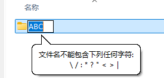
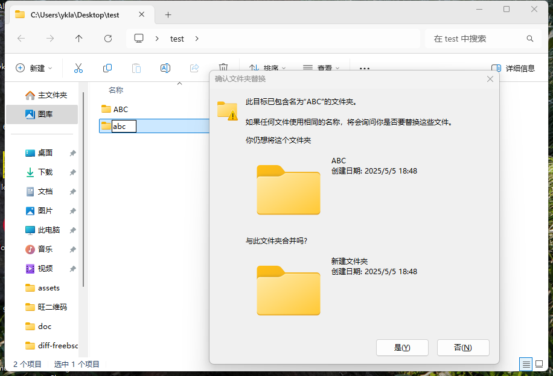

# 4.1 Windows 用户迁移指南


## 文件名规范之差异

### 非法字符

许多在 FreeBSD 中可用的文件或文件名在 Windows 中都是不被允许的（即非法字符）。这些你经常会碰到——如果你使用 Git 在 Windows 上拉取项目。

在这里仅列出一些笔者遇到过的：

- 不能出现英文冒号 `:`



- 不能叫 `con`


更多要求，参见微软官方文档 [命名文件、路径和命名空间](https://learn.microsoft.com/zh-cn/windows/win32/fileio/naming-a-file)。

>**技巧**
>
>你可以在 Windows 下使用 git 工具拉取 [freebsd-doc](https://github.com/freebsd/freebsd-doc) 项目试试看能否成功。我已经报告过 Bug。
>
>[The colon in the file name of the security report of the FreeBSD doc is not compatible with Microsoft Windows](https://bugs.freebsd.org/bugzilla/show_bug.cgi?id=267636)

### 大小写敏感

FreeBSD 的 ZFS 和 UFS 都是 **大小写敏感** 的文件系统。而 macOS 的 HFS+（默认不支持）、APFS（默认不支持）以及 Windows 的 FAT32、NTFS 文件系统都是 **大小写不敏感** 的。

- Windows 下 **大小写不敏感**



可见，abc 和 ABC 无法共存，文件系统认为这是同一个文件。

>**技巧**
>
>判断访问网站服务器类型，最简单的办法就是看网址路径是否是大小写敏感的：如果网站 `https://abc.com/abc` 和 `https://abc.com/ABC` 都能打开且内容一样，那么该网站多半是由 Windows 驱动的。

- FreeBSD 下 **大小写敏感**

```sh
$ touch ABC
$ touch abc
$ ls
abc	ABC
```

可见，abc 和 ABC 可以共存，文件系统认为这是两个不同的文件。


#### 参考文献

- [调整区分大小写](https://learn.microsoft.com/zh-cn/windows/wsl/case-sensitivity)，Windows 文件系统支持使用属性标志按目录设置区分大小写

## 换行符/回车之差异

回车（Carriage Return，CR）和“换行”（Line Feed，LF）是不同的概念，均产生于电传打字机（真 TTY）时代。

- 回车 CR：将光标移动到当前行的开头部分；
- 换行 LF：将光标竖直向下移动到下一行。

可以看到在早期二者是独立的，否则 CRLF 会导致当前行“下沉”一行。

Windows 操作系统默认的文本换行符为 CRLF（即 \\r\\n，0x0D 0x0A，`^M$`），而 Unix（早期 macOS 是 \\r，0x0D）默认使用 LF（即 \\n，0x0A，`$`）。

当然，现在这些符号都出现在每行文本的末尾处（即每行都存在）。

二者是互不兼容的，如果你把 Windows 换行符的文件放到 Unix 下面，可能导致每行末尾多出一个 `^M` 字符，对于某些工具，会造成识别错误，对于 FreeBSD Port 相关文件来说，则会把多行识别为一行。

但是两种换行符可以互相转换。在 FreeBSD 下可以用 Port `converters/dos2unix` 来实现，该软件包含 2 个命令：`dos2unix`（Windows 换行符到 Unix）、`unix2dos`（Unix 换行符到 Windows）。基本用法是 `$ dos2unix -n a.txt b.txt`，如果不需要保留源文件，可以直接 `$ dos2unix a.txt b.txt c.txt`（一次转换多个文件）。可以用命令 `file a.txt` 来判断文件的换行符：

- 使用普通的 Unix 换行符文本文件

```sh
$ file a.txt
a.txt: Unicode text, UTF-8 text
```

- 使用 Windows 换行符的文本文件

```sh
$ file b.txt 
b.txt: Unicode text, UTF-8 text, with very long lines (314), with CRLF line terminators
```

## 字符编码的差异

由于计算机只识别 `0` 和 `1`，故字符编码是一种用于将字符转换为数字表示的规则体系。字符可以是屏幕上可见的文字，也可以是不可见的控制标记，如换行符（LF）、回车符（CR）等，涵盖文本中常见的元素，如数字、Emoji 表情符号、汉字、拉丁字母等。编码方式则是为这些字符分配唯一数字标识（通常是整数），即代码点（code point）的过程。

例如，在 ASCII（American Standard Code for Information Interchange，美国信息交换标准代码，ISO/IEC 646）编码中，`0x41`（即二进制 `0100 0001`）代表大写字母 `A`。ASCII 编码仅支持英文字母、数字及常见英文标点符号——共计支持 128 个字符。

而在 Unicode 编码体系中，“你”这个汉字的代码点是 U+4F60。在 UTF-8（8-bit Unicode Transformation Format，8 位 Unicode 转换格式）编码方式下，它被编码为字节序列 `0xE4 0xBD 0xA0`（二进制为 `11100100 10111101 10100000`）。UTF-8 编码涵盖的字符范围远超 GBK（国家 `G` 标准 `B` 扩展 `K`），里面甚至还有埃及圣书体——如果现在你的屏幕上能看到“𓀀”“𓃕”“𓌊”这三个字符，那么你很可能正在使用 UTF-8 编码（如果你使用的是 UTF-8 编码但仍无法显示这些字符，很可能是字体不支持这些字符集，而非编码问题）。

那么程序如何识别文本的编码呢？通常，有些文件会在开头使用特定的字节序列（即 BOM，byte order mark，字节顺序标记）来标明编码。例如 UTF-8 的 BOM 是 `0xEF 0xBB 0xBF`。但在实际中，很多文本文件并没有 BOM，因此读取程序需要通过上下文猜测编码格式，这往往导致乱码。虽然可以通过程序分析文本内容（如统计字符分布或抽取字符计算）来猜测编码，但这种方法并不总是可靠。编码问题本质上源于系统间默认编码不同或未明确指定编码。

 Windows 默认使用 GBK（如系统语言是简体中文，是 GB2312 的超集），而 Linux 或 UNIX 则使用 UTF-8。

- Windows 11 24H2

```powershell
PS C:\Users\ykla> chcp
活动代码页: 936 # 即 GBK
```

- Ubuntu 24.04/FreeBSD

```sh
root@ykla:/home/ykla# locale charmap
UTF-8
```

其中，FreeBSD 的编码是在 [main/usr.bin/login/login.conf](https://github.com/freebsd/freebsd-src/blob/main/usr.bin/login/login.conf) 这个源文件中设置的，编译出来路径即 `/etc/login.conf`。

自然，也可以把 Windows 10 及后续版本的字符编码设置为 UTF-8。当然，这除了造成更多地编码问题外并不能有效的解决问题。


### 参考文献

- [Code pages](https://learn.microsoft.com/en-us/globalization/encoding/code-pages)，微软官方称，936 即是 GBK。

## 时间与时区的差异

中国统一使用一个时区，东八区，即 UTC+8，UTC（Coordinated Universal Time，协调世界时）时间几乎等同于 GMT（Greenwich Mean Time，格林尼治时间）。UTC 以国际原子时（temps atomique international，TAI）的秒长为基础（并不完全一致）：当铯（Cs）频率 ΔνCs，也就是铯 133 原子不受干扰的基态超精细跃迁频率，以单位 Hz 即 s-1 表示时，取其固定数值为 9 192 631 770 来定义秒——后续又对国际原子时进行了各种修正。

有过 Windows 和 Unix 双系统安装经验的人会发现，Windows 和 Unix 的时间总是差 8 个小时。在现代计算机上（一般在主板上），都有一颗由纽扣电池供电的 RTC（Real-time clock，实时时钟芯片）芯片，用来维护系统断电后的计时。

计算机操作系统在开机时会读取 RTC 的时间来设定系统的时间。RTC 的时间并未标注时区。

Windows 会即直接读取 RTC 的结果，把其当成默认的本地时间，即 Local Time（地方时，当地太阳运行的时间）；Unix 则会把 RTC 的数据视为 UTC 时间：于是你会发现双系统的时间倒流了 8 个小时。

比如，如果 RTC 时间是“2025 年 6 月 6 日白天中午 12:00（即 UTC+8），那么 Windows 下，也是“2025 年 6 月 6 日白天中午 12:00”（即 UTC+8），但在 Unix 下，时间会变为“2025 年 6 月 6 日白天早上 4:00”（即 UTC+8-8）。因为是我们使用 UTC+8，所以二者会相差 8 小时。

对于现代计算机网络来说，时间至关重要，我们可以做个小实验，把时间调慢 5 分钟，打开浏览器，你会发现绝大部分网站都打不开了（HTTPS）。

计算机中的时区是由 IANA 时区数据库规范的，历史悠久。

中华民国二十八年（1939），民国政府将中国划分为五个时区，分为哈尔滨（`Asia/Harbin`）、上海（`Asia/Shanghai`）、重庆（`Asia/Chongqing`）、乌鲁木齐（`Asia/Urumqi`）和喀什（`Asia/Kashgar`）时间。

我们知道，按照实际的地理时区来说，新疆是东六区（虽然全国统一使用北京时间）。从地理上看，新疆与北京时间实际上相差了二个小时。实际上，如果东八区八点太阳出来，那么新疆就是十点才出来。

在时区数据库 2025b 中，`Asia/Harbin`、`Asia/Chongqing`、`Asia/Shanghai` 均等同于北京时间。`Asia/Urumqi` 和 `Asia/Kashgar` 则均为 `UTC+6` 东六区时间。

在 FreeBSD 中，北京时间同样为 `Asia/Shanghai`（东八区）。有些所谓国产操作系统会无中生有一个 `Asia/Beijing`，这不仅是不尊重国际标准与规范的行为，并且会造成严重后果，如造成时间退回到 UTC。

>**注意**
>
>北京（东经 116°）的地方时并不完全等于 UTC+8。我们所述的北京时间不是北京的地方时，而是东经 120 度（上海东经 120°）的地方时。


>**技巧**
>
>中国也曾实行过夏令时（在夏天把表调慢几个小时，因为天亮的早）。


>**思考题**
>
>外太空（飞船，星球等）用什么时区？为什么？

### 参考文献

- [秒的定义](https://www.nim.ac.cn/520/node/4.html)，中国计量科学院载秒的定义
- [Time Zone Database](https://www.iana.org/time-zones)，时区数据库
- [历书基本术语简介](http://www.pmo.cas.cn/xwdt2019/kpdt2019/202203/t20220314_6389637.html#b4)，本文所涉术语，可参考此处中国科学院紫金山天文台的精确解释

## 深入阅读

### Windows

这里有若干书籍可供有意向的读者进一步研究学习 Windows 操作系统设计与实现：

- RUSSINOVICH M, SOLOMON D, IONESCU A, 等. 深入解析 Windows 操作系统：第 7 版. 卷 1 [M]. 刘晖，译. 北京：人民邮电出版社，2021. ISBN: 9787115556943 微软官方教材，具有权威性
- RUSSINOVICH M, SOLOMON D, IONESCU A, 等. 深入解析 Windows 操作系统：第 7 版. 卷 2 [M]. 刘晖，译. 北京：人民邮电出版社，2024. ISBN: 9787115619747 微软官方教材，具有权威性

### 天文历法

- 中国科学院紫金山天文台.2026 年中国天文年历 [M]. 北京：科学出版社，2025. ISBN：9787030825841 注：每年一版。一般日历会写潮起潮落太阳东升西落的时间，该书则是大全
- 胡中为.天文学教程（上）[M]. 上海：上海交通大学出版社，2019. ISBN: 9787313216557 天文学历史悠久，这是本现代天文学入门书籍，本科生教材
- 胡中为.天文学教程（下）[M]. 上海：上海交通大学出版社，2020. ISBN：9787313235725 天文学是一级学科
- DODELSON S, SCHMIDT F. 现代宇宙学 [M]. 于浩然，译. 2 版. 北京：科学出版社，2024. ISBN: 9787030786937 用数学和物理学描述宇宙宏观整体而非具体天体行星
- 卢央.中国古代星占学 [M]. 北京：中国科学技术出版社，2013. ISBN: 9787504661401 中国古代天文学入门，星占学即用哲学或神秘学解释天文学
- CARROLL B W, OSTLIE D A. 当代天体物理学导论 [M]. 姜碧沩，李庆康，高健，等，译. 2 版. 北京：科学出版社，2023. ISBN: 9787030766663 天体物理学即用物理学解释天文学，是现代天文学的核心（还有一些测量、分类、天文历法等不属于此目）

>**思考题**
>
>>对于描述世界，我们有太多种方法。正如马克思所述，“哲学家们只是用不同的方式解释世界……”（《关于费尔巴哈的提纲》第十一段：马克思主义哲学的使命）
>
>你认为通过数学和物理学解释世界的优点是什么？如果排除实用主义和经验主义，还能剩下什么？
>
>你认为通过哲学和神秘学/宗教神学解释世界的缺点是什么？如果排除实用主义和经验主义，还能剩下什么？
>
>>马克思还认为只有必要的自由时间才能确保真正的自由（邓晓芒.马克思论“存在与时间”[J].哲学动态.2000,(6).11-14）：
>>
>>“必须把感性的时间从强制性的、社会一般的抽象时间中解放出来。”
>>
>>“实践也不能被曲解为异化了的生产活动，即类似于动物性的筋肉活动、体力的支出，至少不能把异化劳动当作马克思本来意义上的实践活动。”
>
>你怎样理解这样一个事实：我们 **显然拥有充足的** 自由时间，但是我们仍然 **无法拥有** 所谓的 **“自由”时间** 来了解一些“无意义”的东西（非学者），比如天文学？
>
>我们在不断地刷新短视频阅读网络小说所花费的精力，是否在某种程度上也构成了 **生产活动**？所花费的时间是否在某种意义上构成了 **社会一般（平均）劳动时间**？换言之，这种自由时间的放松，究竟是真正的自由还是一种资本化的假象（实际上仍是另一种形式的工作）？这种自由时间往往被视为对工作的放松，是为了更好地工作，而非单纯实现自由时间；并且我们通过平台获取的快乐和 **工资** 远低于平台从用户获取的算法，个性化数据，内容主体，广告等带来的价值。你怎样看这种对自由时间的资本化异化？

