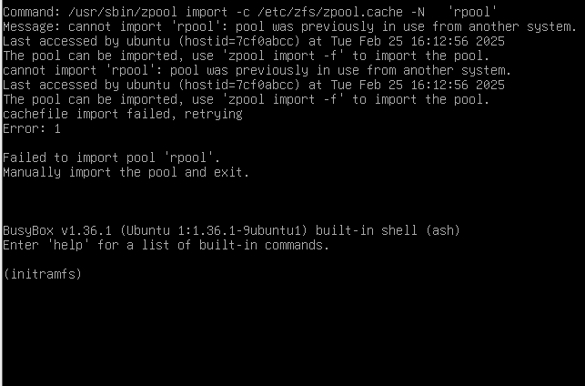

# 4.2 Linux 用户迁移指南

## FreeBSD 技术起源与定位

许多 Linux 体系的核心概念与技术实践，其最初提出者与实践者是 BSD 系统，包括：

- 容器技术的原型可追溯至 FreeBSD Jail 机制（参见 [什么是 Linux 容器？](https://www.redhat.com/zh/topics/containers/whats-a-linux-container) [备份](https://web.archive.org/web/20260122032914/https://www.redhat.com/zh-cn/topics/containers/whats-a-linux-container)）；
- 发行版概念框架（参见 [《FreeBSD：原始操作系统发行版的火炬传承者》](https://book.bsdcn.org/fan-yi-wen-zhang-cun-dang/2025-nian-1-yue/bsd) [备份](https://web.archive.org/web/20260119054752/https://book.bsdcn.org/fan-yi-wen-zhang-cun-dang/2025-nian/bsd)）；
- Gentoo 采用的 Ports 包管理方法论，其技术渊源可追溯至 BSD Ports 框架；
- BSD 是最早的开源理念实践者之一，世界上第一款开源许可证即 BSD 许可证。

## FreeBSD 与 Linux 不同之处

### FreeBSD 并非发行版而是操作系统

FreeBSD 是一个完整的操作系统，包含基本系统（用户空间 + 内核）和 Ports 框架两大部分，二者相互独立。

#### 独立自存的基本系统

freebsd-src = 基本系统存储库 = 用户空间 + 内核

FreeBSD 版本分支分为三个主要系列：

- **CURRENT**：开发版本，对应 main 分支；
- **STABLE**：稳定分支，对应 stable/15 等分支；
- **RELEASE**：正式发布版本，对应 releng/15.0 等分支。

新特性首先提交到 CURRENT，根据需要回溯到 STABLE，再回溯到点版本的 RELEASE。RELEASE 大版本由 CURRENT 经由短期的 STABLE 发展而来。

pkgbase 直接由 freebsd-src 构建：

```sh
# cd /usr/src # 需要预先拉取 freebsd-src 到该路径
# make -j8 buildworld # 世界即用户空间
# make -j8 buildkernel # 内核
# make -j8 packages # 构建 pkgbase 二进制包
```

#### 安装第三方软件的 Ports 框架与 pkg 包管理器

freebsd-ports = 第三方软件集合（单个称为 Port）。

Port 是若干文件的集合，由源码包校验和、说明文件、补丁等构成，其中 Makefile 是核心。Arch 的 PKGBUILD 或 Gentoo 的 ebuild 与此类似，事实上它们是由 Ports 框架衍生出的技术。

pkg 包直接由 freebsd-ports 通过 poudriere 构建系统构建而来。

freebsd-ports 的 main 分支即 latest 源，形如 2026Q1 的分支（最新的那个季度）即 quarter 分支。季度分支直接从 main 按季度切出。

默认基本系统不包含任何 Port 软件，甚至没有 pkg 包管理器本体（传统安装模式）。大多数硬件的固件也从基本系统移到了 Ports。

#### 总结

FreeBSD 整体系统结构符合一般 Windows、安卓或 macOS 用户的直觉。

### init 系统

FreeBSD 使用 BSD init 而非 systemd；BSD init 与传统的 SysVinit 有所不同——FreeBSD 没有运行级别（runlevel），也没有 `/etc/inittab`，均由 rc 系统控制。

当以用户进程身份运行 init 时，可以模拟 AT&T System V UNIX 的行为——超级用户可在命令行中指定所需的运行级别，该 init 进程会向原始的（PID 为 1 的）init 进程发送特定信号，以执行相应操作。例如，在 FreeBSD 中执行 `init 0` 仍然表示关机。参见 [init(8)](https://man.freebsd.org/cgi/man.cgi?query=init&sektion=8&manpath=freebsd-release-ports)。

| 运行级别 | 信号       | 操作说明                             |
|:----------:|:------------|:--------------------------------------|
| 0        | SIGUSR1    | 停止系统运行。                       |
| 0        | SIGUSR2    | 停止系统运行并关闭电源。             |
| 0        | SIGWINCH   | 停止系统运行，关闭电源，然后重新启动。 |
| 1        | SIGTERM    | 进入单用户模式。                     |
| 6        | SIGINT     | 重启计算机。                         |
| c        | SIGTSTP    | 阻止进一步的登录。                   |
| q        | SIGHUP     | 重新扫描终端设备文件（ttys(5)）。   |

### shell

FreeBSD 所有用户的默认 shell 均为 sh（14 之前 root 默认为 csh），而非 bash（如有需要亦可切换）。

### 基本系统去 GNU 化

FreeBSD 基本系统几乎不包含任何与 BSD 协议不兼容的软件。

### 容器技术

许多 Linux 的常用概念最初源于 BSD，例如容器和发行版的概念。

—— [什么是 Linux 容器？](https://www.redhat.com/zh/topics/containers/shenmeshi-linux-rongqi) [备份](https://web.archive.org/web/20260119054228/https://www.redhat.com/zh-cn/topics/containers/whats-a-linux-container)

现在称为容器技术的概念最初出现在 2000 年，当时称为 FreeBSD jail，这种技术可将 FreeBSD 系统分区为多个子系统（也称为 Jail）。Jail 作为安全环境而开发，系统管理员可与企业内部或外部的多个用户共享这些 Jail。2001 年，通过 Jacques Gélinas 的 VServer 项目，隔离环境的实施进入了 Linux 领域。在完成了针对 Linux 中多个受控制用户空间的基础性工作后，Linux 容器开始逐渐成形并最终发展成了现在的模样。2008 年，Docker 项目通过 dotCloud 平台推出其同名的容器技术并进入公众视野。

### 参考文献

- [浅析 Linux 初始化 init 系统，第 1 部分：sysvinit 第 2 部分：UpStart 第 3 部分：Systemd](https://www.cnblogs.com/MYSQLZOUQI/p/5250336.html) [备份](https://web.archive.org/web/20260121094424/https://www.cnblogs.com/MYSQLZOUQI/p/5250336.html)，为存档，原文已佚，系统介绍各初始化系统
- [init -- process control initialization](https://man.freebsd.org/cgi/man.cgi?query=init)，FreeBSD init 系统官方文档
- [Comparison of init systems](https://wiki.gentoo.org/wiki/Comparison_of_init_systems) [备份](https://web.archive.org/web/20260119054306/https://wiki.gentoo.org/wiki/Comparison_of_init_systems)，各大 init 对比图，提供系统选型参考
- [GPL Software in FreeBSD Base](https://wiki.freebsd.org/GPLinBase) [备份](https://web.archive.org/web/20260119053904/https://wiki.freebsd.org/GPLinBase)，FreeBSD 基本系统中的 GPL 软件，梳理系统许可证兼容性

## 基本对比

|   操作系统   |                           发布/生命周期（主要版本）                           |                          主要包管理器（命令）                          |                        许可证（主要）                        | 工具链 |   shell    |     桌面     |
| :----------: | :---------------------------------------------------------------------------: | :--------------------------------------------------------------------: | :----------------------------------------------------------: | :----: | :--------: | :----------: |
|    Ubuntu    |             [2 年/10 年](https://ubuntu.com/about/release-cycle) [备份](https://web.archive.org/web/20260119053423/https://ubuntu.com/about/release-cycle)              |        [apt](https://ubuntu.com/server/docs/package-management)        | [GNU](https://ubuntu.com/legal/intellectual-property-policy) [备份](https://web.archive.org/web/20260120202912/https://canonical.com/legal/intellectual-property-policy) |  gcc   |    bash    |    Gnome     |
| Gentoo Linux |                                   滚动更新                                    |       [Portage（emerge）](https://wiki.gentoo.org/wiki/Portage) [备份](https://web.archive.org/web/20260120154004/https://wiki.gentoo.org/wiki/Portage)        |                             GNU                              |  gcc   |    bash    |     可选     |
|  Arch Linux  |                                   滚动更新                                    |           [pacman](https://wiki.archlinux.org/title/pacman) [备份](https://web.archive.org/web/20260119175658/https://wiki.archlinux.org/title/pacman)            |                             GNU                              |  gcc   |    bash    |     可选     |
|     RHEL     | [3/最长 12 年](https://access.redhat.com/zh_CN/support/policy/updates/errata) | [RPM（yum、dnf）](https://www.redhat.com/sysadmin/how-manage-packages) [备份](https://web.archive.org/web/20260121094407/https://www.redhat.com/en/blog/how-manage-packages) |                             GNU                              |  gcc   |    bash    |    Gnome     |
|   FreeBSD    |               [约 2/4 年](https://www.freebsd.org/security/) [备份](https://web.archive.org/web/20260119053327/https://www.freebsd.org/security/)                |                               pkg/ports                                |                             BSD                              | clang  |   csh/sh   |     可选     |
|   Windows    |       [不固定](https://docs.microsoft.com/zh-cn/lifecycle/faq/windows) [备份](https://web.archive.org/web/20260119054726/https://learn.microsoft.com/zh-cn/lifecycle/faq/windows)        |                                  可选                                  |                             专有                             |  可选  | PowerShell | Windows 桌面 |
|    macOS     |                                 1 年/约 5 年                                  |                                   无                                   |           [专有](https://www.apple.com/legal/sla/) [备份](https://web.archive.org/web/20260117014737/https://www.apple.com/legal/sla/)           | clang  |    zsh     |     Aqua     |

由于 Linux 广泛使用 GNU 工具，因此理论上只要不依赖特定的 Linux 函数库，这些工具都可以在 FreeBSD 上运行。

| Linux 命令/GNU 软件 | BSD Port/命令 |      作用说明      |                                                                                  备注                                                                                   |
| :-----------------: | :-------------------: |  :---------------- | :-------------------------------------------------------------------------------------------------------------------------------------------------------------------------------------- |
|        `lsusb`        |          `sysutils/usbutils`  |   显示 USB 信息    |                                                                            粗略地可以用 `cat /var/run/dmesg`                                                                             |
|        `lspci`        |        `sysutils/pciutils` |    显示 PCI 信息    |                                                                            粗略地可以用 `cat /var/run/dmesg`                                                                             |
|        `lsblk`        |         `sysutils/lsblk`    |  显示磁盘使用情况  |                                                                                            /                                                                                             |
|        `free`        |     `sysutils/freecolor` |  显示内存使用情况  | FreeBSD 未提供 `free` 命令，因为该命令依赖 Linux 特性，通常由 `procps` 包提供。如确实需要 `free`，可使用 `https://github.com/j-keck/free`，其他替代命令包括 `vmstat` |
|        `lscpu`        |        `sysutils/lscpu`    |   显示处理器信息   |                                                                                            /                                                                                             |
|        glibc        |        bsdlibc        |                   C 库        |                                                                                            /                                                                                             |
|         GCC         |     LLVM + Clang      |            编译器、编译链工具 |                                                                              非要用也可以安装 `devel/gcc`                                                                               |
|         `vim`         |            `editors/vim/`    |     文本编辑器     |                                                                  FreeBSD 的 `vi` 不是软链接到 `vim`，而是早期的 `nvi`                                                                   |
|        `wget`         |          `ftp/wget`    |       下载器       |                                                                               系统默认的下载工具是 `fetch`                                                                                |
|        bash         |           `shells/bash`   |       shell        |                                              系统默认的 shell 是 `sh`（非软链接）。你可以自己改。                                             |
|   NetworkManager    |      `net-mgmt/networkmgr`  |    网络连接工具    |                                                                        NetworkManager 依赖 `systemd` 无法直接移植                                                                        |
| `lsmod` | `kldstat` | 列出已加载的内核模块 | / |
| `strace` | `truss` | 跟踪系统调用 | / |
| `modprobe` | 加载内核模块：`kldload`；卸载内核模块：`kldunload` | 加载内核模块、卸载内核模块 | / |

## 附录：GNU/Linux 发行版比较

本附录旨在对主流 GNU/Linux 发行版进行对比分析，帮助读者更全面地了解不同的 GNU/Linux 发行版。

### 发行版的定义与定位

不同的操作系统/发行版，不同的世界观。对"发行版"给出一个精确而统一的定义并不容易。

常见的 Linux 发行版以及一些基于 Linux 的国产操作系统，其维护工作的重点和范围主要体现在哪些方面？它们通常并非文件系统、Linux 内核、GNU C 库（glibc）、systemd、桌面环境等上游项目的原始维护者，对于大量第三方软件包，也往往以集成和适配为主。即使是包管理器和软件源，也大多是在上游工具和社区资源的基础上进行配置与管理。

在长期支持与稳定性方面，红帽企业 Linux（Red Hat Enterprise Linux，RHEL）投入了大量资源，这是其区别于许多其他发行版的重要特征。RHEL 通过保证应用二进制接口（Application Binary Interface，ABI）和内核应用二进制接口（Kernel Application Binary Interface，kABI）的长期稳定性，提供了最长可达十年的支持周期，这与许多其他发行版的支持策略存在明显差异。相关参考如下：

- [Red Hat Enterprise Linux 10: Application Compatibility Guide](https://access.redhat.com/articles/rhel10-abi-compatibility)
- [What is Kernel Application Binary Interface (kABI)?](https://access.redhat.com/solutions/444773)

许多发行版并不直接维护或对上述软件和工具进行全面测试，也不一定为其持续编写补丁或文档。直接将修改回溯并贡献至上游的发行版相对较少，Ubuntu 是其中较为典型的例子。此外，即使发行版维护者有意向向上游贡献代码，也可能面临补丁被接受的挑战，因为其并不对上游项目拥有直接的决策权。

许多商业发行版（如 RHEL）确实向上游项目（例如 Linux 内核）贡献了大量代码，这是客观事实。然而，这并未完全解决基础工具维护资源不足的广泛问题。此外，一些基于提交量的分析表明，商业公司在代码贡献中占据较大比重，红帽是其中的重要贡献者之一。这反映出社区与商业组织在项目贡献与治理上的结构性变化，也揭示着开源社区对开源项目主导权的实质性转移。这一现象常被以 Xorg 项目作为讨论案例，目前其维护和发展方向主要由少数核心维护者和相关组织主导，项目整体重心逐步转向 Wayland 等新的显示技术路线。

### 主流发行版简介

#### Ubuntu

部分用户反馈 Ubuntu 系统中会出现"[内部错误（internal error）](https://www.google.com/search?q=internal+error+ubuntu+site:askubuntu.com) [备份](https://web.archive.org/web/20260120153207/https://www.google.com/sorry/index?continue=https://www.google.com/search%3Fq%3Dinternal%2Berror%2Bubuntu%2Bsite:askubuntu.com%26sei%3D959vaabSCozHkPIP-eblOA&q=EgTP8e5fGPe_vssGIjCj1B3crbT71trbPDKM0-07h3HVs3QNTIjwZULHoK7_a1hyfUlJujeOQip_swusXPsyAVJaAUM)"提示。有观点认为这是 Ubuntu 对错误信息的统一提示方式。需要注意的是，Ubuntu 在开发过程中会阶段性引入 Debian SID（不稳定分支）的软件包。这可能导致其稳定性在特定阶段存在不确定性（无论普通版本还是 LTS）。例如，在跨大版本或小版本升级时，部分用户反馈存在升级失败的风险，即使在初始环境较为干净的系统上也可能会出现。

以下命令可用于查询 Ubuntu 24.04 与 Debian 版本的关联信息：

```bash
ykla@ykla-ubuntu:~$ cat /etc/debian_version	# 查看当前 Debian 系统的版本号
trixie/sid # trixie 即 Debian 13。在当前时间点，Debian 最新的稳定版本是 12 bookworm
ykla@ykla-ubuntu:~$ cat /etc/lsb-release	# 查看当前 Linux 发行版的详细信息
DISTRIB_ID=Ubuntu
DISTRIB_RELEASE=24.04
DISTRIB_CODENAME=noble
DISTRIB_DESCRIPTION="Ubuntu 24.04 LTS"
```

在 VMware Workstation 17 Pro 虚拟机上对 Ubuntu 24.04 LTS 版本（发布于伦敦当地时间 2024 年 4 月 25 日）进行测试时，发现其整体使用体验相较于之前版本有所下降。安装过程中即出现报错，且后续使用中遇到了窗口显示异常、鼠标光标消失、输入框无法获取焦点等问题。安装完成后，系统在开机后频繁弹出"内部错误"提示。




#### Fedora Linux

Fedora 是基于 Red Hat Enterprise Linux（RHEL）的上游发行版，其定位侧重于技术验证和前沿特性测试，根本目的是为 RHEL 系统的新设计和新架构提供试验平台（[该社区由 Red Hat 红帽公司完全主导](https://docs.fedoraproject.org/en-US/council/) [备份](https://web.archive.org/web/20260119053234/https://docs.fedoraproject.org/en-US/council/)）。待特性稳定后，会引入到 RHEL 中。

因此，稳定性并非该发行版的主要设计目标。Fedora 官方的直接跨大版本升级失败率较高。这意味着长期使用后，用户可能需要进行全新安装并重新配置环境。用户难以在该发行版上获得长期的稳定性支持。与基于 Debian 的发行版不同，Fedora 不同大版本之间的软件源通常无法通用，因为软件依赖关系变动频繁。其各版本在定位上更接近于持续迭代的开发分支。其所有版本均包含大量新特性，稳定性表现与持续集成的 [nightly](https://openqa.fedoraproject.org/nightlies.html) [备份](https://web.archive.org/web/20260120154125/https://openqa.fedoraproject.org/nightlies.html) 版本较为接近，差异不大。其稳定性特征与滚动更新发行版有相似之处。

近年来，Fedora 对系统资源的需求有所提升。在 VMware 虚拟机环境中，仅分配 4 GB 内存可能无法顺利完成安装，需要分配 6 GB 至 8 GB 内存才能避免安装过程停滞。

#### CentOS/Rocky Linux/RHEL

CentOS 已从原先基于 RHEL 源代码重建的稳定发行版，转变为 RHEL 的中游开发与测试分支（即 CentOS Stream），其定位与 Fedora 有相似之处。其替代品较多，其中包括获得 UNIX 认证的欧拉（openEuler）操作系统。Rocky Linux 也是其中一个备受关注的替代方案。

这类系统在服务器领域被广泛部署，其特点是以牺牲软件版本的新颖性来换取稳定性，因此所包含的软件版本通常较为陈旧。同样，它们通常不支持直接跨大版本升级，并且在安全更新策略上相对保守。

#### Debian


一个值得注意的现象是，如果在 Debian 安装过程中设置了 root 密码，系统默认可能不会安装 sudo 工具。这一设计通常被认为是出于安全性方面的考虑。但这可能与 GNOME 等桌面环境及大多数登录管理器默认禁止 root 账户直接登录的惯例存在张力。

此外，在部分版本（如 Debian 12.6）中，虽然会安装 sudo，但创建的第一个普通用户默认未被加入 `sudo` 组。这在实际使用中会带来不便，例如该普通用户无法直接通过 sudo 命令重启网络服务。用户需要切换到 tty 控制台登录 root 账户进行操作，这在一定程度上降低了图形界面（GUI）默认安装环境下的使用便利性。

```sh
ykla@debian:~$ sudo su	# 切换到 root 用户
[sudo]ykla 的密码：
ykla 不是 sudoers 文件。
ykla@debian:~$ id	# 显示当前用户的 UID、GID 及所属组信息
uid=1000(ykla) gid=1000(ykla) 组=1000(ykla),24(cdrom),25(floppy),29(audio),30(dip),44(video),46(plugdev),100(users),106(netdev),111(bluetooth),113(Lpadmin),116(scanner)
ykla@debian:~$ hostnamectl	# 显示或设置系统主机名及相关信息
Static hostname: debian
      Icon name: computer-vm
        Chassis: vm
     Machine ID: 9b3107b788dd461f94ca93150474946e
        Boot ID: 081c39d5ac4748fa9ec0b2157c9a5be
 Virtualization: vmware
Operating System: Debian GNU/Linux 12(bookworm)
          Kernel: Linux 6.1.0-22-amd64
    Architecture: x86-64
Hardware Vendor: VMware, Inc.
Hardware Model: VMware Virtual Platform
Firmware Version: 6.00
```

上述问题在实际安装和使用过程中较为明显。例如，安装程序在配置软件源时可能不会同步更新 `debian-security` 源，却默认尝试连接网络进行系统更新（此问题在 Ubuntu 中也存在。鲜为人知的是，在 Debian 高级安装中可绕过该问题），这有时会导致安装失败。

另外，其网络管理工具 [NetworkManager](https://wiki.debian.org/NetworkManager) [备份](https://web.archive.org/web/20260120203128/https://wiki.debian.org/NetworkManager) 与 systemd 在部分功能的集成上可能存在冲突。类似的设计在实际使用中容易引发用户困扰。

Debian Stable 发行版的软件包策略以稳定为主，大部分软件在发布后，其主版本号在生命周期内通常不会升级，软件版本会被锁定，因此应将 Stable 同时理解为"稳定"与"固定"。若用户需要获取更新的软件版本，则需要切换到 Testing 或 Unstable（Sid）分支，但这会牺牲系统的整体稳定性。

综上所述，Debian Stable 发行版以系统稳定著称，同时其软件包版本也相对较旧。在追求稳定性和软件包陈旧度方面，它与 RHEL 有相似之处。

#### openSUSE

在物理机上安装完整的 openSUSE 后，部分用户反馈系统会出现卡顿现象。相关性能问题可能与默认使用的 Btrfs 文件系统的某些特性或配置有关。在多台不同代际的英特尔平台物理机上进行测试，均观察到了卡顿现象。安装后短时间内可能出现系统响应迟缓的情况。因此，不同用户对其使用体验的评价可能存在分歧。有用户通过将根文件系统从 Btrfs 切换为 Ext4 来规避此问题。

openSUSE 因其 Logo 形象，在社区中被昵称为"大蜥蜴"。

其版本号命名曾有一段趣事：为纪念英国作家道格拉斯·亚当斯在《银河系漫游指南》中提到的数字"42"（被誉为"生命、宇宙以及一切事物的终极答案"），openSUSE 将版本号从 13.x 跳跃至 42.x，随后又下调回 15.x。这导致了版本号逻辑上的一个现象：由于 42 大于 15，在特定条件下，从 15.x 升级可能会错误地指向更低的 42.x 版本。

openSUSE 原生的包管理器是 `zypper`。

#### Gentoo Linux

Gentoo [自称](https://www.gentoo.org/get-started/about/) [备份](https://web.archive.org/web/20260119175719/https://www.gentoo.org/get-started/about/)是"元发行版（*Metadistribution*）"。其传统安装方式是从源代码编译所有软件。虽然近年提供了[官方二进制包](https://www.gentoo.org/news/2023/12/29/Gentoo-binary.html) [备份](https://web.archive.org/web/20260120153529/https://www.gentoo.org/news/2023/12/29/Gentoo-binary.html)支持，但在依赖管理方面仍有一定复杂性，且二进制包通用性极为有限。

Gentoo 包管理系统的缺点在于，若某个软件包编译失败，则无法安装，且编译失败的情况时有发生。如果系统长时间不更新，再次更新时可能会遇到复杂的循环依赖问题。此外，Gentoo 难以进行大规模标准化部署，在服务器环境中的应用也相对较少。

此外，Gentoo 的 Portage 包管理器主要由 Python 语言编写。在进行大规模软件集（如 KDE 桌面环境）的依赖计算时，可能会耗费较长时间。在性能有限的处理器上，此计算过程可能需要数分钟至数小时不等，性能开销较为明显。由于可能存在循环依赖等问题，依赖解析过程往往需要多次迭代计算，有时甚至无法自动解决，导致安装操作失败。随着系统中安装的软件包数量增加，包管理操作（如依赖计算）所花费的时间将明显呈几何增长。

简而言之，Gentoo 高度灵活的 USE 标记系统和从源码编译的机制，在给予用户极大控制权的同时，也带来了较高的复杂性。依赖问题（包括循环依赖）可能影响系统稳定性，并使得软件安装、升级和卸载变得困难。

Gentoo 的高度定制化哲学要求用户投入更多精力进行系统管理和维护。

#### Deepin/UOS/中标麒麟

UOS 和 Deepin 的关系类似于 Red Hat Enterprise Linux（RHEL）与 Fedora 的关系，前者基于后者的社区版本进行商业化和深度定制。

Deepin 系统经常因部分更新包测试不充分而饱受用户批评。有反馈称，某些存在问题的更新在推送后未及时撤回，官方仅通过发布修复教程进行处理。这种处理方式影响了用户体验。例如，有用户反馈在全新安装系统后立即升级，便遭遇了系统崩溃。

早期版本中，Deepin 系统在执行如复制文件等基础桌面操作时，曾出现界面卡顿或无响应的情况。

类似更新测试不充分的情况，在 UOS 系统中也有用户反馈。此类情况并非偶发。此外，用户曾遇到 UOS 更新服务器宕机或配置错误导致客户端异常（如浏览器无限弹窗打开几十上百个 UOS 主页）的情况，而官方状态通告有时不够及时。

问题在于 UOS 的许多系统功能（如开发者模式激活）需要在线账户登录并与服务器交互，若服务器连接不稳定，则会直接影响这些功能的使用。

从默认配置策略也可观察到这一问题：UOS 早期版本的默认安装方案仅为系统盘分配约 20 GB 空间，对于日常使用而言容易快速耗尽。用户只能自学成才，在拿到电脑没几周后就被迫重装系统，学习如何自定义分区。而剩下 50% 的其余未分配空间被设计用于系统备份与还原功能，其机制更接近于完整的系统镜像恢复。若用户采用自定义分区方案，则可能失去原厂提供的系统还原功能。

中标麒麟系统曾因未及时修复诸如 ZIP 压缩包解压乱码等常见基础问题而受到用户批评。

一个现实问题是，对于需要离线部署的内网机器，及时安装安全补丁可能存在困难。由于 Linux 系统更新（尤其是涉及底层库时）常存在复杂的依赖关系，在内网固定版本环境中单独安装某个安全补丁，可能会遇到依赖不满足的问题。

#### Arch Linux/Manjaro

Arch Linux 是以滚动更新模式著称的 Linux 发行版，因其高度的可定制性和软件的新颖度吸引了许多用户。

然而，滚动更新模式也意味着系统可能面临更高的不稳定风险。随着系统中安装的软件包数量增加，因依赖冲突或版本不兼容导致问题的概率也可能上升。有观点认为，通过仔细阅读官方更新公告可以规避多数问题。但这要求用户具备较高的主动维护意识和排查能力。

Arch Linux 的主要优势在于软件包版本非常新。Arch Linux 官方仓库（Official Repository）的软件包数量有限，用户通常需要启用 Arch 用户软件仓库（Arch User Repository，AUR）来获取更丰富的软件。而 AUR 源是未经过任何代码审查的（`Warning: AUR packages are user-produced content. These PKGBUILDs are completely unofficial and have not been thoroughly vetted. Any use of the provided files is at your own risk.`）。

AUR 中确实曾发现存在恶意软件包。

#### NixOS

NixOS 是一个采用声明式配置和函数式包管理理念的操作系统。其核心理念是将整个系统的配置集中在声明式文件中，通过锁定依赖实现可重现的系统构建。

NixOS 的主要特点包括：

- **声明式配置**：系统的所有配置集中在一个声明式文件中（如 `/etc/nixos/configuration.nix`）；
- **Flakes**：实验性功能，提供更可重现的依赖管理和项目结构，其锁定文件（`flake.lock`）的作用类似于 `package-lock.json`；
- **可重现性**：基于声明的配置和锁定的依赖，可以精确地复现整个系统环境；
- **无依赖冲突**：通过为每个依赖创建独立存储路径来避免冲突，但这可能导致存储占用较大；
- **可回滚**：每次系统更新都会生成新的系统代际（Generation），允许用户轻松回滚到任意历史版本。

### 参考文献

- [Benefits of Gentoo](https://wiki.gentoo.org/wiki/Benefits_of_Gentoo) [备份](https://web.archive.org/web/20260119180353/https://wiki.gentoo.org/wiki/Benefits_of_Gentoo)，介绍 Gentoo 系统优势与特性
- [The philosophy of Gentoo](https://www.gentoo.org/get-started/philosophy/) [备份](https://web.archive.org/web/20260119053027/https://www.gentoo.org/get-started/philosophy/)，Gentoo 设计哲学，阐述系统设计理念
- [Arch compared to other distributions](https://wiki.archlinux.org/title/Arch_compared_to_other_distributions) [备份](https://web.archive.org/web/20260122123537/https://wiki.archlinux.org/title/Arch_compared_to_other_distributions)，翻译[在这里](https://wiki.archlinuxcn.org/wiki/Arch_%E4%B8%8E%E5%85%B6%E4%BB%96%E5%8F%91%E8%A1%8C%E7%89%88%E7%9A%84%E6%AF%94%E8%BE%83) [备份](https://web.archive.org/web/20260119053802/https://wiki.archlinuxcn.org/wiki/Arch_%E4%B8%8E%E5%85%B6%E4%BB%96%E5%8F%91%E8%A1%8C%E7%89%88%E7%9A%84%E6%AF%94%E8%BE%83)，提供 Arch 与其他发行版对比分析
- 《C++ 语言的设计和演化》，[美] Bjarne Stroustrup，译者：裘宗燕，人民邮电出版社，ISBN 9787115497116，详解 C++ 语言设计理念与演进历程

## 课后习题

1. 在 FreeBSD 中构建一个简单的 Port，编写 Makefile，使其能下载、编译并安装一个最小化的 hello world 程序，验证 Ports 框架。
2. 查看 FreeBSD init 系统源码中 rc 脚本的最小实现，分析其设计如何在简单性与功能完整性之间的权衡，对比 Linux systemd 的设计思路。
3. 修改 FreeBSD 中 wheel 组的默认权限配置，验证其行为变化。
