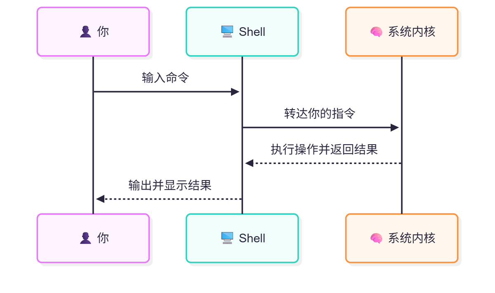

# 4.4 认识 shell

## 什么是 shell



我们的命令是运行在 shell 中的，通过 shell 与系统进行交互。

FreeBSD 默认的 shell 是 sh（Bourne shell，原作者名为 Stephen R. Bourne）。目前已经重写过了，现基本符合 [POSIX.1-2024](https://pubs.opengroup.org/onlinepubs/9799919799/utilities/V3_chap02.html) 中对 shell 的规范。

Linux 中常见的 shell 一般是 bash（Bourne Again SHell，即“又一个 Bourne shell”）。而 macOS 中的默认 shell 通常是 zsh（Z shell）。

>**注意**
>
>Linux 中也存在 sh，但是一般都是被软链接到了 bash 或其他 shell，它们都不是真正的 sh。
>
>- Ubuntu 24.04 LTS 的默认 shell：
>
>```bash
>$ ls -l /bin/sh
>lrwxrwxrwx 1 root root 4  2 月 25 23:19 /bin/sh -> dash
>```

## 快捷键

>**注意**
>
>以下快捷键不一定非要是小写状态才能执行，大写状态下一样可以执行。

### 在 TTY 界面上下翻页/翻行

### 使用 Scroll Lock 键在 TTY 界面上下翻页/翻行

使用 **Scroll Lock** 键（滚动键）：按下 **Scroll Lock** 键后，你可以使用上 ↑/下 ↓ 方向键、**Page Up**/**Page Down** 键来对屏幕进行操作。

不同点：

- 上 ↑/下 ↓ 方向键：使 TTY 界面上下滚动一行
- **Page Up**/**Page Down** 键：使 TTY 界面上下滚动一页

再次按下 **Scroll Lock** 键将退出此模式。

>**技巧**
>
>SL 键在 **HOME** 键上方，PS 截图键 **Print Screen** 右侧，PB 键 **Pause break** 左侧。

事实上，在历史上 **Scroll Lock** 这个按键就是为此而设计的。

### 使用 Shift 组合键在 TTY 界面上下翻页/翻行

使用 **Shift** 快捷键：

- **Shift** + 上 ↑/下 ↓ 方向键——使 TTY 界面上下滚动一行
- **Shift** + **Page Up**/**Page Down** 键——使 TTY 界面上下滚动一页

### 补全命令或目录

一般可以用 **Tab** 键补全命令或目录。上箭头 **↑** 是查看上一条命令，下箭头 **↓** 是查看下一条命令。

- 补全命令
  
```sh
root@ykla:~ # lo # 若此时按 TAB 键，输出如下。可以再输一个字母再按一次 TAB 键看看
local                    localedef                login
local-unbound            locate                   logins
local-unbound-anchor     lock                     logname
local-unbound-checkconf  lockf                    look
local-unbound-control    lockstat                 lorder
local-unbound-setup      locktest                 lowntfs-3g
locale
```

- 补全文件目录或文件名
  
```sh
$ cp /home/ykla/ # 此处按 TAB 键，然后再重复按一次 TAB 键，看看效果
$ cp /home/ykla/test/1.txt
.cache/                 .login                  bin/                    test2
.config/                .profile                HW_PROBE/               test3
.cshrc                  .sh_history             mine
.gitconfig              .sh_history.Y8RqIDNDIv  mydir/
.k5login                .shrc
```

### 终止命令

若想终止命令，可以用 **ctrl**+**c**：

```sh
root@ykla:~ # ping 163.com
PING 163.com (59.111.160.244): 56 data bytes
64 bytes from 59.111.160.244: icmp_seq=0 ttl=52 time=27.672 ms
64 bytes from 59.111.160.244: icmp_seq=1 ttl=52 time=27.580 ms
^C # 注意这里，^C 即代表你在此处按下了 ctrl + c 的组合键，随后命令被终止
--- 163.com ping statistics ---
2 packets transmitted, 2 packets received, 0.0% packet loss
round-trip min/avg/max/stddev = 27.580/27.626/27.672/0.046 ms
```

### 命令后台前台

**ctrl**+**z**: 把当前进程放到后台，然后用 `fg` 命令可回到前台：

```sh
root@ykla:~ # ping 163.com
PING 163.com (59.111.160.244): 56 data bytes
64 bytes from 59.111.160.244: icmp_seq=0 ttl=52 time=27.611 ms
64 bytes from 59.111.160.244: icmp_seq=1 ttl=52 time=27.691 ms
^Z[1] + Suspended               ping 163.com # 注意此处，按下了 ctrl + z
root@ykla:~ # fg # 返回前台
ping 163.com
64 bytes from 59.111.160.244: icmp_seq=3 ttl=52 time=27.465 ms
64 bytes from 59.111.160.244: icmp_seq=4 ttl=52 time=27.586 ms
64 bytes from 59.111.160.244: icmp_seq=5 ttl=52 time=27.522 ms
^C # 按 ctrl + c 结束命令
--- 163.com ping statistics ---
6 packets transmitted, 6 packets received, 0.0% packet loss
round-trip min/avg/max/stddev = 27.465/27.596/27.701/0.085 ms
```

### 其他

- **ctrl**+**l**（L 的小写）：清空屏幕
- **ctrl**+**a**：移动光标到命令行首
- **ctrl**+**e**: 移动光标到命令行尾
