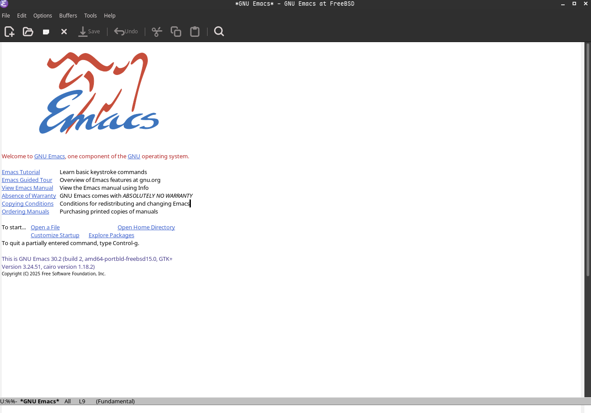

# 4.6 文本编辑器

文本编辑器是类 UNIX 系统（如 FreeBSD）中用于创建、查看、修改纯文本文件的核心工具。无论是编辑 `/etc/rc.conf`、编写脚本还是查看日志，熟练使用合适的编辑器都能极大提升效率。

本节将依次介绍 FreeBSD 中常见的几款文本编辑器，从最简单易上手的内置工具，到功能强大但学习曲线较陡的经典编辑器，再到现代增强版和图形化选择：

| 编辑器          | 类型     | 特点简述                                      |
|-----------------|----------|-----------------------------------------------|
| ee             | 终端     | 内置、极其简单，像记事本，按 ESC 菜单操作      |
| vi             | 终端     | 经典 modal 编辑器，BSD 原生 vi，轻量但命令多   |
| vim            | 终端     | vi 增强版，语法高亮、插件、宏等现代功能        |
| neovim         | 终端     | vim 重构现代版，Lua 配置、异步插件、LazyVim 发行版 |
| emacs          | 终端/图形| 高度可扩展，几乎是“操作系统”，Lisp 配置       |
| microsoft-edit | 图形     | 微软开源，支持中文、鼠标操作、界面友好         |

CLI 编辑器无需图形界面，可在 SSH 远程连接、纯文本控制台中使用，资源占用低。GUI 编辑器提供可视化界面和鼠标支持，更适合桌面环境。

## ee 编辑器

`ee` 是 FreeBSD 基本系统内置的编辑器。

`ee` 的用法比 [nano](https://www.redhat.com/zh/blog/getting-started-nano) [备份](https://web.archive.org/web/20260121060144/https://www.redhat.com/zh-cn/blog/getting-started-nano)（一款 GNU 编辑器）还要简单许多，从其名字“easy editor”（简单的编辑器）即可看出。

比如使用 ee 编辑器打开 `a.txt` 文件：

```sh
# ee a.txt
```

可以直接进行编辑，用法与 `nano` 或 Windows 记事本类似。

按 **ESC 键** 会显示提示框，再按两次 **回车键** 即可保存。

## Vi / Vim / NeoVim 编辑器

FreeBSD 还内置了一款编辑器 `vi`（实际为 `nvi`，New vi，是 4.4BSD 的重新实现）。与大多数 Linux 发行版将 `vi` 链接到 `vim` 不同，BSD 系统提供的是原生 `vi`，其用法较为复杂但功能强大。

### 基本 vi 使用

打开 `vi` 后默认处于**命令模式**，此时输入 `i` 可以进入**插入模式**（文本模式），从而进行文本编辑。注意：在插入模式下，**退格键** 可能不起作用（行为类似 Insert 键），需要使用 **Delete 键** 删除字符。

空行会显示为 `~`。

编辑完成后，按 **ESC 键** 返回命令模式。

在命令模式下输入 `:` 进入底线命令模式，常用命令包括：

- `:q` — 退出（若文件有修改则失败）
- `:q!` — 强制退出，不保存修改
- `:w` — 保存文件
- `:wq` 或 `ZZ` — 保存并退出
- `:wq!` — 强制保存并退出
- `:/关键词` 或 `/关键词` — 搜索关键词（按 n 查找下一个）

**示例**：

```sh
ABC
~
~
:wq
```

### 增强版：Vim

`vim`（Vi IMproved）是 vi 的增强版本，提供了语法高亮、插件支持、多窗口等现代功能。

#### 安装 Vim

使用 pkg 安装：

```sh
# pkg install vim
```

或者使用 ports 构建：

```sh
# cd /usr/ports/editors/vim
# make install clean
```

#### 配置 Vim

安装后可使用 `vim` 命令替代 `vi`，配置更友好。基本配置放在 `~/.vimrc` 文件中。

临时启用行号：

```sh
:set number          " 显示绝对行号（简写 :set nu）
:set relativenumber  " 显示相对行号（简写 :set rnu）
:set nonumber        " 关闭绝对行号
:set norelativenumber " 关闭相对行号
```

永久启用行号：

编辑用户配置文件 ~/.vimrc（如果不存在则创建）：

```sh
set number              " 或 set nu
" set relativenumber    " 可选：启用相对行号
```

### NeoVim（现代 Vi 改进版）

NeoVim 是 vim 的重构分支，更加模块化，支持 Lua 脚本，插件生态更活跃，性能更好。

#### 安装 NeoVim

使用 pkg 安装：

```sh
# pkg install neovim
```

或者使用 ports 构建：

```sh
# cd /usr/ports/editors/neovim
# make install clean
```
#### 配置 NeoVim

**基础配置**：NeoVim 的配置文件位于 `~/.config/nvim/init.lua`（推荐使用 Lua）。

临时启用行号的命令与 Vim 相同，如需永久启用，编辑 ~/.config/nvim/init.lua（如果不存在则创建）：

```sh
vim.opt.number = true          -- 显示绝对行号
vim.opt.relativenumber = true  -- 显示相对行号（推荐与 number 一起用，形成混合模式）
```

**LazyVim 介绍**：

LazyVim 是一个开箱即用的 NeoVim 配置发行版（distribution），基于 lazy.nvim 插件管理器，集成了代码补全、LSP、文件浏览器、Git 集成等 IDE 特性，非常适合想快速获得强大编辑体验的用户。

**安装 LazyVim**（推荐全新配置）：

```sh
# 备份旧配置（如果存在）
mv ~/.config/nvim{,.bak} 2>/dev/null || true
mv ~/.local/share/nvim{,.bak} 2>/dev/null || true
mv ~/.local/state/nvim{,.bak} 2>/dev/null || true
mv ~/.cache/nvim{,.bak} 2>/dev/null || true

# 克隆 Starter 模板
git clone https://github.com/LazyVim/starter ~/.config/nvim

# 移除 git 历史
rm -rf ~/.config/nvim/.git

# 启动（首次会自动下载大量插件）
nvim
```

启动后按空格键（Space）可打开 LazyVim 的快捷键菜单，非常直观。

NeoVim 和 Vim 共享大部分命令，上述 `:q :q! :wq :wq! :/` 等在 LazyVim 中同样适用。


> **注意**
>
> 本篇内容旨在简单介绍 FreeBSD 上常见的文本编辑器，不详细介绍 Vim 及 NeoVim 的详细配置，想要折腾的用户自行探索。

## microsoft-edit

microsoft-edit 是微软开源的文本编辑器，原生支持中文，交互界面简单，并支持鼠标操作。

- 使用 pkg 安装：

```sh
# pkg ins microsoft-edit
```

- 还可以使用 Ports 安装：

```sh
# cd /usr/ports/editors/microsoft-edit/ 
# make install clean
```

使用 msedit 编辑器打开 `abc.txt` 文件：

```sh
$ msedit abc.txt
```


操作较为简单，此处不再展开说明。

## Emacs 编辑器

Emacs 是历史悠久、功能极其强大的文本编辑器，以“可扩展性”闻名（几乎所有功能都可以通过 Emacs Lisp 扩展）。

### 安装 Emacs

使用 pkg 安装：

```sh
# pkg install emacs
```

或者使用 ports 构建：

```sh
# cd /usr/ports/editors/emacs
# make install clean
```

### 配置 Emacs

**基础配置**：

Emacs 的用户配置文件通常为 `~/.emacs.d/init.el`：

```sh
mkdir -p ~/.emacs.d
cat > ~/.emacs.d/init.el << 'EOF'
;; Emacs 基础配置示例
(setq inhibit-startup-screen t)     ; 关闭启动画面
(menu-bar-mode -1)                  ; 禁用菜单栏
(tool-bar-mode -1)                  ; 禁用工具栏
(scroll-bar-mode -1)                ; 禁用滚动条
(global-display-line-numbers-mode 1); 显示行号
EOF
```

> **注意**
>
> 本篇内容旨在简单介绍 FreeBSD 上常见的文本编辑器，不详细介绍 Emacs 的详细配置，想要折腾的用户自行探索。

**退出 Emacs**：

最常用的退出方式是按 `C-x C-c`（先按 Ctrl + x，再按 Ctrl + c）。如果有未保存的修改，Emacs 会提示是否保存。

其他常用启动方式：

- `emacs filename.txt` — 直接打开文件
- `emacs -nw` — 在终端内不启动图形界面

Emacs GUI：



Emacs CLI:

