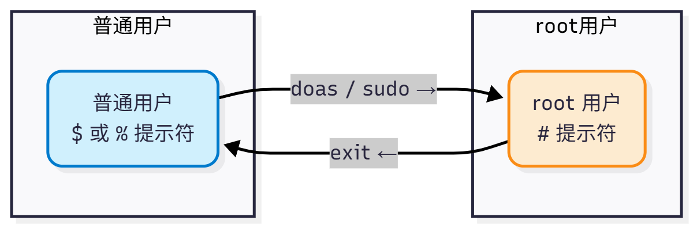

# 4.9 sudo 和 doas




## doas

实际上对于大部分人来说只需要 `sudo su` 这一行命令，其他都是多余的。在使用时将 `sudo` 直接替换为 `doas` 即可。

OpenBSD 认为 sudo 软件配置复杂，代码质量差，漏洞太多，故自行开发了 [doas](https://man.openbsd.org/doas)。自然，FreeBSD 也可以用。

### 安装 doas

- 使用 pkg 安装：

```sh
# pkg install doas
```

- 或者使用 Ports 安装：

```sh
# cd /usr/ports/security/doas/
# make install clean
```

### 查看 doas 安装后信息

```sh
root@ykla:~ # pkg info -D doas
doas-6.3p12:
On install:
To use doas,

/usr/local/etc/doas.conf

must be created. Refer to doas.conf(5) for further details and/or follow
/usr/local/etc/doas.conf.sample as an example.
# 要使用 doas，必须创建配置文件 /usr/local/etc/doas.conf。
# 可参考 doas.conf(5) 的联机文档，或查看 /usr/local/etc/doas.conf.sample 示例配置。

Note: In order to be able to run most desktop (GUI) applications, the user
needs to have the keepenv keyword specified. If keepenv is not specified then
key elements, like the user's $HOME variable, will be reset and cause the GUI
application to crash.
# 注意：如果需要运行图形界面（GUI）程序，配置中必须添加 keepenv 关键词。
# 否则像 $HOME 这样的环境变量将会被清空，导致 GUI 程序崩溃。

Users who only need to run command line applications can usually get away
without keepenv.
# 如果只需要运行命令行程序，通常不需要 keepenv。

When in doubt, try to avoid using keepenv as it is less secure to have
environment variables passed to privileged users.
# 如果不确定是否需要，建议尽量避免使用 keepenv，因为它可能降低系统安全性，
# 会将原用户的环境变量传递给拥有权限的目标用户。

On upgrade from doas<6.1:
With the 6.1 release the transfer of most environment variables (e.g. USER,
HOME and PATH) from the original user to the target user has changed.
# 从 doas 6.1 版本起，环境变量（如 USER、HOME、PATH）传递方式已发生变化。

Please refer to doas.conf(5) for further details.

# 请查看 doas.conf(5) 联机文档以了解更多详情。
```

### 配置 doas

由上可知，示例样板在 `/usr/local/etc/doas.conf.sample`。

而我们需要把配置文件放在 `/usr/local/etc/doas.conf`，该文件默认不存在，需要我们自行创建。

- `/usr/local/etc/doas.conf.sample` 内容如下，相比 sudo 来说，非常简单易懂：

让我们简单注释一下：

```
# Sample file for doas
# Please see doas.conf manual page for information on setting
# up a doas.conf file.

# Permit members of the wheel group to perform actions as root.
permit :wheel # 允许 wheel 组成员 doas

# Same without having to enter the password
permit nopass :wheel # 允许 wheel 组成员 doas，但免密码

# Permit user alice to run commands as a root user.
permit alice as root # 允许用户 alice doas

# Permit user bob to run programs as root, maintaining
# environment variables. Useful for GUI applications.
permit keepenv bob as root  # 允许用户 bob doas，并继承用户 bob 的环境变量，GUI 程序需要，但会降低安全性（参见查看安装后信息）

# Permit user cindy to run only the pkg package manager as root
# to perform package updates and upgrades.
permit cindy as root cmd pkg args update  # 仅允许用户 cindy 执行 pkg update
permit cindy as root cmd pkg args upgrade # 仅允许用户 cindy 执行 pkg upgrade

# Allow david to run id command as root without logging it
permit nolog david as root cmd id # 允许 David 以 root 身份运行 `id` 命令且不记录日志

```


对于一般人只需要创建文件 `/usr/local/etc/doas.conf`，写入

```sh
permit :wheel
```

即可满足日常需求（你的用户须加入 `wheel` 组）。

## sudo

### 安装 sudo

- 使用 pkg 安装：

```sh
# pkg install sudo
```

- 或者使用 Ports 安装：


```sh
# cd /usr/ports/security/sudo/ 
# make install clean
```

### sudo 免密码

在 `/usr/local/etc/sudoers.d/` 下新建两个文件 `username`（需要免密码的用户）和 `wheel`：

- 文件 `username` 内容如下：

```sh
%admin ALL=(ALL) ALL
```

- 文件 `wheel` 内容如下：

多加一行，使用 `sudo` 时不需要输入密码：

```sh
%wheel ALL=(ALL) NOPASSWD:ALL
```

### 故障排除与未竟事宜

- `xxx Is Not in the Sudoers File. This Incident Will Be Reported`

应当在 sudoers 中加入一句话来解决这个问题：


编辑 `/usr/local/etc/sudoers`，找到 `root ALL=(ALL:ALL) ALL` 这行，一般是在第 94 行。在这行下面加一句：

```sh
你的普通用户名 ALL=(ALL:ALL) ALL
```

然后保存退出即可。

## sudo-rs

sudo-rs 是一款采用 Rust 编写的、以安全为导向并具备内存安全性的 **sudo** 与 **su** 的实现。

### 与 sudo 不共存的安装方案

即安装 sudo-rs 必须先卸载 sudo，此安装方式下二者不共存。


- 使用 pkg 安装：

```sh
# pkg install sudo-rs
```

- 或者使用 Ports 安装：


```sh
# cd /usr/ports/security/sudo-rs/ 
# make install clean
```

提供了命令 `sudo`、`visudo` 和 `sudoedit`。

### 与 sudo 共存的安装方案

即系统中同时存在 sudo 与 sudo-rs。

- 使用 pkg 安装

```sh
# pkg ins sudo-rs-coexist
```

- 还可以通过 Ports 来安装：

```sh
# cd /usr/ports/security/sudo-rs/ 
# make -V FLAVORS # 查看有哪些 FLAVORS
default coexist
# make FLAVOR=coexist install clean # 指定安装共存版本的 sudo-rs
```

提供了命令 `sudo-rs`、`visudo-rs` 和 `sudoedit-rs`。

### 配置 sudo-rs

配置文件位于：`/usr/local/etc/sudoers`。

```ini
## sudoers file.
## sudoers 文件。

##
## This file MUST be edited with the 'visudo' command as root.
## 此文件必须通过 root 身份使用 `visudo` 命令编辑。

## Failure to use 'visudo' may result in syntax or file permission errors
## that prevent sudo from running.
## 不使用 `visudo` 可能导致语法或权限错误，从而使 sudo 无法运行。

##
## See the sudoers man page for the details on how to write a sudoers file.
## 如何编写 sudoers 文件的详细说明请参阅 sudoers 的手册页（man sudoers）。

## Defaults specification
## 默认设置规范

##
## Preserve editor environment variables for visudo.
## 为 visudo 保留编辑器相关的环境变量。

## To preserve these for all commands, remove the "!visudo" qualifier.
## 若希望对所有命令都保留这些变量，请移除“!visudo”限定。

Defaults!/usr/local/sbin/visudo env_keep += "SUDO_EDITOR EDITOR VISUAL"
## 仅对 `/usr/local/sbin/visudo` 命令保留环境变量 SUDO_EDITOR、EDITOR、VISUAL。

##
## Use a hard-coded PATH instead of the user's to find commands.
## 使用硬编码的 PATH 查找命令，而不是使用用户自己的 PATH。

## This also helps prevent poorly written scripts from running
## arbitrary commands under sudo.
## 这也有助于防止写得不好的脚本在 sudo 下执行任意命令。

Defaults secure_path="/usr/local/sbin:/usr/local/bin:/usr/sbin:/usr/bin:/sbin:/bin"
## 为 sudo 指定固定的安全 PATH 路径。

##
## Uncomment if needed to preserve environmental variables related to the
## FreeBSD pkg utility and fetch.
## 若需要保留与 FreeBSD pkg 工具和 fetch 相关的环境变量，请取消注释。

# Defaults     env_keep += "PKG_CACHEDIR PKG_DBDIR FTP_PASSIVE_MODE"
## 示例：保留 pkg 缓存/数据库路径与 FTP 被动模式变量。

##
## Additionally uncomment if needed to preserve environmental variables
## related to portupgrade
## 另外，如需保留与 portupgrade 相关的环境变量，请取消注释。

# Defaults     env_keep += "PORTSDIR PORTS_INDEX PORTS_DBDIR PACKAGES PKGTOOLS_CONF"
## 示例：保留 ports 树、索引、数据库、二进制包与工具配置等变量。

##
## You may wish to keep some of the following environment variables
## when running commands via sudo.
## 通过 sudo 运行命令时，你可能希望保留以下某些环境变量。

##
## Locale settings
## 本地化设置（语言/地区）

# Defaults env_keep += "LANG LANGUAGE LINGUAS LC_* _XKB_CHARSET"
## 示例：保留语言与 LC_* 等本地化相关变量。

##
## X11 resource path settings
## X11 资源路径设置

# Defaults env_keep += "XAPPLRESDIR XFILESEARCHPATH XUSERFILESEARCHPATH"
## 示例：保留与 X 应用资源搜索路径相关变量。

##
## Desktop path settings
## 桌面相关路径设置

# Defaults env_keep += "QTDIR KDEDIR"
## 示例：保留 Qt/KDE 的安装路径变量。

##
## Allow sudo-run commands to inherit the callers' ConsoleKit session
## 允许 sudo 运行的命令继承调用者的 ConsoleKit 会话。

# Defaults env_keep += "XDG_SESSION_COOKIE"
## 示例：保留 XDG 会话 cookie（ConsoleKit 时代的变量）。

##
## Uncomment to enable special input methods.  Care should be taken as
## this may allow users to subvert the command being run via sudo.
## 取消注释可启用特殊输入法。但需谨慎，这可能允许用户绕过 sudo 所运行的命令。

# Defaults env_keep += "XMODIFIERS GTK_IM_MODULE QT_IM_MODULE QT_IM_SWITCHER"
## 示例：保留输入法相关环境变量。

##
## Uncomment to disable "use_pty" when running commands as root.
## 取消注释可在以 root 运行命令时禁用“use_pty”。

## Commands run as non-root users will run in a pseudo-terminal,
## not the user's own terminal, to prevent command injection.
## 以非 root 用户运行的命令将使用伪终端，而非用户的原始终端，以防止命令注入。

# Defaults>root !use_pty
## 对 root 目标用户禁用 use_pty（示例，默认注释）。

##

##
## User privilege specification
## 用户权限规范

##
root ALL=(ALL:ALL) ALL
## root 可在所有主机上，以任意（用户:组）身份运行任意命令（需要认证）。

## Uncomment to allow members of group wheel to execute any command
## 取消注释以允许 wheel 组成员执行任意命令。

# %wheel ALL=(ALL:ALL) ALL
## 示例：授予 wheel 组与 root 类似的 sudo 权限（需密码）。

## Same thing without a password
## 同上，但无需输入密码。

# %wheel ALL=(ALL:ALL) NOPASSWD: ALL
## 示例：wheel 组成员可无密码执行任意命令。

## Uncomment to allow members of group sudo to execute any command
## 取消注释以允许 sudo 组成员执行任意命令。

# %sudo	ALL=(ALL:ALL) ALL
## 示例：授予 sudo 组以任意（用户:组）身份执行任意命令的权限（需密码）。

## Uncomment to allow any user to run sudo if they know the password
## of the user they are running the command as (root by default).
## 取消注释可允许任意用户在知道目标用户（默认为 root）密码的情况下运行 sudo。

# Defaults targetpw  # Ask for the password of the target user
## 使用目标用户密码进行认证（而非调用者自己的密码）。

# ALL ALL=(ALL:ALL) ALL  # WARNING: only use this together with 'Defaults targetpw'
## 所有用户均可以任意身份运行任意命令（危险！仅与 `Defaults targetpw` 搭配使用）。

## Read drop-in files from /usr/local/etc/sudoers.d
## 从 /usr/local/etc/sudoers.d 读取附加配置片段（drop-in）。

@includedir sudoers.d
## 包含相对目录 `sudoers.d`（相对于 /usr/local/etc），读取其中的配置文件。
```

### 测试

```sh
ykla@ykla:~ $ sudo su
[sudo: authenticate] Password: # 这里同样什么也没有，*** 也没有
# 
```

## 附录：通过 mac_do 提权

参考文献：

- [FreeBSD MAC 簡單介紹](https://sandb0x.tw/a/FreeBSD_MAC_%E7%B0%A1%E5%96%AE%E4%BB%8B%E7%B4%B9)
- [man mac_do(4)](https://man.freebsd.org/cgi/man.cgi?mac_do(4))

此部分比较简单，读者可自行了解或直接提交 PR 到本书。
