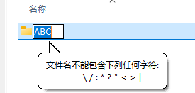
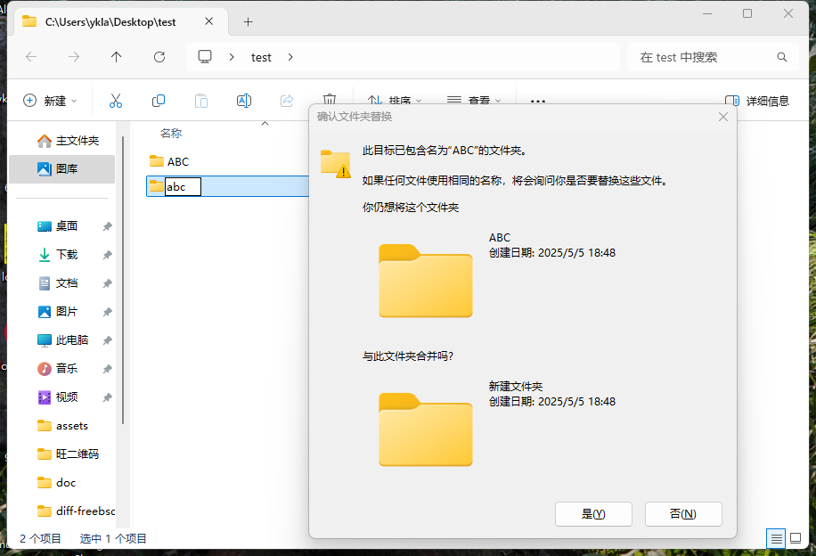

# 4.1 Windows 用户迁移指南

操作系统迁移是用户从一种操作系统平台转向另一种平台时面临的系统性挑战，涉及文件系统概念、字符编码、换行符规范、时区处理等多维度差异。对于从 Windows 迁移至 FreeBSD 的用户而言，理解这些差异是顺利过渡的前提。

本节从文件系统基础概念入手，逐步阐述 Windows 与 FreeBSD 在文件系统组织、文件名规范、文本编码和时区配置等方面的关键差异。

## 文件系统基础

首先，观察以下两幅图像：


前一幅图像展示的是竹子（Bambusoideae），后一幅图像展示的是若干棵行道树。

亚里士多德认为种子之所以能长成大树，是因为种子暗含着一种潜能，并且在环境满足的情况下，有实现为长成一棵树的可能性（参见《形而上学》IX.7, 1049b）。而人和器物的不同就在于人没有固定不变的潜能，这也契合了儒家学说“君子不器”（何晏，注；邢昺，疏. 论语注疏[M]. 北京：中国致公出版社，2016. ISBN: 978-7-5145-0846-8.）和萨特的“存在先于本质”理论（参见Sartre J P. 萨特哲学论文集[M]. 潘培庆，等，译. 合肥：安徽文艺出版社，1998. ISBN: 7-5396-1632-6.）理解 UNIX 目录与 Windows 目录的异同，对于深入理解操作系统的设计与实现非常重要。


我们都听说过一个故事，竹子（Bambusoideae）开花意味着大片竹林的死亡。这是因为，大部分看似茂密繁盛的竹林，极有可能到头来只有一棵竹子真实存活。这些竹子都是从相同的地下根系生长出来的，虽然看起来是多棵竹子，它们事实上是一个整体——这在植物学上称为**克隆生长**（clonal growth）。这也是“雨后春笋”的来历。无论它们相隔多远，仍旧一荣俱荣，一损俱损。这就是 UNIX 的目录——系统中的所有目录都依赖于根（root）。根（`/`）是一切目录的起点，构成了一个**单一层次的目录树结构**（single-rooted directory hierarchy）。例如 `/home/ykla/nihao`、`/bin/sh`、`/etc/fstab`，它们追根溯源，都是从根出发的。换言之，如果删除 `/`，就等于删除了整个系统，所有设备上的目录都会被删除。


行道树则不然，每棵普通的行道树都是独立生长的。无论它们靠得多么紧密，它们仍然是独立的。行道树与 Windows 目录类似，都是独立的——`C:\Program Files (x86)\Google\Update`、`D:\BaiduNetdiskDownload\工具列表`、`E:\123\app`：`C`、`D`、`E` 盘都是独立的，互不干扰。格式化 `D` 盘，并不会影响 `E` 盘存储的文件。即使在 PE 中格式化了 `C` 盘（可能不会显示为 `C` 盘），也不会影响 `E` 盘中的文件。

事实上，Windows 的“盘符”并非固定存在，有经验的装机人员会发现，在 PE 环境中，`C` 盘可能会变成诸如 `X` 等其他盘符。正在使用中的 Windows，其盘符也可以随意分配。

Windows 下判断一个分区属于哪个盘符，依赖的是 GPT 分区类型的 UUID（如 Windows 数据分区类型 UUID 为 `EBD0A0A2-B9E5-4433-87C0-68B6B72699C7`，即 Microsoft Basic Data 类型，适用于所有 Windows 数据分区，而非仅限 C 盘）以及分区的唯一 GUID（相关配置由 Windows 装入管理器 Mount Manager 写入注册表 `HKLM\SYSTEM\MountedDevices`），而不是依靠盘符。

查看盘符和卷的映射关系：

```powershell
PS C:\WINDOWS\system32> Get-ItemProperty -Path "HKLM:\SYSTEM\MountedDevices"


\DosDevices\C:                          : {68, 77, 73, 79...}   # C: 盘符映射项，对应某个磁盘卷的二进制标识（Volume GUID/卷结构数据）
#{6dc6b5e1-fff0-11f0-bf73-b0416f0b5119} : {68, 77, 73, 79...}   # 卷 GUID（唯一卷标识符），表示某个物理分区；右侧为该卷的内部二进制数据
\DosDevices\D:                          : {68, 77, 73, 79...}   # D: 盘符映射项，对应另一个磁盘卷的标识数据
PSPath
                                 :
……省略其他输出……
```

盘符是抽象出来的，实际上没有意义。这也就是为什么在其他操作系统上（包括 Windows 自身，如双系统环境）都看不到 `C` 盘的根本原因，因为不存在一个硬编码并写入文件系统的 `C` 盘标识。只有在真正启动系统时，Windows 才会知道到底谁是 `C` 盘，并写入注册表。至于其他盘符的分配，则具有不确定性，出现 `D` 盘变为 `E` 盘的问题也屡见不鲜，例如某虚拟光驱可能在开机时被自动加载等。

> **思考题**
>
> 阅读《深入解析 Windows 操作系统（第 7 版）（卷 2）》（978-7-115-61974-7，人民邮电出版社）及其他相关文献资料，回答问题：在传统的 BIOS + MBR 引导下，Windows 如何识别 `C` 盘？

### 挂载的概念与机制


小时候住在花木场的人们都知道，经常需要从树 A 上剪取一段枝条，将其斜插到树 B 上，并加以包裹，愈合后就会成为一体：比如在苹果树（UNIX）上可以长出桃子（挂载 Windows 的 `C` 盘）。

这种方法称为“嫁接”。实际上，这就是将树 A 的枝条（文件系统）挂载到树 B 上（嫁接点即某个挂载点，归根结底依赖于根目录 `/`）。

从操作系统的技术视角看，挂载（mount）是将一个文件系统附加到系统目录树中某个已有目录（即挂载点）上的过程。文件系统最好被可视化为以 `/` 为根的树形结构，一个文件系统必须挂载到另一个文件系统中的某个目录上。当文件系统 B 挂载到目录 A 上时，B 的根目录将替换 A，B 中的目录将相应地出现；而 A 中原有的文件将被临时隐藏，直到 B 从 A 上卸载后才会重新出现。

工具 mount 调用 nmount(2) 系统调用，将一个特殊设备或远程节点（rhost:path）准备并嫁接到文件系统树中的节点（node）位置。系统维护一个当前已挂载文件系统的列表。如果不带任何参数调用 mount，将打印此列表。

> **注意**
>
>FreeBSD 的 `mount` 源于 4.4BSD，与 Linux 的 `mount` 在选项语法上基本兼容，但 FreeBSD 使用的是 nmount(2) 系统调用而非 Linux 的 mount(2)。FreeBSD 的 `mount` 会根据文件系统类型自动调用 `/sbin/mount_type` 程序（如 `mount_nfs`、`mount_msdosfs`）。

### 卸载的概念与机制


对园艺有所了解的人们想必对“扦插”这种培育植物的方法并不陌生：

将一棵树新发的侧枝掰下来，插到土里。精心照料一段时间，就会得到一株新的幼苗。

实际上，这与“卸载”的原理有异曲同工之妙：将某个文件系统（如 `/mnt/test`）从完整的根（`/`）上“掰”下来（卸载）。

从技术角度看，卸载（unmount）是挂载的逆操作，将一个已挂载的文件系统从系统目录树中分离。当文件系统 B 从 A 上卸载后，A 中原有的文件将重新出现。

#### 参考文献

- 微软. PARTITION_INFORMATION_GPT[EB/OL]. [2026-04-18]. <https://learn.microsoft.com/en-us/windows/win32/api/winioctl/ns-winioctl-partition_information_gpt>. GPT 分区类型 GUID 定义，其中 Microsoft Basic Data 类型为 EBD0A0A2-B9E5-4433-87C0-68B6B72699C7。
- 微软. Supporting Mount Manager Requests in a Storage Class Driver[EB/OL]. [2026-04-18]. <https://learn.microsoft.com/en-us/windows-hardware/drivers/storage/supporting-mount-manager-requests-in-a-storage-class-driver>. Windows 装入管理器将盘符与分区的映射关系持久化存储于注册表 `HKLM\SYSTEM\MountedDevices`。
- GBIF. Bambusoideae Luerss.[EB/OL]. [2026-04-18]. <https://www.gbif.org/species/113642445>. 竹亚科许多物种具有群体开花（gregarious flowering）特性，开花后常因资源耗竭而死亡；竹子通过地下根茎系统进行克隆生长（clonal growth），同一克隆的个体共享资源。
- Aristotle. Metaphysics[M]. Translated by W. D. Ross. Oxford: Clarendon Press, 1908. Book IX (Theta), Chapter 7, 1049b. 亚里士多德论潜能与现实：种子之所以能长成大树，是因为种子暗含着一种潜能。

## 文件名规范的差异

### 非法字符

许多在 FreeBSD 中可用的文件名或路径在 Windows 中都是不被允许的，即包含非法字符。如果在 Windows 上使用 Git 拉取项目，这种情况经常会遇到。

这里只列出一些笔者遇到过的情况：

- 文件或文件夹名称中不能包含英文冒号 `:`。



- 无法将文件或文件夹命名为 `con`。


更多要求参见：微软. 命名文件、路径和命名空间[EB/OL]. [2026-03-26]. <https://learn.microsoft.com/zh-cn/windows/win32/fileio/naming-a-file>.

> **技巧**
>
> 可在 Windows 下使用 git 工具拉取 [freebsd-doc](https://github.com/freebsd/freebsd-doc) 项目验证兼容性问题。相关 Bug 报告：[The colon in the file name of the security report of the FreeBSD doc is not compatible with Microsoft Windows](https://bugs.freebsd.org/bugzilla/show_bug.cgi?id=267636)

### 大小写敏感性

FreeBSD 的 ZFS 和 UFS 都是 **区分大小写（大小写敏感）** 的文件系统。而 macOS 的 HFS+（默认不区分大小写）、APFS（默认不区分大小写）以及 Windows 的 FAT32 文件系统都是 **不区分大小写（大小写不敏感）** 的。NTFS 本身是大小写保留的文件系统，但 Windows 的 Win32 子系统默认以大小写不敏感方式处理文件名（Windows 10 1803 以后可通过 `fsutil.exe file queryCaseSensitiveInfo <路径>` 按目录启用大小写敏感，主要用于 WSL 兼容）。

- Windows 下 **大小写不敏感**



在 Windows 中，`abc` 和 `ABC` 被视为同一文件，无法共存。

> **技巧**
>
> 判断网站服务器类型的简易方法：若 `https://example.com/path` 和 `https://example.com/PATH` 均可访问且内容相同，则该网站可能运行在 Windows 操作系统上。

- FreeBSD 下 **大小写敏感**

```sh
$ touch ABC    # 创建名为 ABC 的文件
$ touch abc    # 创建名为 abc 的文件
$ ls           # 列出当前目录内容（区分文件名大小写）
abc    ABC
```

在 FreeBSD 中，`abc` 和 `ABC` 是两个独立文件，可以共存。

#### 参考文献

- 微软. 调整区分大小写[EB/OL]. [2026-03-26]. <https://learn.microsoft.com/en-us/windows/wsl/case-sensitivity>. Windows 文件系统支持使用属性标志按目录设置区分大小写，提供跨平台文件兼容性支持。
- 微软. FAT32 File System[EB/OL]. [2026-04-18]. <https://learn.microsoft.com/en-us/previous-versions/aa364047(v=vs.85)>. FAT 文件系统卷不区分大小写。
- Apple. File system formats available in Disk Utility[EB/OL]. [2026-04-18]. <https://support.apple.com/guide/disk-utility/file-system-formats-dsku19ed921c/mac>. APFS 和 HFS+ 默认均不区分大小写，但可在格式化时选择区分大小写变体。

## 换行符差异

回车（Carriage Return，CR）和换行（Line Feed，LF）是不同的概念，均起源于电传打字机（真实 TTY）时代。

- 回车 CR：将光标移动到当前行开头；
- 换行 LF：将光标移动到下一行。

可以看到，在早期二者是独立的，否则 CRLF 会导致当前行“下沉”一行。

Windows 操作系统默认的文本换行符为 CRLF（即 \\r\\n，0x0D 0x0A，`^M$`），而 UNIX（Classic Mac OS 使用 \\r，0x0D）默认使用 LF（即 \\n，0x0A，`$`）。

诚然，现在这些符号通常都出现在每行文本的末尾处（即每行都存在）。

二者互不兼容，如果将使用 Windows 换行符的文件放到 UNIX 系统上，可能会导致每行末尾多出一个 `^M` 字符；对于某些工具会造成识别错误，对于 FreeBSD Port 相关文件来说，则可能将多行识别为一行。

但是两种换行符可以互相转换。在 FreeBSD 下可以用 Port `converters/dos2unix` 来实现，该软件包含 2 个命令：`dos2unix`（Windows 换行符到 UNIX）、`unix2dos`（UNIX 换行符到 Windows）。基本用法是 `$ dos2unix -n a.txt b.txt`，如果不需要保留源文件，可以直接 `$ dos2unix a.txt b.txt c.txt`（一次转换多个文件）。可以用命令 `file a.txt` 来判断文件的换行符类型：

- 使用普通的 UNIX 换行符文本文件

```sh
$ file a.txt  # 查看文件类型
a.txt: Unicode text, UTF-8 text
```

- 使用 Windows 换行符的文本文件

```sh
$ file b.txt  # 查看文件类型
b.txt: Unicode text, UTF-8 text, with very long lines (314), with CRLF line terminators
```

### 参考文献

- IETF. RFC 2046: Multipurpose Internet Mail Extensions (MIME) Part Two: Media Types[EB/OL]. [2026-04-18]. <https://datatracker.ietf.org/doc/html/rfc2046>. 规定文本类型的规范行结束符为 CRLF（0x0D 0x0A）。
- IETF. RFC 20: ASCII format for network interchange[EB/OL]. [2026-04-18]. <https://www.rfc-editor.org/rfc/rfc20.html>. ASCII 标准定义 CR 为 0x0D（第 13 号控制字符），LF 为 0x0A（第 10 号控制字符），二者均源自电传打字机时代的物理操作。
- Wasserburger E. dos2unix / unix2dos - Text file format converters[EB/OL]. [2026-04-18]. <https://dos2unix.sourceforge.io/>. dos2unix 与 unix2dos 命令行工具，用于在 CRLF（Windows）与 LF（UNIX）换行格式之间转换；FreeBSD Port 路径为 converters/dos2unix。基本系统版本与 Port 版本为不同程序。Port 为增强版本，支持更多选项。

## 字符编码差异

由于计算机只识别 `0` 和 `1`，故字符编码是一种用于将字符转换为数字表示的规则体系。字符可以是屏幕上可见的文字，也可以是不可见的控制标记，如换行符（LF）、回车符（CR）等，涵盖文本中常见的元素，如数字、Emoji 表情符号、汉字、拉丁字母等。编码方式则是为这些字符分配唯一数字标识（通常是整数），即代码点（code point）的过程。

例如，ASCII（American Standard Code for Information Interchange，ANSI X3.4）编码中，`0x41`（二进制 `0100 0001`）代表大写字母 `A`。ASCII 仅支持英文字母、数字和常见标点，共 128 个字符。

而在 Unicode 编码体系中，“你”这个汉字的代码点是 U+4F60。在 UTF-8（8-bit Unicode Transformation Format，8 位 Unicode 转换格式）编码方式下，它被编码为字节序列 `0xE4 0xBD 0xA0`（二进制为 `11100100 10111101 10100000`）。UTF-8 编码涵盖的字符范围远超 GBK（国标扩展），当中甚至含有埃及圣书体——如果现在你的屏幕上能看到“𓀀”“𓃕”“𓌊”这三个字符，那么你很可能正在使用 UTF-8 编码（如果你使用的是 UTF-8 编码但仍无法显示这些字符，很可能是字体不支持这些字符集，而非编码问题）。

那么程序如何识别文本的编码呢？通常，有些文件会在开头使用特定的字节序列（即 BOM，byte order mark，字节顺序标记）来标明编码。例如 UTF-8 的 BOM 是 `0xEF 0xBB 0xBF`。但在实际中，很多文本文件并没有 BOM，因此读取程序需要通过上下文猜测编码格式，这往往导致乱码。虽然可以通过程序分析文本内容（如统计字符分布或抽取字符计算）来猜测编码，但这种方法并不总是可靠。编码问题本质上源于系统间默认编码不同或未明确指定编码。

Windows 默认使用 GBK（在简体中文环境下，为 GB2312 的超集），而 Linux 或 UNIX 通常使用 UTF-8。

- Windows 11 24H2 查看当前控制台代码页：

```powershell
PS C:\Users\ykla> chcp
活动代码页: 936 # GBK 编码
```

- Ubuntu 24.04/FreeBSD 输出当前区域设置（locale）的字符编码：

```sh
root@ykla:/home/ykla# locale charmap
UTF-8
```

当然，也可以将 Windows 10 及后续版本的系统字符编码设置为 UTF-8。但这种做法往往除了引入更多编码问题外，并不能有效解决问题。

FreeBSD 的编码在 [main/usr.bin/login/login.conf](https://github.com/freebsd/freebsd-src/blob/main/usr.bin/login/login.conf) 文件中设置，编译后路径为 `/etc/login.conf`。

### 参考文献

- 微软. Code pages[EB/OL]. [2026-03-26]. <https://learn.microsoft.com/en-us/globalization/encoding/code-pages>. 微软官方称，936 即是 GBK，用于中文简体字符编码；代码页 936 最初覆盖 GB 2312 字符集，后扩展为 GBK。
- IETF. RFC 20: ASCII format for network interchange[EB/OL]. [2026-04-18]. <https://www.rfc-editor.org/rfc/rfc20.html>. ASCII 字符编码标准，定义 7 位 128 个字符的编码，其中 0x41 为大写字母 A。
- Unicode Consortium. UTF-8, UTF-16, UTF-32 BOM[EB/OL]. [2026-04-18]. <https://www.unicode.org/faq/utf_bom.html>. UTF-8 的 BOM 为字节序列 0xEF 0xBB 0xBF。
- 微软. Use UTF-8 code pages in Windows apps[EB/OL]. [2026-04-18]. <https://learn.microsoft.com/en-us/windows/apps/design/globalizing/use-utf8-code-page>. Windows 10 及后续版本可通过系统区域设置启用 UTF-8 支持（Beta 功能），但可能导致旧应用程序兼容性问题。
- FreeBSD Project. login.conf(5)[EB/OL]. [2026-04-18]. <https://man.freebsd.org/cgi/man.cgi?query=login.conf&sektion=5>. FreeBSD 登录类能力数据库，源文件位于 `usr.bin/login/login.conf`，编译后路径为 /etc/login.conf，用于设置字符编码等用户环境。

## 时间与时区差异

中国统一使用一个时区，东八区，即 UTC+8，UTC（Coordinated Universal Time，协调世界时）在日常使用中几乎等同于 GMT（Greenwich Mean Time，格林尼治时间）。UTC 以国际原子时（temps atomique international，TAI）的秒长为基础（并不完全一致）：当铯（Cs）频率 ΔνCs，也就是铯 133 原子不受干扰的基态超精细跃迁频率，以单位 Hz 即 s⁻¹ 表示时，取其固定数值为 9,192,631,770 来定义秒——后续又对国际原子时进行了各种修正。

有过 Windows 和 UNIX 双系统安装经验的人会发现，Windows 和 UNIX 的时间总是差 8 个小时。在现代计算机上（一般在主板上），都有一颗由纽扣电池供电的 RTC（Real-time clock，实时时钟芯片）芯片，用来维护系统断电后的计时。

计算机操作系统在开机时会读取 RTC 的时间来设定系统的时间。RTC 的时间并未标注时区。

Windows 会直接读取 RTC 的结果，并将其视为本地时间，即 Local Time（地方时，当地太阳运行的时间）；UNIX 则会将 RTC 的数据视为 UTC 时间：于是会发现双系统的时间相差了 8 个小时。

例如，如果 RTC 时间是“2025 年 6 月 6 日中午 12:00（即 UTC+8）”，那么在 Windows 下仍显示为“2025 年 6 月 6 日中午 12:00”（即 UTC+8）；但在 UNIX 下，时间会变为“2025 年 6 月 6 日晚上 20:00”（即把 RTC 中的 12:00 视为 UTC 后再加上 UTC+8 的偏移量，12+8=20）。因为 UNIX 将 RTC 视为 UTC 而非本地时间，所以显示的时间会比 Windows 快 8 小时。

对于现代计算机网络来说，时间至关重要。可以做个小实验：将时间调慢 5 分钟，打开浏览器，会发现绝大部分网站都打不开了（HTTPS）。

计算机中的时区是由 IANA 时区数据库规范的，历史悠久。

中华民国二十八年（1939），民国政府将中国划分为五个时区，当时称为长白时区（UTC+8:30）、中原标准时区（UTC+8）、陇蜀时区（UTC+7）、新藏时区（UTC+6）和昆仑时区（UTC+5:30）。在 IANA 时区数据库中，这些时区分别对应 `Asia/Harbin`、`Asia/Shanghai`、`Asia/Chongqing`、`Asia/Urumqi` 和 `Asia/Kashgar`。

从实际的地理时区来看，新疆属于东六区（虽然全国统一使用北京时间）。从地理上看，新疆与北京时间实际上相差了两个小时。如果在燕赵大地太阳在北京时间五点出来，那么对于新疆，北京时间七点才能看到日出。

在时区数据库 2025b 中，`Asia/Harbin`、`Asia/Chongqing`、`Asia/Shanghai` 均等同于北京时间。`Asia/Urumqi` 和 `Asia/Kashgar` 则均为 `UTC+6`（东六区时间）。

在 FreeBSD 中，北京时间同样为 `Asia/Shanghai`（东八区）。部分国产操作系统自行定义了 `Asia/Beijing` 时区，这一做法不符合国际标准与规范，且可能造成严重后果，如造成时间退回到 UTC。

> **注意**
>
> 北京（东经 116°）的地方时并不完全等于 UTC+8。北京时间不是北京的地方时，而是东经 120 度（上海东经 120°）的地方时。

> **技巧**
>
> 中国也曾实行过夏令时（在夏天将表调快一个小时，因为天亮得早）。

> **思考题**
>
> 外太空（飞船，星球等）用什么时区？为什么？

### 参考文献

- 中国计量科学研究院. 秒的定义[EB/OL]. [2026-03-26]. <https://www.nim.ac.cn/520/node/4.html>. 秒的定义，基于铯原子超精细跃迁频率。
- BIPM. SI base unit: second[EB/OL]. [2026-04-18]. <https://www.bipm.org/en/si-base-units/second>. 国际计量局秒的 SI 定义，铯 133 原子不受干扰的基态超精细跃迁频率取固定数值 9,192,631,770 Hz。
- IANA. Time Zone Database[EB/OL]. [2026-03-26]. <https://www.iana.org/time-zones>. 时区数据库，提供全球时区信息标准化。
- IANA. tzdata release 2025b NEWS[EB/OL]. [2026-04-18]. <https://data.iana.org/time-zones/tzdb-2025b/NEWS>. 时区数据库 2025b 版本变更说明，Asia/Urumqi 的 1980 年向 UTC+8 的转换已被移除，现为 UTC+6；Asia/Kashgar 为 Asia/Urumqi 的向后兼容链接。
- 微软. Why does Windows keep your BIOS clock on local time?[EB/OL]. [2026-04-18]. <https://devblogs.microsoft.com/oldnewthing/20040902-00/?p=37983>. Windows 默认将硬件时钟（RTC）视为本地时间而非 UTC 的历史原因。
- 中国科学院紫金山天文台. 历书基本术语简介[EB/OL]. [2026-03-26]. <http://www.pmo.cas.cn/xwdt2019/kpdt2019/202203/t20220314_6389637.html#b4>. 本节所涉术语，可参考此处的精确解释。
- 新华网. “北京时间”是怎么来的[EB/OL]. [2026-04-18]. <http://www.xinhuanet.com/politics/2015-10/28/c_1116958394.htm>. 北京时间并非北京（东经 116.4°）地方时，而是东经 120° 经线的区时；中国曾于 1986—1991 年实行夏令时。
- IETF. RFC 5246: The Transport Layer Security (TLS) Protocol Version 1.2[EB/OL]. [2026-04-18]. <https://www.rfc-editor.org/rfc/rfc5246>. TLS 协议规定证书包含 notBefore 与 notAfter 有效期字段，客户端验证时将系统时间与证书有效期比对，时钟偏移可导致握手失败。
- IETF. RFC 6557: Procedures for Maintaining the Time Zone Database[EB/OL]. [2026-04-18]. <https://www.rfc-editor.org/rfc/rfc6557>. IANA 时区数据库维护程序（BCP 175），该数据库自 20 世纪 70 年代末由 Arthur David Olson 开发，2011 年起由 IANA 维护。

## 手册页

FreeBSD 上最全面的文档以手册页的形式存在。系统上几乎每个程序都附带一份简短的参考手册，解释基本操作和可用参数。这些手册可以使用 man 命令查看：

```sh
% man command
```

按回车键继续浏览，输入 `q` 则退出 man 手册。

其中 `command` 是要了解的命令名称。例如，要了解更多关于 ls(1) 的信息，输入：

```sh
% man ls
```

手册页分为多个节，代表主题的类型。在 FreeBSD 中，以下章节可用：

1. 用户命令。
2. 系统调用和错误编号。
3. C 库中的函数。
4. 设备驱动程序。
5. 文件格式。
6. 游戏和其他娱乐。
7. 杂项信息。
8. 系统维护和操作命令。
9. 系统内核接口。

在某些情况下，同一主题可能出现在在线手册的多个节中。例如，既有 chmod 用户命令，也有 chmod() 系统调用。要告诉 man(1) 显示哪个节，指定节号：

```sh
% man 1 chmod
```

这将显示用户命令 chmod(1) 的手册页。在书面文档中，对在线手册特定节的引用传统上放在括号中，因此 chmod(1) 指的是用户命令，chmod(2) 指的是系统调用。

如果不知道手册页的名称，使用 `man -k` 搜索手册页描述中的关键词：

```sh
% man -k mail
```

此命令显示描述中包含关键词“mail”的命令列表。这等效于使用 apropos(1)。


## 深入阅读

### Windows

以下书籍可供读者进一步研究 Windows 操作系统设计与实现：

- Russinovich M, Solomon D, Ionescu A, 等. 深入解析 Windows 操作系统：第7版. 卷1[M]. 刘晖，译. 北京：人民邮电出版社，2021. ISBN: 978-7-115-55694-3. 微软官方教材，具有权威性，系统阐述 Windows 内核架构。
- Russinovich M, Solomon D, Ionescu A, 等. 深入解析 Windows 操作系统：第7版. 卷2[M]. 刘晖，译. 北京：人民邮电出版社，2024. ISBN: 978-7-115-61974-7. 微软官方教材，具有权威性，详解 Windows 系统组件。

### 天文历法

- 中国科学院紫金山天文台. 2026 年中国天文年历[M]. 北京：科学出版社，2025. ISBN: 978-7-03-082584-1. 注：每年一版。一般日历会写潮起潮落太阳东升西落的时间，该书则是大全，提供精确的天文数据。
- 胡中为. 天文学教程（上）[M]. 上海：上海交通大学出版社，2019. ISBN: 978-7-3132-1655-7. 天文学历史悠久，这是本现代天文学入门书籍，本科生教材，系统介绍天文学基础。
- 胡中为. 天文学教程（下）[M]. 上海：上海交通大学出版社，2020. ISBN: 978-7-3132-3572-5. 天文学是一级学科，深入讲解天体物理与宇宙学。
- Dodelson S, Schmidt F. 现代宇宙学[M]. 于浩然，译. 第2版. 北京：科学出版社，2024. ISBN: 978-7-03-078693-7. 该书用数学和物理学描述宇宙宏观整体而非具体天体行星，提供现代宇宙学理论框架。
- 卢央. 中国古代星占学[M]. 北京：中国科学技术出版社，2013. ISBN: 978-7-5046-6140-1. 中国古代天文学入门，星占学即用哲学或神秘学解释天文学，梳理古代星占文化。
- Carroll B W, Ostlie D A. 当代天体物理学导论[M]. 姜碧沩，李庆康，高健，等，译. 第2版. 北京：科学出版社，2023. ISBN: 978-7-03-076666-3. 天体物理学即用物理学解释天文学，是现代天文学的核心（还有一些测量、分类、天文历法等不属于此范畴），提供天体物理系统介绍。

> **思考题**
>
>> 对于描述世界，我们有太多种方法。正如马克思所述，“哲学家们只是用不同的方式解释世界……”（《关于费尔巴哈的提纲》第十一条：马克思主义哲学的使命）
>
> 你认为通过数学和物理学解释世界的优点是什么？如果排除实用主义、实证主义和经验主义，那么还能剩下什么？
>
> 你认为通过哲学和神秘学/宗教神学解释世界的缺点是什么？如果排除实用主义和经验主义，那么还能剩下什么？
>
>>马克思还认为只有必要的自由时间才能确保真正的自由（邓晓芒. 马克思论“存在与时间”[J]. 哲学动态，2000(6): 11-14）：
>>
>>“必须将感性的时间从强制性的、社会一般的抽象时间中解放出来。”
>>
>>“实践也不能被曲解为异化了的生产活动，即类似于动物性的筋肉活动、体力的支出，至少不能将异化劳动当作马克思本来意义上的实践活动。”
>
> 你怎样理解这样一个事实：我们 **显然拥有充足的** 自由时间，但是我们仍然 **无法拥有** 所谓的 **“自由”时间** 去了解一些“无意义”的东西（非学术目的），比如天文学？
>
> 我们在不断地刷短视频阅读网络小说所花费的精力，是否在某种程度上也构成了 **生产活动**？所花费的时间是否在某种意义上构成了 **社会一般（平均）劳动时间**？换言之，这种自由时间的放松，究竟是真正的自由还是一种资本化的假象（实际上仍是另一种形式的工作）？这种自由时间往往被视为对工作的放松，是为了更好地工作，而非单纯实现自由时间；并且我们通过平台获取的快乐和 **工资** 远低于平台从用户获取的算法，个性化数据，内容主体，广告等带来的价值。你如何看待这种对自由时间的资本化异化？

## 课后习题

1. 在 FreeBSD 中挂载一个 Windows NTFS 分区，使用 converters/dos2unix 转换 3 个包含 Windows 换行符的文本文件，并尝试使之自动化，提交 PR 到 FreeBSD Ports。
2. 查找 FreeBSD 内核源代码中负责处理大小写敏感的 UFS/ZFS 文件系统相关代码，进行注释和分析。
3. 尝试修改 Windows 的设置，使其支持 UTC+8 时间。
