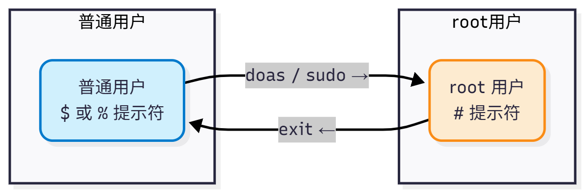

# 4.11 权限提升工具（sudo、doas 等）

当授权用户获取到系统资源后，另一个问题随之浮现。在许多情况下，个别用户可能需要访问应用程序启动脚本，或者整组管理员需要共同维护系统。传统上，标准用户与组、文件权限乃至 su 命令即可管理这类访问。但随着应用程序需要的权限越来越多、更多用户也需要使用系统资源，一个更好的解决方案成为必要。

>**思考题**
>
>>即使是管理员，在无需特权操作时也应当限制自己的权限。
>
>你认为这种限制权限的设计思路的缺点是什么？

权限提升工具允许普通用户以超级用户（root）或其他用户身份执行命令，是 UNIX 系统权限管理的补充机制。

sudo 和 doas 等工具通过配置文件定义权限规则，允许特定用户在无需知道 root 密码的情况下执行特权操作，同时提供审计日志功能。



## doas

对于大多数用户而言，掌握 `sudo su` 这一基础命令即可满足日常需求。doas 是一款从 OpenBSD 移植的命令行工具，可作为类 Unix 系统中广泛使用的 sudo 的替代方案。

doas 的作者是 Ted Unangst，首次出现于 OpenBSD 5.8。借助 doas，用户可以以提升的权限（通常以 root 身份）执行命令，同时保持一种简化且注重安全的方式。与 sudo 不同，doas 强调简单与极简主义，专注于精简的权限委派，摒弃了庞杂的配置选项。

在使用时可以将 `sudo` 直接替换为 `doas`，二者在基本使用场景下具有功能等价性。但 doas 不支持 sudo 的 `NOPASSWD` 标签之外的细粒度权限控制（如时间戳超时、命令参数限制、插件架构等）。

### 安装 doas

- 使用 pkg 安装：

```sh
# pkg install doas
```

- 或者使用 Ports 安装：

```sh
# cd /usr/ports/security/doas/
# make install clean
```

### 查看 doas 安装后的信息

```sh
# pkg info -D doas
doas-6.3p12:
On install:
To use doas,

/usr/local/etc/doas.conf

must be created. Refer to doas.conf(5) for further details and/or follow
/usr/local/etc/doas.conf.sample as an example.
# 要使用 doas，必须创建配置文件 /usr/local/etc/doas.conf。
# 可参考 doas.conf(5) 的联机文档，或查看 /usr/local/etc/doas.conf.sample 示例配置。

Note: In order to be able to run most desktop (GUI) applications, the user
needs to have the keepenv keyword specified. If keepenv is not specified then
key elements, like the user's $HOME variable, will be reset and cause the GUI
application to crash.
# 注意：如果需要运行图形界面程序，配置中必须添加 keepenv 关键词。
# 否则像 $HOME 这样的环境变量将会被清空，导致图形用户界面程序崩溃。

Users who only need to run command line applications can usually get away
without keepenv.
# 如果只需要运行命令行程序，通常不需要 keepenv。

When in doubt, try to avoid using keepenv as it is less secure to have
environment variables passed to privileged users.
# 如果不确定是否需要，建议尽量避免使用 keepenv，因为它可能降低系统安全性，
# 会将原用户的环境变量传递给拥有权限的目标用户。

On upgrade from doas<6.1:
With the 6.1 release the transfer of most environment variables (e.g. USER,
HOME and PATH) from the original user to the target user has changed.
# 从 doas 6.1 版本起，环境变量（如 USER、HOME、PATH）传递方式已发生变化。

Please refer to doas.conf(5) for further details.

# 请查看 doas.conf(5) 联机文档以了解更多详情。
```

### 使用 doas 进行共享管理

对于用户 `user2`，只需要创建文件 `/usr/local/etc/doas.conf` 并写入：

```ini
permit nopass user2 as root
```

即可允许用户 `user2` 在执行 doas 时无需输入密码便可获取 `root` 权限。如果不需要 doas 免密码，移除 `nopass` 即可。

对于 wheel 组用户，则写入以下行。

```ini
permit nopass :wheel
```

可满足需求。

安装并配置好 `doas` 之后，即可像下面这样以增强权限执行命令：

```su
$ doas ee /etc/rc.conf
```

## sudo

sudo 的初始作者是 Bob Coggeshall 和 Cliff Spencer（原始版本，1986 年），主要重写和维护者是 Todd C. Miller。

sudo 的 `sudoers` 配置语法复杂度较高，手册页逾 1000 行，容易配置错误导致安全漏洞；时间戳文件位于 `/var/run/sudo/ts/`，若文件系统已满可能无法正常工作；`sudo -i` 在某些 Shell 环境下可能不会完整加载环境变量。

Sudo 允许管理员配置更严格的系统命令访问，并提供日志记录功能。

### 安装 sudo

- 使用 pkg 安装：

```sh
# pkg install sudo
```

- 或者使用 Ports 安装：

```sh
# cd /usr/ports/security/sudo/
# make install clean
```

### 使用 sudo 进行共享管理

sudo 配置文件由若干小节组成，支持深度自定义。

#### 配置普通用户使用 sudo

未配置的普通用户执行 sudo 将报错 `xxx Is Not in the Sudoers File. This Incident Will Be Reported`。

需要在 sudoers 配置文件中加入一行来解决该问题。编辑 `/usr/local/etc/sudoers` 文件，找到 `root ALL=(ALL:ALL) ALL` 这一行，通常位于第 94 行。在这行下面加一句：

```sh
实际普通用户 ALL=(ALL:ALL) ALL
```

然后保存并退出。如此，用户“实际普通用户”将能够使用 sudo，当提示输入密码时，输入该用户密码即可，无需 root 用户密码。


#### 授予特定用户执行特定命令的权限

在下面的示例中，Web 应用运维人员 user1 需要启动、停止和重启 Web 应用程序 *webservice*。要授予该用户相关权限，请在 `/usr/local/etc/sudoers` 文件末尾新增一行：

```ini
user1   ALL=(ALL)       /usr/sbin/service webservice *
```

随后用户 user1 即可通过以下命令启动 *webservice*：

```ini
$ sudo /usr/sbin/service webservice start
```

上述配置仅对单个用户（user1）放行了 webservice 服务，但大多数组织会有一整支 Web 团队负责相关管理。仅需一行配置，即可将权限赋予整个组。以下步骤将先创建 web 组，再向其中添加用户，最终让组内所有成员都具备管理该服务的能力：

```sh
# pw groupadd -g 6001 -n webteam
```

再使用 pw 命令将所需用户 user1 添加至 webteam 组：

```sh
# pw groupmod -m user1 -n webteam
```

最后，在 `/usr/local/etc/sudoers` 文件中写入以下行，即可让 webteam 组的所有成员都有权限管理 *webservice*：

```ini
%webteam   ALL=(ALL)       /usr/sbin/service webservice *
```

#### sudo 普通用户和组免密码

被允许使用 sudo 的用户只需输入自己的密码即可。这比 su 更安全、控制粒度更细——使用 `su` 需要输入 `root` 密码，且用户会获得完整的 `root` 权限。要允许 webteam 组成员免密码管理该服务，可改为：

```ini
%webteam   ALL=(ALL)       NOPASSWD: /usr/sbin/service webservice *
```

类似的，如果希望用户 user1 免密码，则改为：

```sh
user1   ALL=(ALL)       NOPASSWD:ALL
```

如果希望 `wheel` 组中的用户名也免密码，则如下：

```sh
%wheel   ALL=(ALL)       NOPASSWD:ALL
```

注意到，百分号 `%` 代表组，否则为普通用户。

## sudo-rs

sudo-rs 是采用 Rust 编写的 sudo 与 su 的实现，以安全为导向，具备内存安全性。

### 与 sudo 不共存的安装方案

安装 sudo-rs 前必须先卸载 sudo，该方式下两者不能共存。

- 使用 pkg 安装：

```sh
# pkg install sudo-rs
```

- 或者使用 Ports 安装：

```sh
# cd /usr/ports/security/sudo-rs/
# make install clean
```

提供了 `sudo`、`visudo` 和 `sudoedit` 命令。

`visudo` 以安全方式编辑 sudoers 文件，类似于 vipw(8)。它锁定 sudoers 文件防止同时编辑，执行基本有效性检查，并在安装前检查语法错误。若发现语法错误，会显示行号并提示“What now?”，用户可选择 `e`（重新编辑）、`x`（退出不保存）或 `Q`（强制保存，有风险）。编辑器选择由 `SUDO_EDITOR`、`VISUAL`、`EDITOR` 环境变量决定，默认为 `/usr/bin/vi`。

FreeBSD 的 `visudo` 来自 sudo 软件包（非基本系统），与 Linux 版本来自同一上游源码，基本兼容。

### 与 sudo 共存的安装方案

系统中同时存在 sudo 与 sudo-rs。

- 使用 pkg 安装：

```sh
# pkg install sudo-rs-coexist
```

- 还可以通过 Ports 来安装：

```sh
# cd /usr/ports/security/sudo-rs/
# make -V FLAVORS # 查看有哪些 FLAVORS
default coexist
# make FLAVOR=coexist install clean # 指定安装共存版本的 sudo-rs
```

提供了 `sudo-rs`、`visudo-rs` 和 `sudoedit-rs` 命令。

### 配置 sudo-rs

配置文件位于：`/usr/local/etc/sudoers`。

```ini
## sudoers file.
## sudoers 文件。

##
## This file MUST be edited with the 'visudo' command as root.
## 此文件必须通过 root 身份使用 `visudo` 命令编辑。

## Failure to use 'visudo' may result in syntax or file permission errors
## that prevent sudo from running.
## 不使用 `visudo` 可能导致语法或权限错误，从而使 sudo 无法运行。

##
## See the sudoers man page for the details on how to write a sudoers file.
## 如何编写 sudoers 文件的详细说明请参阅 sudoers 的手册页（man sudoers）。

## Defaults specification
## 默认设置规范

##
## Preserve editor environment variables for visudo.
## 为 visudo 保留编辑器相关的环境变量。

## To preserve these for all commands, remove the "!visudo" qualifier.
## 若希望对所有命令都保留这些变量，请移除“!visudo”限定。

Defaults!/usr/local/sbin/visudo env_keep += "SUDO_EDITOR EDITOR VISUAL"
## 仅对 `/usr/local/sbin/visudo` 命令保留环境变量 SUDO_EDITOR、EDITOR、VISUAL。

##
## Use a hard-coded PATH instead of the user's to find commands.
## 使用硬编码的 PATH 查找命令，而不是使用用户的 PATH。

## This also helps prevent poorly written scripts from running
## arbitrary commands under sudo.
## 这也有助于防止编写不当的脚本在 sudo 下执行任意命令。

Defaults secure_path="/usr/local/sbin:/usr/local/bin:/usr/sbin:/usr/bin:/sbin:/bin"
## 为 sudo 指定固定的安全 PATH 路径。

##
## Uncomment if needed to preserve environmental variables related to the
## FreeBSD pkg utility and fetch.
## 若需要保留与 FreeBSD pkg 工具和 fetch 相关的环境变量，请取消注释。

# Defaults     env_keep += "PKG_CACHEDIR PKG_DBDIR FTP_PASSIVE_MODE"
## 示例：保留 pkg 缓存/数据库路径与 FTP 被动模式变量。

##
## Additionally uncomment if needed to preserve environmental variables
## related to portupgrade
## 另外，如需保留与 portupgrade 相关的环境变量，请取消注释。

# Defaults     env_keep += "PORTSDIR PORTS_INDEX PORTS_DBDIR PACKAGES PKGTOOLS_CONF"
## 示例：保留 ports 树、索引、数据库、二进制包与工具配置等变量。

##
## You may wish to keep some of the following environment variables
## when running commands via sudo.
## 通过 sudo 运行命令时，可能需要保留以下某些环境变量。

##
## Locale settings
## 本地化设置（语言/地区）

# Defaults env_keep += "LANG LANGUAGE LINGUAS LC_* _XKB_CHARSET"
## 示例：保留语言与 LC_* 等本地化相关变量。

##
## X11 resource path settings
## X11 资源路径设置

# Defaults env_keep += "XAPPLRESDIR XFILESEARCHPATH XUSERFILESEARCHPATH"
## 示例：保留与 X 应用资源搜索路径相关变量。

##
## Desktop path settings
## 桌面相关路径设置

# Defaults env_keep += "QTDIR KDEDIR"
## 示例：保留 Qt/KDE 的安装路径变量。

##
## Allow sudo-run commands to inherit the callers' ConsoleKit session
## 允许 sudo 运行的命令继承调用者的 ConsoleKit 会话。

# Defaults env_keep += "XDG_SESSION_COOKIE"
## 示例：保留 XDG 会话 cookie（ConsoleKit 时代的变量）。

##
## Uncomment to enable special input methods.  Care should be taken as
## this may allow users to subvert the command being run via sudo.
## 取消注释可启用特殊输入法。但需谨慎，这可能允许用户绕过 sudo 所运行的命令。

# Defaults env_keep += "XMODIFIERS GTK_IM_MODULE QT_IM_MODULE QT_IM_SWITCHER"
## 示例：保留输入法相关环境变量。

##
## Uncomment to disable "use_pty" when running commands as root.
## 取消注释可在以 root 运行命令时禁用“use_pty”。

## Commands run as non-root users will run in a pseudo-terminal,
## not the user's own terminal, to prevent command injection.
## 以非 root 用户运行的命令将使用伪终端，而非用户的原始终端，以防止命令注入。

# Defaults>root !use_pty
## 对 root 目标用户禁用 use_pty（示例，默认注释）。

##

##
## User privilege specification
## 用户权限规范

##
root ALL=(ALL:ALL) ALL
## root 可在所有主机上，以任意（用户:组）身份运行任意命令（需要认证）。

## Uncomment to allow members of group wheel to execute any command
## 取消注释以允许 wheel 组成员执行任意命令。

# %wheel ALL=(ALL:ALL) ALL
## 示例：授予 wheel 组与 root 类似的 sudo 权限（需密码）。

## Same thing without a password
## 同上，但无需输入密码。

# %wheel ALL=(ALL:ALL) NOPASSWD: ALL
## 示例：wheel 组成员可无密码执行任意命令。

## Uncomment to allow members of group sudo to execute any command
## 取消注释以允许 sudo 组成员执行任意命令。

# %sudo	ALL=(ALL:ALL) ALL
## 示例：授予 sudo 组以任意（用户:组）身份执行任意命令的权限（需密码）。

## Uncomment to allow any user to run sudo if they know the password
## of the user they are running the command as (root by default).
## 取消注释可允许任意用户在知道目标用户（默认为 root）密码的情况下运行 sudo。

# Defaults targetpw  # Ask for the password of the target user
## 使用目标用户密码进行认证（而非调用者的密码）。

# ALL ALL=(ALL:ALL) ALL  # WARNING: only use this together with 'Defaults targetpw'
## 所有用户均可以任意身份运行任意命令（危险！仅与 `Defaults targetpw` 搭配使用）。

## Read drop-in files from /usr/local/etc/sudoers.d
## 从 /usr/local/etc/sudoers.d 读取附加配置片段（drop-in）。

@includedir sudoers.d
## 包含相对目录 `sudoers.d`（相对于 /usr/local/etc），读取其中的配置文件。
```

### 测试

```sh
$ sudo su
[sudo: authenticate] Password: # 此处同样不会显示任何输入内容，无 `***` 等掩码提示
#
```

## 附录：通过 mac_do 提权

参考文献：

- K Rin. FreeBSD MAC 簡單介紹[EB/OL]. [2026-03-26]. <https://sandb0x.tw/a/FreeBSD_MAC_%E7%B0%A1%E5%96%AE%E4%BB%8B%E7%B4%B9>. 以中文简要介绍 FreeBSD 强制访问控制框架的基本概念与配置方式。
- FreeBSD Project. man mac_do(4)[EB/OL]. [2026-03-26]. <https://man.freebsd.org/cgi/man.cgi?mac_do(4)>.
- OpenBSD. doas -- execute commands as another user[EB/OL]. [2026-04-17]. <https://man.openbsd.org/doas.1>. doas 提权工具手册页。

## 提权工具配置文件结构

以下是本节介绍的提权工具配置文件路径总结：

```sh
/usr/local/etc/
├── doas.conf  # doas 配置文件
├── doas.conf.sample  # doas 示例配置文件
├── sudoers  # sudo/sudo-rs 主配置文件
└── sudoers.d/  # sudo 附加配置目录
    ├── username  # 用户名配置文件
    └── wheel  # wheel 组配置文件
```

## 课后习题

1. 查阅 FreeBSD 中 `mac_do` 模块的源代码，分析其通过 Mandatory Access Control 实现提权的机制，梳理其与 `sudo`/`doas` 在权限模型上的本质差异。
2. 查阅 FreeBSD Ports 中 `doas` 工具的源代码实现，分析其配置解析、规则匹配和环境变量处理的设计，评估其在简单性与安全性之间的权衡策略。
3. 修改 `doas` 配置中的 `keepenv` 选项，记录其对环境变量继承行为的影响，分析不同环境变量（如 `PATH`、`HOME`）在提权场景下的安全风险。
