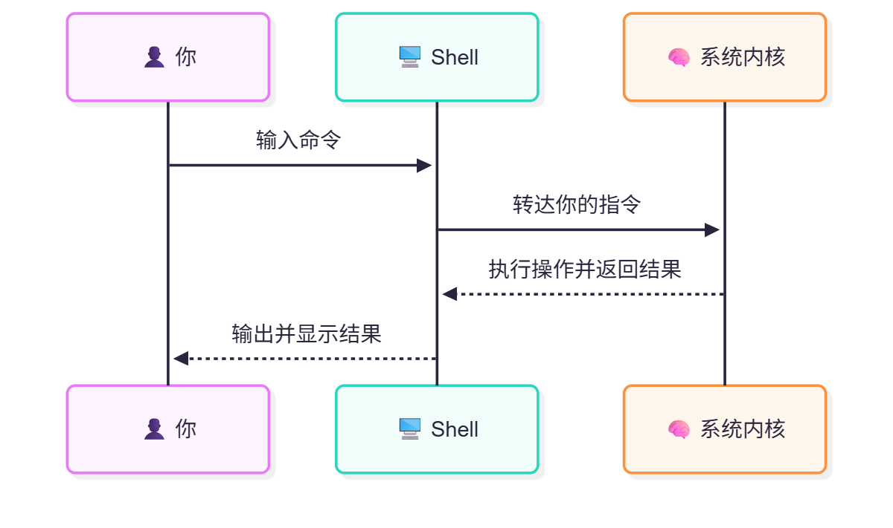

# 4.4 Shell 基础

## 什么是 Shell



Shell 是用户与操作系统内核进行交互的命令解释器（command interpreter），它接受用户输入的命令并将其传递给内核执行。用户的命令运行在 Shell 中，并通过 Shell 与系统进行交互。

FreeBSD 系统默认采用的 Shell 是 sh。需要指出的是，FreeBSD 的 `/bin/sh` 并非 Stephen R. Bourne 在贝尔实验室为 Unix V7 编写的原始 Bourne shell，而是基于 Kenneth Almquist 于 1989 年发布的 Almquist Shell（ash），后者是作为 Bourne shell 的更紧凑、更高效的替代品而设计的。BSD 系列自 4.4BSD 起便采用 ash 衍生的 sh，在功能上基本符合 [POSIX.1-2024](https://pubs.opengroup.org/onlinepubs/9799919799/utilities/V3_chap02.html) 标准中关于 Shell 的规范要求。

Linux 中常见的 Shell 一般是 bash（Bourne Again Shell，是对“Born Again”即“重生”的双关，意为“重生的 Bourne shell”）。而 macOS 中的默认 Shell 通常是 zsh（Z Shell）。

> **注意**
>
> Linux 中也存在 sh，但通常被软链接到其他 Shell（如 Debian/Ubuntu 中链接到 dash，部分发行版链接到 bash），它们并不是真正的 sh。
>
>- Ubuntu 24.04 LTS 默认的 Shell：
>
>```bash
> lrwxrwxrwx 1 root root 4  2 月 25 23:19 /bin/sh -> dash
> $ ls -l /bin/sh # 以长格式查看 /bin/sh 这个文件的详细信息
>```

## 快捷键

> **注意**
>
> 以下快捷键的执行不受键盘大小写状态（如 Caps Lock 开启或关闭）的影响。

### 使用 Scroll Lock 键在 TTY 界面上下翻页/翻行

使用 **Scroll Lock** 键（滚动锁定键）：按下 **Scroll Lock** 键后，可以使用上 ↑/下 ↓ 方向键以及 **Page Up**/**Page Down** 键对屏幕进行操作。

不同点：

- 上 ↑/下 ↓ 方向键：使 TTY 界面上下滚动一行
- **Page Up**/**Page Down** 键：使 TTY 界面上下滚动一页

再次按下 **Scroll Lock** 键将退出此模式。

> **技巧**
>
> SL 键在 **HOME** 键的上方，PS 截图键 **Print Screen** 的右侧，PB 键 **Pause/Break** 的左侧。

事实上，从历史角度来看，**Scroll Lock** 键正是为此类用途而设计的，它能在文本界面中滚动而不影响光标位置。

### 使用 Shift 组合键在 TTY 界面上下翻页/翻行

使用 **Shift** 快捷键：

- **Shift** + 上 ↑/下 ↓ 方向键——使 TTY 界面上下滚动一行
- **Shift** + **Page Up**/**Page Down** 键——使 TTY 界面上下滚动一页

### 补全命令或目录

一般可以使用 **Tab** 键补全命令或目录；上箭头 **↑** 用于查看上一条命令，下箭头 **↓** 用于查看下一条命令。

- 补全命令

```sh
# lo # 若此时按 Tab 键，输出如下。可以再输一个字母再按一次 Tab 键看看
local                    localedef                login
local-unbound            locate                   logins
local-unbound-anchor     lock                     logname
local-unbound-checkconf  lockf                    look
local-unbound-control    lockstat                 lorder
local-unbound-setup      locktest                 lowntfs-3g
locale
```

- 补全文件目录或文件名

```sh
$ cp /home/ykla/ # 此处按 Tab 键，然后再重复按一次 Tab 键，看看效果
$ cp /home/ykla/test/1.txt
.cache/                 .login                  bin/                    test2
.config/                .profile                HW_PROBE/               test3
.cshrc                  .sh_history             mine
.gitconfig              .sh_history.Y8RqIDNDIv  mydir/
.k5login                .shrc
```

### 终止命令

若要终止命令，可以使用 **Ctrl**+**C**：

```sh
# ping 163.com  # 测试与 163.com 的网络连通性
PING 163.com (59.111.160.244): 56 data bytes
64 bytes from 59.111.160.244: icmp_seq=0 ttl=52 time=27.672 ms
64 bytes from 59.111.160.244: icmp_seq=1 ttl=52 time=27.580 ms
^C # 注意这里，^C 即代表你在此处按下了 Ctrl+C 的组合键，随后命令被终止
--- 163.com ping statistics ---
2 packets transmitted, 2 packets received, 0.0% packet loss
round-trip min/avg/max/stddev = 27.580/27.626/27.672/0.046 ms
```

### 让命令位于前台和后台

**Ctrl**+**Z**：将当前进程挂起（暂停），随后可使用 `fg` 命令将其恢复到前台：

```sh
# ping 163.com  # 测试与 163.com 的网络连通性
PING 163.com (59.111.160.244): 56 data bytes
64 bytes from 59.111.160.244: icmp_seq=0 ttl=52 time=27.611 ms
64 bytes from 59.111.160.244: icmp_seq=1 ttl=52 time=27.691 ms
^Z[1] + Suspended               ping 163.com # 注意此处，按下了 Ctrl+Z
# fg # 返回前台
ping 163.com
64 bytes from 59.111.160.244: icmp_seq=3 ttl=52 time=27.465 ms
64 bytes from 59.111.160.244: icmp_seq=4 ttl=52 time=27.586 ms
64 bytes from 59.111.160.244: icmp_seq=5 ttl=52 time=27.522 ms
^C # 按 Ctrl+C 结束命令
--- 163.com ping statistics ---
6 packets transmitted, 6 packets received, 0.0% packet loss
round-trip min/avg/max/stddev = 27.465/27.596/27.701/0.085 ms
```

### 其他

- **Ctrl**+**L**（字母 L）：清空屏幕
- **Ctrl**+**A**：将光标移动到命令行首
- **Ctrl**+**E**：将光标移动到命令行尾

## 参考文献

- ALMQUIST K. ash (Almquist Shell)[EB/OL]. (1989-05-30)[2026-04-18]. <https://github.com/dsipher/ash>. FreeBSD 的 `/bin/sh` 基于 ash，而非 Stephen R. Bourne 的原始 Bourne shell。
- FOX B, RAMEY C. Bash Reference Manual[M]. Boston: Free Software Foundation, 2022. “Bourne Again Shell”是对“Born Again”的双关。

## 课后习题

1. 在 FreeBSD 中编写一个简单的 sh 脚本，实现命令补全的最小示例脚本，测试其功能并记录结果。
2. 查看 FreeBSD sh 源代码中处理快捷键绑定的实现部分，使其更现代化。
3. 修改 FreeBSD 中 shell 的默认提示符配置，验证其行为变化。
