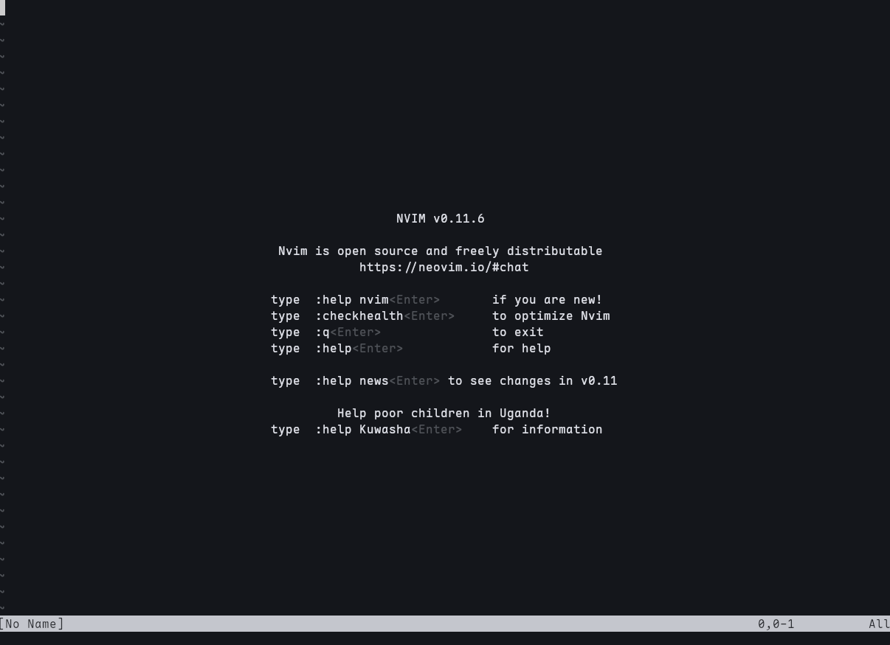
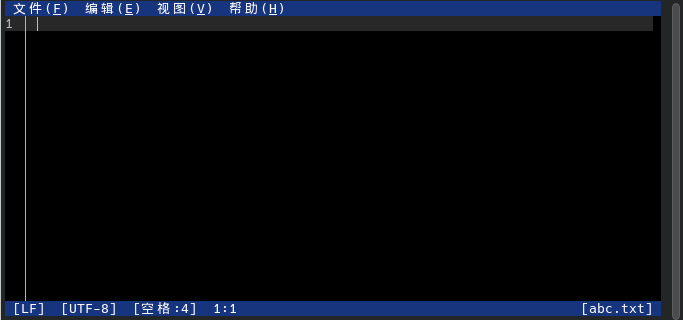

# 4.8 文本编辑器

文本编辑器是类 UNIX 系统中用于创建、查看、修改纯文本文件的工具。无论是编辑 **/etc/rc.conf** 文件、编写脚本还是查看日志，均需使用文本编辑器。

从编辑范式来看，文本编辑器可分为两大类：**模态编辑器**（modal editor）和**无模态编辑器**（modeless editor）。

模态编辑器的典型代表是 vi/Vim，其核心特征是将编辑操作划分为多个模式（如普通模式、插入模式、命令模式等），在不同模式下按键的含义不同，例如在普通模式下按 `i` 进入插入模式，而在插入模式下按 `i` 则输入字符 `i`。

无模态编辑器的典型代表是 ee 和 Emacs，其按键操作在所有状态下含义一致，通常直接输入字符即插入文本。模态编辑的设计源于 1976 年 Bill Joy 开发的 vi 编辑器，其设计动机是在 ADM-3A 终端的有限键盘上实现高效编辑，通过模式切换，无需同时按下控制键即可执行编辑命令。

本节依次介绍 FreeBSD 中常见的几款文本编辑器，涵盖内置基础工具、经典编辑器至现代增强版本与图形化选择：

| 编辑器 | 获取途径 | 特点简述 |
| ------ | -------- | -------- |
| ee | 基本系统 | 极其简单，操作类似记事本，按 ESC 键进入菜单操作 |
| vi | 基本系统 | 经典 modal（多模式）编辑器，BSD 原生 Nvi，轻量但命令多 |
| Vim | Ports | vi 增强版，具有语法高亮、插件、宏等现代功能 |
| NeoVim | Ports | Vim 重构现代版，Lua 配置、异步插件、LazyVim 发行版 |
| Emacs | Ports | 高度可扩展，几乎是“操作系统”，Lisp 配置 |
| microsoft-edit | Ports | 微软开源，支持中文、鼠标操作、界面友好 |

CLI 编辑器无需图形界面，可在 SSH 远程连接、纯文本控制台中使用，资源占用低，适用于服务器环境和远程管理场景。GUI 编辑器提供可视化界面和鼠标支持，更适合桌面环境下的日常开发与文档编辑工作。

> **注意**
>
> 本节仅介绍 FreeBSD 上常见文本编辑器的基本用法，不涉及深入配置，有需要的读者请自行查阅相关资料。

## ee 编辑器

`ee` 是 FreeBSD 基本系统内置的编辑器，支持中文文本编辑。

`ee` 的用法比 [nano](https://www.redhat.com/zh/blog/getting-started-nano)（一款 GNU 编辑器）更为直接，从其名字“easy editor”（简单的编辑器）即可看出其设计目标。`ee` 始终处于文本插入模式，除非底部出现提示或菜单。

使用 ee 编辑器打开 `a.txt` 文件：

```sh
# ee a.txt
```

可以直接进行编辑，用法与 `nano` 或 Windows 记事本类似。

按 **ESC 键** 弹出菜单，可执行保存、退出等操作。再按两次 **回车键** 保存。

## vi 编辑器

FreeBSD 还内置了一款编辑器 `vi`。FreeBSD 的 `vi` 实际上是 nex/nvi，是 4.4BSD ex/vi 的重新实现，旨在与原始 4BSD ex/vi 保持严格的兼容性。

与大多数 Linux 发行版将 `vi` 链接到 `vim` 不同，BSD 系统提供的是原生 `nvi`，其用法较为复杂但功能强大。

`ex`、`vi`、`view` 是同一程序的不同接口，可在编辑会话中切换。`view` 等同于 `vi -R`（只读模式）。nvi 接近 POSIX.1-2008 标准。

### vi 基本使用方法

打开 `vi` 后默认处于**命令模式**，此时输入 `i` 可以进入**插入模式**（文本模式），从而进行文本编辑。注意：在插入模式下，**退格键** 可能不起作用（行为类似 Insert 键），需要使用 **Delete 键** 删除字符。

> **技巧**
>
>`view` 命令相当于使用 vi 的 -R（只读）选项。

空行会显示为 `~`。

编辑完成后，按 **ESC 键** 返回命令模式。

在命令模式下输入 `:` 进入底线命令模式，常用命令包括：

- `:q` — 退出（若文件有修改则失败）
- `:q!` — 强制退出，不保存修改
- `:w` — 保存文件
- `:wq` 或 `ZZ` — 保存并退出
- `:wq!` — 强制保存并退出
- `:/关键词` 或 `/关键词` — 搜索关键词（按 n 查找下一个）

**示例**：

```vim
ABC
~
~
~
~
:wq
```

## Vim（增强版 vi）

Vim（vi IMproved）是 vi 的增强版本，提供了语法高亮、插件支持、多窗口等现代功能。Vim 由 Bram Moolenaar 于 1991 年开发，基于 vi 的操作模型并大幅扩展了其功能。Vim 采用模态编辑（modal editing）设计：在普通模式下按键执行命令，在插入模式下输入文本，在可视模式下选择文本，在命令行模式下执行 Ex 命令。

FreeBSD Ports 中的 Vim 默认编译为 console 版本，如需 GUI 支持（gvim）需安装 Port `editors/vim` 的 GTK 或 Motif 变体；Vim 在处理超大文件时可能消耗大量内存。

### 安装 Vim

使用 pkg 安装：

```sh
# pkg install vim
```

或者使用 ports 构建：

```sh
# cd /usr/ports/editors/vim
# make install clean
```

### 配置 Vim

安装后可使用 `vim` 命令替代 `vi`，配置更友好。基本配置放在 `~/.vimrc` 文件中。

临时启用行号：

```vim
:set number          " 显示绝对行号（简写 :set nu）
:set relativenumber  " 显示相对行号（简写 :set rnu）
:set nonumber        " 关闭绝对行号
:set norelativenumber " 关闭相对行号
```

要永久启用行号，编辑用户配置文件 `~/.vimrc`（如果不存在则创建）：

```vim
set number              " 或 set nu
" set relativenumber    " 可选：启用相对行号
```

## NeoVim（现代 vi 改进版）

NeoVim 是 Vim 的重构分支，更加模块化，支持 Lua 脚本，插件生态更活跃，性能更好。NeoVim 于 2014 年由 Thiago de Arruda 发起，旨在解决 Vim 的技术债务并引入现代扩展机制。其核心改进包括：内置 LSP（Language Server Protocol）支持、基于 Lua 的配置与插件系统、异步 I/O 架构，以及通过 msgpack-rpc 提供的 GUI/编辑器集成接口。

### 安装 NeoVim

- 使用 pkg 安装：

```sh
# pkg install neovim
```

- 或者使用 ports 构建：

```sh
# cd /usr/ports/editors/neovim
# make install clean
```

### NeoVim 基础配置

NeoVim 的配置文件位于 `~/.config/nvim/init.lua`（推荐使用 Lua）。

临时启用行号的命令与 Vim 相同，如需永久启用，编辑 `~/.config/nvim/init.lua` 文件（如果不存在则创建）：

```lua
vim.opt.number = true          -- 显示绝对行号
vim.opt.relativenumber = true  -- 显示相对行号（推荐与 number 一起用，形成混合模式）
```

### LazyVim 编辑器概述

LazyVim 是一个开箱即用的 NeoVim 配置发行版（distribution），基于 lazy.nvim 插件管理器，集成了代码补全、LSP、文件浏览器、Git 集成等 IDE 特性，非常适合需要快速获得强大编辑体验的用户。

#### 安装 LazyVim

推荐全新配置：

```sh
# 备份旧配置（如果存在）
$ mv ~/.config/nvim{,.bak} 2>/dev/null || true
$ mv ~/.local/share/nvim{,.bak} 2>/dev/null || true
$ mv ~/.local/state/nvim{,.bak} 2>/dev/null || true
$ mv ~/.cache/nvim{,.bak} 2>/dev/null || true

# 克隆 Starter 模板
$ git clone https://github.com/LazyVim/starter ~/.config/nvim

# 移除 git 历史
$ rm -rf ~/.config/nvim/.git

# 启动（首次会自动下载大量插件）
$ nvim
```

启动后按空格键可打开 LazyVim 的快捷键菜单，较为直观。

NeoVim 和 Vim 共享大部分命令，上述 `:q :q! :wq :wq! :/` 等在 LazyVim 中同样适用。



## Emacs 编辑器

Emacs 是历史悠久、功能极其强大的文本编辑器，以“可扩展性”闻名（几乎所有功能都可以通过 Emacs Lisp 扩展）。Emacs 由 Richard Stallman 于 1976 年开发，是 GNU 项目的核心组件之一。Emacs 的设计哲学是“编辑器即操作系统”——通过 Emacs Lisp 语言，Emacs 提供了文件管理器、邮件客户端、终端仿真器、调试器前端等超越文本编辑的功能。

### 安装 Emacs

使用 pkg 安装：

```sh
# pkg install emacs
```

或者使用 ports 构建：

```sh
# cd /usr/ports/editors/emacs
# make install clean
```

### Emacs 基础配置

Emacs 的用户配置文件通常为 `~/.emacs.d/init.el`。

编辑或创建 `~/.emacs.d/init.el` 配置文件：

```elisp
;; Emacs 基础配置示例
(setq inhibit-startup-screen t)     ; 关闭启动画面
(menu-bar-mode -1)                  ; 禁用菜单栏
(tool-bar-mode -1)                  ; 禁用工具栏
(scroll-bar-mode -1)                ; 禁用滚动条
(global-display-line-numbers-mode 1); 显示行号
```

### 退出 Emacs

退出 Emacs 的常用方式是先按快捷键 Ctrl + x，再按快捷键 Ctrl + c。如果有未保存的修改，Emacs 会提示是否保存。

其他常用启动方式：

- `emacs filename.txt` — 直接打开文件
- `emacs -nw` — 在终端内不启动图形界面

Emacs 图形用户界面：


Emacs CLI:


## microsoft-edit

microsoft-edit 是由微软开源的文本编辑器，原生支持中文，交互界面简单，并支持鼠标操作。该编辑器基于 Rust 编写，设计目标为提供一个轻量级、现代化的终端文本编辑器，支持语法高亮和 UTF-8 编码。

### 安装 microsoft-edit

- 使用 pkg 安装：

```sh
# pkg install microsoft-edit
```

- 还可以使用 Ports 安装：

```sh
# cd /usr/ports/editors/microsoft-edit/
# make install clean
```

### 使用 microsoft-edit

使用 msedit 编辑器打开 `abc.txt` 文件：

```sh
$ msedit abc.txt
```




操作直观，本节不再展开说明。

## 编辑器配置文件结构

以下是本节介绍的编辑器配置文件路径总结：

```sh
~/.vimrc  # Vim 配置文件
~/.config/
└── nvim/
    └── init.lua  # NeoVim 配置文件
~/.emacs.d/
└── init.el  # Emacs 配置文件
```

## 课后习题

1. 使 vi 支持 UTF-8 编码与中文字体。
2. 查看 FreeBSD 中 Nvi 编辑器的源代码，比较其与早期 UNIX vi 的差异。
3. 修改 FreeBSD 中 vi 编辑器的默认配置为 ee。
