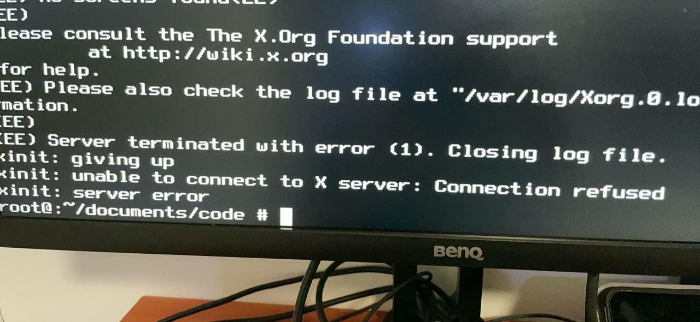
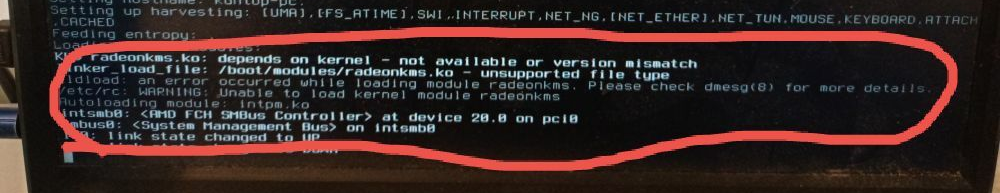

# 第 4.1 节 显卡驱动（英特尔、AMD）

>**警告**
>
>请勿使用 `sysutils/desktop-installer`，会引发不必要的错误和问题。

## 故障排除与未竟事宜



未安装显卡驱动。

---


## 显卡支持情况

对于 FreeBSD 13，编译使用 `drm-510-kmod`，支持情况同 Linux 5.10。AMD 可支持 R7 4750U。

FreeBSD 14.1-RELEASE、14-STABLE（OSVERSION > 1400508）、编译使用 `drm-61-kmod`，支持情况同 Linux 6.1。经过实际测试，可支持第十二代 Alder Lake-N（如 N100）。十三代等后续版本暂无条件测试。

FreeBSD 15 CURRENT，编译使用 `drm-66-kmod`，支持情况同 Linux 6.6。

>**技巧**
>
>可以在 port 开发者手册中的最后一章中查询 OSVERSION 对应的版本和 Git 提交。
>
>查看本机 OSVERSION：
>
>```sh
>root@ykla:~ # uname -U
>1500019
>```

>**警告**
>
>每次点版本或大版本升级时，可能需要重新获取新系统源代码，重新编译安装显卡驱动模块方可顺利完成升级，而不是卡在黑屏的地方：或者你使用“模块源”。


## 安装英特尔核显/AMD 显卡驱动

>**注意**
>
> 在使用 Gnome 时，如果自动锁屏/息屏，可能无法再次进入桌面。见 [Bug 255049 - x11/gdm doesn't show the login screen](https://bugs.freebsd.org/bugzilla/show_bug.cgi?id=255049)。

>**注意**
>
>在使用 Ports 时，drm 需要在 `/usr/src` 中有一份当前版本系统源代码，可参考系统更新章节。如果你是参考的本书其他章节进行的安装，那么你的系统中很可能已经有一份源码了，无需再获取源码。


### FreeBSD 13.X

```sh
# cd /usr/ports/graphics/drm-510-kmod
# make BATCH=yes install clean
```

或者（如有问题请使用 Ports）

```sh
# pkg install drm-510-kmod
```

### FreeBSD 14.X

>**技巧**
>
>若要使用 pkg 安装，请参照本书其他章节配置 kernel modules（kmods）内核模块源。

```sh
# cd /usr/ports/graphics/drm-61-kmod
# make BATCH=yes install clean
```

或者（如有问题请使用 Ports）

```sh
# pkg install drm-61-kmod
```

### FreeBSD 15.0

```sh
# cd /usr/ports/graphics/drm-66-kmod
# make BATCH=yes install clean
```

>**注意**
>
> 像英特尔三代处理器的 HD 4000 这种比较古老的显卡，他在传统的 BIOS 模式下无需额外安装显卡驱动，但是 UEFI 下有可能会花屏（FreeBSD 13.0 及以后无此问题），且需要安装此 DRM 显卡驱动。

## 配置英特尔核显/AMD 显卡

请按如下进行操作：

### intel 核芯显卡

  ```sh
  # sysrc -f /etc/rc.conf kld_list+=i915kms
  ```

### AMD

- 如果是 HD7000 以后的 AMD 显卡，添加 `amdgpu`（大部分人应该使用这个，如果没用再换 `radeonkms`）

    ```sh
    # sysrc -f /etc/rc.conf kld_list+=amdgpu
    ```

- 如果是 HD7000 以前的 AMD 显卡，添加 `kld_list="radeonkms"`（这是十多年前的显卡了）

    ```sh
    # sysrc -f /etc/rc.conf kld_list+=radeonkms
    ```

### 故障排除与未竟事宜

>**注意**
>
>遇到任何问题时，请先使用 Ports 重新编译安装。尤其是在版本升级时。

- `KLD XXX.ko depends on kernel - not available or version mismatch.`

提示内核版本不符，请先升级系统或使用 ports 编译安装。



## 视频硬解（重要）

如果不配置此节，blender 等软件将无法运行！直接“段错误”。

```sh
# pkg install  libva-intel-media-driver
```

或者

```sh
# cd /usr/ports/multimedia/libva-intel-media-driver/ 
# make install clean
```

## 亮度调节

### 通用

- 对于一般计算机：

```sh
# sysrc -f /boot/loader.conf  acpi_video="YES"
```

- 对于 Thinkpad：

```sh
# sysrc -f /boot/loader.conf  acpi_ibm_load="YES"
# sysrc -f /boot/loader.conf  acpi_video="YES"
```

### 英特尔/AMD

`backlight` 自 FreeBSD 13 引入。

```sh
# backlight          # 打印当前亮度
# backlight decr 20  # 降低 20% 亮度
# backlight +        # 默认调整亮度增加 10%
# backlight -        # 默认调整亮度减少 10%
```

如果上述操作不起作用，请检查路径 `/dev/backlight` 下都有哪些设备。

- 示例（照抄不会起作用的，自己 `ls /dev/backlight` 看看）：

```sh
# backlight -f /dev/backlight/amdgpu_bl00 - 10
# backlight -f /dev/backlight/backlight0 - 10  
```

### 参考文献

- [backlight -- configure backlight	hardware](https://man.freebsd.org/cgi/man.cgi?backlight)
- 经过测试，此部分教程适用于 renoir 显卡：

## 故障排除与未竟事宜

- 如果显卡使用驱动有问题请直接联系作者：[https://github.com/freebsd/drm-kmod/issues](https://github.com/freebsd/drm-kmod/issues)
- 如果笔记本出现了唤醒时屏幕点不亮的问题，可以在 `/boot/loader.conf` 中添加 `hw.acpi.reset_video="1"` 以在唤醒时重置显示适配器。
- 普通用户若非 `wheel` 组成员，那么请加入 `video` 组。

## 参考文献

- 显卡详细支持情况可以看 [wiki/Graphics](https://wiki.freebsd.org/Graphics)
