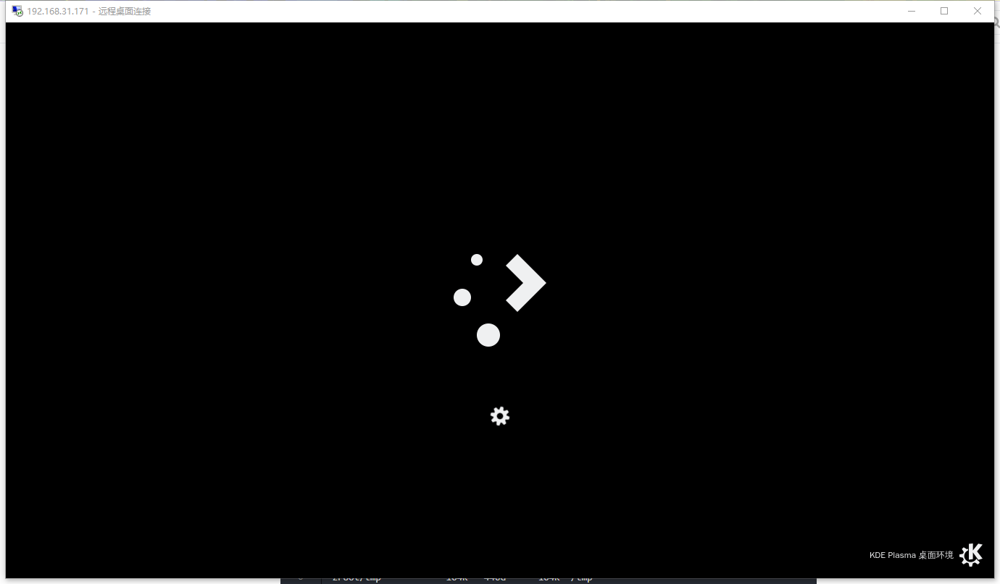
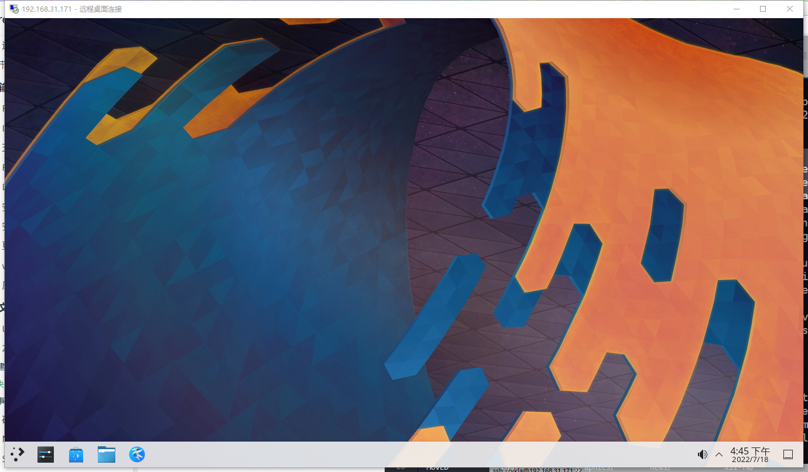

# 第 4.10 节 远程桌面管理

## VNC

启用 VNC 服务（目前只剩下这个 TigerVNC 了）

安装 TigerVNC Server：

```shell-session
# pkg install -y tigervnc-server
```

安装之后，还要做一些设置：

在终端执行命令 `vncpasswd`，设置访问密码。

创建 `~/.vnc/xstartup` 文件，内容如下：

```shell-session
#!/bin/sh
unset SESSION_MANAGER
unset DBUS_SESSION_BUS_ADDRESS
[ -x /etc/X11/xinit/xinitrc ] && exec /etc/X11/xinit/xinitrc
[ -f /etc/X11/xinit/xinitrc ] && exec sh /etc/X11/xinit/xinitrc
xsetroot -solid grey
$command &
```

注意：`$command` 需要替换，请注意保留 `&`，在不同桌面下需要替换，Gnome 用 `gnome-session`，KDE 用 `startplasma-x11`，MATE 用 `mate-session`，Xfce 用 `xfce4-session`。

保存后执行命令 `# chmod 755 ~/.vnc/xstartup`。

- 接下来在终端执行命令 `vncserver` 或 `vncserver :1`。

其中“`:1`”相当于 `DISPLAY=:1`，即指定桌面显示的通信端口为 `1`，对应 VNC 服务的通信端口为 `5901`。尽管桌面显示通信端口 是从 0 开始，但该端口已被当前桌面占用，因此 VNC 服务默认端口虽为 5900，但实际执行往往从 5901 开始。

如果启动服务时不指定通信端口，则系统根据使用情况自动指定。

关闭服务请用命令 `# vncserver -kill :1`，这里通信端口必须指定。

- 如果启用了防火墙，那么此时还需要开通防火墙，以 ipfw 为例，在终端输入命令：

```shell-session
# ipfw add allow tcp from any to me 5900-5910 in keep-state
```

上行命令表示开通 5900-5910 的端口，即 DISPLAY 的 0-10 端口，通常情况下，即便需要开启很多桌面，10 个端口也足够了。最后别忘了将指令加入规则集文件，否则操作系统重启后会丢失。

## XRDP

### 使用其他机器远程 FreeBSD

安装软件包（以 KDE5 桌面为基准）：

```shell-session
# pkg install xorg kde5 xrdp wqy-fonts xdg-user-dirs
```

配置：

```shell-session
# sysrc xrdp_enable="YES"
# sysrc xrdp_sesman_enable="YES"
# sysrc dbus_enable="YES"
```

编辑 `/usr/local/etc/xrdp/startwm.sh`：

找到 `#### start desktop environment`，修改如下：

```shell-session
#### start desktop environment
# exec gnome-session
# exec mate-session
# exec start-lumina-desktop
exec ck-launch-session startplasma-x11   #更改此处
# exec startxfce4
# exec xterm                             #更改此处
```

然后重启系统。

打开 windows 自带的远程桌面链接，输入 IP 地址/用户名/密码进行链接。

> **注意**
>
> 如果看到一个背景是蓝色的菜单。请保持 xrdp 默认设置，第一行 Xorg，第二行 输入 FreeBSD 系统中的用户名，第三行输入其密码。点击 `OK`，即可进入桌面。

#### 中文化(该用户使用 sh 作为 shell）：

```shell-session
#### set environment variables here if you want
export LANG=zh_CN.UTF-8
```

#### 登录

首次登录设备会有安全提示，输入 `yes`，回车后远程桌面窗口就会弹出.





### 使用 FreeBSD 远程其他机器

安装命令：

```shell-session
# pkg install -y rdesktop
```

但 rdesktop 安装后不会在系统中生成菜单，因此要在终端输入命令：

```shell-session
# rdesktop windows 设备 ip
```

## anydesk

通过使用 anydesk 可以远程协助：

```shell-session
# cd /usr/ports/deskutils/anydesk/ && make install clean
```

即可。

