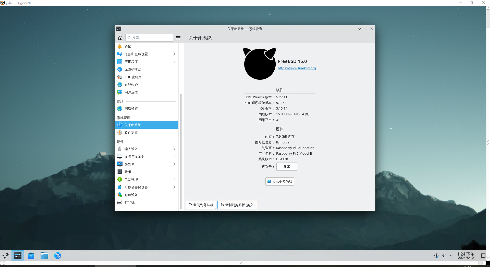
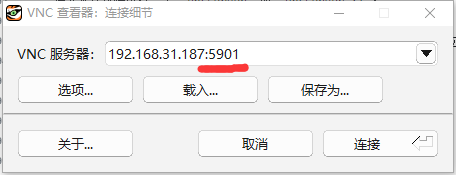
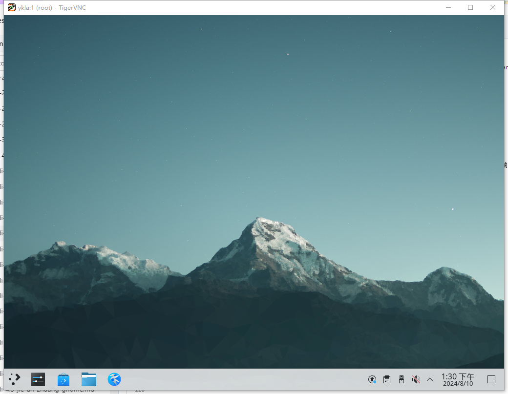

# 第 4.12 节 远程桌面管理

## VNC 与 RPD（XRDP） 对比

XRDP 是 Microsoft RDP 的开源实现。

| **特性**         | **VNC**                                                      | **XRDP**                                                     |
|:------------------:|--------------------------------------------------------------|--------------------------------------------------------------|
| **协议**         | 基于 RFB（Remote Framebuffer）协议                           | 基于 RDP（Remote Desktop Protocol）协议                      |
| **设计目标**     | 跨平台远程访问桌面环境，传输屏幕图像数据（基于像素）                     | 兼容 Windows RDP 远程访问，针对 Linux 开发（通过转发 X11 的图形原语、高级命令）（似乎现在 WIndows to WIndows 不是这样？请求出处。） |
| **性能**         | 图像更新效率较低，带宽和延迟敏感的网络环境下性能差            | 性能较好，适用于低带宽和高延迟网络                           |
| **资源消耗**     | 资源消耗较高，尤其是高分辨率下             | 资源消耗较低                                                  |
| **跨平台兼容性** | 支持在 Windows、Linux、macOS 等不同操作系统间的远程连接          | 主要用于 Windows 和 Linux 间的远程连接                   |
| **安全性**       | 默认未提供强加密（第三方加密亦不安全且只会增加复杂度）；主流客户端、服务器软件漏洞多       | RDP 默认支持 TLS 加密、128 位加密，安全性高                         |
| **会话管理**     | 显示当前活动会话，多用户共享同一会话；它不会保留用户的会话状态                        | 支持多用户独立会话管理，每个用户都有独立的桌面环境；用户可以在断开连接后重新连接并继续之前的会话           |
| **使用体验**     | 使用体验简单直接，适合跨平台访问                          | 使用体验接近 Windows 远程桌面，操作更流畅                  |
| **鼠标**          | 实时传输鼠标动作，响应速度受网络延迟影响较大，精度会下降           | 基于 RDP 协议，鼠标操作响应更快，更流畅；在低带宽条件下表现更好 |
| **键盘**          | 支持键盘操作，会出现输入延迟、重复输入等问题，受网络波动影响大           | 键盘输入响应更快，延迟较低，输入体验接近本地操作                      |
| **剪贴板共享**        | 通常仅限文本                               | 支持更丰富的剪贴板共享，包括文本、文件、图像等                      |
| **文件传输**          | 原生不支持文件传输          | 支持文件传输，直接在远程桌面环境中复制粘贴文件，操作方便                |
| **文件拖放**          | 通常不支持文件拖放操作                 | 支持文件拖放                                 |、
| **CPU/GPU 硬解码**    | 主要依赖 CPU 进行渲染和解码，硬解码支持有限，通常不会利用 GPU 资源       | 支持 GPU 硬解码，能有效利用 GPU 加速渲染和解码，提高性能，减轻 CPU 负担 |
| **软解码**            | 默认使用软解码，CPU 资源占用较高，影响性能                        | 软解码依赖 CPU，但性能影响较小，因为 RDP 协议优化好                      |
| **硬件直通**          | 不支持硬件直通功能                                                     | 支持部分硬件直通功能      |
|**分辨率**|由服务器控制|客户机服务器均可设置|
|**屏幕镜像**|支持|不支持|

综合上表，除了不支持屏幕镜像外，XRDP 完胜。又是 WIndows 的一大优点体现。

### 参考文献

- [xrdp: an open source RDP server](https://github.com/neutrinolabs/xrdp)
- [VNC 还是 RDP? 云上的远程桌面究竟该如何选](https://aws.amazon.com/cn/blogs/china/vnc-or-rdp-how-to-choose-a-remote-desktop-on-the-cloud/)
- [UOS_远程桌面_xrdp_Xorg_x11vnc](https://www.cnblogs.com/osnosn/p/16690589.html)

## VNC

### x11vnc（镜像屏幕）

**和远程软件 todesk 一样会直接镜像屏幕，简言之，你的所有操作都会被同步到显示器上面**

如果没有显示器则不能使用 x11vnc。

安装 x11vnc：

```
# pkg install x11vnc
```

创建密码：

```
$ x11vnc -storepasswd
Enter VNC password: 
Verify password:    
Write password to /root/.vnc/passwd?  [y]/n y #此处键入 y 回车
Password written to: /root/.vnc/passwd
```

启动服务器（KDE 5 SDDM 为例）：

```
$ x11vnc -display :0 -rfbauth ~/.vnc/passwd -auth $(find /var/run/sddm/ -type f)
```

- LightDM

```
$ x11vnc -display :0 -rfbauth ~/.vnc/passwd -auth /var/run/lightdm/root/\:0
```

- GDM

```
$ x11vnc -display :0 -rfbauth ~/.vnc/passwd -auth /var/lib/gdm/:0.Xauth #或 /run/user/120/gdm/Xauthority，取决于你的 gdm 版本，自己 ls 看一下
```



#### 参考文献

- [x11vnc -allow VNC connections to real X11 displays](https://man.freebsd.org/cgi/man.cgi?query=x11vnc&sektion=&manpath=freebsd-release-ports)
- [X11vnc](https://wiki.archlinux.org/title/X11vnc)
  
### TigerVNC

启用 VNC 服务（目前 Ports 就只剩下这个 [TigerVNC](https://www.freshports.org/net/tigervnc-server/) 了）

安装 TigerVNC Server：

```shell-session
# pkg install tigervnc-server
```

安装之后，还要做一些设置：

在终端执行命令 `vncpasswd`，设置访问密码。

创建 `~/.vnc/xstartup` 文件：


```
root@ykla:~ # mkdir -p ~/.vnc/
root@ykla:~ # ee ~/.vnc/xstartup
```

内容如下：

```shell-session
#!/bin/sh
unset SESSION_MANAGER
unset DBUS_SESSION_BUS_ADDRESS
[ -x /etc/X11/xinit/xinitrc ] && exec /etc/X11/xinit/xinitrc
[ -f /etc/X11/xinit/xinitrc ] && exec sh /etc/X11/xinit/xinitrc
xsetroot -solid grey
exec command &  #此处不能照抄！
```

注意：上述 `command` 须进行替换，**请注意保留 `&`**，在不同桌面下需要替换，Gnome 用 `gnome-session`，KDE 用 `startplasma-x11`，MATE 用 `mate-session`，Xfce 用 `xfce4-session`。

保存后执行命令 

```
# chmod 755 ~/.vnc/xstartup
```

- 接下来在终端执行命令 `vncserver` 或 `vncserver :1`。

其中“`:1`”相当于 `DISPLAY=:1`，即指定桌面显示的通信端口为 `1`，对应 VNC 服务的通信端口为 `5901`。尽管桌面显示通信端口是从 0 开始，但该端口已被当前桌面占用，因此 VNC 服务默认端口虽为 5900，但实际执行往往从 5901 开始。

如果启动服务时未通信端口，则系统根据使用情况自动指定。


>**故障排除：由于目标服务器积极拒绝，无法连接**
>
>非镜像 vnc 在连接时必须指定端口，否则按默认端口 5900 进行连接，但是你不是镜像的屏幕，所以必定连不上。
>
>
>
>示例：
>```
>192.168.31.187:5901
>```



关闭服务请用命令 `# vncserver -kill :1`，这里必须指定通信端口。

- 如果启用了防火墙，以 ipfw 为例，在终端输入命令：

```shell-session
# ipfw add allow tcp from any to me 5900-5910 in keep-state
```

上行命令表示放通端口 5900-5910，即 DISPLAY 0-10。

#### 参考文献

- [Xfce4 is not displayed correctly when I connect vncviewer (in Linux) to tightvnc-server (on FreeBSD)](https://forums.freebsd.org/threads/xfce4-is-not-displayed-correctly-when-i-connect-vncviewer-in-linux-to-tightvnc-server-on-freebsd.85709/)

## XRDP

### 使用其他机器远程 FreeBSD

安装软件包（以 KDE5 桌面为基准）：

```shell-session
# pkg install xorg kde5 xrdp wqy-fonts xdg-user-dirs
```

配置：

```shell-session
# sysrc xrdp_enable="YES"
# sysrc xrdp_sesman_enable="YES"
# sysrc dbus_enable="YES"
```

编辑 `/usr/local/etc/xrdp/startwm.sh`：

找到 `#### start desktop environment`，修改如下：

```shell-session
#### start desktop environment
# exec gnome-session
# exec mate-session
# exec start-lumina-desktop
# exec ck-launch-session startplasma-x11 #KDE5 须更改此处
# exec startxfce4                        #xfce 须更改此处
# exec xterm                             #xterm 须更改此处
```

然后重启系统。

打开 Windows 自带的远程桌面链接，输入 IP 地址/用户名/密码进行连接。

> **注意**
>
> 如果看到一个背景是蓝色的菜单。请保持 xrdp 默认设置，第一行 Xorg，第二行 输入 FreeBSD 系统中的用户名，第三行输入其密码。点击 `OK`，即可进入桌面。

#### 中文化(该用户使用 sh 作为 shell）：

```shell-session
#### set environment variables here if you want
export LANG=zh_CN.UTF-8
```

#### 登录

首次登录设备会有安全提示，输入 `yes`，回车后远程桌面窗口就会弹出.


### 使用 FreeBSD 远程其他机器

安装命令：

```shell-session
# pkg install -y rdesktop
```

但 rdesktop 安装后不会在系统中生成菜单，因此要在终端输入命令：

```shell-session
# rdesktop windows 设备 ip
```

## anydesk

使用 anydesk 可进行远程访问：

由于版权问题（**私有软件未经许可默认禁止分发**），必须用户使用 Ports 自行编译：

```shell-session
# cd /usr/ports/deskutils/anydesk/ && make install clean
```
