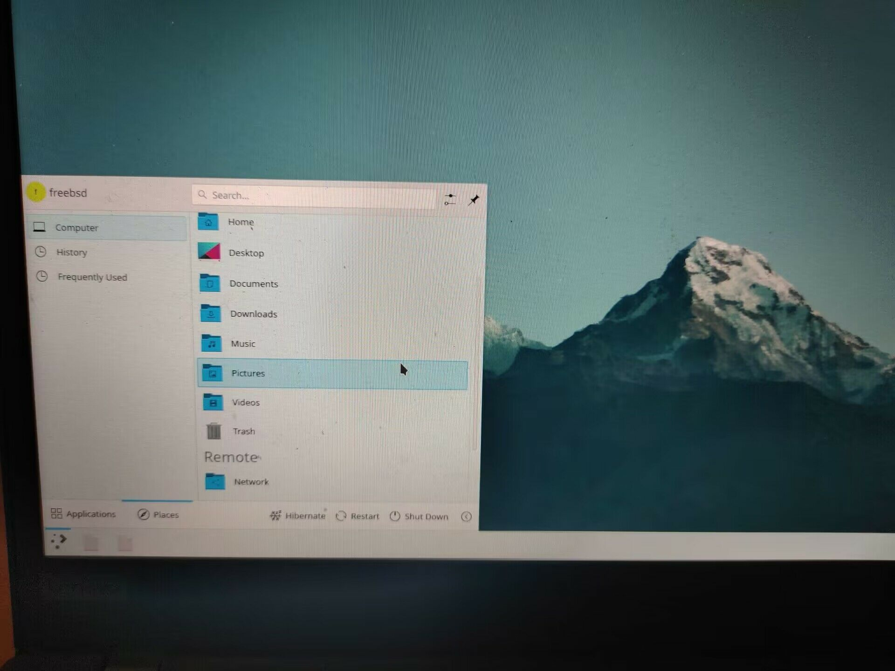
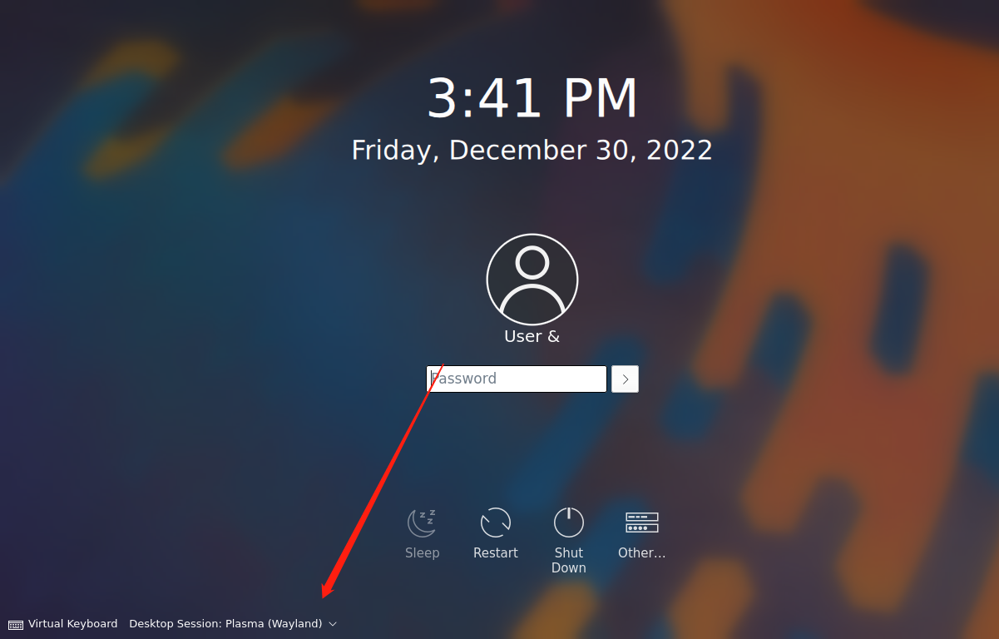
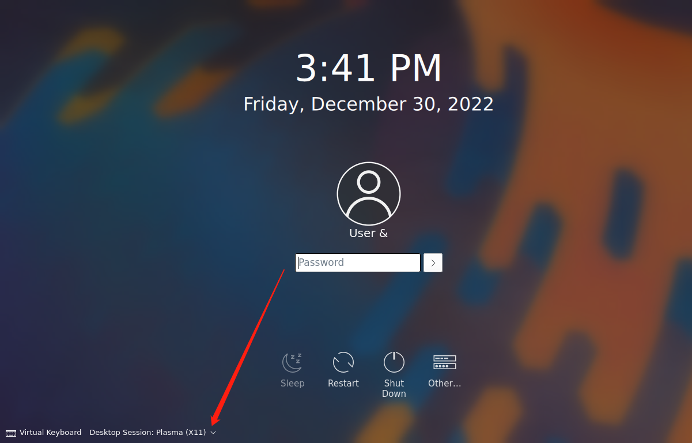
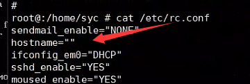
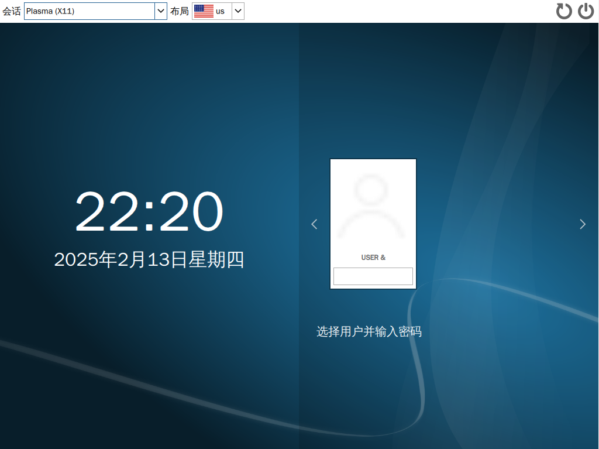

# 第 4.2 节 安装 KDE 5

> 视频教程：FreeBSD 13.1 + VMware 17 + KDE5: [FreeBSD 13.1 安装 KDE5——基于 VMware 17](https://www.bilibili.com/video/BV1UR4y1U71T/)

## 安装

```shell-session
# pkg install xorg sddm kde5 plasma5-sddm-kcm wqy-fonts xdg-user-dirs
```

> 上面的命令分别安装了桌面、窗口管理器和中文字体以及创建用户目录的工具。

> **故障排除**
>
> **如果有时候提示找不到或者没有 kde5,请去** [**x11/kde5**](https://www.freshports.org/x11/kde5) **看看是不是二进制包没有被构建出来。有时候需要切换 quarterly（待上游构建出来了再换到 latest 源，pkg upgrade 升级即可）或者 latest 源。类似方法适用于所有软件，故后边不再赘述。**

## 配置

### Procfs 设置【可选，FreeBSD 13.2 及以后不再需要】

> **提示**
>
> 以下 proc 设置在 FreeBSD 13.2 及以后版本中将 **[不再需要](https://reviews.freebsd.org/R9:60af3bb18c6a0b7c3082e69d0bfb1d5f809e342b)**，无需配置。但是旧版本 **必须** 如此做。
>
> 但是[其中给出的说法](https://bugs.freebsd.org/bugzilla/show_bug.cgi?id=269621)是不正确的，起码在 2023.4.11 之前，还是需要进行该配置的。

`# ee /etc/fstab`

添加内容如下:

```shell-session
proc            /proc           procfs  rw      0       0
```

> 无论虚拟机还是物理机，添加 proc 挂载这一步都是非常必要的，如果不添加会导致桌面服务无法正常运行，部分组件无法加载！

> > **警告**
> >
> > **如果你不配置 proc，在普通用户下，你的所有图标都将变成无法点击的白色方块，**_**任何软件都打不开**_**，桌面陷入异常。且后续再进行配置也是无效的，必须重装系统。**
>
> ↓↓↓↓↓↓↓↓↓↓↓↓↓↓↓↓↓↓↓↓↓↓ **这就是后果** ↓↓↓↓↓↓↓↓↓↓↓↓↓↓↓↓
>
>  <figure><figcaption></figcaption></figure>

### 启动项设置

```shell-session
# sysrc dbus_enable="YES"
# sysrc sddm_enable="YES"
```

然后（可选，如果不需要 `startx`。）

```shell-session
# echo "exec ck-launch-session startplasma-x11" > ~/.xinitrc
```

> 如果你在 root 下已经执行过了，那么新用户仍要再执行一次才能正常使用（无需 root 权限或 sudo 等）`startx`。

提示：hal 已经被删除。**不需要**再添加~~hald_enable="YES",~~ 见：

[sysutils/hal](https://www.freshports.org/sysutils/hal)

### 权限设置

> 普通用户还需要将用户加入 wheel 组：
>
> ```shell-session
> # pw groupmod wheel -m 用户名
> ```

## 故障排除

> - **如果 sddm 登录闪退到登录界面，请检查左下角是不是 plasma-X11，闪退的一般都是 Wayland！因为目前 FreeBSD 上的 KDE 5 尚不支持 Wayland。**
>
> 
>
> **如果你使用 VMware 虚拟机时，压根看不见 sddm 最下边的选项，请按照配置虚拟机章节的教程配置屏幕自动缩放。**
>
> - **如果启动 sddm 提醒 `/usr/bin/xauth: (stdin):1: bad display name`，但是可以正常 `startx`，则你需要在 `/etc/rc.conf` 里面检查你的 `hostname` 是不是空的，有没有设置：**
>
> 
>
> 设置 `hostname` 即可。

## 中文化

点击开始-> System Settings -> Regional Settings 在 `Language` 项的 `Available Language` 栏中找到 “简体中文” 单击 `>` 将其加到 `Preferrred Languages` 栏中，然后单击 `Apply` 按钮；再到 `Formats` 项，将 `Region` 文本框中的内容修改为 “中国-简体中文(zh-CN)”，单击 `Apply` 按钮，logout（注销）后重新登录，此时系统语言将变为中文。


### SDDM 中文化


```
# sysrc sddm_lang="zh_CN.UTF-8"
```



#### 参考文献

- [SDDM login screen with KDE: change language?](https://forums.freebsd.org/threads/sddm-login-screen-with-kde-change-language.80535/)
