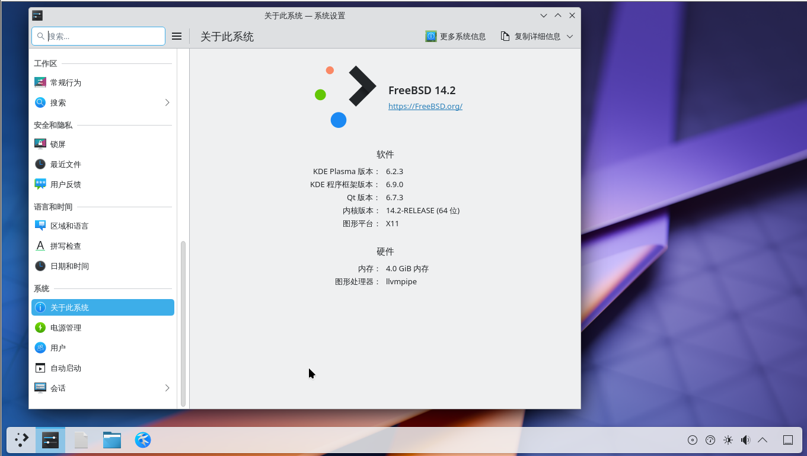

# 第 4.2 节 安装 KDE6

>**技巧**
>
>视频教程见 [003-FreeBSD14.2 安装 KDE6](https://www.bilibili.com/video/BV12zAYeKEej)

>**注意**
>
>旧版本升级说明：即卸载后安装新的 KDE。
>
>```
># pkg remove -f kde5 && pkg autoremove
>```
>或
>```
># pkg remove -f kde6 && pkg autoremove
>```

然后按下文操作即可。
## 安装

```sh
# pkg install xorg sddm kde plasma6-sddm-kcm wqy-fonts xdg-user-dirs
```

或者：

```sh
# cd /usr/ports/x11/xorg/ && make install clean # X11
# cd /usr/ports/x11/kde/ && make install clean # KDE5
# cd /usr/ports/x11/sddm/ && make install clean # 窗口管理器
# cd /usr/ports/deskutils/plasma6-sddm-kcm/ && make install clean # KDE 管理 SDDM 的模块
# cd /usr/ports/x11-fonts/wqy/ && make install clean # 文泉驿字体
# cd /usr/ports/devel/xdg-user-dirs/ && make install clean # 自动创建用户目录的工具
```


> **故障排除**
>
> 如果有时候提示 `pkg` 找不到或者没有 kde6，请点击 [x11/kde](https://www.freshports.org/x11/kde) 看看是不是二进制包没有被构建出来。有时候需要切换 quarterly（待上游构建出来了再换到 latest 源，`pkg upgrade` 更新即可）或者 latest 源。类似方法适用于所有软件，故后边不再赘述。如果没有，需要自己使用上述的 Port 进行编译。

## 启动项设置

```sh
# sysrc dbus_enable="YES"
# sysrc sddm_enable="YES"
```


### `startx`

```sh
# echo "exec ck-launch-session startplasma-x11" > ~/.xinitrc
```

> 如果你在 root 下已经执行过了，那么新用户仍要再执行一次才能正常使用（无需 root 权限或 sudo 等）`startx`。


##  基于 Wayland

在前文的基础上，把 `/usr/local/share/xsessions/plasmax11.desktop` 中的 `/usr/local/bin/startplasma-x11` 都改成 `/usr/local/bin/startplasma-wayland`。重启即可。



## 权限设置

> 普通用户还需要将用户加入 wheel 组（或 `video` 组）：
>
> ```sh
> # pw groupmod wheel -m 用户名
> ```

## 登录界面主题

安装：

```sh
# pkg install sddm-freebsd-black-theme
```

或：

```sh
# cd /usr/ports/x11-themes/sddm-freebsd-black-theme/ 
# make install clean
```


查看配置：

```sh
root@ykla:/home/ykla # pkg info -D sddm-freebsd-black-theme
sddm-freebsd-black-theme-1.3:
On install:
To enable this theme edit:

 /usr/local/etc/sddm.conf

 This theme use the x11-fonts/montserrat font by default. However, it
 can be changed to any desired font editing:

 /usr/local/share/sddm/themes/sddm-freebsd-black-theme/theme.conf

Always:
===>   NOTICE:

The sddm-freebsd-black-theme port currently does not have a maintainer. As a result, it is
more likely to have unresolved issues, not be up-to-date, or even be removed in
the future. To volunteer to maintain this port, please create an issue at:

https://bugs.freebsd.org/bugzilla

More information about port maintainership is available at:

https://docs.freebsd.org/en/articles/contributing/#ports-contributing
```

编辑 `/usr/local/etc/sddm.conf`：

写入：

```sh
[Theme]
Current=sddm-freebsd-black-theme
```

重启，设置完成：

 

### 参考文献

- [デスクトップ環境の構築 - 4-7. LXQTのインストールと設定(LXQT 2.0.0)](http://silversack.my.coocan.jp/bsd/fbsd11x_bde-4-7_lxqt.htm)

## 中文化

### SDDM 中文化

```sh
# sysrc sddm_lang="zh_CN"
```

### 系统中文化方法①用户分级

编辑 `/etc/login.conf`：

找到 `default:\` 这一段，把 `:lang=C.UTF-8` 修改为 `:lang=zh_CN.UTF-8`。

刷新数据库：

```sh
# cap_mkdb /etc/login.conf
```


### 系统中文化方法②系统设置

点击开始-> System Settings ->  `Language & Time` 在 `Region & Language` 项的 `Language` 栏点击右侧 `Modify` 中找到 “简体中文”（一般是倒数第二，如果都是`□□□□`，检查你的中文字体安装否） 单击之。然后单击 `Apply` 按钮；logout（注销）后重新登录，此时系统语言将变为中文。


#### 参考文献

- [SDDM login screen with KDE: change language?](https://forums.freebsd.org/threads/sddm-login-screen-with-kde-change-language.80535/)


## 故障排除

### sddm 登录闪退


如果你使用 VMware 虚拟机时，压根看不见 sddm 最下边的选项，请按照配置虚拟机章节的教程配置屏幕自动缩放。


### 启动 sddm 提醒 `/usr/bin/xauth: (stdin):1: bad display name`，但是可以正常 `startx`

你需要在 `/etc/rc.conf` 里面检查你的 `hostname` 是否为空（理论上不应该为空），有没有设置：


按需设置 `hostname` 即可。

### 菜单缺失关机、重启等四个按纽

如果无效请先看看你是不是在 sddm 界面选择了`用户会话`（读取 `.xinitrc`），应该选择 `plasma-x11`。

修改 `/etc/sysctl.conf` 将其中 `security.bsd.see_other_uid` 的值改为 `1`（`1` 为开启）。重启后即可。

#### 参考文献

- [Missing power buttons when logged in from SDDM](https://forums.freebsd.org/threads/missing-power-buttons-when-logged-in-from-sddm.88231/)

### 解除自动锁屏

单击“设置”——>“安全和隐私”——>“锁屏”——>“自动锁定屏幕”选择“不自动锁屏”，然后点击“应用”。（休眠唤醒后锁定屏幕可按需设置）

注销后重新登录即可。


### 状态栏不显示时钟和时间

点击时区设置，输入 `beijing`，设置上海即可。若无效，请先更新软件包。

### Procfs 设置（FreeBSD 13.2 前必须如此）

> **提示**
>
> 以下 proc 设置在 FreeBSD 13.2 及以后版本中将 **[不再需要](https://reviews.freebsd.org/R9:60af3bb18c6a0b7c3082e69d0bfb1d5f809e342b)**，无需配置。但是旧版本 **必须** 如此做。
>
> 但是[其中给出的说法](https://bugs.freebsd.org/bugzilla/show_bug.cgi?id=269621)是不正确的，起码在 2023.4.11 之前，还是需要进行该配置的。

```sh
# ee /etc/fstab
```

添加内容如下:

```sh
proc            /proc           procfs  rw      0       0
```

> 在 13.2 以前，无论虚拟机还是物理机，添加 proc 挂载这一步都是非常必要的，如果不添加会导致桌面服务无法正常运行，部分组件无法加载！

> > **警告**
> >
> > 在 13.2 以前，如果你不配置 proc，在普通用户下，你的所有图标都将变成无法点击的白色方块，任何软件都打不开，桌面陷入异常。且后续再进行配置也是无效的，必须重装系统。
>
> ↓↓↓ 这就是后果 ↓↓↓
>
>  
