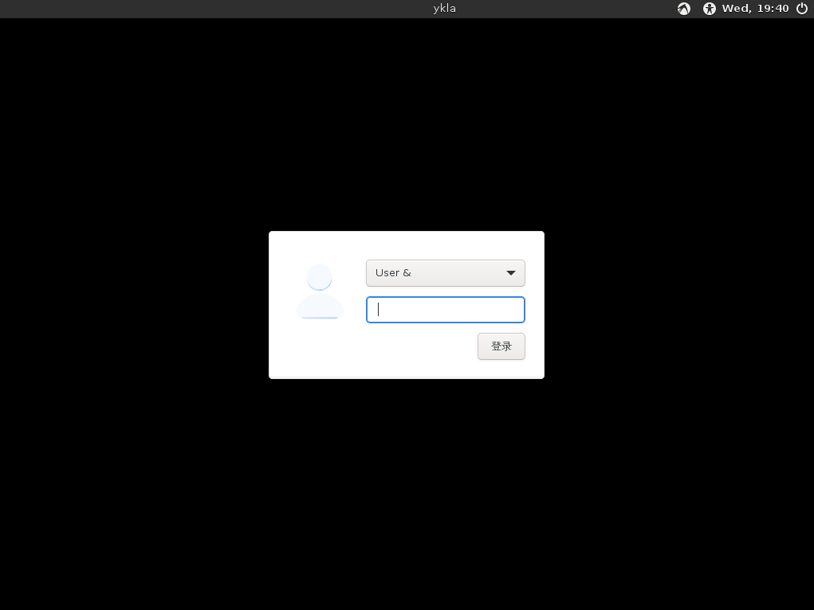
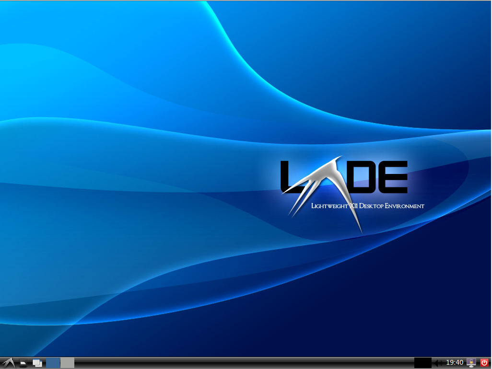
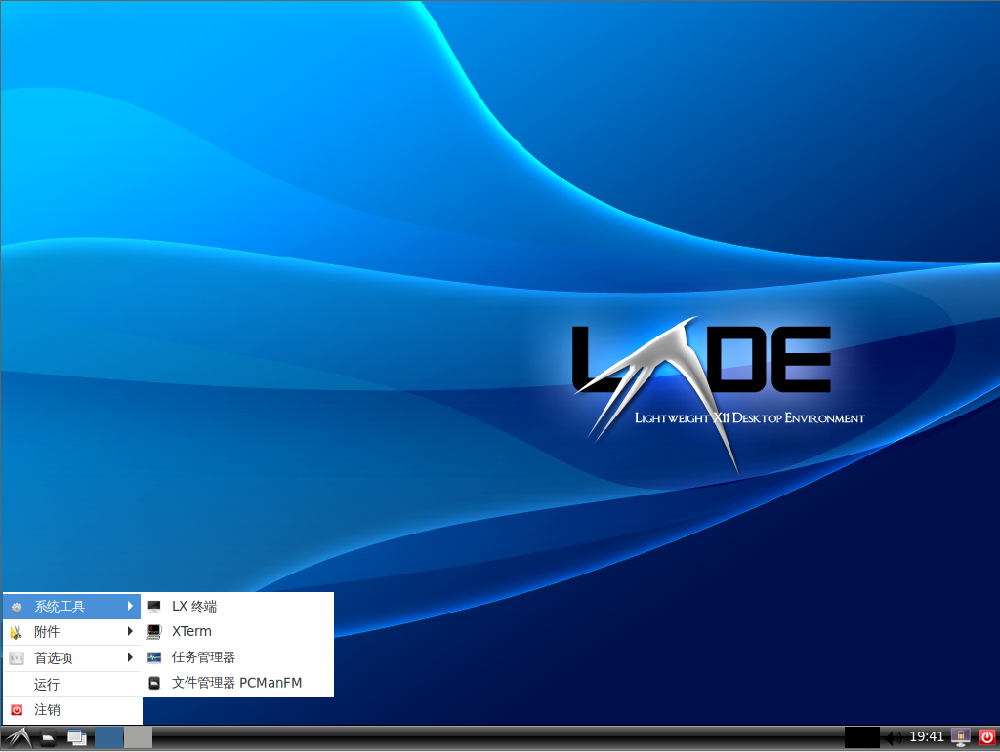

# 第 4.21 节 安装 LXDE

## 安装

```sh
# pkg install lxde-meta xorg lightdm lightdm-gtk-greeter wqy-fonts xdg-user-dirs
```

或者：

```sh
# cd /usr/ports/x11/lxde-meta/ && make install clean # LXDE
# cd /usr/ports/x11/xorg/ && make install clean # X11
# cd /usr/ports/x11/lightdm/ && make install clean # 窗口管理器
# cd /usr/ports/x11/lightdm-gtk-greeter/ && make install clean # lightdm的用户界面，没有这个无法启动 lightdm
# cd /usr/ports/x11-fonts/wqy/ && make install clean # 文泉驿字体
# cd /usr/ports/devel/xdg-user-dirs/ && make install clean # 自动创建用户目录的工具
```

## 配置

## `startx`

编辑 `~/.xinitrc`，加入：

```sh
exec startlxde
```

## 启动项

```sh
# sysrc dbus_enable="YES"
# sysrc lightdm_enable="YES"
```

## fstab

编辑 `/etc/fstab`，加入：

```sh
proc           /proc       procfs  rw  0   0
```

### 中文配置

在 `/etc/rc.conf` 下加入：

```sh
lightdm_env="LC_MESSAGES=zh_CN.UTF-8" 
```

编辑 `/etc/login.conf`：

找到 `default:\` 这一段，把 `:lang=C.UTF-8` 修改为 `:lang=zh_CN.UTF-8`。

刷新数据库：

```sh
# cap_mkdb /etc/login.conf
```

## 图片







## 参考文献

- [Install & Configure a Desktop Environment: LXDE](https://wiki.freebsd.org/LXDE)